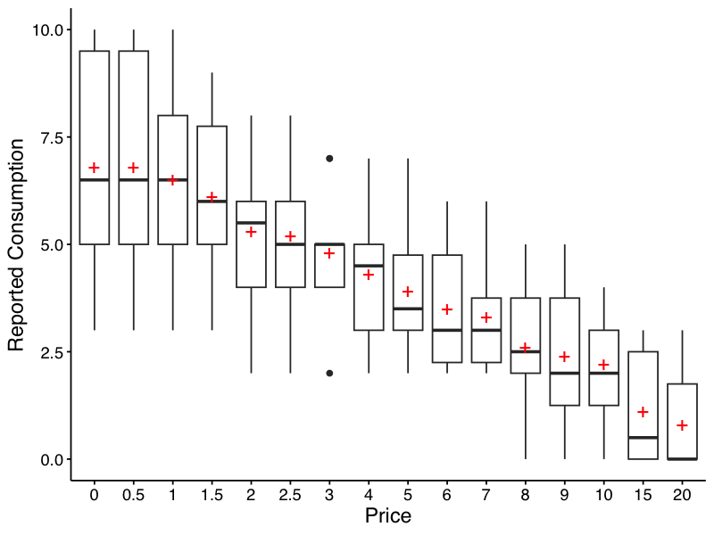
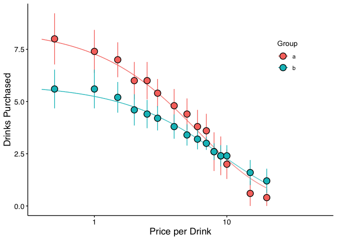
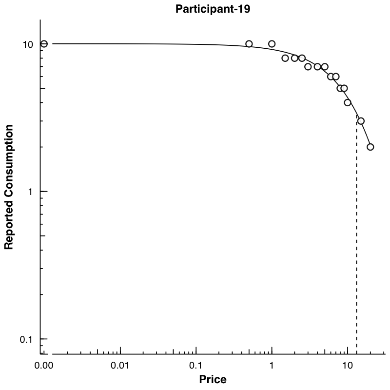
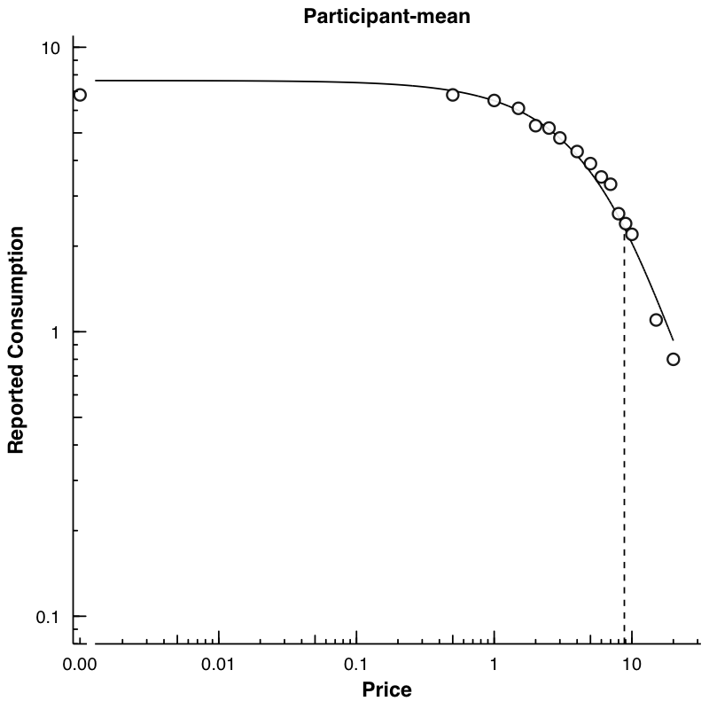

<!-- README.md is generated from README.Rmd. Please edit that file -->

# Behavioral Economic (be) Easy (ez) Demand <a></a>

[](https://cran.r-project.org/package=beezdemand)
[](https://cranlogs.r-pkg.org/)
[](https://cranlogs.r-pkg.org/)

Behavioral economic demand is gaining in popularity. The motivation
behind `beezdemand` was to create an alternative tool to conduct these
analyses. This package is not necessarily meant to be a replacement for
other softwares; rather, it is meant to serve as an additional tool in
the behavioral economist’s toolbox. It is meant for researchers to
conduct behavioral economic (be) demand the easy (ez) way.

## Note About Use

Currently, this version (0.1.2) is stable. I encourage you to use it but
be aware that, as with any software release, there might be (unknown)
bugs present. I’ve tried hard to make this version usable while
including the core functionality (described more below). However, if you
find issues or would like to contribute, please open an issue on my
[GitHub page](https://github.com/brentkaplan/beezdemand) or [email
me](mailto:bkaplan.ku@gmail.com).

## Installing beezdemand

### CRAN Release (recommended method)

The latest stable version of `beezdemand` (currently v.0.1.2) can be
found on [CRAN](https://CRAN.R-project.org/package=beezdemand) and
installed using the following command. The first time you install the
package, you may be asked to select a CRAN mirror. Simply select the
mirror geographically closest to you.

``` r
install.packages("beezdemand")

library(beezdemand)
```

### GitHub Release

To install a stable release directly from
[GitHub](https://github.com/brentkaplan/beezdemand), first install and
load the `devtools` package. Then, use `install_github` to install the
package and associated vignette. You *don’t* need to download anything
directly from [GitHub](https://github.com/brentkaplan/beezdemand), as
you should use the following instructions:

``` r
install.packages("devtools")

devtools::install_github("brentkaplan/beezdemand", build_vignettes = TRUE)

library(beezdemand)
```

### GitHub Development Version

To install the development version of the package, specify the
development branch in `install_github`:

``` r
devtools::install_github("brentkaplan/beezdemand@develop")
```

# Using the Package

## Example Dataset

An example dataset of responses on an Alcohol Purchase Task is provided.
This object is called `apt` and is located within the `beezdemand`
package. These data are a subset of from the paper by [Kaplan & Reed
(2018)](https://psycnet.apa.org/record/2018-02774-001). Participants
(id) reported the number of alcoholic drinks (y) they would be willing
to purchase and consume at various prices (x; USD). Note the format of
the data, which is called “long format”. Long format data are data
structured such that repeated observations are stacked in multiple rows,
rather than across columns. First, take a look at an extract of the
dataset `apt`, where I’ve subsetted rows 1 through 10 and 17 through 26:

|     |  id |   x |   y |
|:----|----:|----:|----:|
| 1   |  19 | 0.0 |  10 |
| 2   |  19 | 0.5 |  10 |
| 3   |  19 | 1.0 |  10 |
| 4   |  19 | 1.5 |   8 |
| 5   |  19 | 2.0 |   8 |
| 6   |  19 | 2.5 |   8 |
| 7   |  19 | 3.0 |   7 |
| 8   |  19 | 4.0 |   7 |
| 9   |  19 | 5.0 |   7 |
| 10  |  19 | 6.0 |   6 |
| 17  |  30 | 0.0 |   3 |
| 18  |  30 | 0.5 |   3 |
| 19  |  30 | 1.0 |   3 |
| 20  |  30 | 1.5 |   3 |
| 21  |  30 | 2.0 |   2 |
| 22  |  30 | 2.5 |   2 |
| 23  |  30 | 3.0 |   2 |
| 24  |  30 | 4.0 |   2 |
| 25  |  30 | 5.0 |   2 |
| 26  |  30 | 6.0 |   2 |

The first column contains the row number. The second column contains the
id number of the series within the dataset. The third column contains
the x values (in this specific dataset, price per drink) and the fourth
column contains the associated responses (number of alcoholic drinks
purchased at each respective price). There are replicates of id because
for each series (or participant), several x values were presented.

## Converting from Wide to Long and Vice Versa

Take for example the format of most datasets that would be exported from
a data collection software such as Qualtrics or SurveyMonkey or Google
Forms:

``` r
## the following code takes the apt data, which are in long format, and converts
## to a wide format that might be seen from data collection software
wide <- spread(apt, x, y)
colnames(wide) <- c("id", paste0("price_", seq(1, 16, by = 1)))
knitr::kable(wide[1:5, 1:10])
```

|  id | price_1 | price_2 | price_3 | price_4 | price_5 | price_6 | price_7 | price_8 | price_9 |
|----:|--------:|--------:|--------:|--------:|--------:|--------:|--------:|--------:|--------:|
|  19 |      10 |      10 |      10 |       8 |       8 |       8 |       7 |       7 |       7 |
|  30 |       3 |       3 |       3 |       3 |       2 |       2 |       2 |       2 |       2 |
|  38 |       4 |       4 |       4 |       4 |       4 |       4 |       4 |       3 |       3 |
|  60 |      10 |      10 |       8 |       8 |       6 |       6 |       5 |       5 |       4 |
|  68 |      10 |      10 |       9 |       9 |       8 |       8 |       7 |       6 |       5 |

A dataset such as this is referred to as “wide format” because each
participant series contains a single row and multiple measurements
within the participant are indicated by the columns. This data format is
fine for some purposes; however, for `beezdemand`, data are required to
be in “long format” (in the same format as the example data described
[earlier](#exdata)). In order to convert to the long format, some steps
will be required.

First, it is helpful to rename the columns to what the prices actually
were. For example, for the purposes of our example dataset, price_1 was
\$0.00 (free), price_2 was \$0.50, price_3 was \$1.00, and so on.

``` r
## make an object to hold what will be the new column names
newcolnames <- c("id", "0", "0.5", "1", "1.50", "2", "2.50", "3",
                 "4", "5", "6", "7", "8", "9", "10", "15", "20")
## current column names
colnames(wide)
```

     [1] "id"       "price_1"  "price_2"  "price_3"  "price_4"  "price_5" 
     [7] "price_6"  "price_7"  "price_8"  "price_9"  "price_10" "price_11"
    [13] "price_12" "price_13" "price_14" "price_15" "price_16"

``` r
## replace current column names with new column names
colnames(wide) <- newcolnames

## how new data look (first 5 rows only)
knitr::kable(wide[1:5, ])
```

|  id |   0 | 0.5 |   1 | 1.50 |   2 | 2.50 |   3 |   4 |   5 |   6 |   7 |   8 |   9 |  10 |  15 |  20 |
|----:|----:|----:|----:|-----:|----:|-----:|----:|----:|----:|----:|----:|----:|----:|----:|----:|----:|
|  19 |  10 |  10 |  10 |    8 |   8 |    8 |   7 |   7 |   7 |   6 |   6 |   5 |   5 |   4 |   3 |   2 |
|  30 |   3 |   3 |   3 |    3 |   2 |    2 |   2 |   2 |   2 |   2 |   2 |   2 |   1 |   1 |   1 |   1 |
|  38 |   4 |   4 |   4 |    4 |   4 |    4 |   4 |   3 |   3 |   3 |   3 |   2 |   2 |   2 |   0 |   0 |
|  60 |  10 |  10 |   8 |    8 |   6 |    6 |   5 |   5 |   4 |   4 |   3 |   3 |   2 |   2 |   0 |   0 |
|  68 |  10 |  10 |   9 |    9 |   8 |    8 |   7 |   6 |   5 |   5 |   5 |   4 |   4 |   3 |   0 |   0 |

Now we can convert into a long format using some of the helpful
functions in the `tidyverse` package (make sure the package is loaded
before trying the commands below).

``` r
## using the dataframe 'wide', we specify the key will be 'price', the values
## will be 'consumption', and we will select all columns besides the first ('id')
long <- tidyr::gather(wide, price, consumption, -id)

## we'll sort the rows by id
long <- arrange(long, id)

## view the first 20 rows
knitr::kable(long[1:20, ])
```

|  id | price | consumption |
|----:|:------|------------:|
|  19 | 0     |          10 |
|  19 | 0.5   |          10 |
|  19 | 1     |          10 |
|  19 | 1.50  |           8 |
|  19 | 2     |           8 |
|  19 | 2.50  |           8 |
|  19 | 3     |           7 |
|  19 | 4     |           7 |
|  19 | 5     |           7 |
|  19 | 6     |           6 |
|  19 | 7     |           6 |
|  19 | 8     |           5 |
|  19 | 9     |           5 |
|  19 | 10    |           4 |
|  19 | 15    |           3 |
|  19 | 20    |           2 |
|  30 | 0     |           3 |
|  30 | 0.5   |           3 |
|  30 | 1     |           3 |
|  30 | 1.50  |           3 |

Two final modifications we will make will be to (1) rename our columns
to what the functions in `beezdemand` will expect to see: `id`, `x`, and
`y`, and (2) ensure both x and y are in numeric format.

``` r
colnames(long) <- c("id", "x", "y")

long$x <- as.numeric(long$x)
long$y <- as.numeric(long$y)
knitr::kable(head(long))
```

|  id |   x |   y |
|----:|----:|----:|
|  19 | 0.0 |  10 |
|  19 | 0.5 |  10 |
|  19 | 1.0 |  10 |
|  19 | 1.5 |   8 |
|  19 | 2.0 |   8 |
|  19 | 2.5 |   8 |

The dataset is now “tidy” because: (1) each variable forms a column, (2)
each observation forms a row, and (3) each type of observational unit
forms a table (in this case, our observational unit is the Alcohol
Purchase Task data). To learn more about the benefits of tidy data,
readers are encouraged to consult Hadley Wikham’s essay on [Tidy
Data](https://vita.had.co.nz/papers/tidy-data.html).

## Obtain Descriptive Data

Descriptive values of responses at each price can be obtained easily.
The resulting table includes mean, standard deviation, proportion of
zeros, number of NAs, and minimum and maximum values. If
`bwplot = TRUE`, a box-and-whisker plot is also created and saved. By
default, this location is a folder named “plots” one level up from the
current working directory. The user may additionally specify the
directory that the plot should save into, the type of file (either
`"png"` or `"pdf"`), and the filename. Notice the red crosses indicate
the mean. Defaults are shown here:

``` r
GetDescriptives(dat = apt, bwplot = FALSE, outdir = "../plots/", device = "png",
                filename = "bwplot")
```

To actually run the code and generate the file, we will turn
`bwplot = TRUE`. The function will create a folder one level higher than
the current folder (i.e., the `../` portion) and save the file,
“bwplot.png” in the folder.

``` r
GetDescriptives(dat = apt, bwplot = TRUE, outdir = plotdir, device = "png",
                filename = "bwplot")
```



And here is the table that is returned from the function:

| Price | Mean | Median |   SD | PropZeros | NAs | Min | Max |
|:------|-----:|-------:|-----:|----------:|----:|----:|----:|
| 0     |  6.8 |    6.5 | 2.62 |       0.0 |   0 |   3 |  10 |
| 0.5   |  6.8 |    6.5 | 2.62 |       0.0 |   0 |   3 |  10 |
| 1     |  6.5 |    6.5 | 2.27 |       0.0 |   0 |   3 |  10 |
| 1.5   |  6.1 |    6.0 | 1.91 |       0.0 |   0 |   3 |   9 |
| 2     |  5.3 |    5.5 | 1.89 |       0.0 |   0 |   2 |   8 |
| 2.5   |  5.2 |    5.0 | 1.87 |       0.0 |   0 |   2 |   8 |
| 3     |  4.8 |    5.0 | 1.48 |       0.0 |   0 |   2 |   7 |
| 4     |  4.3 |    4.5 | 1.57 |       0.0 |   0 |   2 |   7 |
| 5     |  3.9 |    3.5 | 1.45 |       0.0 |   0 |   2 |   7 |
| 6     |  3.5 |    3.0 | 1.43 |       0.0 |   0 |   2 |   6 |
| 7     |  3.3 |    3.0 | 1.34 |       0.0 |   0 |   2 |   6 |
| 8     |  2.6 |    2.5 | 1.51 |       0.1 |   0 |   0 |   5 |
| 9     |  2.4 |    2.0 | 1.58 |       0.1 |   0 |   0 |   5 |
| 10    |  2.2 |    2.0 | 1.32 |       0.1 |   0 |   0 |   4 |
| 15    |  1.1 |    0.5 | 1.37 |       0.5 |   0 |   0 |   3 |
| 20    |  0.8 |    0.0 | 1.14 |       0.6 |   0 |   0 |   3 |

## Change Data

There are certain instances in which data are to be modified before
fitting, for example when using an equation that logarithmically
transforms y values. The following function can help with modifying
data:

- `nrepl` indicates number of replacement 0 values, either as an integer
  or `"all"`. If this value is an integer, `n`, then the first `n` 0s
  will be replaced.

- `replnum` indicates the number that should replace 0 values

- `rem0` removes all zeros

- `remq0e` removes y value where x (or price) equals 0

- `replfree` replaces where x (or price) equals 0 with a specified
  number

``` r
ChangeData(dat = apt, nrepl = 1, replnum = 0.01, rem0 = FALSE, remq0e = FALSE,
           replfree = NULL)
```

## Identify Unsystematic Responses

Using the following function, we can examine the consistency of demand
data using [Stein et al.’s
(2015)](https://psycnet.apa.org/record/2015-30199-001) alogrithm for
identifying unsystematic responses. Default values shown, but they can
be customized.

``` r
CheckUnsystematic(dat = apt, deltaq = 0.025, bounce = 0.1, reversals = 0, ncons0 = 2)
```

| id  | TotalPass | DeltaQ | DeltaQPass | Bounce | BouncePass | Reversals | ReversalsPass | NumPosValues |
|:----|----------:|-------:|:-----------|-------:|:-----------|----------:|:--------------|-------------:|
| 19  |         3 | 0.2112 | Pass       |      0 | Pass       |         0 | Pass          |           16 |
| 30  |         3 | 0.1437 | Pass       |      0 | Pass       |         0 | Pass          |           16 |
| 38  |         3 | 0.7885 | Pass       |      0 | Pass       |         0 | Pass          |           14 |
| 60  |         3 | 0.9089 | Pass       |      0 | Pass       |         0 | Pass          |           14 |
| 68  |         3 | 0.9089 | Pass       |      0 | Pass       |         0 | Pass          |           14 |

## Analyze Demand Data

Results of the analysis return both empirical and derived measures for
use in additional analyses and model specification. Equations include
the linear model, exponential model, and exponentiated model. Soon, I
will be including the nonlinear mixed effects model, mixed effects
versions of the exponential and exponentiated model, and others.
However, currently these models are not yet supported.

### Obtaining Empirical Measures

Empirical measures can be obtained separately on their own:

``` r
GetEmpirical(dat = apt)
```

| id  | Intensity | BP0 | BP1 | Omaxe | Pmaxe |
|:----|----------:|----:|----:|------:|------:|
| 19  |        10 |  NA |  20 |    45 |    15 |
| 30  |         3 |  NA |  20 |    20 |    20 |
| 38  |         4 |  15 |  10 |    21 |     7 |
| 60  |        10 |  15 |  10 |    24 |     8 |
| 68  |        10 |  15 |  10 |    36 |     9 |

### Obtaining Derived Measures

`FitCurves()` has several important arguments that can be passed. For
the purposes of this document, focus will be on the two contemporary
demand equations.

- `equation = "hs"` is the default but can accept the character strings
  `"linear"`, `"hs"`, or `"koff"`, the latter two of which are the
  contemporary equations proposed by [Hursh & Silberberg
  (2008)](https://psycnet.apa.org/record/2008-00265-008) and [Koffarnus
  et al. (2015)](https://psycnet.apa.org/record/2015-37520-001),
  respectively.

- `k` can take accept a specific number but by default will be
  calculated based on the maximum and minimum y values of the entire
  sample and adding .5. Adding this amount was originally proposed by
  Steven R. Hursh in an early iteration of a Microsoft Excel spreadsheet
  used to calculate demand metrics. This adjustment was adopted for two
  reasons. First, when fitting $Q_0$ as a derived parameter, the value
  may exceed the empirically observed intensity value. Thus, a k value
  calculated based only on the observed range of data may underestimate
  the full fitted range of the curve. Second, we have found that values
  of $\alpha$ (as well as values that rely on $\alpha$, i.e. approximate
  $P_{max}$) display greater discrepancies when smaller values of k are
  used compared to larger values of k. Other options include `"ind"`,
  which will calculate k based on individual basis, `"fit"`, which will
  fit k as a free parameter on an individual basis, `"share"`, which
  will fit k as a single shared parameter across all data sets (while
  fitting individual $Q_0$ and $\alpha$).

- `agg = NULL` is the default, which means no aggregation. When
  `agg = "Mean"`, models are fit to the averaged data disregarding any
  error. When `agg = "Pooled"`, all data are used and clustering within
  individual is ignored.

- `detailed = FALSE` is the default. This will output a single dataframe
  of results, as shown below. When `detailed = TRUE`, the output is a 3
  element list that includes (1) dataframe of results, (2) list of
  nonlinear regression model objects, (3) list of dataframes containing
  predicted x and y values (to be used in subsequent plotting), and (4)
  list of individual dataframes used in fitting.

- `lobound` and `hibound` can accept named vectors that will be used as
  lower and upper bounds, respectively during fitting. If `k = "fit"`,
  then it should look as follows (values are nonspecific):
  `lobound = c("q0" = 0, "k" = 0, "alpha" = 0)` and
  `hibound = c("q0" = 25, "k" = 10, "alpha" = 1)`. If `k` is not being
  fit as a parameter, then only `"q0"` and `"alpha"` should be used in
  bounding.

Note: Fitting with an equation (e.g., `"linear"`, `"hs"`) that doesn’t
work happily with zero consumption values results in the following. One,
a message will appear saying that zeros are incompatible with the
equation. Two, because zeros are removed prior to finding empirical
(i.e., observed) measures, resulting BP0 values will be all NAs
(reflective of the data transformations). The warning message will look
as follows:

``` r
Warning message:
Zeros found in data not compatible with equation! Dropping zeros!
```

The simplest use of `FitCurves()` is shown here, only needing to specify
`dat` and `equation`. All other arguments shown are set to their default
values.

``` r
FitCurves(dat = apt, equation = "hs", agg = NULL, detailed = FALSE,
          xcol = "x", ycol = "y", idcol = "id", groupcol = NULL)
```

Which is equivalent to:

``` r
FitCurves(dat = apt, equation = "hs")
```

Note that this ouput returns a message
(`No k value specified. Defaulting to empirical mean range +.5`) and the
aforementioned warning
(`Warning message: Zeros found in data not compatible with equation! Dropping zeros!`).
With `detailed = FALSE`, the only output is the dataframe of results
(broken up to show the different types of results). This example fits
the exponential equation proposed by [Hursh & Silberberg
(2008)](https://psycnet.apa.org/record/2008-00265-008):

| id  | Intensity | BP0 | BP1 | Omaxe | Pmaxe |
|:----|----------:|:----|----:|------:|------:|
| 19  |        10 | NA  |  20 |    45 |    15 |
| 30  |         3 | NA  |  20 |    20 |    20 |
| 38  |         4 | NA  |  10 |    21 |     7 |
| 60  |        10 | NA  |  10 |    24 |     8 |
| 68  |        10 | NA  |  10 |    36 |     9 |

Empirical Measures

| Equation |       Q0d |        K |     Alpha |        R2 |
|:---------|----------:|---------:|----------:|----------:|
| hs       | 10.475734 | 1.031479 | 0.0046571 | 0.9660008 |
| hs       |  2.932406 | 1.031479 | 0.0134557 | 0.7922379 |
| hs       |  4.523155 | 1.031479 | 0.0087935 | 0.8662632 |
| hs       | 10.492133 | 1.031479 | 0.0102231 | 0.9664814 |
| hs       | 10.651760 | 1.031479 | 0.0061262 | 0.9699408 |

Fitted Measures

|      Q0se |   Alphase |   N |     AbsSS |     SdRes |    Q0Low |    Q0High |  AlphaLow | AlphaHigh |
|----------:|----------:|----:|----------:|----------:|---------:|----------:|----------:|----------:|
| 0.4159581 | 0.0002358 |  16 | 0.0193354 | 0.0371632 | 9.583593 | 11.367876 | 0.0041515 | 0.0051628 |
| 0.2506946 | 0.0017321 |  16 | 0.0978350 | 0.0835955 | 2.394720 |  3.470093 | 0.0097408 | 0.0171706 |
| 0.2357693 | 0.0008878 |  14 | 0.0259083 | 0.0464653 | 4.009458 |  5.036853 | 0.0068592 | 0.0107277 |
| 0.6219724 | 0.0005118 |  14 | 0.0236652 | 0.0444083 | 9.136972 | 11.847295 | 0.0091080 | 0.0113382 |
| 0.3841063 | 0.0002713 |  14 | 0.0109439 | 0.0301992 | 9.814865 | 11.488656 | 0.0055350 | 0.0067173 |

Uncertainty and Model Information

|        EV |    Omaxd |     Pmaxd |    Omaxa |
|----------:|---------:|----------:|---------:|
| 2.0496977 | 45.49394 | 14.393108 | 47.84770 |
| 0.7094191 | 15.74587 | 17.796228 | 16.56052 |
| 1.0855465 | 24.09418 | 17.654531 | 25.34076 |
| 0.9337419 | 20.72481 |  6.546547 | 21.79707 |
| 1.5581899 | 34.58471 | 10.760891 | 36.37405 |

Derived Measures

Here, the simplest form is shown specifying another equation, `"koff"`.
This fits the modified exponential equation proposed by [Koffarnus et
al. (2015)](https://psycnet.apa.org/record/2015-37520-001):

``` r
FitCurves(dat = apt, equation = "koff")
```

| id  | Intensity | BP0 | BP1 | Omaxe | Pmaxe |
|:----|----------:|----:|----:|------:|------:|
| 19  |        10 |  NA |  20 |    45 |    15 |
| 30  |         3 |  NA |  20 |    20 |    20 |
| 38  |         4 |  15 |  10 |    21 |     7 |
| 60  |        10 |  15 |  10 |    24 |     8 |
| 68  |        10 |  15 |  10 |    36 |     9 |

Empirical Measures

| Equation |       Q0d |        K |     Alpha |        R2 |
|:---------|----------:|---------:|----------:|----------:|
| koff     | 10.131767 | 1.429419 | 0.0029319 | 0.9668576 |
| koff     |  2.989613 | 1.429419 | 0.0093716 | 0.8136932 |
| koff     |  4.607551 | 1.429419 | 0.0070562 | 0.8403625 |
| koff     | 10.371088 | 1.429419 | 0.0068127 | 0.9659117 |
| koff     | 10.703627 | 1.429419 | 0.0044361 | 0.9444897 |

Fitted Measures

|      Q0se |   Alphase |   N |    AbsSS |     SdRes |    Q0Low |    Q0High |  AlphaLow | AlphaHigh |
|----------:|----------:|----:|---------:|----------:|---------:|----------:|----------:|----------:|
| 0.2438729 | 0.0001663 |  16 | 2.908243 | 0.4557758 | 9.608712 | 10.654822 | 0.0025752 | 0.0032886 |
| 0.1721284 | 0.0013100 |  16 | 1.490454 | 0.3262837 | 2.620434 |  3.358792 | 0.0065620 | 0.0121812 |
| 0.3078231 | 0.0010631 |  16 | 4.429941 | 0.5625161 | 3.947336 |  5.267766 | 0.0047761 | 0.0093362 |
| 0.4069382 | 0.0004577 |  16 | 5.010982 | 0.5982703 | 9.498292 | 11.243884 | 0.0058310 | 0.0077945 |
| 0.4677467 | 0.0003736 |  16 | 8.350830 | 0.7723263 | 9.700410 | 11.706844 | 0.0036349 | 0.0052373 |

Uncertainty and Model Information

|        EV |    Omaxd |     Pmaxd |    Omaxa |
|----------:|---------:|----------:|---------:|
| 1.9957818 | 46.56622 | 15.140905 | 46.70800 |
| 0.6243741 | 14.56810 | 16.052915 | 14.61245 |
| 0.8292621 | 19.34861 | 13.833934 | 19.40752 |
| 0.8588915 | 20.03993 |  6.365580 | 20.10095 |
| 1.3190323 | 30.77608 |  9.472147 | 30.86979 |

Derived Measures

By specifying `agg = "Mean"`, y values at each x value are aggregated
and a single curve is fit to the data (disregarding error around each
averaged point):

``` r
FitCurves(dat = apt, equation = "hs", agg = "Mean")
```

| id   | Intensity | BP0 | BP1 | Omaxe | Pmaxe |
|:-----|----------:|:----|----:|------:|------:|
| mean |       6.8 | NA  |  20 |  23.1 |     7 |

Empirical Measures

| Equation |      Q0d |        K |     Alpha |        R2 |
|:---------|---------:|---------:|----------:|----------:|
| hs       | 7.637436 | 1.429419 | 0.0066817 | 0.9807508 |

Fitted Measures

|      Q0se |   Alphase |   N |   AbsSS |    SdRes |   Q0Low |   Q0High |  AlphaLow | AlphaHigh |
|----------:|----------:|----:|--------:|---------:|--------:|---------:|----------:|----------:|
| 0.3258955 | 0.0002218 |  16 | 0.02187 | 0.039524 | 6.93846 | 8.336413 | 0.0062059 | 0.0071574 |

Uncertainty and Model Information

|       EV |    Omaxd |    Pmaxd |    Omaxa |
|---------:|---------:|---------:|---------:|
| 0.875742 | 20.43309 | 8.813584 | 20.49531 |

Derived Measures

By specifying `agg = "Pooled"`, y values at each x value are aggregated
and a single curve is fit to the data and error around each averaged
point (but disregarding within-subject clustering):

``` r
FitCurves(dat = apt, equation = "hs", agg = "Pooled")
```

| id     | Intensity | BP0 | BP1 | Omaxe | Pmaxe |
|:-------|----------:|:----|----:|------:|------:|
| pooled |       6.8 | NA  |  20 |  23.1 |     7 |

Empirical Measures

| Equation |      Q0d |        K |     Alpha |       R2 |
|:---------|---------:|---------:|----------:|---------:|
| hs       | 6.592488 | 1.031479 | 0.0085032 | 0.460412 |

Fitted Measures

|      Q0se |   Alphase |   N |    AbsSS |     SdRes |    Q0Low |   Q0High |  AlphaLow | AlphaHigh |
|----------:|----------:|----:|---------:|----------:|---------:|---------:|----------:|----------:|
| 0.4260507 | 0.0007125 | 146 | 4.677846 | 0.1802361 | 5.750367 | 7.434609 | 0.0070949 | 0.0099115 |

Uncertainty and Model Information

|       EV |    Omaxd |    Pmaxd |    Omaxa |
|---------:|---------:|---------:|---------:|
| 1.122607 | 24.91675 | 12.52644 | 26.20589 |

Derived Measures

## Share k Globally; Fit Other Parameters Locally

As mentioned earlier, in the function `FitCurves`, when `k = "share"`
this parameter will be a shared parameter across all datasets (globally)
while estimating $Q_0$ and $\alpha$ locally. While this works, it may
take some time with larger sample sizes.

``` r
FitCurves(dat = apt, equation = "hs", k = "share")
```

| id  | Intensity | BP0 | BP1 | Omaxe | Pmaxe |
|:----|----------:|:----|----:|------:|------:|
| 19  |        10 | NA  |  20 |    45 |    15 |
| 30  |         3 | NA  |  20 |    20 |    20 |
| 38  |         4 | NA  |  10 |    21 |     7 |
| 60  |        10 | NA  |  10 |    24 |     8 |
| 68  |        10 | NA  |  10 |    36 |     9 |

Empirical Measures

| Equation |       Q0d |       K |     Alpha |        R2 |
|:---------|----------:|--------:|----------:|----------:|
| hs       | 10.014576 | 3.31833 | 0.0011616 | 0.9820968 |
| hs       |  2.766313 | 3.31833 | 0.0033331 | 0.7641766 |
| hs       |  4.485810 | 3.31833 | 0.0024580 | 0.8803145 |
| hs       |  9.721379 | 3.31833 | 0.0024219 | 0.9705985 |
| hs       | 10.293139 | 3.31833 | 0.0015879 | 0.9722310 |

Fitted Measures

|      Q0se |   Alphase |   N |     AbsSS |     SdRes |    Q0Low |    Q0High |  AlphaLow | AlphaHigh |
|----------:|----------:|----:|----------:|----------:|---------:|----------:|----------:|----------:|
| 0.2429150 | 0.0000308 |  16 | 0.0101816 | 0.0269677 | 9.493575 | 10.535577 | 0.0010955 | 0.0012277 |
| 0.2192797 | 0.0003739 |  16 | 0.1110490 | 0.0890622 | 2.296005 |  3.236621 | 0.0025312 | 0.0041350 |
| 0.2074990 | 0.0001963 |  14 | 0.0231862 | 0.0439566 | 4.033709 |  4.937912 | 0.0020302 | 0.0028858 |
| 0.4371061 | 0.0000778 |  14 | 0.0207584 | 0.0415916 | 8.769006 | 10.673751 | 0.0022523 | 0.0025914 |
| 0.3179671 | 0.0000523 |  14 | 0.0101100 | 0.0290259 | 9.600348 | 10.985930 | 0.0014740 | 0.0017018 |

Uncertainty and Model Information

|        EV |    Omaxd |     Pmaxd |    Omaxa |
|----------:|---------:|----------:|---------:|
| 1.4241862 | 44.55169 | 13.160540 | 44.55206 |
| 0.4963281 | 15.52624 | 16.603785 | 15.52637 |
| 0.6730395 | 21.05416 | 13.884786 | 21.05433 |
| 0.6830746 | 21.36808 |  6.502492 | 21.36826 |
| 1.0418474 | 32.59129 |  9.366898 | 32.59155 |

Derived Measures

## Compare Values of $\alpha$ and $Q_0$ via Extra Sum-of-Squares *F*-Test

When one has multiple groups, it may be beneficial to compare whether
separate curves are preferred over a single curve. This is accomplished
by the Extra Sum-of-Squares *F*-test. This function (using the argument
`compare`) will determine whether a single $\alpha$ or a single $Q_0$ is
better than multiple $\alpha$s or $Q_0$s. A single curve will be fit,
the residual deviations calculated and those residuals are compared to
residuals obtained from multiple curves. A resulting *F* statistic will
be reporting along with a *p* value.

``` r
## setting the seed initializes the random number generator so results will be
## reproducible
set.seed(1234)

## manufacture random grouping
apt$group <- NA
apt[apt$id %in% sample(unique(apt$id), length(unique(apt$id))/2), "group"] <- "a"
apt$group[is.na(apt$group)] <- "b"

## take a look at what the new groupings look like in long form
knitr::kable(apt[1:20, ])
```

|  id |    x |   y | group |
|----:|-----:|----:|:------|
|  19 |  0.0 |  10 | a     |
|  19 |  0.5 |  10 | a     |
|  19 |  1.0 |  10 | a     |
|  19 |  1.5 |   8 | a     |
|  19 |  2.0 |   8 | a     |
|  19 |  2.5 |   8 | a     |
|  19 |  3.0 |   7 | a     |
|  19 |  4.0 |   7 | a     |
|  19 |  5.0 |   7 | a     |
|  19 |  6.0 |   6 | a     |
|  19 |  7.0 |   6 | a     |
|  19 |  8.0 |   5 | a     |
|  19 |  9.0 |   5 | a     |
|  19 | 10.0 |   4 | a     |
|  19 | 15.0 |   3 | a     |
|  19 | 20.0 |   2 | a     |
|  30 |  0.0 |   3 | b     |
|  30 |  0.5 |   3 | b     |
|  30 |  1.0 |   3 | b     |
|  30 |  1.5 |   3 | b     |

``` r
## in order for this to run, you will have had to run the code immediately
## preceeding (i.e., the code to generate the groups)
ef <- ExtraF(dat = apt, equation = "koff", k = 2, groupcol = "group", verbose = TRUE)
```

    [1] "Null hypothesis: alpha same for all data sets"
    [1] "Alternative hypothesis: alpha different for each data set"
    [1] "Conclusion: fail to reject the null hypothesis"
    [1] "F(1,156) = 0.0298, p = 0.8631"

A summary table (broken up here for ease of display) will be created
when the option `verbose = TRUE`. This table can be accessed as the
`dfres` object resulting from `ExtraF`. In the example above, we can
access this summary table using `ef$dfres`:

| Group      |      Q0d |   K |        R2 |     Alpha |
|:-----------|---------:|----:|----------:|----------:|
| Shared     |       NA |  NA |        NA |        NA |
| a          | 8.489634 |   2 | 0.6206444 | 0.0040198 |
| b          | 5.848119 |   2 | 0.6206444 | 0.0040198 |
| Not Shared |       NA |  NA |        NA |        NA |
| a          | 8.503442 |   2 | 0.6448801 | 0.0040518 |
| b          | 5.822075 |   2 | 0.5242825 | 0.0039376 |

Fitted Measures

| Group      |   N |    AbsSS |    SdRes |
|:-----------|----:|---------:|---------:|
| Shared     |  NA |       NA |       NA |
| a          | 160 | 387.0945 | 1.570213 |
| b          | 160 | 387.0945 | 1.570213 |
| Not Shared |  NA |       NA |       NA |
| a          |  80 | 249.2764 | 1.787695 |
| b          |  80 | 137.7440 | 1.328890 |

Uncertainty and Model Information

| Group      |        EV |    Omaxd |     Pmaxd |
|:-----------|----------:|---------:|----------:|
| Shared     |        NA |       NA |        NA |
| a          | 0.8795301 | 22.63159 |  8.453799 |
| b          | 0.8795301 | 22.63159 | 12.272265 |
| Not Shared |        NA |       NA |        NA |
| a          | 0.8725741 | 22.45260 |  8.373320 |
| b          | 0.8978945 | 23.10414 | 12.584550 |

Derived Measures

| Group      |    Omaxa | Notes     |
|:-----------|---------:|:----------|
| Shared     |       NA | NA        |
| a          | 22.63190 | converged |
| b          | 22.63190 | converged |
| Not Shared |       NA | NA        |
| a          | 22.45291 | converged |
| b          | 23.10445 | converged |

Convergence and Summary Information

When `verbose = TRUE`, objects from the result can be used in subsequent
graphing. The following code generates a plot of our two groups. We can
use the predicted values already generated from the `ExtraF` function by
accessing the `newdat` object. In the example above, we can access these
predicted values using `ef$newdat`. Note that we keep the linear scaling
of y given we used [Koffarnus et
al. (2015)’s](https://psycnet.apa.org/record/2015-37520-001) equation
fitted to the data.

``` r
## be sure that you've loaded the tidyverse package (e.g., library(tidyverse))
ggplot(apt, aes(x = x, y = y, group = group)) +
  ## the predicted lines from the sum of squares f-test can be used in subsequent
  ## plots by calling data = ef$newdat
  geom_line(aes(x = x, y = y, group = group, color = group),
            data = ef$newdat[ef$newdat$x >= .1, ]) +
  stat_summary(fun.data = "mean_se", aes(color = group),
               geom = "errorbar", orientation = "x", width = 0) +
  stat_summary(fun = "mean", aes(fill = group), geom = "point", shape = 21,
               color = "black", stroke = .75, size = 4, orientation = "x") +
  scale_x_continuous(limits = c(.4, 50), breaks = c(.1, 1, 10, 100)) +
  coord_trans(x = "log10") +
  scale_color_discrete(name = "Group") +
  scale_fill_discrete(name = "Group") +
  labs(x = "Price per Drink", y = "Drinks Purchased") +
  theme(legend.position = c(.85, .75)) +
  ## theme_apa is a beezdemand function used to change the theme in accordance
  ## with American Psychological Association style
  theme_apa()
```

<!-- -->

## Plots

Plots can be created using the `PlotCurves` function. This function
takes the output from `FitCurves` when the argument from `FitCurves`,
`detailed = TRUE`. The default will be to save figures into a plots
folder created one directory above the current working directory.
Figures can be saved as either PNG or PDF. If the argument `ask = TRUE`,
then plots will be shown interactively and not saved (`ask = FALSE` is
the default). Graphs can automatically be created at both an aggregate
and individual level.

As a demonstration, let’s first use `FitCurves` on the `apt` dataset,
specifying `k = "share"` and `detailed = T`. This will return a list of
objects to use in `PlotCurves`. In `PlotCurves`, we will feed in our new
object, `out`, and tell the function to save the plots in the directory
`"../plots/"` and `ask = FALSE` because we don’t want `R` to
interactively show us each plot. Because we have 10 datasets in our
`apt` example, 10 plots will be created and saved in the `"../plots/"`
directory.

``` r
out <- FitCurves(dat = apt, equation = "hs", k = "share", detailed = T)
```

    Warning: Zeros found in data not compatible with equation! Dropping zeros!

    Beginning search for best-starting k

    Best k fround at 0.93813356574003 = err: 0.744881846162718

    Searching for shared K, this can take a while...

``` r
PlotCurves(dat = out, outdir = plotdir, device = "png", ask = F)
```

    Warning in annotation_logticks2(sides = "b", data = data.frame(X = NA, mask =
    1)): Ignoring unknown parameters: `size`

    Warning in annotation_logticks2(sides = "l", data = data.frame(X = NA, mask =
    0)): Ignoring unknown parameters: `size`

    Warning in annotation_logticks2(sides = "b", data = data.frame(X = NA, mask =
    1)): Ignoring unknown parameters: `size`

    Warning in annotation_logticks2(sides = "l", data = data.frame(X = NA, mask =
    0)): Ignoring unknown parameters: `size`

    Warning in annotation_logticks2(sides = "b", data = data.frame(X = NA, mask =
    1)): Ignoring unknown parameters: `size`

    Warning in annotation_logticks2(sides = "l", data = data.frame(X = NA, mask =
    0)): Ignoring unknown parameters: `size`

    Warning in annotation_logticks2(sides = "b", data = data.frame(X = NA, mask =
    1)): Ignoring unknown parameters: `size`

    Warning in annotation_logticks2(sides = "l", data = data.frame(X = NA, mask =
    0)): Ignoring unknown parameters: `size`

    Warning in annotation_logticks2(sides = "b", data = data.frame(X = NA, mask =
    1)): Ignoring unknown parameters: `size`

    Warning in annotation_logticks2(sides = "l", data = data.frame(X = NA, mask =
    0)): Ignoring unknown parameters: `size`

    Warning in annotation_logticks2(sides = "b", data = data.frame(X = NA, mask =
    1)): Ignoring unknown parameters: `size`

    Warning in annotation_logticks2(sides = "l", data = data.frame(X = NA, mask =
    0)): Ignoring unknown parameters: `size`

    Warning in annotation_logticks2(sides = "b", data = data.frame(X = NA, mask =
    1)): Ignoring unknown parameters: `size`

    Warning in annotation_logticks2(sides = "l", data = data.frame(X = NA, mask =
    0)): Ignoring unknown parameters: `size`

    Warning in annotation_logticks2(sides = "b", data = data.frame(X = NA, mask =
    1)): Ignoring unknown parameters: `size`

    Warning in annotation_logticks2(sides = "l", data = data.frame(X = NA, mask =
    0)): Ignoring unknown parameters: `size`

    Warning in annotation_logticks2(sides = "b", data = data.frame(X = NA, mask =
    1)): Ignoring unknown parameters: `size`

    Warning in annotation_logticks2(sides = "l", data = data.frame(X = NA, mask =
    0)): Ignoring unknown parameters: `size`

    Warning in annotation_logticks2(sides = "b", data = data.frame(X = NA, mask =
    1)): Ignoring unknown parameters: `size`

    Warning in annotation_logticks2(sides = "l", data = data.frame(X = NA, mask =
    0)): Ignoring unknown parameters: `size`

    10 plots saved in man/figures/



We can also make a plot of the mean data. Here, we again use
`FitCurves`, this time calculating a k from the observed range of the
data (thus not specifying any k) and specifying `agg = "Mean"`.

``` r
mn <- FitCurves(dat = apt, equation = "hs", agg = "Mean", detailed = T)
```

    No k value specified. Defaulting to empirical mean range +.5

``` r
PlotCurves(dat = mn, outdir = plotdir, device = "png", ask = F)
```

    Warning in annotation_logticks2(sides = "b", data = data.frame(X = NA, mask =
    1)): Ignoring unknown parameters: `size`

    Warning in annotation_logticks2(sides = "l", data = data.frame(X = NA, mask =
    0)): Ignoring unknown parameters: `size`

    1 plots saved in man/figures/

``` r
list.files("../plots/")
```

     [1] "Participant-106.png"  "Participant-113.png"  "Participant-142.png" 
     [4] "Participant-156.png"  "Participant-188.png"  "Participant-19.png"  
     [7] "Participant-30.png"   "Participant-38.png"   "Participant-60.png"  
    [10] "Participant-68.png"   "Participant-mean.png"



## Learn More About Functions

To learn more about a function and what arguments it takes, type “?” in
front of the function name.

``` r
?CheckUnsystematic
```

``` r
CheckUnsystematic          package:beezdemand          R Documentation

Systematic Purchase Task Data Checker

Description:

     Applies Stein, Koffarnus, Snider, Quisenberry, & Bickels (2015)
     criteria for identification of nonsystematic purchase task data.

Usage:

     CheckUnsystematic(dat, deltaq = 0.025, bounce = 0.1, reversals = 0,
       ncons0 = 2)

Arguments:

     dat: Dataframe in long form. Colums are id, x, y.

  deltaq: Numeric vector of length equal to one. The criterion by which
          the relative change in quantity purchased will be compared.
          Relative changes in quantity purchased below this criterion
          will be flagged. Default value is 0.025.

  bounce: Numeric vector of length equal to one. The criterion by which
          the number of price-to-price increases in consumption that
          exceed 25% of initial consumption at the lowest price,
          expressed relative to the total number of price increments,
          will be compared. The relative number of price-to-price
          increases above this criterion will be flagged. Default value
          is 0.10.

reversals:Numeric vector of length equal to one. The criterion by
          which the number of reversals from number of consecutive (see
          ncons0) 0s will be compared. Number of reversals above this
          criterion will be flagged. Default value is 0.

  ncons0: Number of consecutive 0s prior to a positive value is used to
          flag for a reversal. Value can be either 1 (relatively more
          conservative) or 2 (default; as recommended by Stein et al.,
          (2015).

Details:

     This function applies the 3 criteria proposed by Stein et al.,
     (2015) for identification of nonsystematic purchase task data. The
     three criteria include trend (deltaq), bounce, and reversals from
     0. Also reports number of positive consumption values.

Value:

     Dataframe

Author(s):

     Brent Kaplan <bkaplan.ku@gmail.com>

Examples:

     ## Using all default values
     CheckUnsystematic(apt, deltaq = 0.025, bounce = 0.10, reversals = 0, ncons0 = 2)
     ## Specifying just 1 zero to flag as reversal
     CheckUnsystematic(apt, deltaq = 0.025, bounce = 0.10, reversals = 0, ncons0 = 1)
```

# Acknowledgments

- Shawn P. Gilroy, Contributor [GitHub](https://github.com/miyamot0)

- Derek D. Reed, Applied Behavioral Economics Laboratory

- Mikhail N. Koffarnus, Addiction Recovery Research Center

- Steven R. Hursh, Institutes for Behavior Resources, Inc.

- Paul E. Johnson, Center for Research Methods and Data Analysis,
  University of Kansas

- Peter G. Roma, Institutes for Behavior Resources, Inc.

- W. Brady DeHart, Addiction Recovery Research Center

- Michael Amlung, Cognitive Neuroscience of Addictions Laboratory

Special thanks to the following people who helped provide feedback on
this document:

- Alexandra M. Mellis

- Mr. Jeremiah “Downtown Jimbo Brown” Brown

- Gideon Naudé

# Recommended Readings

- Reed, D. D., Niileksela, C. R., & Kaplan, B. A. (2013). Behavioral
  economics: A tutorial for behavior analysts in practice. *Behavior
  Analysis in Practice, 6* (1), 34–54.
  <https://doi.org/10.1007/BF03391790>

- Reed, D. D., Kaplan, B. A., & Becirevic, A. (2015). Basic research on
  the behavioral economics of reinforcer value. In *Autism Service
  Delivery* (pp. 279-306). Springer New York.
  <https://doi.org/10.1007/978-1-4939-2656-5_10>

- Hursh, S. R., & Silberberg, A. (2008). Economic demand and essential
  value. *Psychological Review, 115* (1), 186-198.
  <https://dx.doi.org/10.1037/0033-295X.115.1.186>

- Koffarnus, M. N., Franck, C. T., Stein, J. S., & Bickel, W. K. (2015).
  A modified exponential behavioral economic demand model to better
  describe consumption data. *Experimental and Clinical
  Psychopharmacology, 23* (6), 504-512.
  <https://dx.doi.org/10.1037/pha0000045>

- Stein, J. S., Koffarnus, M. N., Snider, S. E., Quisenberry, A. J., &
  Bickel, W. K. (2015). Identification and management of nonsystematic
  purchase task data: Toward best practice. *Experimental and Clinical
  Psychopharmacology 23* (5), 377-386.
  <https://dx.doi.org/10.1037/pha0000020>

- Hursh, S. R., Raslear, T. G., Shurtleff, D., Bauman, R., & Simmons, L.
  (1988). A cost‐benefit analysis of demand for food. *Journal of the
  Experimental Analysis of Behavior, 50* (3), 419-440.
  <https://www.ncbi.nlm.nih.gov/pmc/articles/PMC1338908/>
