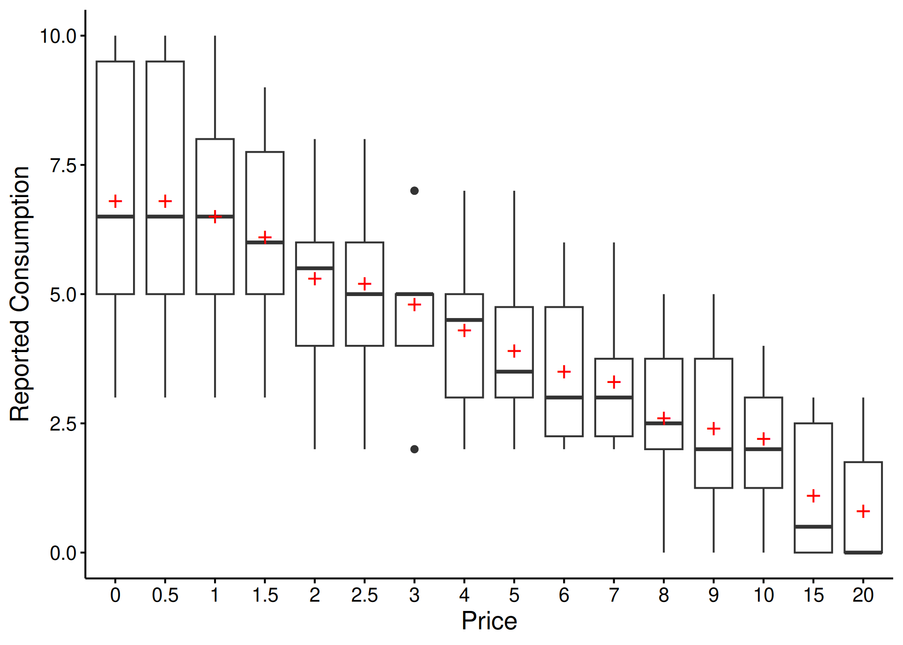
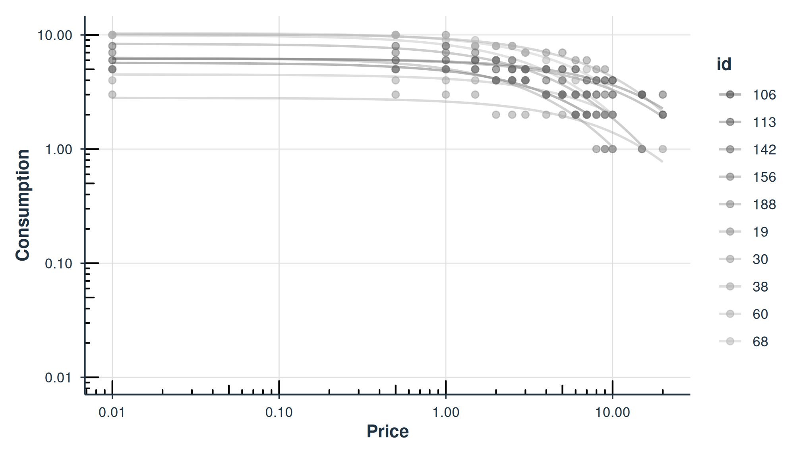

# Using beezdemand

## Rationale Behind `beezdemand`

Behavioral economic demand is gaining in popularity. The motivation
behind `beezdemand` was to create an alternative tool to conduct these
analyses. This package is not necessarily meant to be a replacement for
other softwares; rather, it is meant to serve as an additional tool in
the behavioral economist’s toolbox. It is meant for researchers to
conduct behavioral economic (be) demand the easy (ez) way.

### Note About Use

`beezdemand` is under active development but aims to be stable for
typical applied use. If you find issues or would like to contribute,
please open an issue on my [GitHub
page](https://github.com/brentkaplan/beezdemand) or [email
me](mailto:bkaplan.ku@gmail.com). Please check `NEWS.md` for changes in
recent versions.

### Installing `beezdemand`

#### CRAN Release (recommended method)

The latest stable version of `beezdemand` can be found on
[CRAN](https://CRAN.R-project.org/package=beezdemand) and installed
using the following command. The first time you install the package, you
may be asked to select a CRAN mirror. Simply select the mirror
geographically closest to you.

``` r
install.packages("beezdemand")

library(beezdemand)
```

#### GitHub Release

To install a stable release directly from
[GitHub](https://github.com/brentkaplan/beezdemand), first install and
load the `devtools` package. Then, use `install_github` to install the
package and associated vignette. You *don’t* need to download anything
directly from [GitHub](https://github.com/brentkaplan/beezdemand), as
you should use the following instructions:

``` r
install.packages("devtools")

devtools::install_github("brentkaplan/beezdemand", build_vignettes = TRUE)

library(beezdemand)
```

#### GitHub Development Version

To install the development version of the package, specify the
development branch in `install_github`:

``` r
devtools::install_github("brentkaplan/beezdemand@develop")
```

### Using the Package

#### Example Dataset

An example dataset of responses on an Alcohol Purchase Task is provided.
This object is called `apt` and is located within the `beezdemand`
package. These data are a subset from the paper by Kaplan & Reed (2018).
Participants (id) reported the number of alcoholic drinks (y) they would
be willing to purchase and consume at various prices (x; USD). Note the
format of the data, which is called “long format”. Long format data are
data structured such that repeated observations are stacked in multiple
rows, rather than across columns. First, take a look at an extract of
the dataset `apt`, where I’ve subsetted rows 1 through 10 and 17 through
26:

|     |  id |   x |   y |
|:----|----:|----:|----:|
| 1   |  19 | 0.0 |  10 |
| 2   |  19 | 0.5 |  10 |
| 3   |  19 | 1.0 |  10 |
| 4   |  19 | 1.5 |   8 |
| 5   |  19 | 2.0 |   8 |
| 6   |  19 | 2.5 |   8 |
| 7   |  19 | 3.0 |   7 |
| 8   |  19 | 4.0 |   7 |
| 9   |  19 | 5.0 |   7 |
| 10  |  19 | 6.0 |   6 |
| 17  |  30 | 0.0 |   3 |
| 18  |  30 | 0.5 |   3 |
| 19  |  30 | 1.0 |   3 |
| 20  |  30 | 1.5 |   3 |
| 21  |  30 | 2.0 |   2 |
| 22  |  30 | 2.5 |   2 |
| 23  |  30 | 3.0 |   2 |
| 24  |  30 | 4.0 |   2 |
| 25  |  30 | 5.0 |   2 |
| 26  |  30 | 6.0 |   2 |

Example APT (Alcohol Purchase Task) data in long format

The first column contains the row number. The second column contains the
id number of the series within the dataset. The third column contains
the x values (in this specific dataset, price per drink) and the fourth
column contains the associated responses (number of alcoholic drinks
purchased at each respective price). There are replicates of id because
for each series (or participant), several x values were presented.

#### Converting from Wide to Long and Vice Versa

Take for example the format of most datasets that would be exported from
a data collection software such as Qualtrics or SurveyMonkey or Google
Forms:

``` r
## the following code takes the apt data, which are in long format, and converts
## to a wide format that might be seen from data collection software
wide <- as.data.frame(tidyr::pivot_wider(apt, names_from = x, values_from = y))
colnames(wide) <- c("id", paste0("price_", seq(1, 16, by = 1)))
knitr::kable(
    wide[1:5, 1:10],
    caption = "Example data in wide format (first 5 participants, first 10 prices)"
)
```

|  id | price_1 | price_2 | price_3 | price_4 | price_5 | price_6 | price_7 | price_8 | price_9 |
|----:|--------:|--------:|--------:|--------:|--------:|--------:|--------:|--------:|--------:|
|  19 |      10 |      10 |      10 |       8 |       8 |       8 |       7 |       7 |       7 |
|  30 |       3 |       3 |       3 |       3 |       2 |       2 |       2 |       2 |       2 |
|  38 |       4 |       4 |       4 |       4 |       4 |       4 |       4 |       3 |       3 |
|  60 |      10 |      10 |       8 |       8 |       6 |       6 |       5 |       5 |       4 |
|  68 |      10 |      10 |       9 |       9 |       8 |       8 |       7 |       6 |       5 |

Example data in wide format (first 5 participants, first 10 prices)

A dataset such as this is referred to as “wide format” because each
participant series contains a single row and multiple measurements
within the participant are indicated by the columns. This data format is
fine for some purposes; however, for `beezdemand`, data are required to
be in “long format” (in the same format as the example data described
earlier). The
[`pivot_demand_data()`](https://brentkaplan.github.io/beezdemand/reference/pivot_demand_data.md)
function makes this conversion easy.

##### Quick conversion with `pivot_demand_data()`

Since our column names (`price_1`, `price_2`, …) don’t encode the actual
prices, we supply them via `x_values`:

``` r
long <- pivot_demand_data(
  wide,
  format = "long",
  x_values = c(0, 0.5, 1, 1.50, 2, 2.50, 3, 4, 5, 6, 7, 8, 9, 10, 15, 20)
)
knitr::kable(
    head(long),
    caption = "Wide to long conversion using pivot_demand_data()"
)
```

|  id |   x |   y |
|----:|----:|----:|
|  19 | 0.0 |  10 |
|  19 | 0.5 |  10 |
|  19 | 1.0 |  10 |
|  19 | 1.5 |   8 |
|  19 | 2.0 |   8 |
|  19 | 2.5 |   8 |

Wide to long conversion using pivot_demand_data()

If your wide data already has numeric column names (e.g., `"0"`,
`"0.5"`, `"1"`),
[`pivot_demand_data()`](https://brentkaplan.github.io/beezdemand/reference/pivot_demand_data.md)
will auto-detect the prices and no `x_values` argument is needed. See
[`?pivot_demand_data`](https://brentkaplan.github.io/beezdemand/reference/pivot_demand_data.md)
for details.

Manual approach with tidyr (click to expand)

For users who want to understand the underlying mechanics, here is the
step-by-step approach using `tidyr` directly. First, rename columns to
their actual prices:

``` r
## make a copy for the manual approach
wide_manual <- wide
newcolnames <- c("id", "0", "0.5", "1", "1.50", "2", "2.50", "3",
                 "4", "5", "6", "7", "8", "9", "10", "15", "20")
colnames(wide_manual) <- newcolnames
```

Then pivot to long format, rename columns, and coerce to numeric:

``` r
long_manual <- tidyr::pivot_longer(wide_manual, -id,
                                   names_to = "price", values_to = "consumption")
long_manual <- dplyr::arrange(long_manual, id)
colnames(long_manual) <- c("id", "x", "y")
long_manual$x <- as.numeric(long_manual$x)
long_manual$y <- as.numeric(long_manual$y)
```

The dataset is now “tidy” because: (1) each variable forms a column, (2)
each observation forms a row, and (3) each type of observational unit
forms a table (in this case, our observational unit is the Alcohol
Purchase Task data). To learn more about the benefits of tidy data,
readers are encouraged to consult Hadley Wikham’s essay on [Tidy
Data](https://vita.had.co.nz/papers/tidy-data.html).

#### Obtain Descriptive Data

Descriptive statistics at each price point can be obtained using
[`get_descriptive_summary()`](https://brentkaplan.github.io/beezdemand/reference/get_descriptive_summary.md),
which returns an S3 object with
[`print()`](https://rdrr.io/r/base/print.html),
[`summary()`](https://rdrr.io/r/base/summary.html), and
[`plot()`](https://rdrr.io/r/graphics/plot.default.html) methods. The
legacy
[`GetDescriptives()`](https://brentkaplan.github.io/beezdemand/reference/GetDescriptives.md)
is also available for backward compatibility.

``` r
desc <- get_descriptive_summary(apt)
knitr::kable(
    desc$statistics,
    caption = "Descriptive statistics by price point",
    digits = 2
)
```

| Price | Mean | Median |   SD | PropZeros | NAs | Min | Max |
|:------|-----:|-------:|-----:|----------:|----:|----:|----:|
| 0     |  6.8 |    6.5 | 2.62 |       0.0 |   0 |   3 |  10 |
| 0.5   |  6.8 |    6.5 | 2.62 |       0.0 |   0 |   3 |  10 |
| 1     |  6.5 |    6.5 | 2.27 |       0.0 |   0 |   3 |  10 |
| 1.5   |  6.1 |    6.0 | 1.91 |       0.0 |   0 |   3 |   9 |
| 2     |  5.3 |    5.5 | 1.89 |       0.0 |   0 |   2 |   8 |
| 2.5   |  5.2 |    5.0 | 1.87 |       0.0 |   0 |   2 |   8 |
| 3     |  4.8 |    5.0 | 1.48 |       0.0 |   0 |   2 |   7 |
| 4     |  4.3 |    4.5 | 1.57 |       0.0 |   0 |   2 |   7 |
| 5     |  3.9 |    3.5 | 1.45 |       0.0 |   0 |   2 |   7 |
| 6     |  3.5 |    3.0 | 1.43 |       0.0 |   0 |   2 |   6 |
| 7     |  3.3 |    3.0 | 1.34 |       0.0 |   0 |   2 |   6 |
| 8     |  2.6 |    2.5 | 1.51 |       0.1 |   0 |   0 |   5 |
| 9     |  2.4 |    2.0 | 1.58 |       0.1 |   0 |   0 |   5 |
| 10    |  2.2 |    2.0 | 1.32 |       0.1 |   0 |   0 |   4 |
| 15    |  1.1 |    0.5 | 1.37 |       0.5 |   0 |   0 |   3 |
| 20    |  0.8 |    0.0 | 1.14 |       0.6 |   0 |   0 |   3 |

Descriptive statistics by price point

The [`plot()`](https://rdrr.io/r/graphics/plot.default.html) method
creates a box-and-whisker plot with mean values shown as red crosses:

``` r
plot(desc)
```



#### Change Data

There are certain instances in which data are to be modified before
fitting, for example when using an equation that logarithmically
transforms y values. The following function can help with modifying
data:

- `nrepl` indicates number of replacement 0 values, either as an integer
  or `"all"`. If this value is an integer, `n`, then the first `n` 0s
  will be replaced

- `replnum` indicates the number that should replace 0 values

- `rem0` removes all zeros

- `remq0e` removes y value where x (or price) equals 0

- `replfree` replaces where x (or price) equals 0 with a specified
  number

``` r
ChangeData(apt, nrepl = 1, replnum = 0.01, rem0 = FALSE, remq0e = FALSE, replfree = NULL)
```

#### Identify Unsystematic Responses

Use
[`check_systematic_demand()`](https://brentkaplan.github.io/beezdemand/reference/check_systematic_demand.md)
to examine the consistency of purchase task data using Stein et al.’s
(2015) algorithm for identifying unsystematic responses. Default values
are shown, but they can be customized.

``` r
check_systematic_demand(
  data = apt,
  trend_threshold = 0.025,
  bounce_threshold = 0.1,
  max_reversals = 0,
  consecutive_zeros = 2
)
```

| id  | type   | trend_stat | trend_threshold | trend_direction | trend_pass | bounce_stat | bounce_threshold | bounce_direction | bounce_pass | reversals | reversals_pass | returns | n_positive | systematic |
|:----|:-------|-----------:|----------------:|:----------------|:-----------|------------:|-----------------:|:-----------------|:------------|----------:|:---------------|--------:|-----------:|:-----------|
| 19  | demand |     0.2112 |           0.025 | down            | TRUE       |           0 |              0.1 | none             | TRUE        |         0 | TRUE           |      NA |         16 | TRUE       |
| 30  | demand |     0.1437 |           0.025 | down            | TRUE       |           0 |              0.1 | none             | TRUE        |         0 | TRUE           |      NA |         16 | TRUE       |
| 38  | demand |     0.7885 |           0.025 | down            | TRUE       |           0 |              0.1 | none             | TRUE        |         0 | TRUE           |      NA |         14 | TRUE       |
| 60  | demand |     0.9089 |           0.025 | down            | TRUE       |           0 |              0.1 | none             | TRUE        |         0 | TRUE           |      NA |         14 | TRUE       |
| 68  | demand |     0.9089 |           0.025 | down            | TRUE       |           0 |              0.1 | none             | TRUE        |         0 | TRUE           |      NA |         14 | TRUE       |

Systematicity check results (first 5 participants)

#### Analyze Demand Data

Results of the analysis return both empirical and derived measures for
use in additional analyses and model specification. Equations include
the linear model, exponential model, exponentiated model, and simplified
exponential model (Rzeszutek et al., 2025). `beezdemand` also supports
mixed-effects and hurdle demand models (see the dedicated vignettes for
those workflows).

##### Obtaining Empirical Measures

Empirical measures can be obtained separately on their own. The modern
[`get_empirical_measures()`](https://brentkaplan.github.io/beezdemand/reference/get_empirical_measures.md)
returns a tibble with consistent column naming; the legacy
[`GetEmpirical()`](https://brentkaplan.github.io/beezdemand/reference/GetEmpirical.md)
is also available:

``` r
get_empirical_measures(apt)
```

| id  | Intensity | BP0 | BP1 | Omaxe | Pmaxe |
|:----|----------:|----:|----:|------:|------:|
| 19  |        10 |  NA |  20 |    45 |    15 |
| 30  |         3 |  NA |  20 |    20 |    20 |
| 38  |         4 |  15 |  10 |    21 |     7 |
| 60  |        10 |  15 |  10 |    24 |     8 |
| 68  |        10 |  15 |  10 |    36 |     9 |

Empirical demand measures (first 5 participants)

##### Obtaining Derived Measures

Starting with `beezdemand` version `0.2.0`, the recommended interface
for fitting demand curves is
[`fit_demand_fixed()`](https://brentkaplan.github.io/beezdemand/reference/fit_demand_fixed.md).
It returns a structured S3 object with consistent methods like
[`summary()`](https://rdrr.io/r/base/summary.html),
[`tidy()`](https://generics.r-lib.org/reference/tidy.html),
[`glance()`](https://generics.r-lib.org/reference/glance.html),
[`predict()`](https://rdrr.io/r/stats/predict.html),
[`confint()`](https://rdrr.io/r/stats/confint.html),
[`augment()`](https://generics.r-lib.org/reference/augment.html), and
[`plot()`](https://rdrr.io/r/graphics/plot.default.html).

Key arguments:

- `equation` can be `"linear"`, `"hs"`, `"koff"`, or `"simplified"`
  (Hursh & Silberberg, 2008; Koffarnus et al., 2015; Rzeszutek et al.,
  2025).

- `k` can be a fixed numeric value (e.g., `2`) or one of the helper
  modes: `"ind"`, `"fit"`, or `"share"`.

- `agg = NULL` fits per-subject curves. Use `agg = "Mean"` or
  `agg = "Pooled"` for group-level curves.

- `param_space` controls whether optimization happens on the natural
  scale or log10 scale (see
  [`?fit_demand_fixed`](https://brentkaplan.github.io/beezdemand/reference/fit_demand_fixed.md)).

Note: Fitting with an equation (e.g., `"linear"`, `"hs"`) that doesn’t
work happily with zero consumption values results in the following. One,
a message will appear saying that zeros are incompatible with the
equation. Two, because zeros are removed prior to finding empirical
(i.e., observed) measures, resulting BP0 values will be all NAs
(reflective of the data transformations). The warning message will look
as follows:

``` r
Warning message:
Zeros found in data not compatible with equation! Dropping zeros!
```

The simplest use of
[`fit_demand_fixed()`](https://brentkaplan.github.io/beezdemand/reference/fit_demand_fixed.md)
is shown here. This example fits the exponential equation proposed by
Hursh & Silberberg (2008):

``` r
fit_demand_fixed(data = apt, equation = "hs", k = 2)
```

| id  | term |  estimate | std.error | statistic | p.value | component | estimate_scale | term_display | estimate_internal |
|:----|:-----|----------:|----------:|----------:|--------:|:----------|:---------------|:-------------|------------------:|
| 19  | Q0   | 10.158665 | 0.2685323 |        NA |      NA | fixed     | natural        | Q0           |         10.158665 |
| 30  | Q0   |  2.807366 | 0.2257764 |        NA |      NA | fixed     | natural        | Q0           |          2.807366 |
| 38  | Q0   |  4.497456 | 0.2146862 |        NA |      NA | fixed     | natural        | Q0           |          4.497456 |
| 60  | Q0   |  9.924274 | 0.4591683 |        NA |      NA | fixed     | natural        | Q0           |          9.924274 |
| 68  | Q0   | 10.390384 | 0.3290277 |        NA |      NA | fixed     | natural        | Q0           |         10.390384 |
| 106 | Q0   |  5.683566 | 0.3002817 |        NA |      NA | fixed     | natural        | Q0           |          5.683566 |
| 113 | Q0   |  6.195949 | 0.1744096 |        NA |      NA | fixed     | natural        | Q0           |          6.195949 |
| 142 | Q0   |  6.171990 | 0.6408575 |        NA |      NA | fixed     | natural        | Q0           |          6.171990 |
| 156 | Q0   |  8.348973 | 0.4105617 |        NA |      NA | fixed     | natural        | Q0           |          8.348973 |
| 188 | Q0   |  6.303639 | 0.5636959 |        NA |      NA | fixed     | natural        | Q0           |          6.303639 |

Parameter estimates
([`tidy()`](https://generics.r-lib.org/reference/tidy.html), first 10
rows)

| model_class      | backend | equation | k_spec    | nobs | n_subjects | n_success | n_fail | converged | logLik | AIC | BIC |
|:-----------------|:--------|:---------|:----------|-----:|-----------:|----------:|-------:|:----------|-------:|----:|----:|
| beezdemand_fixed | legacy  | hs       | fixed (2) |  146 |         10 |        10 |      0 | NA        |     NA |  NA |  NA |

Model summary
([`glance()`](https://generics.r-lib.org/reference/glance.html))

| id  | term |  estimate | conf.low | conf.high | level |
|:----|:-----|----------:|---------:|----------:|------:|
| 19  | Q0   | 10.158665 | 9.632351 | 10.684978 |  0.95 |
| 30  | Q0   |  2.807366 | 2.364853 |  3.249880 |  0.95 |
| 38  | Q0   |  4.497456 | 4.076679 |  4.918233 |  0.95 |
| 60  | Q0   |  9.924274 | 9.024321 | 10.824227 |  0.95 |
| 68  | Q0   | 10.390384 | 9.745502 | 11.035267 |  0.95 |
| 106 | Q0   |  5.683566 | 5.095025 |  6.272107 |  0.95 |
| 113 | Q0   |  6.195949 | 5.854112 |  6.537785 |  0.95 |
| 142 | Q0   |  6.171990 | 4.915932 |  7.428047 |  0.95 |
| 156 | Q0   |  8.348973 | 7.544287 |  9.153660 |  0.95 |
| 188 | Q0   |  6.303639 | 5.198816 |  7.408463 |  0.95 |

Confidence intervals
([`confint()`](https://rdrr.io/r/stats/confint.html), first 10 rows)

| id  |   x |   y |   k |   .fitted |     .resid |
|:----|----:|----:|----:|----------:|-----------:|
| 19  | 0.0 |  10 |   2 | 10.158665 | -0.1586645 |
| 19  | 0.5 |  10 |   2 |  9.685985 |  0.3140150 |
| 19  | 1.0 |  10 |   2 |  9.239853 |  0.7601470 |
| 19  | 1.5 |   8 |   2 |  8.818571 | -0.8185709 |
| 19  | 2.0 |   8 |   2 |  8.420561 | -0.4205615 |
| 19  | 2.5 |   8 |   2 |  8.044358 | -0.0443584 |
| 19  | 3.0 |   7 |   2 |  7.688598 | -0.6885978 |
| 19  | 4.0 |   7 |   2 |  7.033415 | -0.0334151 |
| 19  | 5.0 |   7 |   2 |  6.445871 |  0.5541287 |
| 19  | 6.0 |   6 |   2 |  5.918026 |  0.0819737 |

Fitted values and residuals
([`augment()`](https://generics.r-lib.org/reference/augment.html), first
10 rows)

``` r
hs_diag
#> 
#> Model Diagnostics
#> ================================================== 
#> Model class: beezdemand_fixed 
#> 
#> Convergence:
#>   Status: Converged
#> 
#> Residuals:
#>   Mean: 0.0284
#>   SD: 0.5306
#>   Range: [-1.458, 2.228]
#>   Outliers: 3 observations
#> 
#> --------------------------------------------------
#> Issues Detected (1):
#>   1. Detected 3 potential outliers across subjects
```

``` r
plot(fit_hs)
```



``` r
plot_residuals(fit_hs)$fitted
#> NULL
```

##### Normalized Alpha (\alpha^\*)

When `k` varies across participants or studies, raw \alpha values are
not directly comparable. The `alpha_star` column in
[`tidy()`](https://generics.r-lib.org/reference/tidy.html) output
provides a normalized version (Strategy B; Rzeszutek et al., 2025) that
adjusts for the scaling constant:

\alpha^\* = \frac{-\alpha}{\ln\\\left(1 - \frac{1}{k \cdot
\ln(b)}\right)}

where b is the logarithmic base (10 for HS/Koff equations). Standard
errors are computed via the delta method. `alpha_star` requires k \cdot
\ln(b) \> 1; otherwise `NA` is returned.

``` r
## alpha_star is included in tidy() output for HS and Koff equations
hs_tidy[hs_tidy$term == "alpha_star", c("id", "term", "estimate", "std.error")]
#> # A tibble: 10 × 4
#>    id    term       estimate std.error
#>    <chr> <chr>         <dbl>     <dbl>
#>  1 19    alpha_star  0.00836  0.000249
#>  2 30    alpha_star  0.0240   0.00276 
#>  3 38    alpha_star  0.0172   0.00146 
#>  4 60    alpha_star  0.0176   0.000592
#>  5 68    alpha_star  0.0113   0.000394
#>  6 106   alpha_star  0.0257   0.00176 
#>  7 113   alpha_star  0.00812  0.000447
#>  8 142   alpha_star  0.00969  0.00163 
#>  9 156   alpha_star  0.0193   0.000668
#> 10 188   alpha_star  0.0321   0.00184
```

Here is the same idea specifying the `"koff"` equation (Koffarnus et
al., 2015):

``` r
fit_demand_fixed(data = apt, equation = "koff", k = 2)
```

The `"simplified"` equation (Rzeszutek et al., 2025), also known as the
Simplified Exponential with Normalized Decay (SND), handles zeros
natively without requiring data transformation and does not require a
`k` parameter:

``` r
fit_demand_fixed(data = apt, equation = "simplified")
```

For a more detailed treatment of the simplified equation, see
[`vignette("fixed-demand")`](https://brentkaplan.github.io/beezdemand/articles/fixed-demand.md).

By specifying `agg = "Mean"`, y values at each x value are aggregated
and a single curve is fit to the data (disregarding error around each
averaged point):

``` r
fit_demand_fixed(data = apt, equation = "hs", k = 2, agg = "Mean")
```

By specifying `agg = "Pooled"`, y values at each x value are aggregated
and a single curve is fit to the data and error around each averaged
point (but disregarding within-subject clustering):

``` r
fit_demand_fixed(data = apt, equation = "hs", k = 2, agg = "Pooled")
```

#### Share k Globally; Fit Other Parameters Locally

As mentioned earlier, in
[`fit_demand_fixed()`](https://brentkaplan.github.io/beezdemand/reference/fit_demand_fixed.md),
when `k = "share"` this parameter will be a shared parameter across all
datasets (globally) while estimating Q_0 and \alpha locally. While this
works, it may take some time with larger sample sizes.

``` r
fit_demand_fixed(data = apt, equation = "hs", k = "share")
```

| id  | term |  estimate | std.error | statistic | p.value | component | estimate_scale | term_display | estimate_internal |
|:----|:-----|----------:|----------:|----------:|--------:|:----------|:---------------|:-------------|------------------:|
| 19  | Q0   | 10.014576 | 0.2429150 |        NA |      NA | fixed     | natural        | Q0           |         10.014576 |
| 30  | Q0   |  2.766313 | 0.2192797 |        NA |      NA | fixed     | natural        | Q0           |          2.766313 |
| 38  | Q0   |  4.485810 | 0.2074990 |        NA |      NA | fixed     | natural        | Q0           |          4.485810 |
| 60  | Q0   |  9.721379 | 0.4371061 |        NA |      NA | fixed     | natural        | Q0           |          9.721379 |
| 68  | Q0   | 10.293139 | 0.3179671 |        NA |      NA | fixed     | natural        | Q0           |         10.293139 |
| 106 | Q0   |  5.654329 | 0.2826797 |        NA |      NA | fixed     | natural        | Q0           |          5.654329 |
| 113 | Q0   |  6.169268 | 0.1640778 |        NA |      NA | fixed     | natural        | Q0           |          6.169268 |
| 142 | Q0   |  6.052017 | 0.6238319 |        NA |      NA | fixed     | natural        | Q0           |          6.052017 |
| 156 | Q0   |  8.136417 | 0.3523684 |        NA |      NA | fixed     | natural        | Q0           |          8.136417 |
| 188 | Q0   |  6.208328 | 0.4920853 |        NA |      NA | fixed     | natural        | Q0           |          6.208328 |

Parameter estimates
([`tidy()`](https://generics.r-lib.org/reference/tidy.html), first 10
rows)

| model_class      | backend | equation | k_spec | nobs | n_subjects | n_success | n_fail | converged | logLik | AIC | BIC |
|:-----------------|:--------|:---------|:-------|-----:|-----------:|----------:|-------:|:----------|-------:|----:|----:|
| beezdemand_fixed | legacy  | hs       | share  |  146 |         10 |        10 |      0 | NA        |     NA |  NA |  NA |

Model summary
([`glance()`](https://generics.r-lib.org/reference/glance.html))

#### Learn More About Functions

To learn more about a function and what arguments it takes, type “?” in
front of the function name.

``` r
## Modern interface (recommended)
?check_systematic_demand

## Legacy interface (still available)
?CheckUnsystematic
```

### Next Steps

Now that you are familiar with the basics, explore the other vignettes
for more advanced workflows:

- [`vignette("model-selection")`](https://brentkaplan.github.io/beezdemand/articles/model-selection.md)
  – Choosing the right model class for your data
- [`vignette("fixed-demand")`](https://brentkaplan.github.io/beezdemand/articles/fixed-demand.md)
  – In-depth fixed-effect demand modeling
- [`vignette("group-comparisons")`](https://brentkaplan.github.io/beezdemand/articles/group-comparisons.md)
  – Extra sum-of-squares F-test for group comparisons
- [`vignette("mixed-demand")`](https://brentkaplan.github.io/beezdemand/articles/mixed-demand.md)
  – Mixed-effects nonlinear demand models (NLME)
- [`vignette("mixed-demand-advanced")`](https://brentkaplan.github.io/beezdemand/articles/mixed-demand-advanced.md)
  – Advanced mixed-effects topics (factors, EMMs, covariates)
- [`vignette("hurdle-demand-models")`](https://brentkaplan.github.io/beezdemand/articles/hurdle-demand-models.md)
  – Two-part hurdle models via TMB
- [`vignette("cross-price-models")`](https://brentkaplan.github.io/beezdemand/articles/cross-price-models.md)
  – Cross-price demand analysis
- [`vignette("migration-guide")`](https://brentkaplan.github.io/beezdemand/articles/migration-guide.md)
  – Migrating from
  [`FitCurves()`](https://brentkaplan.github.io/beezdemand/reference/FitCurves.md)
  to
  [`fit_demand_fixed()`](https://brentkaplan.github.io/beezdemand/reference/fit_demand_fixed.md)

### Free `beezdemand` Alternative with Graphical User Interface

If you are interested in using open source software for analyzing demand
curve data but don’t know `R`, please check out
[shinybeez](https://github.com/brentkaplan/shinybeez), a free open
source Shiny app for demand curve analysis (see the companion article
[here](https://pubmed.ncbi.nlm.nih.gov/40103003/)).

### Acknowledgments

- Shawn P. Gilroy, Contributor [GitHub](https://github.com/miyamot0)

- Derek D. Reed, Applied Behavioral Economics Laboratory

- Mikhail N. Koffarnus, Addiction Recovery Research Center

- Steven R. Hursh, Institutes for Behavior Resources, Inc.

- Paul E. Johnson, Center for Research Methods and Data Analysis,
  University of Kansas

- Peter G. Roma, Institutes for Behavior Resources, Inc.

- W. Brady DeHart, Addiction Recovery Research Center

- Michael Amlung, Cognitive Neuroscience of Addictions Laboratory

### Recommended Readings

- Reed, D. D., Niileksela, C. R., & Kaplan, B. A. (2013). Behavioral
  economics: A tutorial for behavior analysts in practice. *Behavior
  Analysis in Practice, 6* (1), 34–54.
  <https://doi.org/10.1007/BF03391790>

- Reed, D. D., Kaplan, B. A., & Becirevic, A. (2015). Basic research on
  the behavioral economics of reinforcer value. In *Autism Service
  Delivery* (pp. 279-306). Springer New York.
  <https://doi.org/10.1007/978-1-4939-2656-5_10>

- Hursh, S. R., & Silberberg, A. (2008). Economic demand and essential
  value. *Psychological Review, 115* (1), 186-198.
  <https://dx.doi.org/10.1037/0033-295X.115.1.186>

- Koffarnus, M. N., Franck, C. T., Stein, J. S., & Bickel, W. K. (2015).
  A modified exponential behavioral economic demand model to better
  describe consumption data. *Experimental and Clinical
  Psychopharmacology, 23* (6), 504-512.
  <https://dx.doi.org/10.1037/pha0000045>

- Stein, J. S., Koffarnus, M. N., Snider, S. E., Quisenberry, A. J., &
  Bickel, W. K. (2015). Identification and management of nonsystematic
  purchase task data: Toward best practice. *Experimental and Clinical
  Psychopharmacology 23* (5), 377-386.
  <https://dx.doi.org/10.1037/pha0000020>

- Hursh, S. R., Raslear, T. G., Shurtleff, D., Bauman, R., & Simmons, L.
  (1988). A cost‐benefit analysis of demand for food. *Journal of the
  Experimental Analysis of Behavior, 50* (3), 419-440.
  <https://doi.org/10.1901/jeab.1988.50-419>

- Kaplan, B. A., Franck, C. T., McKee, K., Gilroy, S. P., &
  Koffarnus, M. N. (2021). Applying mixed-effects modeling to behavioral
  economic demand: An introduction. *Perspectives on Behavior Science,
  44* (2), 333–358. <https://doi.org/10.1007/s40614-021-00299-7>

- Koffarnus, M. N., Kaplan, B. A., Franck, C. T., Rzeszutek, M. J., &
  Traxler, H. K. (2022). Behavioral economic demand modeling chronology,
  complexities, and considerations: Much ado about zeros. *Behavioural
  Processes, 199*, 104646.
  <https://doi.org/10.1016/j.beproc.2022.104646>

- Reed, D. D., Kaplan, B. A., & Gilroy, S. P. (2025). *Handbook of
  Operant Behavioral Economics: Demand, Discounting, Methods, and
  Applications* (1st ed.). Academic Press.
  <https://shop.elsevier.com/books/handbook-of-operant-behavioral-economics/reed/978-0-323-95745-8>

- Kaplan, B. A. (2025). Quantitative models of operant demand. In D. D.
  Reed, B. A. Kaplan, & S. P. Gilroy (Eds.), *Handbook of Operant
  Behavioral Economics: Demand, Discounting, Methods, and Applications*
  (1st ed.). Academic Press.
  <https://shop.elsevier.com/books/handbook-of-operant-behavioral-economics/reed/978-0-323-95745-8>

- Kaplan, B. A., & Reed, D. D. (2025). shinybeez: A Shiny app for
  behavioral economic easy demand and discounting. *Journal of the
  Experimental Analysis of Behavior*.
  <https://doi.org/10.1002/jeab.70000>

- Rzeszutek, M. J., Regnier, S. D., Franck, C. T., & Koffarnus, M. N.
  (2025). Overviewing the exponential model of demand and introducing a
  simplification that solves issues of span, scale, and zeros.
  *Experimental and Clinical Psychopharmacology*.

- Rzeszutek, M. J., Regnier, S. D., Kaplan, B. A., Traxler, H. K.,
  Stein, J. S., Tomlinson, D., & Koffarnus, M. N. (2025). Identification
  and management of nonsystematic cross-commodity data: Toward best
  practice. *Experimental and Clinical Psychopharmacology*. In press.
