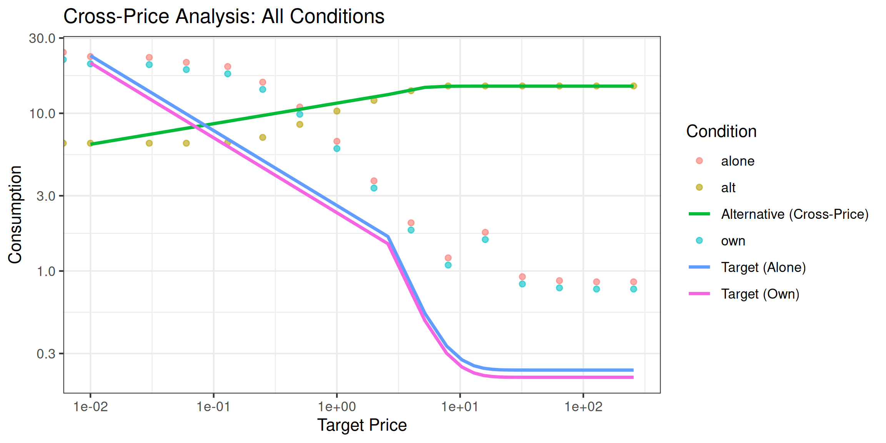
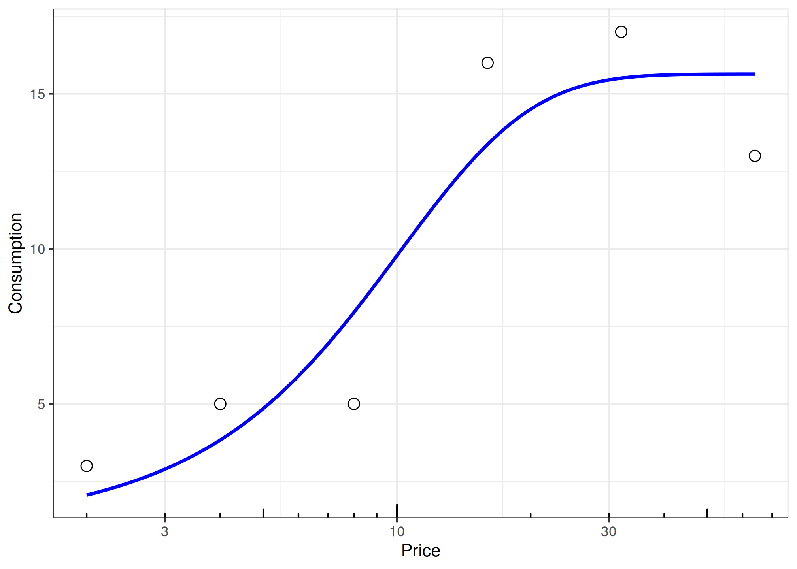
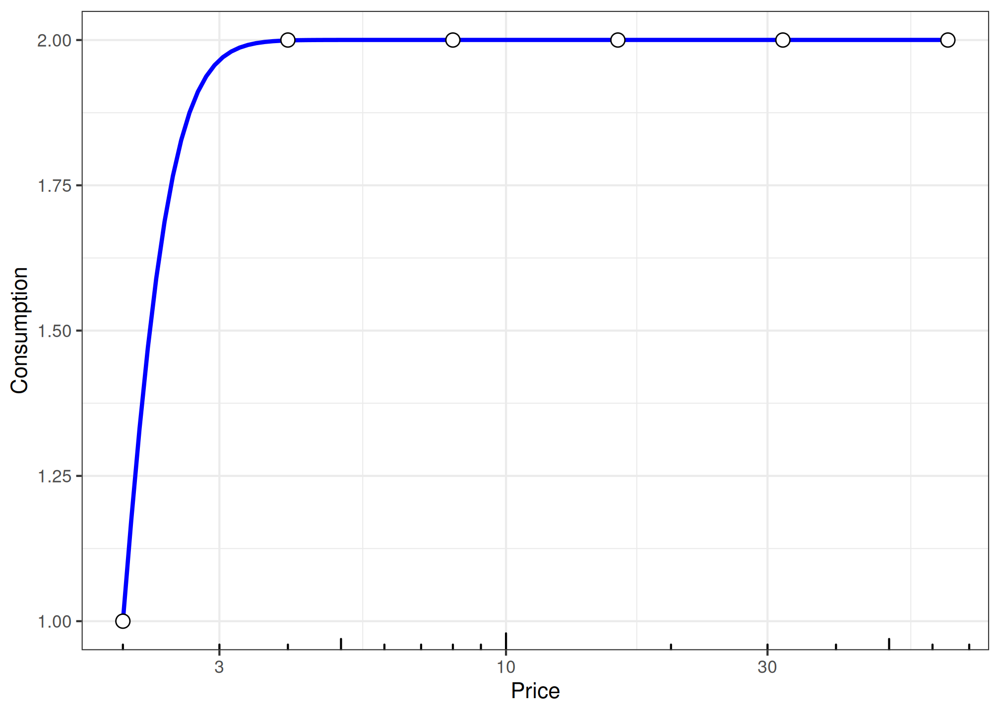
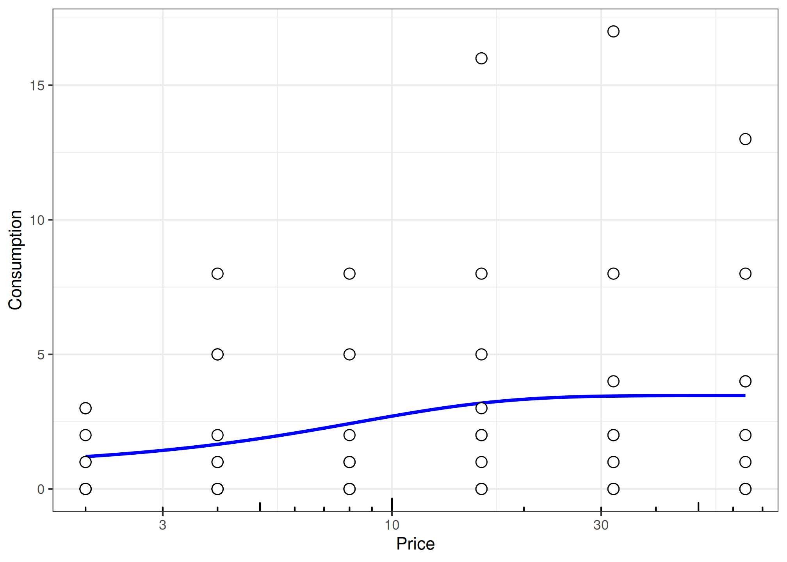
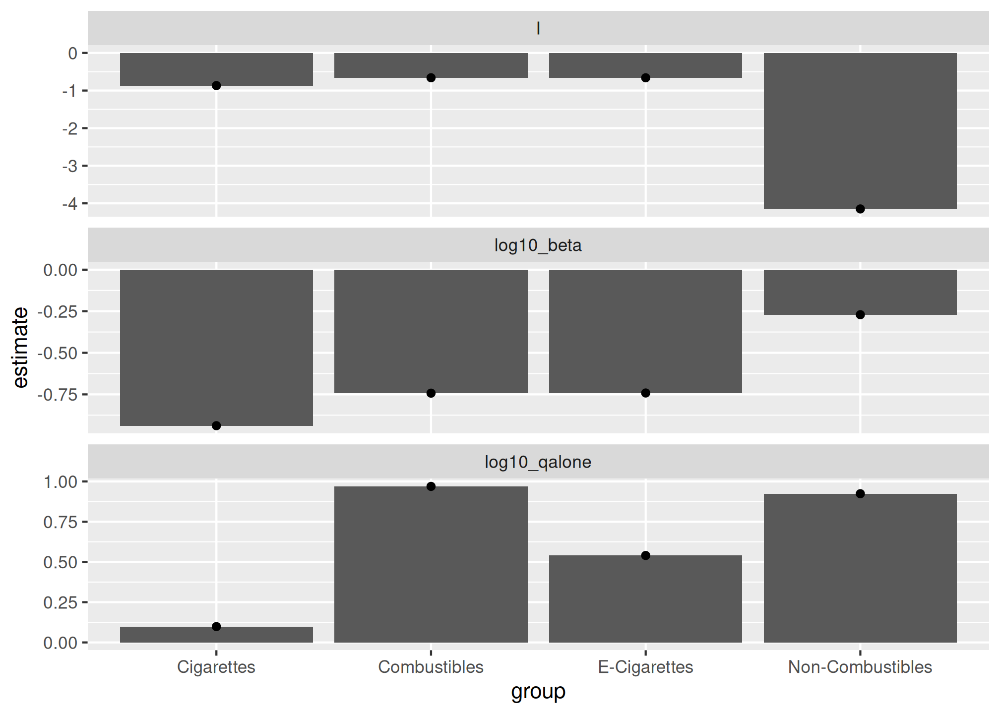
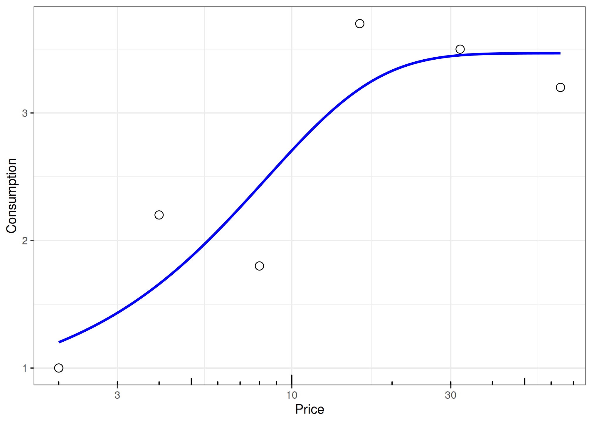
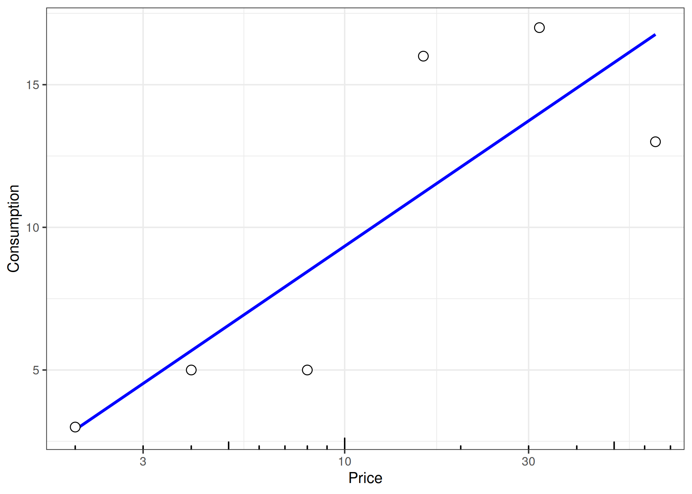
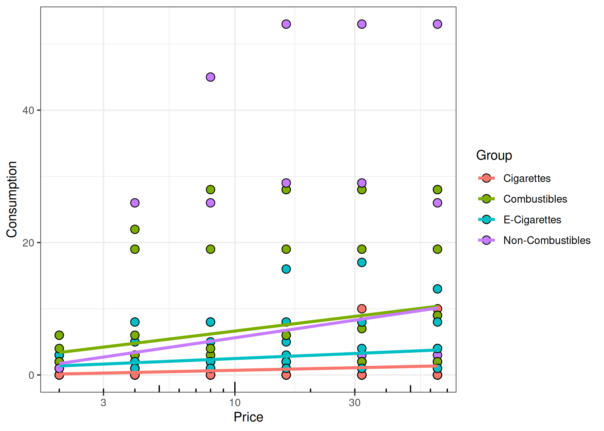
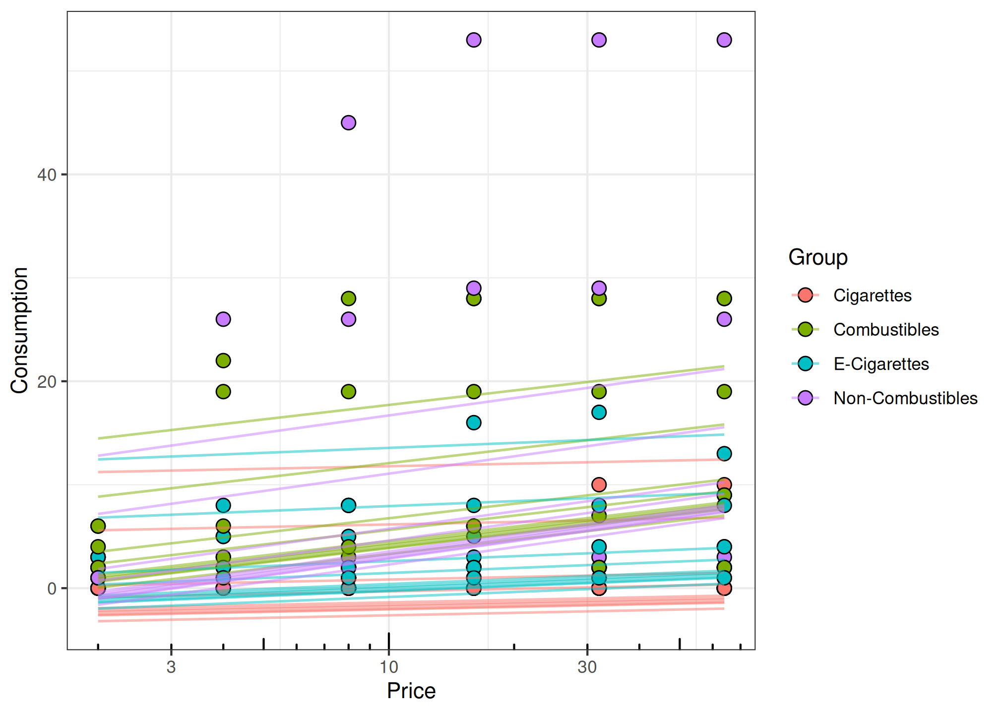
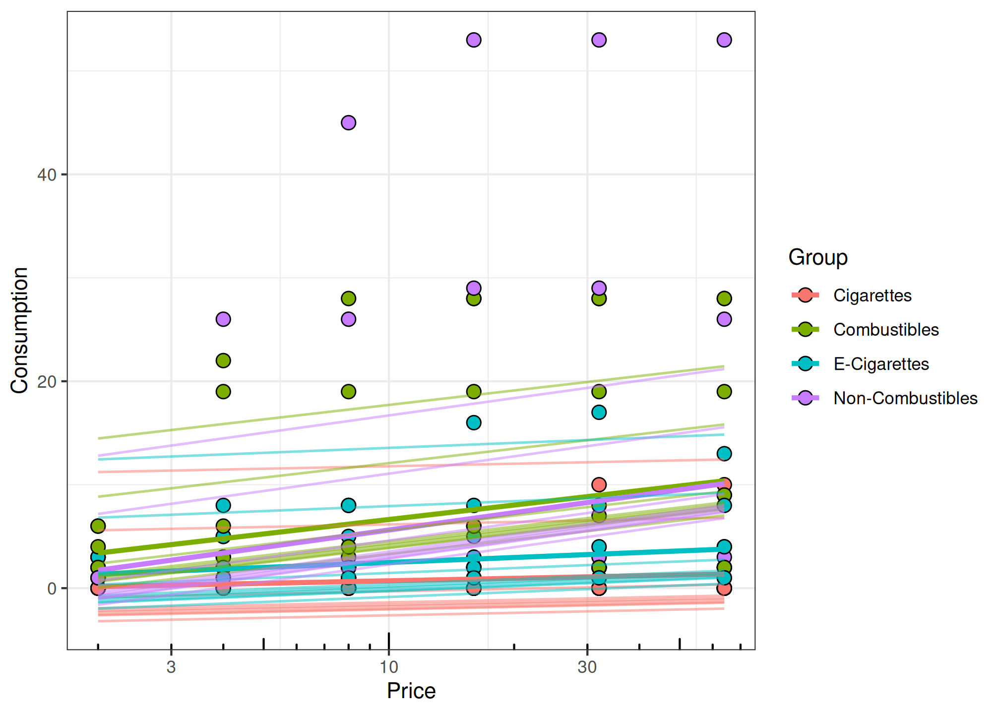

# How to Use Cross-Price Demand Model Functions

## Data Structure

``` r
glimpse(etm)
#> Rows: 240
#> Columns: 5
#> $ id     <dbl> 1, 1, 1, 1, 1, 1, 1, 1, 1, 1, 1, 1, 1, 1, 1, 1, 1, 1, 1, 1, 1, …
#> $ x      <dbl> 2, 4, 8, 16, 32, 64, 2, 4, 8, 16, 32, 64, 2, 4, 8, 16, 32, 64, …
#> $ y      <dbl> 0, 0, 0, 0, 0, 0, 1, 2, 2, 2, 2, 2, 3, 5, 5, 16, 17, 13, 0, 0, …
#> $ target <chr> "alt", "alt", "alt", "alt", "alt", "alt", "alt", "alt", "alt", …
#> $ group  <chr> "Cigarettes", "Cigarettes", "Cigarettes", "Cigarettes", "Cigare…
```

Typical columns: - `id`: participant identifier

- `x`: alternative product price

- `y`: consumption level

- `target`: condition type (e.g., “alt”)

- `group`: product category

## Complete Cross-Price Analysis Workflow

This section demonstrates a complete analysis workflow using data that
contains multiple experimental conditions: target consumption when the
alternative is absent (`alone`), target consumption when the alternative
is present (`own`), and alternative consumption as a function of target
price (`alt`).

### Loading the cp Dataset

``` r
# Load the cross-price example dataset
data("cp", package = "beezdemand")

# Examine structure
glimpse(cp)
#> Rows: 48
#> Columns: 5
#> $ id     <dbl> 1, 1, 1, 1, 1, 1, 1, 1, 1, 1, 1, 1, 1, 1, 1, 1, 1, 1, 1, 1, 1, …
#> $ x      <dbl> 0.00, 0.01, 0.03, 0.06, 0.13, 0.25, 0.50, 1.00, 2.00, 4.00, 8.0…
#> $ y      <dbl> 24.3430657, 22.8832117, 22.6058394, 21.0291971, 19.7810219, 15.…
#> $ target <chr> "alone", "alone", "alone", "alone", "alone", "alone", "alone", …
#> $ group  <chr> "cigarettes", "cigarettes", "cigarettes", "cigarettes", "cigare…

# View conditions
table(cp$target)
#> 
#> alone   alt   own 
#>    16    16    16
```

The `cp` dataset contains:

- **alone**: Target commodity (cigarettes) consumption when alternative
  is *not* available
- **own**: Target commodity consumption when alternative *is* available
- **alt**: Alternative commodity (e-cigarettes) consumption as a
  function of target price

Note that `x` represents the **target commodity price** throughout all
conditions.

### Step 1: Fit Target Demand (Alone Condition)

First, we fit a standard demand curve to the target commodity when the
alternative is absent:

``` r
# Filter to alone condition
alone_data <- cp |>
    dplyr::filter(target == "alone")

# Fit demand curve (modern interface)
fit_alone <- fit_demand_fixed(
    data = alone_data,
    equation = "koff",
    k = 2
)
#> [1] "Data casted as data.frame"

# View results
fit_alone
#> 
#> Fixed-Effect Demand Model
#> ==========================
#> 
#> Call:
#> fit_demand_fixed(data = alone_data, equation = "koff", k = 2)
#> 
#> Equation: koff 
#> k: fixed (2) 
#> Subjects: 1 ( 1 converged, 0 failed)
#> 
#> Use summary() for parameter summaries, tidy() for tidy output.
```

### Step 2: Fit Target Demand (Own Condition)

Next, fit the same demand model to target consumption when the
alternative is present:

``` r
# Filter to own condition
own_data <- cp |>
    dplyr::filter(target == "own")

# Fit demand curve
fit_own <- fit_demand_fixed(
    data = own_data,
    equation = "koff",
    k = 2
)
#> [1] "Data casted as data.frame"

# View results
fit_own
#> 
#> Fixed-Effect Demand Model
#> ==========================
#> 
#> Call:
#> fit_demand_fixed(data = own_data, equation = "koff", k = 2)
#> 
#> Equation: koff 
#> k: fixed (2) 
#> Subjects: 1 ( 1 converged, 0 failed)
#> 
#> Use summary() for parameter summaries, tidy() for tidy output.
```

### Step 3: Fit Cross-Price Model (Alt Condition)

Finally, fit the cross-price model to alternative consumption as a
function of target price:

``` r
# Filter to alt condition
alt_data <- cp |>
    dplyr::filter(target == "alt")

# Fit cross-price model
fit_alt <- fit_cp_nls(
    dat = alt_data,
    equation = "exponentiated",
    return_all = TRUE
)

# View results
summary(fit_alt)
#> Cross-Price Demand Model Summary
#> ================================
#> 
#> Model Specification:
#> Equation type: exponentiated 
#> Functional form: y ~ (10^log10_qalone) * 10^(I * exp(-(10^log10_beta) * x)) 
#> Fitting method: nls_multstart 
#> Method details: Multiple starting values optimization with nls.multstart 
#> 
#> Coefficients:
#>                Estimate Std. Error  t value  Pr(>|t|)    
#> log10_qalone  1.1720228  0.0025378 461.8250 < 2.2e-16 ***
#> I            -0.3712609  0.0066765 -55.6075 < 2.2e-16 ***
#> log10_beta   -0.1271127  0.0217331  -5.8488 5.696e-05 ***
#> ---
#> Signif. codes:  0 '***' 0.001 '**' 0.01 '*' 0.05 '.' 0.1 ' ' 1
#> 
#> Confidence Intervals:
#>                2.5 %   97.5 %
#> log10_qalone  1.1665  1.17751
#> I            -0.3857 -0.35684
#> log10_beta   -0.1741 -0.08016
#> 
#> Fit Statistics:
#> R-squared: 0.9973 
#> AIC: 1.3 
#> BIC: 4.39 
#> 
#> Parameter Interpretation (natural scale):
#> qalone (Q_alone): 14.86  - consumption at zero alternative price
#> I: -0.3713  - interaction parameter (substitution direction)
#> beta: 0.7463  - sensitivity parameter (sensitivity of relation to price)
#> 
#> Optimizer parameters (log10 scale):
#> log10_qalone: 1.172 
#> log10_beta: -0.1271
```

[`fit_cp_nls()`](https://brentkaplan.github.io/beezdemand/reference/fit_cp_nls.md)
uses a log10-parameterized optimizer internally (for numerical
stability), but [`predict()`](https://rdrr.io/r/stats/predict.html)
returns `y_pred` on the natural `y` scale. For the `"exponential"` form,
predictions may also include `y_pred_log10`.

### Comparing Results Across Conditions

``` r
# Extract key parameters for each condition
coef_alone <- coef(fit_alone)
Q0_alone <- coef_alone$estimate[coef_alone$term == "q0"]
Alpha_alone <- coef_alone$estimate[coef_alone$term == "alpha"]

coef_own <- coef(fit_own)
Q0_own <- coef_own$estimate[coef_own$term == "q0"]
Alpha_own <- coef_own$estimate[coef_own$term == "alpha"]

comparison <- data.frame(
    Condition = c("Alone (Target)", "Own (Target)", "Alt (Cross-Price)"),
    Q0_or_Qalone = c(
        Q0_alone,
        Q0_own,
        coef(fit_alt)["qalone"]
    ),
    Alpha_or_I = c(
        Alpha_alone,
        Alpha_own,
        coef(fit_alt)["I"]
    )
)

comparison
#>           Condition Q0_or_Qalone  Alpha_or_I
#> 1    Alone (Target)     23.54818  0.01406589
#> 2      Own (Target)     21.19336  0.01562876
#> 3 Alt (Cross-Price)           NA -0.37126092
```

**Interpretation:**

- Comparing `Q0` between alone and own conditions shows how the presence
  of an alternative affects baseline consumption of the target commodity
- The `I` parameter from the cross-price model indicates whether the
  products are substitutes (I \< 0) or complements (I \> 0)

### Combined Visualization

``` r
# Create prediction data
x_seq <- seq(0.01, max(cp$x), length.out = 100)

# Get demand predictions for each condition
pred_alone <- predict(fit_alone, newdata = data.frame(x = x_seq))$.fitted
pred_own <- predict(fit_own, newdata = data.frame(x = x_seq))$.fitted

# Cross-price model predictions (always on the natural y scale)
pred_alt <- predict(fit_alt, newdata = data.frame(x = x_seq))$y_pred

# Combine into plot data
plot_data <- data.frame(
    x = rep(x_seq, 3),
    y = c(pred_alone, pred_own, pred_alt),
    Condition = rep(c("Target (Alone)", "Target (Own)", "Alternative (Cross-Price)"), each = length(x_seq))
)

# Plot
ggplot() +
    geom_point(data = cp, aes(x = x, y = y, color = target), alpha = 0.6) +
    geom_line(data = plot_data, aes(x = x, y = y, color = Condition), linewidth = 1) +
    scale_x_log10() +
    scale_y_log10() +
    labs(
        x = "Target Price",
        y = "Consumption",
        title = "Cross-Price Analysis: All Conditions",
        color = "Condition"
    ) +
    theme_bw()
```



## Checking Unsystematic Data

``` r
etm |>
    dplyr::filter(group %in% "E-Cigarettes" & id %in% 1)
#> # A tibble: 6 × 5
#>      id     x     y target group       
#>   <dbl> <dbl> <dbl> <chr>  <chr>       
#> 1     1     2     3 alt    E-Cigarettes
#> 2     1     4     5 alt    E-Cigarettes
#> 3     1     8     5 alt    E-Cigarettes
#> 4     1    16    16 alt    E-Cigarettes
#> 5     1    32    17 alt    E-Cigarettes
#> 6     1    64    13 alt    E-Cigarettes


unsys_one <- etm |>
    filter(group %in% "E-Cigarettes" & id %in% 1) |>
    check_systematic_cp()

unsys_one$results
#> # A tibble: 1 × 15
#>   id    type  trend_stat trend_threshold trend_direction trend_pass bounce_stat
#>   <chr> <chr>      <dbl>           <dbl> <chr>           <lgl>            <dbl>
#> 1 1     cp            NA           0.025 up              NA                 0.2
#> # ℹ 8 more variables: bounce_threshold <dbl>, bounce_direction <chr>,
#> #   bounce_pass <lgl>, reversals <int>, reversals_pass <lgl>, returns <int>,
#> #   n_positive <int>, systematic <lgl>

unsys_one_lnic <- lnic |>
    filter(
        target == "adjusting",
        id == "R_00Q12ahGPKuESBT"
    ) |>
    check_systematic_cp()

unsys_one_lnic$results
#> # A tibble: 1 × 15
#>   id     type  trend_stat trend_threshold trend_direction trend_pass bounce_stat
#>   <chr>  <chr>      <dbl>           <dbl> <chr>           <lgl>            <dbl>
#> 1 R_00Q… cp            NA           0.025 down            NA                   0
#> # ℹ 8 more variables: bounce_threshold <dbl>, bounce_direction <chr>,
#> #   bounce_pass <lgl>, reversals <int>, reversals_pass <lgl>, returns <int>,
#> #   n_positive <int>, systematic <lgl>
```

``` r
unsys_all <- etm |>
    group_by(id, group) |>
    nest() |>
    mutate(
        sys = map(data, check_systematic_cp),
        results = map(sys, ~ dplyr::select(.x$results, -id))
    ) |>
    select(-data, -sys) |>
    unnest(results)
```

``` r
knitr::kable(
    unsys_all |>
        group_by(group) |>
        summarise(
            n_subjects = n(),
            pct_systematic = round(mean(systematic, na.rm = TRUE) * 100, 1),
            .groups = "drop"
        ),
    caption = "Systematicity check by product group (ETM dataset)"
)
```

| group            | n_subjects | pct_systematic |
|:-----------------|-----------:|---------------:|
| Cigarettes       |         10 |             90 |
| Combustibles     |         10 |             70 |
| E-Cigarettes     |         10 |             80 |
| Non-Combustibles |         10 |             90 |

Systematicity check by product group (ETM dataset)

### Demonstration from Rzeszutek et al. (under review)

#### Low Nicotine Study (Kaplan et al., 2018)

``` r
unsys_all_lnic <- lnic |>
    filter(target == "fixed") |>
    group_by(id, condition) |>
    nest() |>
    mutate(
        sys = map(
            data,
            check_systematic_cp
        )
    ) |>
    mutate(results = map(sys, ~ dplyr::select(.x$results, -id))) |>
    select(-data, -sys) |>
    unnest(results) |>
    arrange(id)
```

``` r
knitr::kable(
    unsys_all_lnic |>
        group_by(condition) |>
        summarise(
            n_subjects = n(),
            pct_systematic = round(mean(systematic, na.rm = TRUE) * 100, 1),
            .groups = "drop"
        ),
    caption = "Systematicity check by condition (Low Nicotine study, Kaplan et al., 2018)"
)
```

| condition   | n_subjects | pct_systematic |
|:------------|-----------:|---------------:|
| 100%        |         67 |           97.0 |
| 2%          |         57 |           91.2 |
| 2% NegFrame |         59 |           91.5 |

Systematicity check by condition (Low Nicotine study, Kaplan et al.,
2018)

#### Unpublished Cannabis and Cigarette Data

``` r
unsys_all_can_cig <- can_cig |>
    filter(target %in% c("cannabisFix", "cigarettesFix")) |>
    group_by(id, target) |>
    nest() |>
    mutate(
        sys = map(data, check_systematic_cp),
        results = map(sys, ~ dplyr::select(.x$results, -id))
    ) |>
    select(-data, -sys) |>
    unnest(results) |>
    arrange(id)
```

``` r
knitr::kable(
    unsys_all_can_cig |>
        group_by(target) |>
        summarise(
            n_subjects = n(),
            pct_systematic = round(mean(systematic, na.rm = TRUE) * 100, 1),
            .groups = "drop"
        ),
    caption = "Systematicity check by target (Cannabis/Cigarettes, unpublished data)"
)
```

| target        | n_subjects | pct_systematic |
|:--------------|-----------:|---------------:|
| cannabisFix   |         99 |           67.7 |
| cigarettesFix |         99 |           77.8 |

Systematicity check by target (Cannabis/Cigarettes, unpublished data)

#### In Progress Experimental Tobacco Marketplace Data

``` r
unsys_all_ongoing_etm <- ongoing_etm |>
    # one person is doubled up
    distinct() |>
    filter(target %in% c("FixCig", "ECig")) |>
    group_by(id, target) |>
    nest() |>
    mutate(
        sys = map(data, check_systematic_cp),
        results = map(sys, ~ dplyr::select(.x$results, -id))
    ) |>
    select(-data, -sys) |>
    unnest(results)
```

``` r
knitr::kable(
    unsys_all_ongoing_etm |>
        group_by(target) |>
        summarise(
            n_subjects = n(),
            pct_systematic = round(mean(systematic, na.rm = TRUE) * 100, 1),
            .groups = "drop"
        ),
    caption = "Systematicity check by target (Ongoing ETM data)"
)
```

| target | n_subjects | pct_systematic |
|:-------|-----------:|---------------:|
| ECig   |         47 |           83.0 |
| FixCig |         47 |           89.4 |

Systematicity check by target (Ongoing ETM data)

## Nonlinear Model Fitting

### Two Stage

``` r
fit_one <- etm |>
    dplyr::filter(group %in% "E-Cigarettes" & id %in% 1) |>
    fit_cp_nls(
        equation = "exponentiated",
        return_all = TRUE
    )

summary(fit_one)
#> Cross-Price Demand Model Summary
#> ================================
#> 
#> Model Specification:
#> Equation type: exponentiated 
#> Functional form: y ~ (10^log10_qalone) * 10^(I * exp(-(10^log10_beta) * x)) 
#> Fitting method: nls_multstart 
#> Method details: Multiple starting values optimization with nls.multstart 
#> 
#> Coefficients:
#>               Estimate Std. Error t value  Pr(>|t|)    
#> log10_qalone  1.194135   0.060311 19.7995 0.0002815 ***
#> I            -1.268376   0.837302 -1.5148 0.2270524    
#> log10_beta   -0.737728   0.265129 -2.7825 0.0688459 .  
#> ---
#> Signif. codes:  0 '***' 0.001 '**' 0.01 '*' 0.05 '.' 0.1 ' ' 1
#> 
#> Confidence Intervals:
#>               2.5 % 97.5 %
#> log10_qalone  1.002  1.386
#> I            -3.933  1.396
#> log10_beta   -1.581  0.106
#> 
#> Fit Statistics:
#> R-squared: 0.8597 
#> AIC: 34.06 
#> BIC: 33.23 
#> 
#> Parameter Interpretation (natural scale):
#> qalone (Q_alone): 15.64  - consumption at zero alternative price
#> I: -1.268  - interaction parameter (substitution direction)
#> beta: 0.1829  - sensitivity parameter (sensitivity of relation to price)
#> 
#> Optimizer parameters (log10 scale):
#> log10_qalone: 1.194 
#> log10_beta: -0.7377

plot(fit_one, x_trans = "log10")
```



``` r
fit_all <- etm |>
    group_by(id, group) |>
    nest() |>
    mutate(
        unsys = map(data, check_unsystematic_cp),
        fit = map(data, fit_cp_nls, equation = "exponentiated", return_all = TRUE),
        summary = map(fit, summary),
        plot = map(fit, plot, x_trans = "log10"),
        glance = map(fit, glance),
        tidy = map(fit, tidy)
    )
```

``` r
# Show parameter estimates for first 3 subjects only
knitr::kable(
    fit_all |>
        slice(1:3) |>
        unnest(tidy) |>
        select(id, group, term, estimate, std.error),
    digits = 3,
    caption = "Example parameter estimates (first 3 subjects)"
)
```

|  id | group            | term         |      estimate |    std.error |
|----:|:-----------------|:-------------|--------------:|-------------:|
|   1 | Cigarettes       | log10_qalone | -4.520500e+01 | 2.077915e+04 |
|   1 | Cigarettes       | I            | -1.840000e+00 | 2.077883e+04 |
|   1 | Cigarettes       | log10_beta   | -3.588000e+00 | 4.946434e+03 |
|   1 | Combustibles     | log10_qalone |  3.010000e-01 | 0.000000e+00 |
|   1 | Combustibles     | I            | -4.680670e+02 | 2.715780e+02 |
|   1 | Combustibles     | log10_beta   |  5.650000e-01 | 3.400000e-02 |
|   1 | E-Cigarettes     | log10_qalone |  1.194000e+00 | 6.000000e-02 |
|   1 | E-Cigarettes     | I            | -1.268000e+00 | 8.370000e-01 |
|   1 | E-Cigarettes     | log10_beta   | -7.380000e-01 | 2.650000e-01 |
|   1 | Non-Combustibles | log10_qalone | -4.465900e+01 | 3.266880e+04 |
|   1 | Non-Combustibles | I            | -2.449000e+00 | 3.266849e+04 |
|   1 | Non-Combustibles | log10_beta   | -3.686000e+00 | 5.834030e+03 |
|   2 | Cigarettes       | log10_qalone | -3.078160e+02 | 1.911008e+06 |
|   2 | Cigarettes       | I            |  3.082850e+02 | 1.911007e+06 |
|   2 | Cigarettes       | log10_beta   | -4.310000e+00 | 2.694688e+03 |
|   2 | Combustibles     | log10_qalone | -4.830000e-01 | 2.381000e+00 |
|   2 | Combustibles     | I            |  9.950000e-01 | 2.271000e+00 |
|   2 | Combustibles     | log10_beta   | -1.527000e+00 | 1.663000e+00 |
|   2 | E-Cigarettes     | log10_qalone | -3.077080e+02 | 1.130645e+06 |
|   2 | E-Cigarettes     | I            |  3.082790e+02 | 1.130645e+06 |
|   2 | E-Cigarettes     | log10_beta   | -4.397000e+00 | 1.594221e+03 |
|   2 | Non-Combustibles | log10_qalone | -3.080510e+02 | 5.727693e+06 |
|   2 | Non-Combustibles | I            |  3.082640e+02 | 5.727693e+06 |
|   2 | Non-Combustibles | log10_beta   | -4.831000e+00 | 8.073049e+03 |
|   3 | Cigarettes       | log10_qalone |  1.000000e+00 | 0.000000e+00 |
|   3 | Cigarettes       | I            | -4.446080e+02 | 2.573770e+02 |
|   3 | Cigarettes       | log10_beta   | -3.230000e-01 | 3.300000e-02 |
|   3 | Combustibles     | log10_qalone | -4.537600e+01 | 5.154300e+02 |
|   3 | Combustibles     | I            | -2.076000e+00 | 5.150490e+02 |
|   3 | Combustibles     | log10_beta   | -2.790000e+00 | 1.140520e+02 |
|   3 | E-Cigarettes     | log10_qalone | -4.533800e+01 | 3.951200e+02 |
|   3 | E-Cigarettes     | I            | -2.312000e+00 | 3.947180e+02 |
|   3 | E-Cigarettes     | log10_beta   | -2.732000e+00 | 7.919200e+01 |
|   3 | Non-Combustibles | log10_qalone | -4.542400e+01 | 1.483320e+02 |
|   3 | Non-Combustibles | I            | -1.831000e+00 | 1.479030e+02 |
|   3 | Non-Combustibles | log10_beta   | -2.518000e+00 | 3.918000e+01 |
|   4 | Cigarettes       | log10_qalone | -4.529600e+01 | 2.315600e+01 |
|   4 | Cigarettes       | I            | -2.337000e+00 | 2.164500e+01 |
|   4 | Cigarettes       | log10_beta   | -2.000000e+00 | 6.466000e+00 |
|   4 | Combustibles     | log10_qalone |  1.447000e+00 | 5.400000e-02 |
|   4 | Combustibles     | I            | -2.649152e+03 | 9.148180e+05 |
|   4 | Combustibles     | log10_beta   |  3.000000e-03 | 1.863100e+01 |
|   4 | E-Cigarettes     | log10_qalone | -4.495600e+01 | 2.990277e+03 |
|   4 | E-Cigarettes     | I            | -2.824000e+00 | 2.989923e+03 |
|   4 | E-Cigarettes     | log10_beta   | -3.171000e+00 | 4.705820e+02 |
|   4 | Non-Combustibles | log10_qalone | -4.502900e+01 | 2.796771e+04 |
|   4 | Non-Combustibles | I            | -2.583000e+00 | 2.796739e+04 |
|   4 | Non-Combustibles | log10_beta   | -3.653000e+00 | 4.737270e+03 |
|   5 | Cigarettes       | log10_qalone |  0.000000e+00 | 0.000000e+00 |
|   5 | Cigarettes       | I            |  0.000000e+00 | 0.000000e+00 |
|   5 | Cigarettes       | log10_beta   | -6.081000e+00 | 4.800000e-02 |
|   5 | Combustibles     | log10_qalone |  1.448000e+00 | 0.000000e+00 |
|   5 | Combustibles     | I            | -6.810000e+00 | 1.150000e-01 |
|   5 | Combustibles     | log10_beta   |  1.800000e-02 | 3.000000e-03 |
|   5 | E-Cigarettes     | log10_qalone |  9.030000e-01 | 0.000000e+00 |
|   5 | E-Cigarettes     | I            | -1.105911e+11 | 3.553261e+10 |
|   5 | E-Cigarettes     | log10_beta   |  1.064000e+00 | 6.000000e-03 |
|   5 | Non-Combustibles | log10_qalone |  1.724000e+00 | 0.000000e+00 |
|   5 | Non-Combustibles | I            | -8.613190e+02 | 4.976930e+02 |
|   5 | Non-Combustibles | log10_beta   |  7.000000e-02 | 2.700000e-02 |
|   6 | Cigarettes       | log10_qalone | -4.520700e+01 | 1.883684e+04 |
|   6 | Cigarettes       | I            | -2.921000e+00 | 1.883652e+04 |
|   6 | Cigarettes       | log10_beta   | -3.568000e+00 | 2.825844e+03 |
|   6 | Combustibles     | log10_qalone | -4.542100e+01 | 4.753390e+02 |
|   6 | Combustibles     | I            | -2.620000e+00 | 4.749340e+02 |
|   6 | Combustibles     | log10_beta   | -2.771000e+00 | 8.361600e+01 |
|   6 | E-Cigarettes     | log10_qalone |  3.160000e-01 | 4.600000e-02 |
|   6 | E-Cigarettes     | I            | -4.890000e-01 | 1.680000e-01 |
|   6 | E-Cigarettes     | log10_beta   | -9.410000e-01 | 2.580000e-01 |
|   6 | Non-Combustibles | log10_qalone | -4.496200e+01 | 1.062530e+02 |
|   6 | Non-Combustibles | I            | -2.758000e+00 | 1.056300e+02 |
|   6 | Non-Combustibles | log10_beta   | -2.417000e+00 | 1.931000e+01 |
|   7 | Cigarettes       | log10_qalone |  3.010000e-01 | 0.000000e+00 |
|   7 | Cigarettes       | I            | -2.150700e+02 | 1.341400e+01 |
|   7 | Cigarettes       | log10_beta   | -6.880000e-01 | 4.000000e-03 |
|   7 | Combustibles     | log10_qalone |  1.082000e+00 | 5.900000e-01 |
|   7 | Combustibles     | I            | -5.340000e-01 | 4.990000e-01 |
|   7 | Combustibles     | log10_beta   | -1.639000e+00 | 1.047000e+00 |
|   7 | E-Cigarettes     | log10_qalone | -4.542400e+01 | 8.741134e+03 |
|   7 | E-Cigarettes     | I            | -2.341000e+00 | 8.740799e+03 |
|   7 | E-Cigarettes     | log10_beta   | -3.402000e+00 | 1.643544e+03 |
|   7 | Non-Combustibles | log10_qalone | -4.509500e+01 | 1.716570e+02 |
|   7 | Non-Combustibles | I            | -1.991000e+00 | 1.712250e+02 |
|   7 | Non-Combustibles | log10_beta   | -2.549000e+00 | 4.139200e+01 |
|   8 | Cigarettes       | log10_qalone | -4.529500e+01 | 8.952569e+03 |
|   8 | Cigarettes       | I            | -2.168000e+00 | 8.952236e+03 |
|   8 | Cigarettes       | log10_beta   | -3.407000e+00 | 1.816815e+03 |
|   8 | Combustibles     | log10_qalone |  3.082550e+02 | 3.028308e+05 |
|   8 | Combustibles     | I            | -3.084270e+02 | 3.028302e+05 |
|   8 | Combustibles     | log10_beta   | -4.245000e+00 | 4.274000e+02 |
|   8 | E-Cigarettes     | log10_qalone |  4.770000e-01 | 8.400000e-02 |
|   8 | E-Cigarettes     | I            | -8.799230e+02 | 4.922550e+05 |
|   8 | E-Cigarettes     | log10_beta   | -2.700000e-02 | 3.231500e+01 |
|   8 | Non-Combustibles | log10_qalone |  4.810000e-01 | 3.500000e-02 |
|   8 | Non-Combustibles | I            | -2.251000e+00 | 7.430000e-01 |
|   8 | Non-Combustibles | log10_beta   | -1.077000e+00 | 9.900000e-02 |
|   9 | Cigarettes       | log10_qalone | -4.472600e+01 | 3.839739e+03 |
|   9 | Cigarettes       | I            | -2.769000e+00 | 3.839390e+03 |
|   9 | Cigarettes       | log10_beta   | -3.225000e+00 | 6.145640e+02 |
|   9 | Combustibles     | log10_qalone |  3.010000e-01 | 0.000000e+00 |
|   9 | Combustibles     | I            | -2.509812e+11 | 2.359234e+10 |
|   9 | Combustibles     | log10_beta   |  7.780000e-01 | 3.000000e-03 |
|   9 | E-Cigarettes     | log10_qalone |  6.520000e-01 | 1.170000e-01 |
|   9 | E-Cigarettes     | I            | -4.460000e-01 | 1.180000e-01 |
|   9 | E-Cigarettes     | log10_beta   | -1.387000e+00 | 3.800000e-01 |
|   9 | Non-Combustibles | log10_qalone | -4.491200e+01 | 1.834712e+04 |
|   9 | Non-Combustibles | I            | -2.891000e+00 | 1.834679e+04 |
|   9 | Non-Combustibles | log10_beta   | -3.562000e+00 | 2.781259e+03 |
|  10 | Cigarettes       | log10_qalone | -4.484500e+01 | 3.442558e+03 |
|  10 | Cigarettes       | I            | -2.514000e+00 | 3.442210e+03 |
|  10 | Cigarettes       | log10_beta   | -3.201000e+00 | 6.075210e+02 |
|  10 | Combustibles     | log10_qalone |  1.279000e+00 | 0.000000e+00 |
|  10 | Combustibles     | I            | -6.370968e+03 | 3.699638e+03 |
|  10 | Combustibles     | log10_beta   |  6.430000e-01 | 2.900000e-02 |
|  10 | E-Cigarettes     | log10_qalone |  0.000000e+00 | 0.000000e+00 |
|  10 | E-Cigarettes     | I            |  0.000000e+00 | 0.000000e+00 |
|  10 | E-Cigarettes     | log10_beta   | -6.432000e+00 | 4.300000e-02 |
|  10 | Non-Combustibles | log10_qalone |  1.439000e+00 | 1.400000e-02 |
|  10 | Non-Combustibles | I            | -8.492300e+01 | 1.419310e+02 |
|  10 | Non-Combustibles | log10_beta   |  3.090000e-01 | 1.500000e-01 |

Example parameter estimates (first 3 subjects)

``` r

# Show one example plot
fit_all$plot[[2]]
```



### Fit to Group (pooled by group)

``` r
fit_pooled <- etm |>
    group_by(group) |>
    nest() |>
    mutate(
        unsys = map(data, check_unsystematic_cp),
        fit = map(data, fit_cp_nls, equation = "exponentiated", return_all = TRUE),
        summary = map(fit, summary),
        plot = map(fit, plot, x_trans = "log10"),
        glance = map(fit, glance),
        tidy = map(fit, tidy)
    )
```

``` r
# Show tidy results instead of summary
knitr::kable(
    fit_pooled |>
        unnest(tidy) |>
        select(group, term, estimate, std.error),
    digits = 3,
    caption = "Pooled model parameter estimates by product group"
)
```

| group            | term         | estimate | std.error |
|:-----------------|:-------------|---------:|----------:|
| Cigarettes       | log10_qalone |    0.098 |     0.205 |
| Cigarettes       | I            |   -0.868 |     1.251 |
| Cigarettes       | log10_beta   |   -0.938 |     0.827 |
| Combustibles     | log10_qalone |    0.969 |     0.098 |
| Combustibles     | I            |   -0.661 |     0.683 |
| Combustibles     | log10_beta   |   -0.743 |     0.579 |
| E-Cigarettes     | log10_qalone |    0.540 |     0.105 |
| E-Cigarettes     | I            |   -0.661 |     0.735 |
| E-Cigarettes     | log10_beta   |   -0.742 |     0.622 |
| Non-Combustibles | log10_qalone |    0.924 |     0.134 |
| Non-Combustibles | I            |   -4.148 |    19.320 |
| Non-Combustibles | log10_beta   |   -0.271 |     0.904 |

Pooled model parameter estimates by product group

``` r

# Show one plot example
fit_pooled |>
    dplyr::filter(group == "E-Cigarettes") |>
    pull(plot) |>
    pluck(1)
```



### Fit to Group (mean)

``` r
fit_mean <- etm |>
    group_by(group, x) |>
    summarise(
        y = mean(y),
        .groups = "drop"
    ) |>
    group_by(group) |>
    nest() |>
    mutate(
        unsys = map(data, check_unsystematic_cp),
        fit = map(data, fit_cp_nls, equation = "exponentiated", return_all = TRUE),
        summary = map(fit, summary),
        plot = map(fit, plot, x_trans = "log10"),
        glance = map(fit, glance),
        tidy = map(fit, tidy)
    )
```

``` r
# Show tidy results
knitr::kable(
    fit_mean |>
        unnest(tidy) |>
        select(group, term, estimate, std.error),
    digits = 3,
    caption = "Mean model parameter estimates by product group"
)
```

| group            | term         | estimate | std.error |
|:-----------------|:-------------|---------:|----------:|
| Cigarettes       | log10_qalone |    0.098 |     0.074 |
| Cigarettes       | I            |   -0.868 |     0.453 |
| Cigarettes       | log10_beta   |   -0.938 |     0.299 |
| Combustibles     | log10_qalone |    0.969 |     0.031 |
| Combustibles     | I            |   -0.661 |     0.218 |
| Combustibles     | log10_beta   |   -0.743 |     0.185 |
| E-Cigarettes     | log10_qalone |    0.540 |     0.052 |
| E-Cigarettes     | I            |   -0.661 |     0.367 |
| E-Cigarettes     | log10_beta   |   -0.742 |     0.310 |
| Non-Combustibles | log10_qalone |    0.924 |     0.007 |
| Non-Combustibles | I            |   -4.148 |     0.992 |
| Non-Combustibles | log10_beta   |   -0.271 |     0.046 |

Mean model parameter estimates by product group

``` r

# Show parameter estimates plot
fit_mean |>
    unnest(cols = c(glance, tidy)) |>
    select(
        group,
        term,
        estimate
    ) |>
    ggplot(aes(x = group, y = estimate, group = term)) +
    geom_bar(stat = "identity") +
    geom_point() +
    facet_wrap(~term, ncol = 1, scales = "free_y")
```



``` r

# Show one example plot
fit_mean |>
    dplyr::filter(group %in% "E-Cigarettes") |>
    pull(plot) |>
    pluck(1)
```



## Linear Model Fitting

``` r
fit_one_linear <- etm |>
    dplyr::filter(group %in% "E-Cigarettes" & id %in% 1) |>
    fit_cp_linear(
        type = "fixed",
        log10x = TRUE,
        return_all = TRUE
    )

summary(fit_one_linear)
#> Linear Cross-Price Demand Model Summary
#> =======================================
#> 
#> Formula: y ~ log10(x) 
#> Method: lm 
#> 
#> Coefficients:
#>             Estimate Std. Error t value Pr(>|t|)  
#> (Intercept)  0.13333    3.55773  0.0375  0.97190  
#> log10(x)     9.20649    3.03472  3.0337  0.03864 *
#> ---
#> Signif. codes:  0 '***' 0.001 '**' 0.01 '*' 0.05 '.' 0.1 ' ' 1
#> 
#> R-squared: 0.697   Adjusted R-squared: 0.6213
plot(fit_one_linear, x_trans = "log10")
```



## Linear Mixed-Effects Model

``` r
fit_mixed <- fit_cp_linear(
    etm,
    type = "mixed",
    log10x = TRUE,
    group_effects = "interaction",
    random_slope = FALSE,
    return_all = TRUE
)

summary(fit_mixed)
#> Mixed-Effects Linear Cross-Price Demand Model Summary
#> ====================================================
#> 
#> Formula: y ~ log10(x) * group + (1 | id) 
#> Method: lmer 
#> 
#> Fixed Effects:
#>                                Estimate Std. Error t value
#> (Intercept)                    -0.10000    2.66378 -0.0375
#> log10(x)                        0.80675    1.85305  0.4354
#> groupCombustibles               2.09333    3.07225  0.6814
#> groupE-Cigarettes               0.98667    3.07225  0.3212
#> groupNon-Combustibles           0.14667    3.07225  0.0477
#> log10(x):groupCombustibles      3.83445    2.62060  1.4632
#> log10(x):groupE-Cigarettes      0.78777    2.62060  0.3006
#> log10(x):groupNon-Combustibles  4.76459    2.62060  1.8181
#> 
#> Random Effects:
#>     Group        Term Variance  Std.Dev       NA
#>        id (Intercept)     <NA> 23.76351 4.874783
#>  Residual        <NA>     <NA> 54.45409 7.379301
#> 
#> Model Fit:
#> R2 (marginal): 0.1121   [Fixed effects only]
#> R2 (conditional): 0.3819   [Fixed + random effects]
#> AIC: 1655 
#> BIC: 1690 
#> 
#> Note: R2 values for mixed models are approximate.

# plot fixed effects only
plot(fit_mixed, x_trans = "log10", pred_type = "fixed")
```



``` r

# plot random effects only
plot(fit_mixed, x_trans = "log10", pred_type = "random")
```



``` r

# plot both fixed and random effects
plot(fit_mixed, x_trans = "log10", pred_type = "all")
```



## Extracting Model Coefficients

``` r
glance(fit_one)
#> # A tibble: 1 × 6
#>   r.squared   aic   bic equation      method        transform
#>       <dbl> <dbl> <dbl> <chr>         <chr>         <chr>    
#> 1     0.860  34.1  33.2 exponentiated nls_multstart none
tidy(fit_one)
#> # A tibble: 3 × 5
#>   term         estimate std.error statistic  p.value
#>   <chr>           <dbl>     <dbl>     <dbl>    <dbl>
#> 1 log10_qalone    1.19     0.0603     19.8  0.000282
#> 2 I              -1.27     0.837      -1.51 0.227   
#> 3 log10_beta     -0.738    0.265      -2.78 0.0688
```

``` r
extract_coefficients(fit_mixed)
#> $fixed
#>                    (Intercept)                       log10(x) 
#>                     -0.1000000                      0.8067540 
#>              groupCombustibles              groupE-Cigarettes 
#>                      2.0933333                      0.9866667 
#>          groupNon-Combustibles     log10(x):groupCombustibles 
#>                      0.1466667                      3.8344541 
#>     log10(x):groupE-Cigarettes log10(x):groupNon-Combustibles 
#>                      0.7877715                      4.7645940 
#> 
#> $random
#> $id
#>    (Intercept)
#> 1   -1.0155373
#> 2   -2.0805203
#> 3   -2.6890820
#> 4    0.1255158
#> 5   11.0796263
#> 6   -3.3356788
#> 7   -2.3087309
#> 8   -2.4608713
#> 9   -2.7651522
#> 10   5.4504307
#> 
#> with conditional variances for "id" 
#> 
#> $combined
#> $id
#>    (Intercept) log10(x) groupCombustibles groupE-Cigarettes
#> 1  -1.11553732 0.806754          2.093333         0.9866667
#> 2  -2.18052028 0.806754          2.093333         0.9866667
#> 3  -2.78908198 0.806754          2.093333         0.9866667
#> 4   0.02551585 0.806754          2.093333         0.9866667
#> 5  10.97962630 0.806754          2.093333         0.9866667
#> 6  -3.43567877 0.806754          2.093333         0.9866667
#> 7  -2.40873092 0.806754          2.093333         0.9866667
#> 8  -2.56087134 0.806754          2.093333         0.9866667
#> 9  -2.86515219 0.806754          2.093333         0.9866667
#> 10  5.35043065 0.806754          2.093333         0.9866667
#>    groupNon-Combustibles log10(x):groupCombustibles log10(x):groupE-Cigarettes
#> 1              0.1466667                   3.834454                  0.7877715
#> 2              0.1466667                   3.834454                  0.7877715
#> 3              0.1466667                   3.834454                  0.7877715
#> 4              0.1466667                   3.834454                  0.7877715
#> 5              0.1466667                   3.834454                  0.7877715
#> 6              0.1466667                   3.834454                  0.7877715
#> 7              0.1466667                   3.834454                  0.7877715
#> 8              0.1466667                   3.834454                  0.7877715
#> 9              0.1466667                   3.834454                  0.7877715
#> 10             0.1466667                   3.834454                  0.7877715
#>    log10(x):groupNon-Combustibles
#> 1                        4.764594
#> 2                        4.764594
#> 3                        4.764594
#> 4                        4.764594
#> 5                        4.764594
#> 6                        4.764594
#> 7                        4.764594
#> 8                        4.764594
#> 9                        4.764594
#> 10                       4.764594
#> 
#> attr(,"class")
#> [1] "coef.mer"
```

## Post-hoc Estimated Marginal Means and Comparisons

``` r
cp_posthoc_slopes(fit_mixed)
#> Slope Estimates and Comparisons 
#> =============================== 
#> 
#> Estimated Marginal Means:
#>  group               x.trend         SE  df   asymp.LCL asymp.UCL
#>  Cigarettes       0.01665965 0.03826583 Inf -0.05834000 0.0916593
#>  Combustibles     0.09584197 0.03826583 Inf  0.02084232 0.1708416
#>  E-Cigarettes     0.03292730 0.03826583 Inf -0.04207235 0.1079269
#>  Non-Combustibles 0.11504957 0.03826583 Inf  0.04004992 0.1900492
#> 
#> Degrees-of-freedom method: asymptotic 
#> Confidence level used: 0.95 
#> 
#> Significant interaction: No 
#> 
#> No significant interaction detected (alpha = 0.05 ). Pairwise slope comparisons not performed. 
#> P-value adjustment method: tukey
cp_posthoc_intercepts(fit_mixed)
#> Intercept Estimates and Comparisons 
#> =================================== 
#> 
#> Estimated Marginal Means:
#>  group                emmean       SE  df asymp.LCL asymp.UCL
#>  Cigarettes       -0.1000000 2.663776 Inf -5.320906  5.120906
#>  Combustibles      1.9933333 2.663776 Inf -3.227573  7.214239
#>  E-Cigarettes      0.8866667 2.663776 Inf -4.334239  6.107573
#>  Non-Combustibles  0.0466667 2.663776 Inf -5.174239  5.267573
#> 
#> Degrees-of-freedom method: asymptotic 
#> Confidence level used: 0.95 
#> 
#> Significant interaction: No 
#> 
#> No significant interaction detected (alpha = 0.05 ). Pairwise intercept comparisons not performed. 
#> P-value adjustment method: tukey
```

## See Also

- [`vignette("beezdemand")`](https://brentkaplan.github.io/beezdemand/articles/beezdemand.md)
  – Getting started with beezdemand
- [`vignette("model-selection")`](https://brentkaplan.github.io/beezdemand/articles/model-selection.md)
  – Choosing the right model class for your data
- [`vignette("group-comparisons")`](https://brentkaplan.github.io/beezdemand/articles/group-comparisons.md)
  – Extra sum-of-squares F-test for group comparisons
- [`vignette("mixed-demand")`](https://brentkaplan.github.io/beezdemand/articles/mixed-demand.md)
  – Mixed-effects nonlinear demand models
- [`vignette("mixed-demand-advanced")`](https://brentkaplan.github.io/beezdemand/articles/mixed-demand-advanced.md)
  – Advanced mixed-effects topics
- [`vignette("hurdle-demand-models")`](https://brentkaplan.github.io/beezdemand/articles/hurdle-demand-models.md)
  – Two-part hurdle demand models
