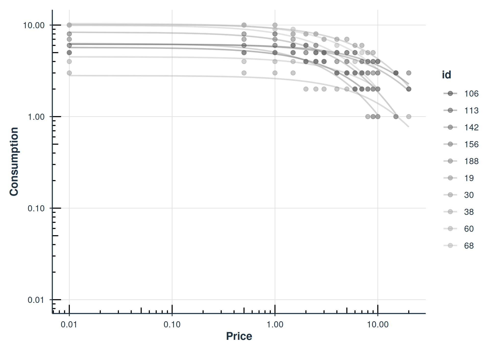
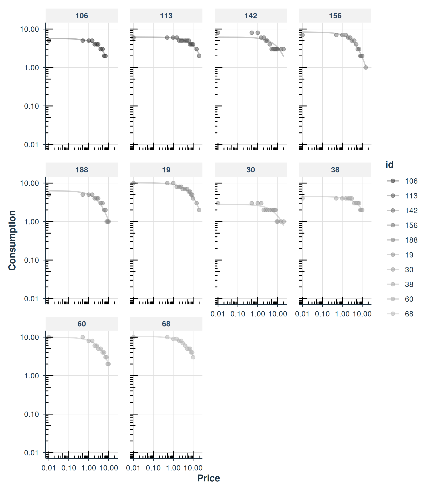
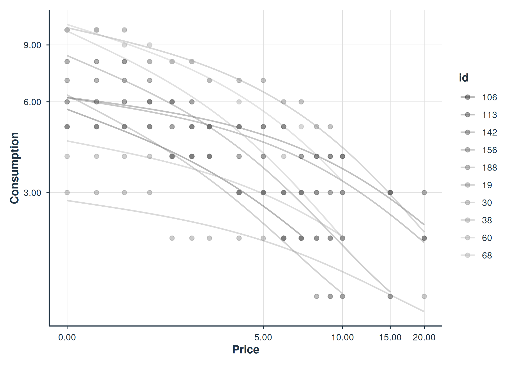
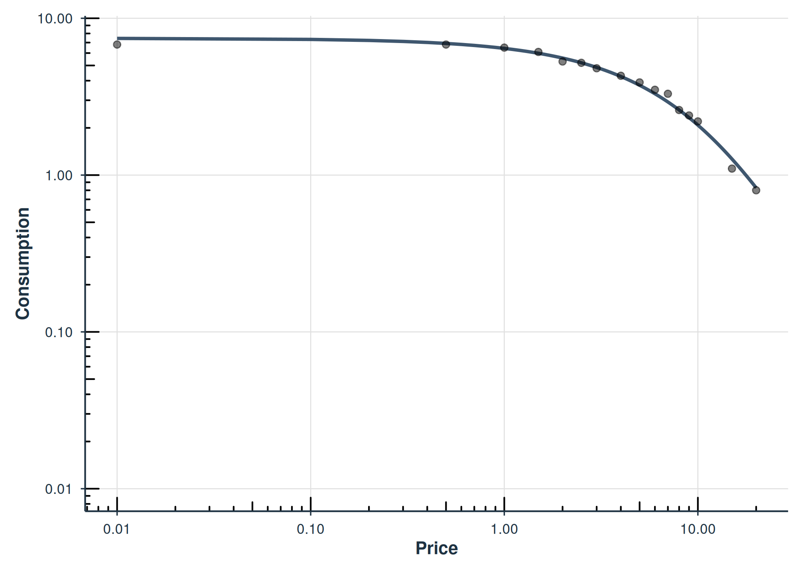
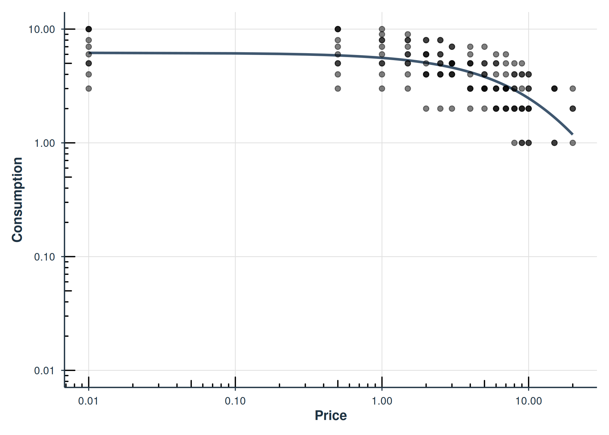
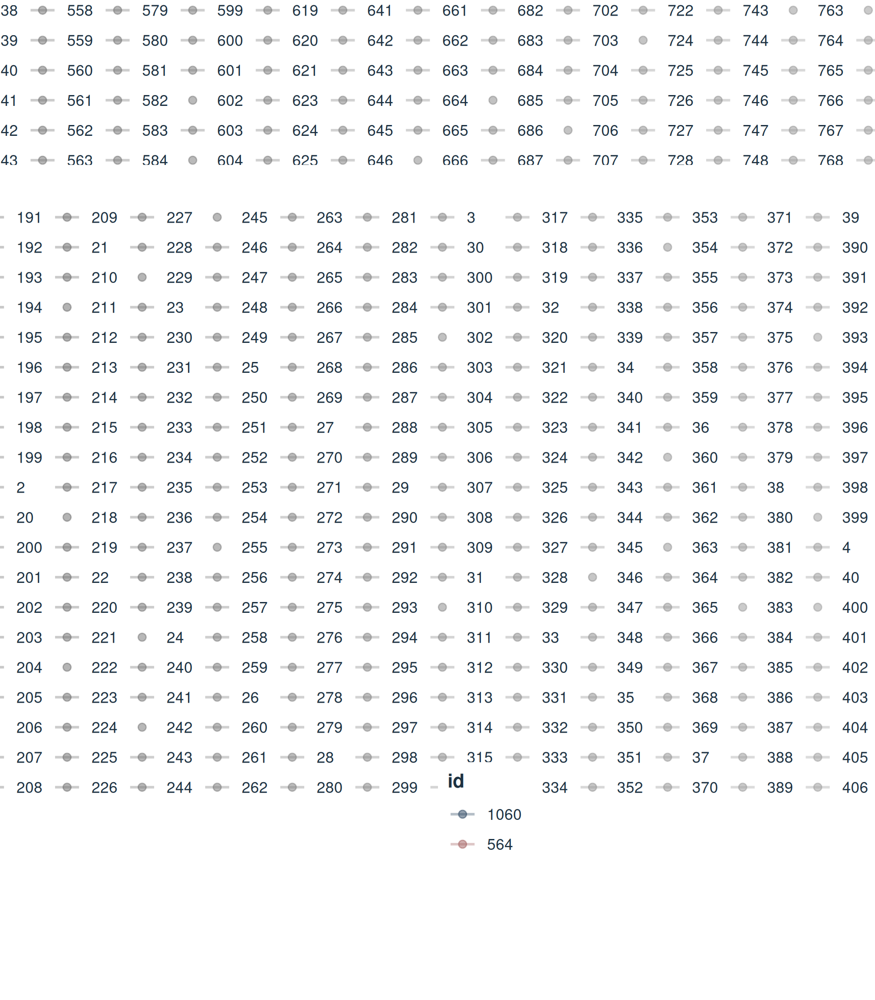
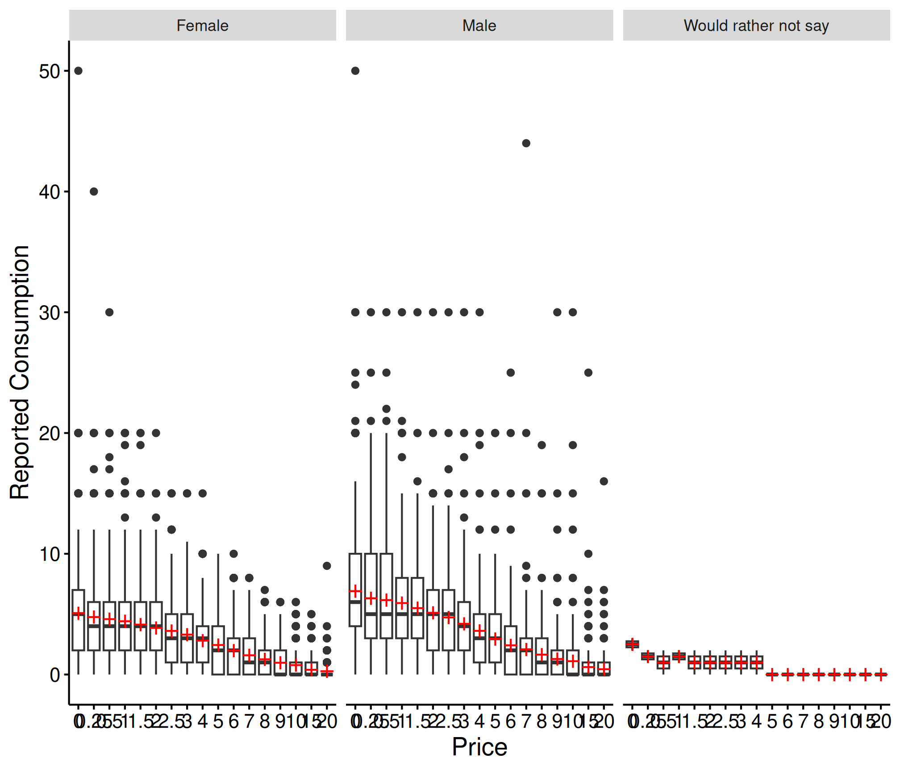

# Fixed-Effect Demand Modeling with \`beezdemand\`

## Introduction

This vignette demonstrates how to fit individual (fixed-effect) demand
curves using
[`fit_demand_fixed()`](https://brentkaplan.github.io/beezdemand/reference/fit_demand_fixed.md).
This function fits separate nonlinear least squares (NLS) models for
each subject, producing per-subject estimates of demand parameters like
Q\_{0} (intensity) and \alpha (elasticity).

**When to use fixed-effect models:** Fixed-effect models are appropriate
when you want independent curve fits for each participant. They make no
assumptions about the distribution of parameters across subjects and are
the simplest approach to demand curve analysis. For hierarchical models
that share information across subjects, see
[`vignette("mixed-demand")`](https://brentkaplan.github.io/beezdemand/articles/mixed-demand.md).
For guidance on choosing between approaches, see
[`vignette("model-selection")`](https://brentkaplan.github.io/beezdemand/articles/model-selection.md).

**Data format:** All modeling functions expect long-format data with
columns `id` (subject identifier), `x` (price), and `y` (consumption).
See
[`vignette("beezdemand")`](https://brentkaplan.github.io/beezdemand/articles/beezdemand.md)
for details on data preparation and conversion from wide format.

## Fitting with Different Equations

[`fit_demand_fixed()`](https://brentkaplan.github.io/beezdemand/reference/fit_demand_fixed.md)
supports several equation forms. We demonstrate the three most common
below using the `apt` (Alcohol Purchase Task) dataset.

### Hursh & Silberberg (“hs”)

The exponential model of demand (Hursh & Silberberg, 2008):

\log\_{10}(Q) = \log\_{10}(Q_0) + k \cdot (e^{-\alpha \cdot Q_0 \cdot
x} - 1)

``` r

fit_hs <- fit_demand_fixed(apt, equation = "hs", k = 2)
fit_hs
#> 
#> Fixed-Effect Demand Model
#> ==========================
#> 
#> Call:
#> fit_demand_fixed(data = apt, equation = "hs", k = 2)
#> 
#> Equation: hs 
#> k: fixed (2) 
#> Subjects: 10 ( 10 converged, 0 failed)
#> 
#> Use summary() for parameter summaries, tidy() for tidy output.
```

### Koffarnus (“koff”)

The exponentiated model (Koffarnus et al., 2015):

Q = Q_0 \cdot 10^{k \cdot (e^{-\alpha \cdot Q_0 \cdot x} - 1)}

``` r

fit_koff <- fit_demand_fixed(apt, equation = "koff", k = 2)
fit_koff
#> 
#> Fixed-Effect Demand Model
#> ==========================
#> 
#> Call:
#> fit_demand_fixed(data = apt, equation = "koff", k = 2)
#> 
#> Equation: koff 
#> k: fixed (2) 
#> Subjects: 10 ( 10 converged, 0 failed)
#> 
#> Use summary() for parameter summaries, tidy() for tidy output.
```

### Simplified (“simplified”)

The simplified exponential model (Rzeszutek et al., 2025) does not
require a scaling constant k:

Q = Q_0 \cdot e^{-\alpha \cdot Q_0 \cdot x}

``` r

fit_simplified <- fit_demand_fixed(apt, equation = "simplified")
fit_simplified
#> 
#> Fixed-Effect Demand Model
#> ==========================
#> 
#> Call:
#> fit_demand_fixed(data = apt, equation = "simplified")
#> 
#> Equation: simplified 
#> k: none (simplified equation) 
#> Subjects: 10 ( 10 converged, 0 failed)
#> 
#> Use summary() for parameter summaries, tidy() for tidy output.
```

## The k Parameter

The scaling constant k controls the range of the demand function. For
the `"hs"` and `"koff"` equations, `k` can be specified in several ways:

| `k` value | Behavior |
|----|----|
| Numeric (e.g., `2`) | Fixed constant for all subjects (default) |
| `"ind"` | Individual k per subject, computed from each subject’s data range |
| `"share"` | Single shared k estimated across all subjects via global regression |
| `"fit"` | k is a free parameter estimated jointly with Q_0 and \alpha |

``` r

## Fixed k (default)
fit_demand_fixed(apt, equation = "hs", k = 2)

## Individual k per subject
fit_demand_fixed(apt, equation = "hs", k = "ind")

## Shared k across subjects
fit_demand_fixed(apt, equation = "hs", k = "share")

## Fitted k as free parameter
fit_demand_fixed(apt, equation = "hs", k = "fit")
```

The `param_space` argument controls whether optimization is performed on
the natural scale (`"natural"`, the default) or log10 scale (`"log10"`).
The log10 scale can improve convergence for some datasets:

``` r

fit_demand_fixed(apt, equation = "hs", k = 2, param_space = "log10")
```

## Inspecting Fits

All `beezdemand_fixed` objects support the standard
[`tidy()`](https://generics.r-lib.org/reference/tidy.html),
[`glance()`](https://generics.r-lib.org/reference/glance.html),
[`augment()`](https://generics.r-lib.org/reference/augment.html), and
[`confint()`](https://rdrr.io/r/stats/confint.html) methods for
programmatic access to results.

### tidy(): Per-Subject Parameter Estimates

``` r

tidy(fit_hs)
#> # A tibble: 40 × 10
#>    id    term  estimate std.error statistic p.value component estimate_scale
#>    <chr> <chr>    <dbl>     <dbl>     <dbl>   <dbl> <chr>     <chr>         
#>  1 19    Q0       10.2      0.269        NA      NA fixed     natural       
#>  2 30    Q0        2.81     0.226        NA      NA fixed     natural       
#>  3 38    Q0        4.50     0.215        NA      NA fixed     natural       
#>  4 60    Q0        9.92     0.459        NA      NA fixed     natural       
#>  5 68    Q0       10.4      0.329        NA      NA fixed     natural       
#>  6 106   Q0        5.68     0.300        NA      NA fixed     natural       
#>  7 113   Q0        6.20     0.174        NA      NA fixed     natural       
#>  8 142   Q0        6.17     0.641        NA      NA fixed     natural       
#>  9 156   Q0        8.35     0.411        NA      NA fixed     natural       
#> 10 188   Q0        6.30     0.564        NA      NA fixed     natural       
#> # ℹ 30 more rows
#> # ℹ 2 more variables: term_display <chr>, estimate_internal <dbl>
```

### glance(): Model-Level Summary

``` r

glance(fit_hs)
#> # A tibble: 1 × 12
#>   model_class      backend equation k_spec     nobs n_subjects n_success n_fail
#>   <chr>            <chr>   <chr>    <chr>     <int>      <int>     <int>  <int>
#> 1 beezdemand_fixed legacy  hs       fixed (2)   146         10        10      0
#> # ℹ 4 more variables: converged <lgl>, logLik <dbl>, AIC <dbl>, BIC <dbl>
```

### augment(): Fitted Values and Residuals

``` r

augment(fit_hs)
#> # A tibble: 146 × 6
#>    id        x     y     k .fitted  .resid
#>    <chr> <dbl> <dbl> <dbl>   <dbl>   <dbl>
#>  1 19      0      10     2   10.2  -0.159 
#>  2 19      0.5    10     2    9.69  0.314 
#>  3 19      1      10     2    9.24  0.760 
#>  4 19      1.5     8     2    8.82 -0.819 
#>  5 19      2       8     2    8.42 -0.421 
#>  6 19      2.5     8     2    8.04 -0.0444
#>  7 19      3       7     2    7.69 -0.689 
#>  8 19      4       7     2    7.03 -0.0334
#>  9 19      5       7     2    6.45  0.554 
#> 10 19      6       6     2    5.92  0.0820
#> # ℹ 136 more rows
```

### confint(): Confidence Intervals

``` r

confint(fit_hs)
#> # A tibble: 40 × 6
#>    id    term  estimate conf.low conf.high level
#>    <chr> <chr>    <dbl>    <dbl>     <dbl> <dbl>
#>  1 19    Q0       10.2      9.63     10.7   0.95
#>  2 30    Q0        2.81     2.36      3.25  0.95
#>  3 38    Q0        4.50     4.08      4.92  0.95
#>  4 60    Q0        9.92     9.02     10.8   0.95
#>  5 68    Q0       10.4      9.75     11.0   0.95
#>  6 106   Q0        5.68     5.10      6.27  0.95
#>  7 113   Q0        6.20     5.85      6.54  0.95
#>  8 142   Q0        6.17     4.92      7.43  0.95
#>  9 156   Q0        8.35     7.54      9.15  0.95
#> 10 188   Q0        6.30     5.20      7.41  0.95
#> # ℹ 30 more rows
```

### summary(): Formatted Summary

The [`summary()`](https://rdrr.io/r/base/summary.html) method provides a
formatted overview including parameter distributions across subjects:

``` r

summary(fit_hs)
#> 
#> Fixed-Effect Demand Model Summary
#> ================================================== 
#> 
#> Equation: hs 
#> k: fixed (2) 
#> 
#> Fit Summary:
#>   Total subjects: 10 
#>   Converged: 10 
#>   Failed: 0 
#>   Total observations: 146 
#> 
#> Parameter Summary (across subjects):
#>   Q0:
#>     Median: 6.2498 
#>     Range: [ 2.8074 , 10.3904 ]
#>   alpha:
#>     Median: 0.004251 
#>     Range: [ 0.001987 , 0.00785 ]
#> 
#> Per-subject coefficients:
#> -------------------------
#> # A tibble: 40 × 10
#>    id    term      estimate std.error statistic p.value component estimate_scale
#>    <chr> <chr>        <dbl>     <dbl>     <dbl>   <dbl> <chr>     <chr>         
#>  1 106   Q0         5.68     0.300           NA      NA fixed     natural       
#>  2 106   alpha      0.00628  0.000432        NA      NA fixed     natural       
#>  3 106   alpha_st…  0.0257   0.00176         NA      NA fixed     natural       
#>  4 106   k          2       NA               NA      NA fixed     natural       
#>  5 113   Q0         6.20     0.174           NA      NA fixed     natural       
#>  6 113   alpha      0.00199  0.000109        NA      NA fixed     natural       
#>  7 113   alpha_st…  0.00812  0.000447        NA      NA fixed     natural       
#>  8 113   k          2       NA               NA      NA fixed     natural       
#>  9 142   Q0         6.17     0.641           NA      NA fixed     natural       
#> 10 142   alpha      0.00237  0.000400        NA      NA fixed     natural       
#> # ℹ 30 more rows
#> # ℹ 2 more variables: term_display <chr>, estimate_internal <dbl>
```

## Normalized Alpha (\alpha^\*)

When k varies across participants or studies (e.g., `k = "ind"` or
`k = "fit"`), raw \alpha values are not directly comparable. The
`alpha_star` column in
[`tidy()`](https://generics.r-lib.org/reference/tidy.html) output
provides a normalized version (Strategy B; Rzeszutek et al., 2025) that
adjusts for the scaling constant:

\alpha^\* = \frac{-\alpha}{\ln\\\left(1 - \frac{1}{k \cdot
\ln(b)}\right)}

where b is the logarithmic base (10 for HS/Koff equations). Standard
errors are computed via the delta method. `alpha_star` requires k \cdot
\ln(b) \> 1; otherwise `NA` is returned.

``` r

tidy(fit_hs) |>
  filter(term == "alpha_star") |>
  select(id, term, estimate, std.error)
#> # A tibble: 10 × 4
#>    id    term       estimate std.error
#>    <chr> <chr>         <dbl>     <dbl>
#>  1 19    alpha_star  0.00836  0.000249
#>  2 30    alpha_star  0.0240   0.00276 
#>  3 38    alpha_star  0.0172   0.00146 
#>  4 60    alpha_star  0.0176   0.000592
#>  5 68    alpha_star  0.0113   0.000394
#>  6 106   alpha_star  0.0257   0.00176 
#>  7 113   alpha_star  0.00812  0.000447
#>  8 142   alpha_star  0.00969  0.00163 
#>  9 156   alpha_star  0.0193   0.000668
#> 10 188   alpha_star  0.0321   0.00184
```

## Plotting

### Basic Demand Curves

The [`plot()`](https://rdrr.io/r/graphics/plot.default.html) method
displays fitted demand curves with observed data points. The x-axis
defaults to a log10 scale:

``` r

plot(fit_hs)
```



### Faceted by Subject

Use `facet = TRUE` to show each subject in a separate panel:

``` r

plot(fit_hs, facet = TRUE)
```



### Axis Transformations

Control the x- and y-axis transformations with `x_trans` and `y_trans`:

``` r

plot(fit_hs, x_trans = "pseudo_log", y_trans = "pseudo_log")
```



## Diagnostics

### Model Checks

[`check_demand_model()`](https://brentkaplan.github.io/beezdemand/reference/check_demand_model.md)
summarizes convergence, residual properties, and potential issues:

``` r

check_demand_model(fit_hs)
#> 
#> Model Diagnostics
#> ================================================== 
#> Model class: beezdemand_fixed 
#> 
#> Convergence:
#>   Status: Converged
#> 
#> Residuals:
#>   Mean: 0.0284
#>   SD: 0.5306
#>   Range: [-1.458, 2.228]
#>   Outliers: 3 observations
#> 
#> --------------------------------------------------
#> Issues Detected (1):
#>   1. Detected 3 potential outliers across subjects
```

### Residual Plots

[`plot_residuals()`](https://brentkaplan.github.io/beezdemand/reference/plot_residuals.md)
produces diagnostic plots. Use `$fitted` for a residuals-vs-fitted plot:

``` r

plot_residuals(fit_hs)$fitted
#> NULL
```

## Predictions

### Default Predictions

[`predict()`](https://rdrr.io/r/stats/predict.html) with no arguments
returns fitted values at the observed prices:

``` r

predict(fit_hs)
#> # A tibble: 160 × 3
#>        x id    .fitted
#>    <dbl> <chr>   <dbl>
#>  1     0 19      10.2 
#>  2     0 30       2.81
#>  3     0 38       4.50
#>  4     0 60       9.92
#>  5     0 68      10.4 
#>  6     0 106      5.68
#>  7     0 113      6.20
#>  8     0 142      6.17
#>  9     0 156      8.35
#> 10     0 188      6.30
#> # ℹ 150 more rows
```

### Custom Price Grid

Supply `newdata` to predict at specific prices:

``` r

new_prices <- data.frame(x = c(0, 0.5, 1, 2, 5, 10, 20))
predict(fit_hs, newdata = new_prices)
#> # A tibble: 70 × 3
#>        x id    .fitted
#>    <dbl> <chr>   <dbl>
#>  1     0 19      10.2 
#>  2     0 30       2.81
#>  3     0 38       4.50
#>  4     0 60       9.92
#>  5     0 68      10.4 
#>  6     0 106      5.68
#>  7     0 113      6.20
#>  8     0 142      6.17
#>  9     0 156      8.35
#> 10     0 188      6.30
#> # ℹ 60 more rows
```

## Aggregated Models

Instead of fitting each subject individually, you can fit a single curve
to aggregated data.

### Mean Aggregation

`agg = "Mean"` computes the mean consumption at each price across
subjects, then fits a single curve to those means:

``` r

fit_mean <- fit_demand_fixed(apt, equation = "hs", k = 2, agg = "Mean")
fit_mean
#> 
#> Fixed-Effect Demand Model
#> ==========================
#> 
#> Call:
#> fit_demand_fixed(data = apt, equation = "hs", k = 2, agg = "Mean")
#> 
#> Equation: hs 
#> k: fixed (2) 
#> Aggregation: Mean 
#> Subjects: 1 ( 1 converged, 0 failed)
#> 
#> Use summary() for parameter summaries, tidy() for tidy output.
```

``` r

plot(fit_mean)
```



### Pooled Aggregation

`agg = "Pooled"` fits a single curve to all data points pooled together,
retaining error around each observation but ignoring within-subject
clustering:

``` r

fit_pooled <- fit_demand_fixed(apt, equation = "hs", k = 2, agg = "Pooled")
fit_pooled
#> 
#> Fixed-Effect Demand Model
#> ==========================
#> 
#> Call:
#> fit_demand_fixed(data = apt, equation = "hs", k = 2, agg = "Pooled")
#> 
#> Equation: hs 
#> k: fixed (2) 
#> Aggregation: Pooled 
#> Subjects: 1 ( 1 converged, 0 failed)
#> 
#> Use summary() for parameter summaries, tidy() for tidy output.
```

``` r

plot(fit_pooled)
```



## Grouped Analysis with `by`

When your dataset includes grouping variables (e.g., gender, condition,
drug), you can run fits separately per group using the `by` parameter.
This replaces manual [`split()`](https://rdrr.io/r/base/split.html) /
[`lapply()`](https://rdrr.io/r/base/lapply.html) / `bind_rows()`
workflows.

We use the `apt_full` dataset, which includes demographic columns like
`gender`:

``` r

data("apt_full", package = "beezdemand", envir = environment())
```

### Fitting by Group

``` r

fit_by_gender <- fit_demand_fixed(
  apt_full, equation = "hs", k = 2, by = "gender"
)
#> Error in nlsModel(formula, mf, start, wts, scaleOffset = scOff, nDcentral = nDcntr) : 
#>   singular gradient matrix at initial parameter estimates
#> Error in nlsModel(formula, mf, start, wts, scaleOffset = scOff, nDcentral = nDcntr) : 
#>   singular gradient matrix at initial parameter estimates
#> Error in numericDeriv(form[[3L]], names(ind), env, central = nDcentral) : 
#>   Missing value or an infinity produced when evaluating the model
#> Error in nls(formula = (log(y)/log(10)) ~ (log(q0)/log(10)) + k * (exp(-alpha *  : 
#>   number of iterations exceeded maximum of 50
#> Error in nlsModel(formula, mf, start, wts, scaleOffset = scOff, nDcentral = nDcntr) : 
#>   singular gradient matrix at initial parameter estimates
#> Error in numericDeriv(form[[3L]], names(ind), env, central = nDcentral) : 
#>   Missing value or an infinity produced when evaluating the model
#> Error in numericDeriv(form[[3L]], names(ind), env, central = nDcentral) : 
#>   Missing value or an infinity produced when evaluating the model
#> Error in nls(formula = (log(y)/log(10)) ~ (log(q0)/log(10)) + k * (exp(-alpha *  : 
#>   number of iterations exceeded maximum of 50
#> Error in nlsModel(formula, mf, start, wts, scaleOffset = scOff, nDcentral = nDcntr) : 
#>   singular gradient matrix at initial parameter estimates
#> Error in nls(formula = (log(y)/log(10)) ~ (log(q0)/log(10)) + k * (exp(-alpha *  : 
#>   number of iterations exceeded maximum of 50
#> Error in numericDeriv(form[[3L]], names(ind), env, central = nDcentral) : 
#>   Missing value or an infinity produced when evaluating the model
#> Error in nls(formula = (log(y)/log(10)) ~ (log(q0)/log(10)) + k * (exp(-alpha *  : 
#>   number of iterations exceeded maximum of 50
#> Error in nls(formula = (log(y)/log(10)) ~ (log(q0)/log(10)) + k * (exp(-alpha *  : 
#>   number of iterations exceeded maximum of 50
#> Error in numericDeriv(form[[3L]], names(ind), env, central = nDcentral) : 
#>   Missing value or an infinity produced when evaluating the model
#> Error in numericDeriv(form[[3L]], names(ind), env, central = nDcentral) : 
#>   Missing value or an infinity produced when evaluating the model
#> Error in numericDeriv(form[[3L]], names(ind), env, central = nDcentral) : 
#>   Missing value or an infinity produced when evaluating the model
#> Error in nlsModel(formula, mf, start, wts, scaleOffset = scOff, nDcentral = nDcntr) : 
#>   singular gradient matrix at initial parameter estimates
#> Error in nls(formula = (log(y)/log(10)) ~ (log(q0)/log(10)) + k * (exp(-alpha *  : 
#>   number of iterations exceeded maximum of 50
#> Error in nlsModel(formula, mf, start, wts, scaleOffset = scOff, nDcentral = nDcntr) : 
#>   singular gradient matrix at initial parameter estimates
#> Error in numericDeriv(form[[3L]], names(ind), env, central = nDcentral) : 
#>   Missing value or an infinity produced when evaluating the model
#> Error in nlsModel(formula, mf, start, wts, scaleOffset = scOff, nDcentral = nDcntr) : 
#>   singular gradient matrix at initial parameter estimates
#> Error in nls(formula = (log(y)/log(10)) ~ (log(q0)/log(10)) + k * (exp(-alpha *  : 
#>   number of iterations exceeded maximum of 50
#> Error in nls(formula = (log(y)/log(10)) ~ (log(q0)/log(10)) + k * (exp(-alpha *  : 
#>   number of iterations exceeded maximum of 50
#> Error in numericDeriv(form[[3L]], names(ind), env, central = nDcentral) : 
#>   Missing value or an infinity produced when evaluating the model
#> Error in numericDeriv(form[[3L]], names(ind), env, central = nDcentral) : 
#>   Missing value or an infinity produced when evaluating the model
#> Error in numericDeriv(form[[3L]], names(ind), env, central = nDcentral) : 
#>   Missing value or an infinity produced when evaluating the model
#> Error in nls(formula = (log(y)/log(10)) ~ (log(q0)/log(10)) + k * (exp(-alpha *  : 
#>   number of iterations exceeded maximum of 50
#> Error in nlsModel(formula, mf, start, wts, scaleOffset = scOff, nDcentral = nDcntr) : 
#>   singular gradient matrix at initial parameter estimates
#> Error in nls(formula = (log(y)/log(10)) ~ (log(q0)/log(10)) + k * (exp(-alpha *  : 
#>   number of iterations exceeded maximum of 50
#> Error in nlsModel(formula, mf, start, wts, scaleOffset = scOff, nDcentral = nDcntr) : 
#>   singular gradient matrix at initial parameter estimates
#> Error in numericDeriv(form[[3L]], names(ind), env, central = nDcentral) : 
#>   Missing value or an infinity produced when evaluating the model
#> Error in nlsModel(formula, mf, start, wts, scaleOffset = scOff, nDcentral = nDcntr) : 
#>   singular gradient matrix at initial parameter estimates
#> Error in numericDeriv(form[[3L]], names(ind), env, central = nDcentral) : 
#>   Missing value or an infinity produced when evaluating the model
#> Error in nlsModel(formula, mf, start, wts, scaleOffset = scOff, nDcentral = nDcntr) : 
#>   singular gradient matrix at initial parameter estimates
#> Error in numericDeriv(form[[3L]], names(ind), env, central = nDcentral) : 
#>   Missing value or an infinity produced when evaluating the model
#> Error in numericDeriv(form[[3L]], names(ind), env, central = nDcentral) : 
#>   Missing value or an infinity produced when evaluating the model
#> Error in nls(formula = (log(y)/log(10)) ~ (log(q0)/log(10)) + k * (exp(-alpha *  : 
#>   number of iterations exceeded maximum of 50
#> Error in nls(formula = (log(y)/log(10)) ~ (log(q0)/log(10)) + k * (exp(-alpha *  : 
#>   number of iterations exceeded maximum of 50
#> Error in nlsModel(formula, mf, start, wts, scaleOffset = scOff, nDcentral = nDcntr) : 
#>   singular gradient matrix at initial parameter estimates
#> Error in nls(formula = (log(y)/log(10)) ~ (log(q0)/log(10)) + k * (exp(-alpha *  : 
#>   number of iterations exceeded maximum of 50
#> Error in numericDeriv(form[[3L]], names(ind), env, central = nDcentral) : 
#>   Missing value or an infinity produced when evaluating the model
#> Error in numericDeriv(form[[3L]], names(ind), env, central = nDcentral) : 
#>   Missing value or an infinity produced when evaluating the model
#> Error in nls(formula = (log(y)/log(10)) ~ (log(q0)/log(10)) + k * (exp(-alpha *  : 
#>   number of iterations exceeded maximum of 50
#> Error in nls(formula = (log(y)/log(10)) ~ (log(q0)/log(10)) + k * (exp(-alpha *  : 
#>   number of iterations exceeded maximum of 50
#> Error in numericDeriv(form[[3L]], names(ind), env, central = nDcentral) : 
#>   Missing value or an infinity produced when evaluating the model
#> Error in nls(formula = (log(y)/log(10)) ~ (log(q0)/log(10)) + k * (exp(-alpha *  : 
#>   number of iterations exceeded maximum of 50
#> Error in numericDeriv(form[[3L]], names(ind), env, central = nDcentral) : 
#>   Missing value or an infinity produced when evaluating the model
#> Error in nlsModel(formula, mf, start, wts, scaleOffset = scOff, nDcentral = nDcntr) : 
#>   singular gradient matrix at initial parameter estimates
#> Error in nls(formula = (log(y)/log(10)) ~ (log(q0)/log(10)) + k * (exp(-alpha *  : 
#>   number of iterations exceeded maximum of 50
#> Error in numericDeriv(form[[3L]], names(ind), env, central = nDcentral) : 
#>   Missing value or an infinity produced when evaluating the model
#> Error in numericDeriv(form[[3L]], names(ind), env, central = nDcentral) : 
#>   Missing value or an infinity produced when evaluating the model
#> Error in numericDeriv(form[[3L]], names(ind), env, central = nDcentral) : 
#>   Missing value or an infinity produced when evaluating the model
#> Error in nlsModel(formula, mf, start, wts, scaleOffset = scOff, nDcentral = nDcntr) : 
#>   singular gradient matrix at initial parameter estimates
#> Error in nlsModel(formula, mf, start, wts, scaleOffset = scOff, nDcentral = nDcntr) : 
#>   singular gradient matrix at initial parameter estimates
#> Error in nls(formula = (log(y)/log(10)) ~ (log(q0)/log(10)) + k * (exp(-alpha *  : 
#>   singular gradient
#> Error in nls(formula = (log(y)/log(10)) ~ (log(q0)/log(10)) + k * (exp(-alpha *  : 
#>   singular gradient
#> Error in nlsModel(formula, mf, start, wts, scaleOffset = scOff, nDcentral = nDcntr) : 
#>   singular gradient matrix at initial parameter estimates
#> Error in nls(formula = (log(y)/log(10)) ~ (log(q0)/log(10)) + k * (exp(-alpha *  : 
#>   number of iterations exceeded maximum of 50
#> Error in nls(formula = (log(y)/log(10)) ~ (log(q0)/log(10)) + k * (exp(-alpha *  : 
#>   step factor 0.000488281 reduced below 'minFactor' of 0.000976562
#> Error in numericDeriv(form[[3L]], names(ind), env, central = nDcentral) : 
#>   Missing value or an infinity produced when evaluating the model
#> Error in nls(formula = (log(y)/log(10)) ~ (log(q0)/log(10)) + k * (exp(-alpha *  : 
#>   number of iterations exceeded maximum of 50
#> Error in nlsModel(formula, mf, start, wts, scaleOffset = scOff, nDcentral = nDcntr) : 
#>   singular gradient matrix at initial parameter estimates
#> Error in nls(formula = (log(y)/log(10)) ~ (log(q0)/log(10)) + k * (exp(-alpha *  : 
#>   number of iterations exceeded maximum of 50
#> Error in numericDeriv(form[[3L]], names(ind), env, central = nDcentral) : 
#>   Missing value or an infinity produced when evaluating the model
#> Error in numericDeriv(form[[3L]], names(ind), env, central = nDcentral) : 
#>   Missing value or an infinity produced when evaluating the model
#> Error in nls(formula = (log(y)/log(10)) ~ (log(q0)/log(10)) + k * (exp(-alpha *  : 
#>   number of iterations exceeded maximum of 50
#> Error in nlsModel(formula, mf, start, wts, scaleOffset = scOff, nDcentral = nDcntr) : 
#>   singular gradient matrix at initial parameter estimates
#> Error in numericDeriv(form[[3L]], names(ind), env, central = nDcentral) : 
#>   Missing value or an infinity produced when evaluating the model
#> Error in nlsModel(formula, mf, start, wts, scaleOffset = scOff, nDcentral = nDcntr) : 
#>   singular gradient matrix at initial parameter estimates
#> Error in nls(formula = (log(y)/log(10)) ~ (log(q0)/log(10)) + k * (exp(-alpha *  : 
#>   number of iterations exceeded maximum of 50
#> Error in numericDeriv(form[[3L]], names(ind), env, central = nDcentral) : 
#>   Missing value or an infinity produced when evaluating the model
#> Error in numericDeriv(form[[3L]], names(ind), env, central = nDcentral) : 
#>   Missing value or an infinity produced when evaluating the model
#> Error in nlsModel(formula, mf, start, wts, scaleOffset = scOff, nDcentral = nDcntr) : 
#>   singular gradient matrix at initial parameter estimates
#> Error in nlsModel(formula, mf, start, wts, scaleOffset = scOff, nDcentral = nDcntr) : 
#>   singular gradient matrix at initial parameter estimates
#> Error in nlsModel(formula, mf, start, wts, scaleOffset = scOff, nDcentral = nDcntr) : 
#>   singular gradient matrix at initial parameter estimates
#> Error in nls(formula = (log(y)/log(10)) ~ (log(q0)/log(10)) + k * (exp(-alpha *  : 
#>   number of iterations exceeded maximum of 50
#> Error in numericDeriv(form[[3L]], names(ind), env, central = nDcentral) : 
#>   Missing value or an infinity produced when evaluating the model
#> Error in nls(formula = (log(y)/log(10)) ~ (log(q0)/log(10)) + k * (exp(-alpha *  : 
#>   step factor 0.000488281 reduced below 'minFactor' of 0.000976562
#> Error in numericDeriv(form[[3L]], names(ind), env, central = nDcentral) : 
#>   Missing value or an infinity produced when evaluating the model
#> Error in nls(formula = (log(y)/log(10)) ~ (log(q0)/log(10)) + k * (exp(-alpha *  : 
#>   number of iterations exceeded maximum of 50
#> Error in numericDeriv(form[[3L]], names(ind), env, central = nDcentral) : 
#>   Missing value or an infinity produced when evaluating the model
#> Error in nlsModel(formula, mf, start, wts, scaleOffset = scOff, nDcentral = nDcntr) : 
#>   singular gradient matrix at initial parameter estimates
#> Error in numericDeriv(form[[3L]], names(ind), env, central = nDcentral) : 
#>   Missing value or an infinity produced when evaluating the model
#> Error in numericDeriv(form[[3L]], names(ind), env, central = nDcentral) : 
#>   Missing value or an infinity produced when evaluating the model
#> Error in nlsModel(formula, mf, start, wts, scaleOffset = scOff, nDcentral = nDcntr) : 
#>   singular gradient matrix at initial parameter estimates
#> Error in nls(formula = (log(y)/log(10)) ~ (log(q0)/log(10)) + k * (exp(-alpha *  : 
#>   number of iterations exceeded maximum of 50
#> Error in numericDeriv(form[[3L]], names(ind), env, central = nDcentral) : 
#>   Missing value or an infinity produced when evaluating the model
#> Error in numericDeriv(form[[3L]], names(ind), env, central = nDcentral) : 
#>   Missing value or an infinity produced when evaluating the model
#> Error in nlsModel(formula, mf, start, wts, scaleOffset = scOff, nDcentral = nDcntr) : 
#>   singular gradient matrix at initial parameter estimates
#> Error in numericDeriv(form[[3L]], names(ind), env, central = nDcentral) : 
#>   Missing value or an infinity produced when evaluating the model
#> Error in numericDeriv(form[[3L]], names(ind), env, central = nDcentral) : 
#>   Missing value or an infinity produced when evaluating the model
#> Error in nls(formula = (log(y)/log(10)) ~ (log(q0)/log(10)) + k * (exp(-alpha *  : 
#>   singular gradient
#> Error in nlsModel(formula, mf, start, wts, scaleOffset = scOff, nDcentral = nDcntr) : 
#>   singular gradient matrix at initial parameter estimates
#> Error in numericDeriv(form[[3L]], names(ind), env, central = nDcentral) : 
#>   Missing value or an infinity produced when evaluating the model
#> Error in numericDeriv(form[[3L]], names(ind), env, central = nDcentral) : 
#>   Missing value or an infinity produced when evaluating the model
#> Error in nls(formula = (log(y)/log(10)) ~ (log(q0)/log(10)) + k * (exp(-alpha *  : 
#>   singular gradient
#> Error in numericDeriv(form[[3L]], names(ind), env, central = nDcentral) : 
#>   Missing value or an infinity produced when evaluating the model
#> Error in numericDeriv(form[[3L]], names(ind), env, central = nDcentral) : 
#>   Missing value or an infinity produced when evaluating the model
#> Error in nls(formula = (log(y)/log(10)) ~ (log(q0)/log(10)) + k * (exp(-alpha *  : 
#>   step factor 0.000488281 reduced below 'minFactor' of 0.000976562
#> Error in numericDeriv(form[[3L]], names(ind), env, central = nDcentral) : 
#>   Missing value or an infinity produced when evaluating the model
#> Error in numericDeriv(form[[3L]], names(ind), env, central = nDcentral) : 
#>   Missing value or an infinity produced when evaluating the model
#> Error in nls(formula = (log(y)/log(10)) ~ (log(q0)/log(10)) + k * (exp(-alpha *  : 
#>   number of iterations exceeded maximum of 50
#> Error in nls(formula = (log(y)/log(10)) ~ (log(q0)/log(10)) + k * (exp(-alpha *  : 
#>   number of iterations exceeded maximum of 50
#> Error in numericDeriv(form[[3L]], names(ind), env, central = nDcentral) : 
#>   Missing value or an infinity produced when evaluating the model
#> Error in nlsModel(formula, mf, start, wts, scaleOffset = scOff, nDcentral = nDcntr) : 
#>   singular gradient matrix at initial parameter estimates
#> Error in numericDeriv(form[[3L]], names(ind), env, central = nDcentral) : 
#>   Missing value or an infinity produced when evaluating the model
#> Error in nls(formula = (log(y)/log(10)) ~ (log(q0)/log(10)) + k * (exp(-alpha *  : 
#>   number of iterations exceeded maximum of 50
#> Error in numericDeriv(form[[3L]], names(ind), env, central = nDcentral) : 
#>   Missing value or an infinity produced when evaluating the model
#> Error in numericDeriv(form[[3L]], names(ind), env, central = nDcentral) : 
#>   Missing value or an infinity produced when evaluating the model
#> Error in numericDeriv(form[[3L]], names(ind), env, central = nDcentral) : 
#>   Missing value or an infinity produced when evaluating the model
#> Error in nlsModel(formula, mf, start, wts, scaleOffset = scOff, nDcentral = nDcntr) : 
#>   singular gradient matrix at initial parameter estimates
#> Error in nlsModel(formula, mf, start, wts, scaleOffset = scOff, nDcentral = nDcntr) : 
#>   singular gradient matrix at initial parameter estimates
#> Error in numericDeriv(form[[3L]], names(ind), env, central = nDcentral) : 
#>   Missing value or an infinity produced when evaluating the model
#> Error in nlsModel(formula, mf, start, wts, scaleOffset = scOff, nDcentral = nDcntr) : 
#>   singular gradient matrix at initial parameter estimates
#> Error in numericDeriv(form[[3L]], names(ind), env, central = nDcentral) : 
#>   Missing value or an infinity produced when evaluating the model
#> Error in numericDeriv(form[[3L]], names(ind), env, central = nDcentral) : 
#>   Missing value or an infinity produced when evaluating the model
#> Error in nls(formula = (log(y)/log(10)) ~ (log(q0)/log(10)) + k * (exp(-alpha *  : 
#>   number of iterations exceeded maximum of 50
#> Error in numericDeriv(form[[3L]], names(ind), env, central = nDcentral) : 
#>   Missing value or an infinity produced when evaluating the model
#> Error in nlsModel(formula, mf, start, wts, scaleOffset = scOff, nDcentral = nDcntr) : 
#>   singular gradient matrix at initial parameter estimates
#> Error in nls(formula = (log(y)/log(10)) ~ (log(q0)/log(10)) + k * (exp(-alpha *  : 
#>   number of iterations exceeded maximum of 50
#> Error in nls(formula = (log(y)/log(10)) ~ (log(q0)/log(10)) + k * (exp(-alpha *  : 
#>   number of iterations exceeded maximum of 50
#> Error in nlsModel(formula, mf, start, wts, scaleOffset = scOff, nDcentral = nDcntr) : 
#>   singular gradient matrix at initial parameter estimates
#> Error in nlsModel(formula, mf, start, wts, scaleOffset = scOff, nDcentral = nDcntr) : 
#>   singular gradient matrix at initial parameter estimates
#> Error in numericDeriv(form[[3L]], names(ind), env, central = nDcentral) : 
#>   Missing value or an infinity produced when evaluating the model
#> Error in nlsModel(formula, mf, start, wts, scaleOffset = scOff, nDcentral = nDcntr) : 
#>   singular gradient matrix at initial parameter estimates
#> Error in nls(formula = (log(y)/log(10)) ~ (log(q0)/log(10)) + k * (exp(-alpha *  : 
#>   number of iterations exceeded maximum of 50
#> Error in numericDeriv(form[[3L]], names(ind), env, central = nDcentral) : 
#>   Missing value or an infinity produced when evaluating the model
#> Error in nlsModel(formula, mf, start, wts, scaleOffset = scOff, nDcentral = nDcntr) : 
#>   singular gradient matrix at initial parameter estimates
fit_by_gender
#> 
#> Grouped Fixed-Effect Demand Model
#> ==================================
#> 
#> Call:
#> fit_demand_fixed(data = apt_full, equation = "hs", k = 2, by = "gender")
#> 
#> Grouped by: gender 
#> Equation: hs 
#> k: fixed (2) 
#> 
#>   gender=Female: 617 subjects (501 converged, 116 failed)
#>   gender=Male: 471 subjects (401 converged, 70 failed)
#>   gender=Would rather not say: 2 subjects (1 converged, 1 failed)
#> 
#> Use tidy() for combined tidy output, coef() for coefficients.
```

The result is a `beezdemand_fixed_grouped` object containing one child
`beezdemand_fixed` fit per group. All standard accessors prepend the
grouping column(s) automatically:

``` r

tidy(fit_by_gender) |> head(10)
#> # A tibble: 10 × 11
#>    gender id    term  estimate std.error statistic p.value component
#>    <chr>  <chr> <chr>    <dbl>     <dbl>     <dbl>   <dbl> <chr>    
#>  1 Female 475   Q0       11.0      1.19         NA      NA fixed    
#>  2 Female 476   Q0        1.86     0.162        NA      NA fixed    
#>  3 Female 477   Q0        3.93     0.903        NA      NA fixed    
#>  4 Female 478   Q0        8.18     1.21         NA      NA fixed    
#>  5 Female 479   Q0        4.89     0.461        NA      NA fixed    
#>  6 Female 480   Q0        5.02     0.542        NA      NA fixed    
#>  7 Female 481   Q0        3.57     0.297        NA      NA fixed    
#>  8 Female 482   Q0        3.11     0.302        NA      NA fixed    
#>  9 Female 483   Q0        5.89     0.428        NA      NA fixed    
#> 10 Female 484   Q0        5.00    NA            NA      NA fixed    
#> # ℹ 3 more variables: estimate_scale <chr>, term_display <chr>,
#> #   estimate_internal <dbl>
```

``` r

glance(fit_by_gender)
#> # A tibble: 3 × 13
#>   gender   model_class backend equation k_spec  nobs n_subjects n_success n_fail
#>   <chr>    <chr>       <chr>   <chr>    <chr>  <int>      <int>     <int>  <int>
#> 1 Female   beezdemand… legacy  hs       fixed…  7097        617       501    116
#> 2 Male     beezdemand… legacy  hs       fixed…  5730        471       401     70
#> 3 Would r… beezdemand… legacy  hs       fixed…    12          2         1      1
#> # ℹ 4 more variables: converged <lgl>, logLik <dbl>, AIC <dbl>, BIC <dbl>
```

### Grouped Plotting

[`plot()`](https://rdrr.io/r/graphics/plot.default.html) combines
per-group panels:

``` r

plot(fit_by_gender)
```



### Grouped Systematicity and Descriptive Checks

The `by` parameter works the same way in
[`check_systematic_demand()`](https://brentkaplan.github.io/beezdemand/reference/check_systematic_demand.md)
and
[`get_descriptive_summary()`](https://brentkaplan.github.io/beezdemand/reference/get_descriptive_summary.md):

``` r

sys <- check_systematic_demand(apt_full, by = "gender")
sys
#> 
#> Systematicity Check (demand)
#> ------------------------------ 
#> Grouped by: gender 
#> Total patterns: 1100 
#> Systematic: 946 ( 86 %)
#> Unsystematic: 154 ( 14 %)
#> 
#> Use summary() for details, tidy() for per-subject results.
```

``` r

desc <- get_descriptive_summary(apt_full, by = "gender")
plot(desc)
```



## Conclusion

The
[`fit_demand_fixed()`](https://brentkaplan.github.io/beezdemand/reference/fit_demand_fixed.md)
interface provides a modern, consistent API for individual demand curve
fitting with full support for the
[`tidy()`](https://generics.r-lib.org/reference/tidy.html) /
[`glance()`](https://generics.r-lib.org/reference/glance.html) /
[`augment()`](https://generics.r-lib.org/reference/augment.html)
workflow. For datasets where borrowing strength across subjects is
desirable, consider the mixed-effects or hurdle model approaches.

## See Also

- [`vignette("beezdemand")`](https://brentkaplan.github.io/beezdemand/articles/beezdemand.md)
  – Getting started with beezdemand
- [`vignette("model-selection")`](https://brentkaplan.github.io/beezdemand/articles/model-selection.md)
  – Choosing the right model class
- [`vignette("group-comparisons")`](https://brentkaplan.github.io/beezdemand/articles/group-comparisons.md)
  – Extra sum-of-squares F-test for group comparisons
- [`vignette("mixed-demand")`](https://brentkaplan.github.io/beezdemand/articles/mixed-demand.md)
  – Mixed-effects nonlinear demand models (NLME)
- [`vignette("mixed-demand-advanced")`](https://brentkaplan.github.io/beezdemand/articles/mixed-demand-advanced.md)
  – Advanced mixed-effects topics
- [`vignette("hurdle-demand-models")`](https://brentkaplan.github.io/beezdemand/articles/hurdle-demand-models.md)
  – Two-part hurdle demand models via TMB
- [`vignette("cross-price-models")`](https://brentkaplan.github.io/beezdemand/articles/cross-price-models.md)
  – Cross-price demand analysis
- [`vignette("migration-guide")`](https://brentkaplan.github.io/beezdemand/articles/migration-guide.md)
  – Migrating from
  [`FitCurves()`](https://brentkaplan.github.io/beezdemand/reference/FitCurves.md)
  to
  [`fit_demand_fixed()`](https://brentkaplan.github.io/beezdemand/reference/fit_demand_fixed.md)
