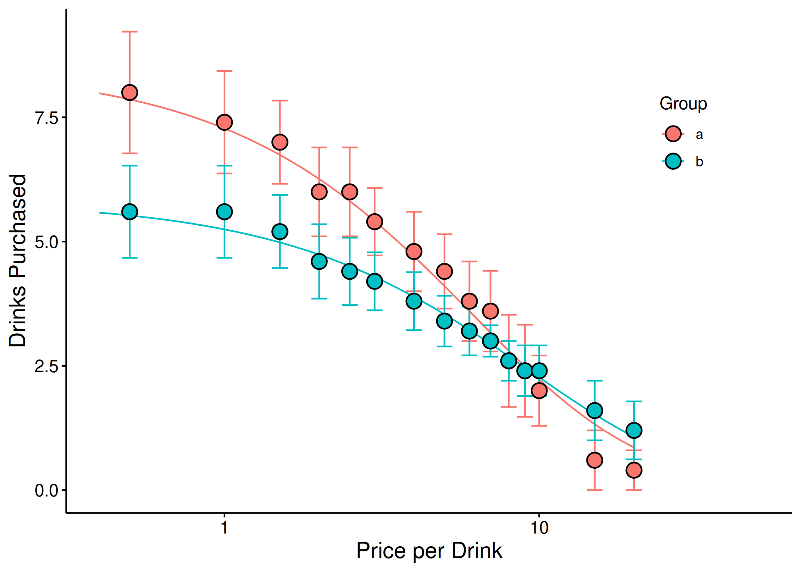

# Group Comparisons with Extra Sum-of-Squares F-Test

## Introduction

When you have multiple groups (e.g., treatment vs. control, different
populations), it is often useful to compare whether separate demand
curves are preferred over a single curve. The **Extra Sum-of-Squares
*F*-test** addresses this by fitting a single curve to all data,
computing the residual deviations, and comparing those residuals to
those obtained from separate group-level curves.

For background on fitting individual demand curves, see
[`vignette("beezdemand")`](https://brentkaplan.github.io/beezdemand/articles/beezdemand.md).
For mixed-effects approaches to group comparisons, see
[`vignette("mixed-demand")`](https://brentkaplan.github.io/beezdemand/articles/mixed-demand.md).

> **Note:** For formal statistical inference on group differences,
> mixed-effects models
> ([`vignette("mixed-demand")`](https://brentkaplan.github.io/beezdemand/articles/mixed-demand.md))
> are the preferred modern approach, offering random effects and
> estimated marginal means.
> [`ExtraF()`](https://brentkaplan.github.io/beezdemand/reference/ExtraF.md)
> remains useful for quick, traditional group comparisons.

### Setting Up Groups

We will use the built-in `apt` dataset and manufacture random groupings
for demonstration purposes.

``` r

## setting the seed initializes the random number generator so results will be
## reproducible
set.seed(1234)

## manufacture random grouping
apt$group <- NA
apt[apt$id %in% sample(unique(apt$id), length(unique(apt$id))/2), "group"] <- "a"
apt$group[is.na(apt$group)] <- "b"

## take a look at what the new groupings look like in long form
knitr::kable(apt[1:20, ])
```

|  id |    x |   y | group |
|----:|-----:|----:|:------|
|  19 |  0.0 |  10 | a     |
|  19 |  0.5 |  10 | a     |
|  19 |  1.0 |  10 | a     |
|  19 |  1.5 |   8 | a     |
|  19 |  2.0 |   8 | a     |
|  19 |  2.5 |   8 | a     |
|  19 |  3.0 |   7 | a     |
|  19 |  4.0 |   7 | a     |
|  19 |  5.0 |   7 | a     |
|  19 |  6.0 |   6 | a     |
|  19 |  7.0 |   6 | a     |
|  19 |  8.0 |   5 | a     |
|  19 |  9.0 |   5 | a     |
|  19 | 10.0 |   4 | a     |
|  19 | 15.0 |   3 | a     |
|  19 | 20.0 |   2 | a     |
|  30 |  0.0 |   3 | b     |
|  30 |  0.5 |   3 | b     |
|  30 |  1.0 |   3 | b     |
|  30 |  1.5 |   3 | b     |

### Running the Extra Sum-of-Squares F-Test

The
[`ExtraF()`](https://brentkaplan.github.io/beezdemand/reference/ExtraF.md)
function will determine whether a single \alpha or a single Q_0 is
better than multiple \alphas or Q_0s. A resulting *F* statistic will be
reported along with a *p* value.

``` r

## in order for this to run, you will have had to run the code immediately
## preceeding (i.e., the code to generate the groups)
ef <- ExtraF(dat = apt, equation = "koff", k = 2, groupcol = "group", verbose = TRUE)
```

A summary table (broken up here for ease of display) will be created
when the option `verbose = TRUE`. This table can be accessed as the
`dfres` object resulting from `ExtraF`. In the example above, we can
access this summary table using `ef$dfres`:

| Group      |      Q0d |   K |        R2 |     Alpha |
|:-----------|---------:|----:|----------:|----------:|
| Shared     |       NA |  NA |        NA |        NA |
| a          | 8.489634 |   2 | 0.6206444 | 0.0040198 |
| b          | 5.848119 |   2 | 0.6206444 | 0.0040198 |
| Not Shared |       NA |  NA |        NA |        NA |
| a          | 8.503442 |   2 | 0.6448801 | 0.0040518 |
| b          | 5.822075 |   2 | 0.5242825 | 0.0039376 |

Fitted Measures {.table}

| Group      |   N |    AbsSS |    SdRes |
|:-----------|----:|---------:|---------:|
| Shared     |  NA |       NA |       NA |
| a          | 160 | 387.0945 | 1.570213 |
| b          | 160 | 387.0945 | 1.570213 |
| Not Shared |  NA |       NA |       NA |
| a          |  80 | 249.2764 | 1.787695 |
| b          |  80 | 137.7440 | 1.328890 |

Uncertainty and Model Information {.table}

| Group      |        EV |    Omaxd |     Pmaxd |
|:-----------|----------:|---------:|----------:|
| Shared     |        NA |       NA |        NA |
| a          | 0.8795301 | 22.63159 |  8.453799 |
| b          | 0.8795301 | 22.63159 | 12.272265 |
| Not Shared |        NA |       NA |        NA |
| a          | 0.8725741 | 22.45260 |  8.373320 |
| b          | 0.8978945 | 23.10414 | 12.584550 |

Derived Measures {.table}

| Group      |    Omaxa | Notes     |
|:-----------|---------:|:----------|
| Shared     |       NA | NA        |
| a          | 22.63190 | converged |
| b          | 22.63190 | converged |
| Not Shared |       NA | NA        |
| a          | 22.45291 | converged |
| b          | 23.10445 | converged |

Convergence and Summary Information {.table}

### Visualizing Group Comparisons

When `verbose = TRUE`, objects from the result can be used in subsequent
graphing. The following code generates a plot of our two groups. We can
use the predicted values already generated from the `ExtraF` function by
accessing the `newdat` object. In the example above, we can access these
predicted values using `ef$newdat`. Note that we keep the linear scaling
of y given we used Koffarnus et al. (2015)’s equation fitted to the
data.

``` r

## be sure that you've loaded the tidyverse package (e.g., library(tidyverse))
ggplot(apt, aes(x = x, y = y, group = group)) +
  ## the predicted lines from the sum of squares f-test can be used in subsequent
  ## plots by calling data = ef$newdat
  geom_line(aes(x = x, y = y, group = group, color = group),
            data = ef$newdat[ef$newdat$x >= .1, ]) +
  stat_summary(fun.data = mean_se, aes(width = .05, color = group),
               geom = "errorbar") +
  stat_summary(fun = mean, aes(fill = group), geom = "point", shape = 21,
               color = "black", stroke = .75, size = 4) +
  scale_x_log10(limits = c(.4, 50), breaks = c(.1, 1, 10, 100)) +
  scale_color_discrete(name = "Group") +
  scale_fill_discrete(name = "Group") +
  labs(x = "Price per Drink", y = "Drinks Purchased") +
  theme(legend.position = c(.85, .75)) +
  ## theme_apa is a beezdemand function used to change the theme in accordance
  ## with American Psychological Association style
  theme_apa()
```



### See Also

- [`vignette("beezdemand")`](https://brentkaplan.github.io/beezdemand/articles/beezdemand.md)
  – Getting started with beezdemand
- [`vignette("model-selection")`](https://brentkaplan.github.io/beezdemand/articles/model-selection.md)
  – Choosing the right model class for your data
- [`vignette("fixed-demand")`](https://brentkaplan.github.io/beezdemand/articles/fixed-demand.md)
  – Fixed-effect demand modeling
- [`vignette("mixed-demand")`](https://brentkaplan.github.io/beezdemand/articles/mixed-demand.md)
  – Mixed-effects nonlinear demand models (NLME)
- [`vignette("hurdle-demand-models")`](https://brentkaplan.github.io/beezdemand/articles/hurdle-demand-models.md)
  – Two-part hurdle demand models
- [`vignette("cross-price-models")`](https://brentkaplan.github.io/beezdemand/articles/cross-price-models.md)
  – Cross-price demand analysis
- [`vignette("migration-guide")`](https://brentkaplan.github.io/beezdemand/articles/migration-guide.md)
  – Migrating from
  [`FitCurves()`](https://brentkaplan.github.io/beezdemand/reference/FitCurves.md)
