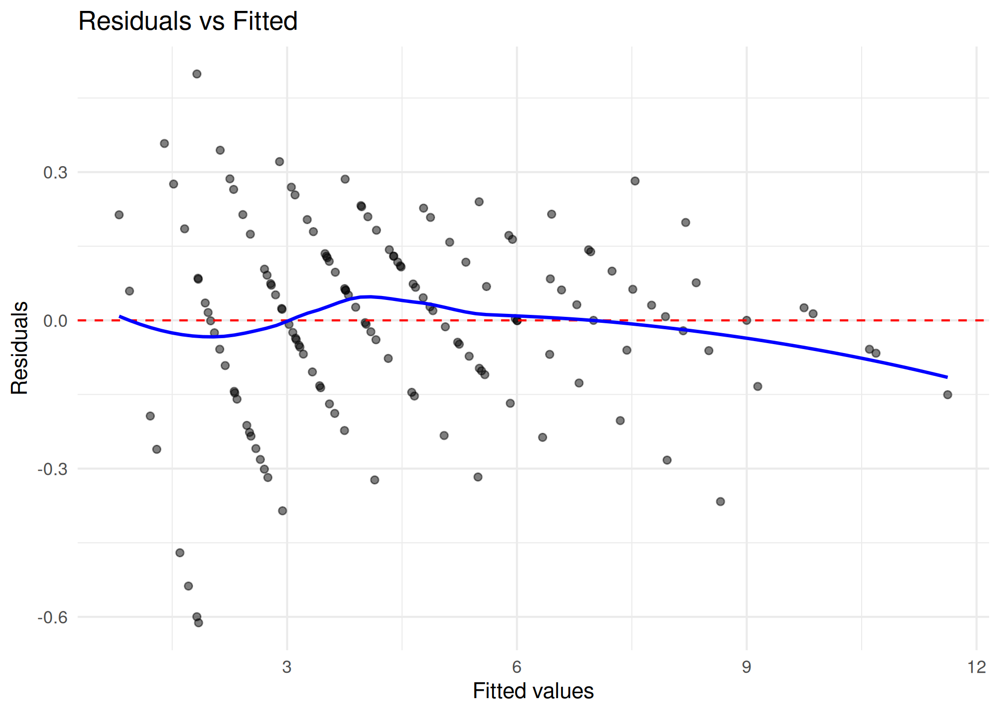
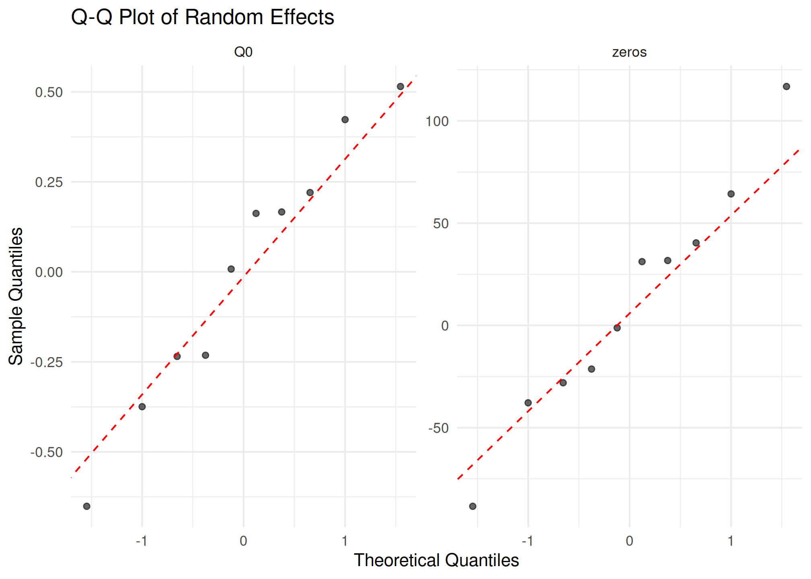

# Hurdle Demand Models

## Introduction

The `beezdemand` package includes functionality for fitting **two-part
mixed effects hurdle demand models** using Template Model Builder (TMB).
This approach is particularly useful when:

- Zero consumption values are **informative** (i.e., represent true
  non-consumption rather than censored data)
- You want to model both the **probability of consuming** and the
  **intensity of consumption** simultaneously
- Individual-level heterogeneity is important for both parts of the
  model

### When to Use Hurdle Models vs. Standard Models

| Scenario                                                      | Recommended Approach                                                                                                                                                                             |
|---------------------------------------------------------------|--------------------------------------------------------------------------------------------------------------------------------------------------------------------------------------------------|
| Few zeros, zeros are measurement artifacts                    | [`fit_demand_fixed()`](https://brentkaplan.github.io/beezdemand/reference/fit_demand_fixed.md) or [`fit_demand_mixed()`](https://brentkaplan.github.io/beezdemand/reference/fit_demand_mixed.md) |
| Many zeros, zeros represent true non-consumption              | [`fit_demand_hurdle()`](https://brentkaplan.github.io/beezdemand/reference/fit_demand_hurdle.md)                                                                                                 |
| Need to understand factors affecting whether someone consumes | [`fit_demand_hurdle()`](https://brentkaplan.github.io/beezdemand/reference/fit_demand_hurdle.md)                                                                                                 |
| Need individual-level estimates of “quitting price”           | [`fit_demand_hurdle()`](https://brentkaplan.github.io/beezdemand/reference/fit_demand_hurdle.md)                                                                                                 |

## Model Specification

The hurdle model has two parts:

### Part I: Binary Model (Probability of Zero Consumption)

\text{logit}(\pi\_{ij}) = \beta_0 + \beta_1 \cdot \log(\text{price} +
\epsilon) + a_i

Where:

- \pi\_{ij} = probability of zero consumption for subject i at price j
- \beta_0 = intercept (baseline log-odds of zero consumption)
- \beta_1 = slope (effect of log-price on log-odds of zero)
- \epsilon = small constant (default 0.001) for handling zero prices
- a_i = subject-specific random intercept

### Part II: Continuous Model (Consumption Given Positive)

**With 3 random effects:** \log(Q\_{ij}) = (\log Q_0 + b_i) + k \cdot
(\exp(-(\alpha + c_i) \cdot \text{price}) - 1) + \varepsilon\_{ij}

**With 2 random effects:** \log(Q\_{ij}) = (\log Q_0 + b_i) + k \cdot
(\exp(-\alpha \cdot \text{price}) - 1) + \varepsilon\_{ij}

Where:

- Q_0 = intensity (consumption at price 0)
- k = scaling parameter for exponential decay
- \alpha = elasticity parameter
- b_i = subject-specific random effect on intensity
- c_i = subject-specific random effect on elasticity (3-RE model only)

### Random Effects Structure

The random effects follow a multivariate normal distribution:

- **2-RE model:** (a_i, b_i) \sim \text{MVN}(0, \Sigma\_{2 \times 2})
- **3-RE model:** (a_i, b_i, c_i) \sim \text{MVN}(0, \Sigma\_{3 \times
  3})

## Getting Started

### Data Requirements

Your data should be in **long format** with columns for:

- Subject identifier
- Price
- Consumption (including zeros)

``` r
library(beezdemand)

# Example data structure
knitr::kable(
    head(apt, 10),
    caption = "Example APT data structure (first 10 rows)"
)
```

|  id |   x |   y |
|----:|----:|----:|
|  19 | 0.0 |  10 |
|  19 | 0.5 |  10 |
|  19 | 1.0 |  10 |
|  19 | 1.5 |   8 |
|  19 | 2.0 |   8 |
|  19 | 2.5 |   8 |
|  19 | 3.0 |   7 |
|  19 | 4.0 |   7 |
|  19 | 5.0 |   7 |
|  19 | 6.0 |   6 |

Example APT data structure (first 10 rows)

### Basic Model Fitting

``` r
# Fit 2-RE model (simpler, faster)
fit2 <- fit_demand_hurdle(
    data = apt,
    y_var = "y",
    x_var = "x",
    id_var = "id",
    random_effects = c("zeros", "q0"), # 2 random effects
    verbose = 0
)
```

``` r
# Fit 3-RE model (more flexible)
fit3 <- fit_demand_hurdle(
    data = apt,
    y_var = "y",
    x_var = "x",
    id_var = "id",
    random_effects = c("zeros", "q0", "alpha"), # 3 random effects
    verbose = 1
)
```

### Interpreting Output

``` r
# View summary
summary(fit2)
#> 
#> Two-Part Mixed Effects Hurdle Demand Model
#> ============================================
#> 
#> Call:
#> fit_demand_hurdle(data = apt, y_var = "y", x_var = "x", id_var = "id", 
#>     random_effects = c("zeros", "q0"), verbose = 0)
#> 
#> Convergence: Yes 
#> Number of subjects: 10 
#> Number of observations: 160 
#> Random effects: 2 (zeros, q0) 
#> 
#> Fixed Effects:
#> --------------
#>              Estimate Std. Error t value
#> beta0      -392.08424  146.77064  -2.671
#> beta1       135.79403   50.43489   2.692
#> log_q0        1.93813    0.11712  16.548
#> log_k         0.55505    0.09013   6.158
#> log_alpha    -2.31478    0.16822 -13.760
#> logsigma_a    5.76791    1.48287   3.890
#> logsigma_b   -1.04114    0.22836  -4.559
#> logsigma_e   -1.63184    0.06063 -26.914
#> rho_ab_raw   -0.19191    0.23754  -0.808
#> 
#> Variance Components:
#> --------------------
#>           Estimate  Std. Error
#> alpha       0.0988      0.0166
#> k           1.7420      0.1570
#> var_a  102316.4496 303443.2535
#> var_b       0.1246      0.0569
#> cov_ab    -21.4106     12.6866
#> var_e       0.0382      0.0046
#> 
#> Correlations:
#> -------------
#>        Estimate Std. Error
#> rho_ab  -0.1896      0.229
#> 
#> Model Fit:
#> ----------
#>   Log-likelihood: 2.31
#>   AIC: 13.38
#>   BIC: 41.06
#> 
#> Demand Metrics (Group-Level):
#> -----------------------------
#>   Pmax (price at max expenditure): 20.0000
#>   Omax (max expenditure): 30.9810
#>   Q at Pmax: 1.5491
#>   Elasticity at Pmax: -0.4772
#>   Method: numerical_optimize_observed_domain
#> 
#> Derived Parameters (Individual-Level Summary):
#> ----------------------------------------------
#>   Q0 (Intensity):
#>    Min. 1st Qu.  Median    Mean 3rd Qu.    Max. 
#>   3.622   5.496   7.585   7.365   8.544  11.623 
#>   Alpha:
#>    Min. 1st Qu.  Median    Mean 3rd Qu.    Max. 
#> 0.09879 0.09879 0.09879 0.09879 0.09879 0.09879 
#>   Breakpoint:
#>    Min. 1st Qu.  Median    Mean 3rd Qu.    Max. 
#>   7.591  13.549  16.183  17.986  21.796  34.419 
#>   Pmax:
#>    Min. 1st Qu.  Median    Mean 3rd Qu.    Max. 
#>     100     100     100     100     100     100 
#>   Omax:
#>    Min. 1st Qu.  Median    Mean 3rd Qu.    Max. 
#>   63.44   96.28  132.88  129.03  149.67  203.62

# Extract coefficients
coef(fit2)
#>         beta0         beta1    logsigma_a    logsigma_b    logsigma_e 
#> -392.08424414  135.79402761    5.76791287   -1.04113716   -1.63183781 
#>    rho_ab_raw            Q0         alpha             k 
#>   -0.19191230    6.94572447    0.09878809    1.74202549

# Standardized tidy summaries
tidy(fit2) |> head()
#> # A tibble: 6 × 9
#>   term        estimate std.error statistic  p.value component     estimate_scale
#>   <chr>          <dbl>     <dbl>     <dbl>    <dbl> <chr>         <chr>         
#> 1 beta0      -392.      147.         -2.67 7.55e- 3 zero_probabi… logit         
#> 2 beta1       136.       50.4         2.69 7.09e- 3 zero_probabi… logit         
#> 3 Q0            6.95      0.813       8.54 1.36e-17 consumption   natural       
#> 4 k             1.74      0.157      11.1  1.32e-28 consumption   natural       
#> 5 alpha         0.0988    0.0166      5.94 2.77e- 9 consumption   natural       
#> 6 logsigma_a    5.77      1.48        3.89 1.00e- 4 variance      natural       
#> # ℹ 2 more variables: term_display <chr>, estimate_internal <dbl>
glance(fit2)
#> # A tibble: 1 × 9
#>   model_class   backend  nobs n_subjects n_random_effects converged logLik   AIC
#>   <chr>         <chr>   <int>      <int>            <int> <lgl>      <dbl> <dbl>
#> 1 beezdemand_h… TMB       160         10                2 TRUE        2.31  13.4
#> # ℹ 1 more variable: BIC <dbl>

# Get subject-specific parameters
head(get_subject_pars(fit2))
#>    id       a_i        b_i        Q0      alpha breakpoint     Pmax      Omax
#> 1  19 -88.44328  0.5148913 11.623368 0.09878809  34.419417 99.99996 203.61911
#> 2  30 -21.33116 -0.6512299  3.621529 0.09878809  20.997058 99.99996  63.44224
#> 3  38  40.35748 -0.2348862  5.491712 0.09878809  13.330758 99.99996  96.20426
#> 4  60  31.73720  0.1663613  8.202899 0.09878809  14.204504 99.99996 143.69905
#> 5  68  31.19351  0.4228981 10.601806 0.09878809  14.261495 99.99996 185.72329
#> 6 106 116.82464 -0.2317221  5.509116 0.09878809   7.590564 99.99996  96.50914
```

## Diagnostics

Use
[`check_demand_model()`](https://brentkaplan.github.io/beezdemand/reference/check_demand_model.md)
and the plotting helpers for quick post-fit checks.

``` r
check_demand_model(fit2)
#> 
#> Model Diagnostics
#> ================================================== 
#> Model class: beezdemand_hurdle 
#> 
#> Convergence:
#>   Status: Converged
#> 
#> Random Effects:
#> 
#> Residuals:
#>   Mean: 5.392e-05
#>   SD: 0.1896
#>   Range: [-0.6119, 0.4986]
#>   Outliers: 2 observations
#> 
#> --------------------------------------------------
#> Issues Detected (1):
#>   1. Detected 2 potential outliers (|resid| > 3)
#> 
#> Recommendations:
#>   - Investigate outlying observations
plot_residuals(fit2)$fitted
```



``` r
plot_qq(fit2)
```



## Understanding Results

### Fixed Effects

| Parameter | Interpretation                                                    |
|-----------|-------------------------------------------------------------------|
| `beta0`   | Part I intercept: baseline log-odds of zero consumption           |
| `beta1`   | Part I slope: change in log-odds per unit increase in log(price)  |
| `logQ0`   | Log of intensity parameter (population average)                   |
| `k`       | Scaling parameter for demand decay                                |
| `alpha`   | Elasticity parameter (population average for 2-RE, mean for 3-RE) |

### Subject-Specific Parameters

The `subject_pars` data frame contains:

| Parameter    | Description                                                            |
|--------------|------------------------------------------------------------------------|
| `a_i`        | Random effect for Part I (zeros probability)                           |
| `b_i`        | Random effect for Part II (intensity)                                  |
| `c_i`        | Random effect for alpha (3-RE model only)                              |
| `Q0`         | Individual intensity: \exp(\log Q_0 + b_i)                             |
| `alpha`      | Individual elasticity: \alpha + c_i (or just \alpha for 2-RE)          |
| `breakpoint` | Price where P(zero) = 0.5: \exp(-(\beta_0 + a_i) / \beta_1) - \epsilon |
| `Pmax`       | Price at maximum expenditure                                           |
| `Omax`       | Maximum expenditure                                                    |

## Model Selection: 2-RE vs 3-RE

### When to Use Each

- **2-RE model**: When you believe elasticity (\alpha) is relatively
  constant across subjects
- **3-RE model**: When you believe elasticity varies meaningfully
  between subjects

### Likelihood Ratio Test

``` r
# Compare nested models
compare_hurdle_models(fit3, fit2)

# Unified model comparison (AIC/BIC + LRT when appropriate)
compare_models(fit3, fit2)

# Output:
# Likelihood Ratio Test
# =====================
#            Model n_RE    LogLik df     AIC     BIC
#    Full (3 RE)    3 -1234.56 12 2493.12 2543.21
# Reduced (2 RE)    2 -1245.78  9 2509.56 2547.89
#
# LR statistic: 22.44
# df: 3
# p-value: 5.2e-05
```

A significant p-value suggests the 3-RE model provides a better fit.

## Visualization

``` r
# Population demand curve
plot(fit2, type = "demand")
```


Population demand curve from 2-RE hurdle model.

``` r
# Probability of zero consumption
plot(fit2, type = "probability")
```


Probability of zero consumption as a function of price.

``` r
# Distribution of individual parameters
plot(fit2, type = "parameters")
plot(fit2, type = "parameters", parameters = c("Q0", "alpha", "Pmax"))

# Individual demand curves
plot(fit2, type = "individual", subjects = c("1", "2", "3", "4"))

# Single subject with observed data
plot_subject(fit2, subject_id = "1", show_data = TRUE, show_population = TRUE)
```

## Simulation and Validation

### Simulating Data

The
[`simulate_hurdle_data()`](https://brentkaplan.github.io/beezdemand/reference/simulate_hurdle_data.md)
function generates data from the hurdle model:

``` r
# Simulate with default parameters
sim_data <- simulate_hurdle_data(
    n_subjects = 100,
    seed = 123
)

head(sim_data)
#   id    x         y delta       a_i        b_i
# 1  1 0.00 12.345678     0 -0.523456  0.1234567
# 2  1 0.50 11.234567     0 -0.523456  0.1234567
# ...

# Custom parameters
sim_custom <- simulate_hurdle_data(
    n_subjects = 100,
    logQ0 = log(15), # Q0 = 15
    alpha = 0.1, # Lower elasticity
    k = 3, # Higher k (ensures Pmax exists)
    stop_at_zero = FALSE, # All prices for all subjects
    seed = 456
)
```

### Monte Carlo Simulation Studies

The
[`run_hurdle_monte_carlo()`](https://brentkaplan.github.io/beezdemand/reference/run_hurdle_monte_carlo.md)
function assesses model performance through simulation.

**Note**: Monte Carlo simulations are computationally intensive and not
run during vignette building. The example below shows typical usage and
expected output format.

``` r
# Run Monte Carlo study
mc_results <- run_hurdle_monte_carlo(
    n_sim = 100, # Number of simulations
    n_subjects = 100, # Subjects per simulation
    n_random_effects = 2, # 2-RE model
    verbose = TRUE,
    seed = 123
)

# View summary
print_mc_summary(mc_results)

# Monte Carlo Simulation Summary
# ==============================
#
# Simulations: 100 attempted, 95 converged (95.0%)
#
#    Parameter True Mean_Est   Bias Rel_Bias% Emp_SE Mean_SE SE_Ratio Coverage_95%  N
#        beta0 -2.0    -2.01  -0.01      0.5   0.12    0.11     0.92         94.7 95
#        beta1  1.0     1.02   0.02      2.0   0.08    0.08     1.00         95.8 95
#        logQ0  2.3     2.29  -0.01     -0.4   0.05    0.05     1.00         94.7 95
#            k  2.0     2.03   0.03      1.5   0.15    0.14     0.93         93.7 95
#        alpha  0.5     0.51   0.01      2.0   0.04    0.04     1.00         95.8 95
# ...
```

### Interpreting Monte Carlo Results

| Metric        | Target | Interpretation                            |
|---------------|--------|-------------------------------------------|
| Bias          | ~0     | Estimates should be unbiased              |
| Relative Bias | \< 5%  | Acceptable bias relative to true value    |
| SE Ratio      | ~1.0   | Model SEs match empirical variability     |
| Coverage 95%  | ~95%   | CIs should contain true value 95% of time |

## Integration with beezdemand Workflow

### Combining with Other Analyses

``` r
# Fit hurdle model
hurdle_fit <- fit_demand_hurdle(data,
    y_var = "y", x_var = "x", id_var = "id",
    random_effects = c("zeros", "q0"), verbose = 0
)

# Extract subject parameters
hurdle_pars <- get_subject_pars(hurdle_fit)

# These can be merged with other analyses
# e.g., correlate with individual characteristics
cor(hurdle_pars$Q0, subject_characteristics$age)
cor(hurdle_pars$breakpoint, subject_characteristics$dependence_score)
```

### Exporting Results

``` r
# Subject parameters
write.csv(get_subject_pars(hurdle_fit), "hurdle_subject_parameters.csv")

# Summary statistics
summ <- get_hurdle_param_summary(hurdle_fit)
print(summ)
```

## Technical Details

### TMB Backend

The hurdle model is implemented using Template Model Builder (TMB),
which provides:

- Efficient Laplace approximation for marginal likelihood
- Automatic differentiation for fast optimization
- Standard errors via the delta method

### Control Parameters

``` r
fit <- fit_demand_hurdle(
    data,
    y_var = "y",
    x_var = "x",
    id_var = "id",
    epsilon = 0.001, # Constant for log(price + epsilon)
    tmb_control = list(
        max_iter = 200, # Maximum iterations
        eval_max = 1000, # Maximum function evaluations
        trace = 0 # Optimization trace level
    ),
    verbose = 1 # 0 = silent, 1 = progress, 2 = detailed
)
```

### Custom Starting Values

For difficult optimization problems:

``` r
custom_starts <- list(
    beta0 = -3.0,
    beta1 = 1.5,
    logQ0 = log(8),
    k = 2.5,
    alpha = 0.1,
    logsigma_a = 0.5,
    logsigma_b = -0.5,
    logsigma_e = -1.0,
    rho_ab_raw = 0
)

fit <- fit_demand_hurdle(data,
    y_var = "y", x_var = "x", id_var = "id",
    start_values = custom_starts, verbose = 1
)
```

## References

Zhao, T., Luo, X., Chu, H., Le, C.T., Epstein, L.H. and Thomas, J.L.
(2016), A two-part mixed effects model for cigarette purchase task data.
*Jrnl Exper Analysis Behavior*, 106: 242-253.
<https://doi.org/10.1002/jeab.228>

Hursh, S. R., & Silberberg, A. (2008). Economic demand and essential
value. *Psychological Review*, 115(1), 186-198.

## See Also

- [`vignette("beezdemand")`](https://brentkaplan.github.io/beezdemand/articles/beezdemand.md)
  – Getting started with beezdemand
- [`vignette("model-selection")`](https://brentkaplan.github.io/beezdemand/articles/model-selection.md)
  – Choosing the right model class
- [`vignette("fixed-demand")`](https://brentkaplan.github.io/beezdemand/articles/fixed-demand.md)
  – Fixed-effect demand modeling
- [`vignette("mixed-demand")`](https://brentkaplan.github.io/beezdemand/articles/mixed-demand.md)
  – Mixed-effects nonlinear demand models
- [`vignette("mixed-demand-advanced")`](https://brentkaplan.github.io/beezdemand/articles/mixed-demand-advanced.md)
  – Advanced mixed-effects topics
- [`vignette("cross-price-models")`](https://brentkaplan.github.io/beezdemand/articles/cross-price-models.md)
  – Cross-price demand analysis
- [`vignette("group-comparisons")`](https://brentkaplan.github.io/beezdemand/articles/group-comparisons.md)
  – Group comparisons
- [`vignette("migration-guide")`](https://brentkaplan.github.io/beezdemand/articles/migration-guide.md)
  – Migrating from
  [`FitCurves()`](https://brentkaplan.github.io/beezdemand/reference/FitCurves.md)
