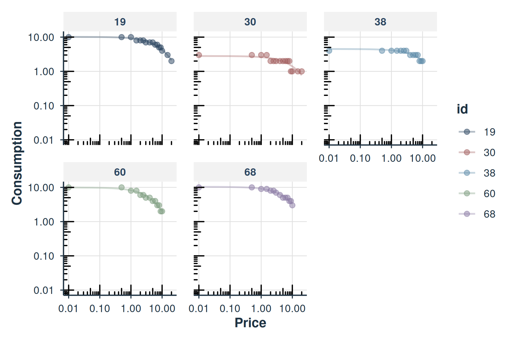

# Migration Guide: FitCurves to fit_demand_fixed

## Overview

Starting with beezdemand version 0.2.0,
[`FitCurves()`](https://brentkaplan.github.io/beezdemand/reference/FitCurves.md)
has been superseded by
[`fit_demand_fixed()`](https://brentkaplan.github.io/beezdemand/reference/fit_demand_fixed.md).
This guide helps you migrate existing code to use the modern API.

For related workflows, see:

- [`vignette("beezdemand")`](https://brentkaplan.github.io/beezdemand/articles/beezdemand.md)
  for getting started
- [`vignette("model-selection")`](https://brentkaplan.github.io/beezdemand/articles/model-selection.md)
  for choosing a model class
- [`vignette("mixed-demand")`](https://brentkaplan.github.io/beezdemand/articles/mixed-demand.md)
  and
  [`vignette("mixed-demand-advanced")`](https://brentkaplan.github.io/beezdemand/articles/mixed-demand-advanced.md)
  for mixed-effects models
- [`vignette("hurdle-demand-models")`](https://brentkaplan.github.io/beezdemand/articles/hurdle-demand-models.md)
  for hurdle models

### Why Migrate?

The new
[`fit_demand_fixed()`](https://brentkaplan.github.io/beezdemand/reference/fit_demand_fixed.md)
function provides:

- **Structured S3 objects** with consistent methods
  ([`summary()`](https://rdrr.io/r/base/summary.html),
  [`tidy()`](https://generics.r-lib.org/reference/tidy.html),
  [`glance()`](https://generics.r-lib.org/reference/glance.html),
  [`predict()`](https://rdrr.io/r/stats/predict.html),
  [`plot()`](https://rdrr.io/r/graphics/plot.default.html),
  [`confint()`](https://rdrr.io/r/stats/confint.html),
  [`augment()`](https://generics.r-lib.org/reference/augment.html))
- **Tidyverse integration** via tibble outputs from
  [`tidy()`](https://generics.r-lib.org/reference/tidy.html) and
  [`glance()`](https://generics.r-lib.org/reference/glance.html)
- **Standardized API** consistent with other beezdemand model classes
- **Better reproducibility** with stored call and parameter information

[`FitCurves()`](https://brentkaplan.github.io/beezdemand/reference/FitCurves.md)
will continue to work but is no longer actively developed. New features
will only be added to
[`fit_demand_fixed()`](https://brentkaplan.github.io/beezdemand/reference/fit_demand_fixed.md).

## Quick Migration Reference

| FitCurves() | fit_demand_fixed() | Notes |
|----|----|----|
| `dat` | `data` | Renamed for consistency |
| `xcol` | `x_var` | Renamed for consistency |
| `ycol` | `y_var` | Renamed for consistency |
| `idcol` | `id_var` | Renamed for consistency |
| `detailed = TRUE` | Always detailed | fit_demand_fixed always returns full results |
| `groupcol` | Not supported | Use factor models instead |
| Returns data.frame | Returns S3 object | Use [`tidy()`](https://generics.r-lib.org/reference/tidy.html) for data frame output |

## Basic Migration

### Before (FitCurves)

``` r

# Old approach
results <- FitCurves(
  dat = apt,
  equation = "hs",
  k = 2,
  xcol = "x",
  ycol = "y",
  idcol = "id"
)

# results is a data.frame with all parameters
head(results)
```

### After (fit_demand_fixed)

``` r

# New approach
fit <- fit_demand_fixed(
  data = apt,
  equation = "hs",
  k = 2,
  x_var = "x",
  y_var = "y",
  id_var = "id"
)

# fit is a structured S3 object
print(fit)
#> 
#> Fixed-Effect Demand Model
#> ==========================
#> 
#> Call:
#> fit_demand_fixed(data = apt, equation = "hs", k = 2, x_var = "x", 
#>     y_var = "y", id_var = "id")
#> 
#> Equation: hs 
#> k: fixed (2) 
#> Subjects: 10 ( 10 converged, 0 failed)
#> 
#> Use summary() for parameter summaries, tidy() for tidy output.
```

## Extracting Results

### Getting Parameter Estimates

#### Before (FitCurves)

``` r

# FitCurves returns a data frame directly
results <- FitCurves(apt, "hs", k = 2)
q0_values <- results$Q0d
alpha_values <- results$Alpha
```

#### After (fit_demand_fixed)

``` r

# Use tidy() for a tibble of coefficients
fit <- fit_demand_fixed(apt, equation = "hs", k = 2)
coefs <- tidy(fit)
head(coefs)
#> # A tibble: 6 × 10
#>   id    term  estimate std.error statistic p.value component estimate_scale
#>   <chr> <chr>    <dbl>     <dbl>     <dbl>   <dbl> <chr>     <chr>         
#> 1 19    Q0       10.2      0.269        NA      NA fixed     natural       
#> 2 30    Q0        2.81     0.226        NA      NA fixed     natural       
#> 3 38    Q0        4.50     0.215        NA      NA fixed     natural       
#> 4 60    Q0        9.92     0.459        NA      NA fixed     natural       
#> 5 68    Q0       10.4      0.329        NA      NA fixed     natural       
#> 6 106   Q0        5.68     0.300        NA      NA fixed     natural       
#> # ℹ 2 more variables: term_display <chr>, estimate_internal <dbl>

# Or access the results data frame directly
head(fit$results)
#>    id Intensity BP0 BP1 Omaxe Pmaxe Equation       Q0d K       Alpha        R2
#> 1  19        10  NA  20    45    15       hs 10.158664 2 0.002047574 0.9804182
#> 2  30         3  NA  20    20    20       hs  2.807366 2 0.005865523 0.7723159
#> 3  38         4  NA  10    21     7       hs  4.497456 2 0.004203441 0.8767531
#> 4  60        10  NA  10    24     8       hs  9.924274 2 0.004299344 0.9714808
#> 5  68        10  NA  10    36     9       hs 10.390384 2 0.002765273 0.9723669
#> 6 106         5  NA   7    15     5       hs  5.683566 2 0.006281201 0.9283457
#>        Q0se      Alphase alpha_star alpha_star_se  N      AbsSS      SdRes
#> 1 0.2685323 6.090445e-05 0.00836391  0.0002487819 16 0.01113625 0.02820366
#> 2 0.2257764 6.760007e-04 0.02395943  0.0027613206 16 0.10721624 0.08751173
#> 3 0.2146862 3.571177e-04 0.01717017  0.0014587507 14 0.02387617 0.04460584
#> 4 0.4591683 1.449834e-04 0.01756192  0.0005922269 14 0.02013543 0.04096282
#> 5 0.3290277 9.636582e-05 0.01129556  0.0003936341 14 0.01006059 0.02895483
#> 6 0.3002817 4.315615e-04 0.02565739  0.0017628381 11 0.01651102 0.04283174
#>      Q0Low    Q0High    AlphaLow   AlphaHigh        EV    Omaxd     Pmaxd
#> 1 9.582720 10.734609 0.001916947 0.002178201 1.7266939 44.43035 13.869758
#> 2 2.323124  3.291609 0.004415646 0.007315401 0.6027653 15.51003 17.520210
#> 3 4.029695  4.965217 0.003425349 0.004981534 0.8411046 21.64285 15.260658
#> 4 8.923832 10.924716 0.003983452 0.004615236 0.8223426 21.16008  6.761518
#> 5 9.673495 11.107274 0.002555310 0.002975236 1.2785478 32.89890 10.040966
#> 6 5.004282  6.362850 0.005304941 0.007257462 0.5628754 14.48361  8.081306
#>      Omaxa     Pmaxa     Notes converged
#> 1 44.43095 13.955544 converged      TRUE
#> 2 15.51024 17.628574 converged      TRUE
#> 3 21.64314 15.355046 converged      TRUE
#> 4 21.16036  6.803339 converged      TRUE
#> 5 32.89934 10.103070 converged      TRUE
#> 6 14.48380  8.131289 converged      TRUE
```

### Getting Model-Level Statistics

#### Before (FitCurves)

``` r

# Manual calculation required
results <- FitCurves(apt, "hs", k = 2)
n_converged <- sum(!is.na(results$Alpha))
mean_r2 <- mean(results$R2, na.rm = TRUE)
```

#### After (fit_demand_fixed)

``` r

# Use glance() for model-level statistics
fit <- fit_demand_fixed(apt, equation = "hs", k = 2)
glance(fit)
#> # A tibble: 1 × 12
#>   model_class      backend equation k_spec     nobs n_subjects n_success n_fail
#>   <chr>            <chr>   <chr>    <chr>     <int>      <int>     <int>  <int>
#> 1 beezdemand_fixed legacy  hs       fixed (2)   146         10        10      0
#> # ℹ 4 more variables: converged <lgl>, logLik <dbl>, AIC <dbl>, BIC <dbl>

# Or use summary() for comprehensive output
summary(fit)
#> 
#> Fixed-Effect Demand Model Summary
#> ================================================== 
#> 
#> Equation: hs 
#> k: fixed (2) 
#> 
#> Fit Summary:
#>   Total subjects: 10 
#>   Converged: 10 
#>   Failed: 0 
#>   Total observations: 146 
#> 
#> Parameter Summary (across subjects):
#>   Q0:
#>     Median: 6.2498 
#>     Range: [ 2.8074 , 10.3904 ]
#>   alpha:
#>     Median: 0.004251 
#>     Range: [ 0.001987 , 0.00785 ]
#> 
#> Per-subject coefficients:
#> -------------------------
#> # A tibble: 40 × 10
#>    id    term      estimate std.error statistic p.value component estimate_scale
#>    <chr> <chr>        <dbl>     <dbl>     <dbl>   <dbl> <chr>     <chr>         
#>  1 106   Q0         5.68     0.300           NA      NA fixed     natural       
#>  2 106   alpha      0.00628  0.000432        NA      NA fixed     natural       
#>  3 106   alpha_st…  0.0257   0.00176         NA      NA fixed     natural       
#>  4 106   k          2       NA               NA      NA fixed     natural       
#>  5 113   Q0         6.20     0.174           NA      NA fixed     natural       
#>  6 113   alpha      0.00199  0.000109        NA      NA fixed     natural       
#>  7 113   alpha_st…  0.00812  0.000447        NA      NA fixed     natural       
#>  8 113   k          2       NA               NA      NA fixed     natural       
#>  9 142   Q0         6.17     0.641           NA      NA fixed     natural       
#> 10 142   alpha      0.00237  0.000400        NA      NA fixed     natural       
#> # ℹ 30 more rows
#> # ℹ 2 more variables: term_display <chr>, estimate_internal <dbl>
```

## Working with Predictions

### Before (FitCurves)

``` r

# Required detailed = TRUE and manual extraction
results <- FitCurves(apt, "hs", k = 2, detailed = TRUE)
# Predictions stored in list element
predictions <- results$newdats  # List of data frames
```

### After (fit_demand_fixed)

``` r

# Use predict() method
fit <- fit_demand_fixed(apt, equation = "hs", k = 2)

# Predict at new prices
new_prices <- data.frame(x = c(0, 0.5, 1, 2, 5, 10))
preds <- predict(fit, newdata = new_prices)
head(preds)
#> # A tibble: 6 × 3
#>       x id    .fitted
#>   <dbl> <chr>   <dbl>
#> 1     0 19      10.2 
#> 2     0 30       2.81
#> 3     0 38       4.50
#> 4     0 60       9.92
#> 5     0 68      10.4 
#> 6     0 106      5.68
```

## Plotting

### Before (FitCurves)

``` r

# Used separate PlotCurves() function
results <- FitCurves(apt, "hs", k = 2, detailed = TRUE)
PlotCurves(results)
```

### After (fit_demand_fixed)

``` r

# Use plot() method directly on the fit object
fit <- fit_demand_fixed(apt, equation = "hs", k = 2)

# Plot first 5 subjects
plot(fit, ids = unique(apt$id)[1:5], facet = TRUE)
```



### New in 0.2.0: Diagnostics + Residual Workflows

Once you migrate to the modern API, you can use standardized post-fit
helpers:

- [`augment()`](https://generics.r-lib.org/reference/augment.html) to
  get fitted values + residuals in a tidy format
- [`check_demand_model()`](https://brentkaplan.github.io/beezdemand/reference/check_demand_model.md)
  for a structured diagnostic summary
- [`plot_residuals()`](https://brentkaplan.github.io/beezdemand/reference/plot_residuals.md)
  for common residual diagnostics (via
  [`augment()`](https://generics.r-lib.org/reference/augment.html))

``` r

fit <- fit_demand_fixed(apt, equation = "hs", k = 2)

augment(fit) |> head()
#> # A tibble: 6 × 6
#>   id        x     y     k .fitted  .resid
#>   <chr> <dbl> <dbl> <dbl>   <dbl>   <dbl>
#> 1 19      0      10     2   10.2  -0.159 
#> 2 19      0.5    10     2    9.69  0.314 
#> 3 19      1      10     2    9.24  0.760 
#> 4 19      1.5     8     2    8.82 -0.819 
#> 5 19      2       8     2    8.42 -0.421 
#> 6 19      2.5     8     2    8.04 -0.0444
check_demand_model(fit)
#> 
#> Model Diagnostics
#> ================================================== 
#> Model class: beezdemand_fixed 
#> 
#> Convergence:
#>   Status: Converged
#> 
#> Residuals:
#>   Mean: 0.0284
#>   SD: 0.5306
#>   Range: [-1.458, 2.228]
#>   Outliers: 3 observations
#> 
#> --------------------------------------------------
#> Issues Detected (1):
#>   1. Detected 3 potential outliers across subjects
plot_residuals(fit)$fitted
#> NULL
```

### New in 0.2.0: Unified Systematicity Wrappers

For user-facing workflows, prefer:

- [`check_systematic_demand()`](https://brentkaplan.github.io/beezdemand/reference/check_systematic_demand.md)
  (purchase task)
- [`check_systematic_cp()`](https://brentkaplan.github.io/beezdemand/reference/check_systematic_cp.md)
  (cross-price)

These wrap legacy helpers (e.g.,
[`CheckUnsystematic()`](https://brentkaplan.github.io/beezdemand/reference/CheckUnsystematic.md))
but return a standardized `beezdemand_systematicity` object.

``` r

sys <- check_systematic_demand(apt)
head(sys$results)
```

## Advanced Features

### Aggregated Data (Mean/Pooled)

Both functions support aggregation, with identical syntax:

``` r

# Fit to mean data
fit_mean <- fit_demand_fixed(apt, equation = "hs", k = 2, agg = "Mean")
tidy(fit_mean)
#> # A tibble: 4 × 10
#>   id    term       estimate std.error statistic p.value component estimate_scale
#>   <chr> <chr>         <dbl>     <dbl>     <dbl>   <dbl> <chr>     <chr>         
#> 1 mean  Q0          7.44      2.03e-1        NA      NA fixed     natural       
#> 2 mean  alpha       0.00435   8.89e-5        NA      NA fixed     natural       
#> 3 mean  alpha_star  0.0178    3.63e-4        NA      NA fixed     natural       
#> 4 mean  k           2        NA              NA      NA fixed     natural       
#> # ℹ 2 more variables: term_display <chr>, estimate_internal <dbl>
```

### Parameter Space

Both functions support log10 parameterization:

``` r

# Fit in log10 space
fit_log <- fit_demand_fixed(
  apt,
  equation = "hs",
  k = 2,
  param_space = "log10"
)

# tidy() can report in either scale
tidy(fit_log, report_space = "log10") |> head()
#> # A tibble: 6 × 10
#>   id    term  estimate std.error statistic p.value component estimate_scale
#>   <chr> <chr>    <dbl>     <dbl>     <dbl>   <dbl> <chr>     <chr>         
#> 1 19    Q0       1.01     0.0115        NA      NA fixed     log10         
#> 2 30    Q0       0.448    0.0349        NA      NA fixed     log10         
#> 3 38    Q0       0.653    0.0207        NA      NA fixed     log10         
#> 4 60    Q0       0.997    0.0201        NA      NA fixed     log10         
#> 5 68    Q0       1.02     0.0138        NA      NA fixed     log10         
#> 6 106   Q0       0.755    0.0229        NA      NA fixed     log10         
#> # ℹ 2 more variables: term_display <chr>, estimate_internal <dbl>
tidy(fit_log, report_space = "natural") |> head()
#> # A tibble: 6 × 10
#>   id    term  estimate std.error statistic p.value component estimate_scale
#>   <chr> <chr>    <dbl>     <dbl>     <dbl>   <dbl> <chr>     <chr>         
#> 1 19    Q0       10.2      0.269        NA      NA fixed     natural       
#> 2 30    Q0        2.81     0.226        NA      NA fixed     natural       
#> 3 38    Q0        4.50     0.215        NA      NA fixed     natural       
#> 4 60    Q0        9.92     0.459        NA      NA fixed     natural       
#> 5 68    Q0       10.4      0.329        NA      NA fixed     natural       
#> 6 106   Q0        5.68     0.300        NA      NA fixed     natural       
#> # ℹ 2 more variables: term_display <chr>, estimate_internal <dbl>
```

## Feature Comparison

| Feature | FitCurves() | fit_demand_fixed() |
|----|----|----|
| Equations | hs, koff, linear | hs, koff, linear |
| k options | numeric, “ind”, “fit”, “share” | numeric, “ind”, “fit”, “share” |
| Aggregation | “Mean”, “Pooled” | “Mean”, “Pooled” |
| Parameter space | natural, log10 | natural, log10 |
| [`summary()`](https://rdrr.io/r/base/summary.html) method | No | Yes |
| [`tidy()`](https://generics.r-lib.org/reference/tidy.html) method | No | Yes |
| [`glance()`](https://generics.r-lib.org/reference/glance.html) method | No | Yes |
| [`predict()`](https://rdrr.io/r/stats/predict.html) method | No | Yes |
| [`plot()`](https://rdrr.io/r/graphics/plot.default.html) method | No | Yes |
| [`coef()`](https://rdrr.io/r/stats/coef.html) method | No | Yes |
| [`augment()`](https://generics.r-lib.org/reference/augment.html) method | No | Yes |
| [`confint()`](https://rdrr.io/r/stats/confint.html) method | No | Yes |

## Suppressing Deprecation Warnings

If you need to continue using
[`FitCurves()`](https://brentkaplan.github.io/beezdemand/reference/FitCurves.md)
without warnings (e.g., in legacy code or during a gradual migration),
you can suppress the deprecation message:

``` r

# Suppress deprecation warning temporarily
rlang::with_options(
  lifecycle_verbosity = "quiet",
  FitCurves(apt, "hs", k = 2)
)
```

However, we strongly recommend migrating to
[`fit_demand_fixed()`](https://brentkaplan.github.io/beezdemand/reference/fit_demand_fixed.md)
for new code.

## Need Help?

If you encounter issues during migration:

1.  Check the function documentation:
    [`?fit_demand_fixed`](https://brentkaplan.github.io/beezdemand/reference/fit_demand_fixed.md)
2.  Review the [beezdemand GitHub
    repository](https://github.com/brentkaplan/beezdemand)
3.  Open an issue if you find bugs or have feature requests

## See Also

- [`vignette("beezdemand")`](https://brentkaplan.github.io/beezdemand/articles/beezdemand.md)
  – Getting started with beezdemand
- [`vignette("model-selection")`](https://brentkaplan.github.io/beezdemand/articles/model-selection.md)
  – Choosing the right model class
- [`vignette("fixed-demand")`](https://brentkaplan.github.io/beezdemand/articles/fixed-demand.md)
  – Fixed-effect demand modeling
- [`vignette("mixed-demand")`](https://brentkaplan.github.io/beezdemand/articles/mixed-demand.md)
  – Mixed-effects nonlinear demand models
- [`vignette("mixed-demand-advanced")`](https://brentkaplan.github.io/beezdemand/articles/mixed-demand-advanced.md)
  – Advanced mixed-effects topics
- [`vignette("hurdle-demand-models")`](https://brentkaplan.github.io/beezdemand/articles/hurdle-demand-models.md)
  – Two-part hurdle demand models
- [`vignette("cross-price-models")`](https://brentkaplan.github.io/beezdemand/articles/cross-price-models.md)
  – Cross-price demand analysis
- [`vignette("group-comparisons")`](https://brentkaplan.github.io/beezdemand/articles/group-comparisons.md)
  – Group comparisons

## Session Information

``` r

sessionInfo()
#> R version 4.6.0 (2026-04-24)
#> Platform: x86_64-pc-linux-gnu
#> Running under: Ubuntu 24.04.4 LTS
#> 
#> Matrix products: default
#> BLAS:   /usr/lib/x86_64-linux-gnu/openblas-pthread/libblas.so.3 
#> LAPACK: /usr/lib/x86_64-linux-gnu/openblas-pthread/libopenblasp-r0.3.26.so;  LAPACK version 3.12.0
#> 
#> locale:
#>  [1] LC_CTYPE=C.UTF-8       LC_NUMERIC=C           LC_TIME=C.UTF-8       
#>  [4] LC_COLLATE=C.UTF-8     LC_MONETARY=C.UTF-8    LC_MESSAGES=C.UTF-8   
#>  [7] LC_PAPER=C.UTF-8       LC_NAME=C              LC_ADDRESS=C          
#> [10] LC_TELEPHONE=C         LC_MEASUREMENT=C.UTF-8 LC_IDENTIFICATION=C   
#> 
#> time zone: UTC
#> tzcode source: system (glibc)
#> 
#> attached base packages:
#> [1] stats     graphics  grDevices utils     datasets  methods   base     
#> 
#> other attached packages:
#> [1] dplyr_1.2.1      beezdemand_0.3.0
#> 
#> loaded via a namespace (and not attached):
#>  [1] nls.multstart_2.0.0 gtable_0.3.6        TMB_1.9.21         
#>  [4] xfun_0.57           bslib_0.10.0        ggplot2_4.0.3      
#>  [7] htmlwidgets_1.6.4   insight_1.5.0       lattice_0.22-9     
#> [10] vctrs_0.7.3         tools_4.6.0         Rdpack_2.6.6       
#> [13] generics_0.1.4      tibble_3.3.1        pkgconfig_2.0.3    
#> [16] Matrix_1.7-5        RColorBrewer_1.1-3  S7_0.2.2           
#> [19] desc_1.4.3          lifecycle_1.0.5     compiler_4.6.0     
#> [22] farver_2.1.2        textshaping_1.0.5   minpack.lm_1.2-4   
#> [25] nlstools_2.1-0      htmltools_0.5.9     sass_0.4.10        
#> [28] yaml_2.3.12         pillar_1.11.1       pkgdown_2.2.0      
#> [31] nloptr_2.2.1        jquerylib_0.1.4     tidyr_1.3.2        
#> [34] MASS_7.3-65         cachem_1.1.0        reformulas_0.4.4   
#> [37] boot_1.3-32         nlme_3.1-169        tidyselect_1.2.1   
#> [40] digest_0.6.39       performance_0.16.0  mvtnorm_1.3-7      
#> [43] purrr_1.2.2         splines_4.6.0       fastmap_1.2.0      
#> [46] grid_4.6.0          cli_3.6.6           magrittr_2.0.5     
#> [49] patchwork_1.3.2     utf8_1.2.6          broom_1.0.12       
#> [52] withr_3.0.2         scales_1.4.0        backports_1.5.1    
#> [55] estimability_1.5.1  rmarkdown_2.31      emmeans_2.0.3      
#> [58] otel_0.2.0          lme4_2.0-1          ragg_1.5.2         
#> [61] coda_0.19-4.1       evaluate_1.0.5      knitr_1.51         
#> [64] rbibutils_2.4.1     rlang_1.2.0         Rcpp_1.1.1-1.1     
#> [67] xtable_1.8-8        glue_1.8.1          nlsr_2026.4.29     
#> [70] minqa_1.2.8         jsonlite_2.0.0      R6_2.6.1           
#> [73] systemfonts_1.3.2   fs_2.1.0
```
