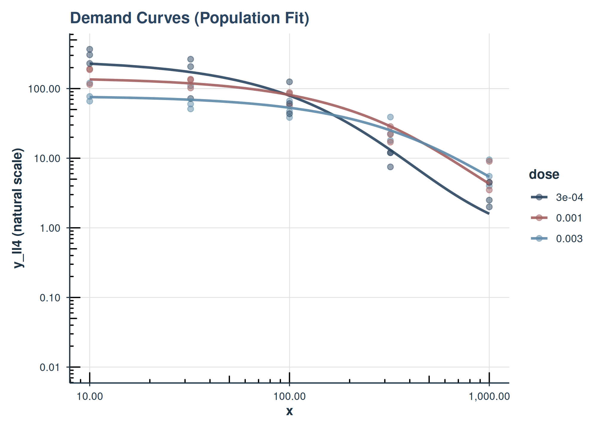

# Advanced Mixed-Effects Demand Modeling

## Introduction

This vignette covers advanced topics for mixed-effects nonlinear demand
modeling with `beezdemand`. It assumes you are already familiar with the
basics covered in
[`vignette("mixed-demand")`](https://brentkaplan.github.io/beezdemand/articles/mixed-demand.md),
including fitting models with
[`fit_demand_mixed()`](https://brentkaplan.github.io/beezdemand/reference/fit_demand_mixed.md),
inspecting results with
[`tidy()`](https://generics.r-lib.org/reference/tidy.html) /
[`glance()`](https://generics.r-lib.org/reference/glance.html) /
[`augment()`](https://generics.r-lib.org/reference/augment.html), and
basic plotting.

Topics covered here include:

- **Multi-factor models** (additive and interaction)
- **Collapsing factor levels** (asymmetric specifications for Q0 and
  alpha)
- **Estimated marginal means** and **pairwise comparisons**
- **Multi-factor visualization** with faceting
- **Complex random effects structures**
- **Continuous covariates** and `fixed_rhs`
- **Trends** with `emtrends`

``` r
quick_nlme_control <- nlme::nlmeControl(
  msMaxIter = 100,
  niterEM = 20,
  maxIter = 100, # Low iterations for speed
  pnlsTol = 0.1,
  tolerance = 1e-4, # Looser tolerance
  opt = "nlminb",
  msVerbose = FALSE
)

# Prepare data subsets used throughout
ko_alf <- ko[ko$drug == "Alfentanil", ]

# Fit the one-factor model used as a baseline/fallback in later sections
fit_one_factor_dose <- fit_demand_mixed(
  data = ko_alf,
  y_var = "y_ll4",
  x_var = "x",
  id_var = "monkey",
  factors = "dose",
  equation_form = "zben",
  nlme_control = quick_nlme_control,
  start_value_method = "heuristic"
)
```

### Model with Two Factors (Additive)

Here, Q\_{0} and \alpha vary by drug and dose additively. For this, we
need more data than just ko_alf, so we use `ko`. Note: With complex
models and small sample sizes, convergence can be challenging. The
start_value_method = “pooled_nls” is often more robust for complex
models.

This example is omitted from the rendered vignette (it can be slow and
may fail to converge). Set `render_fast <- FALSE` in the setup chunk to
run it.

#### Model with Two Factors and Interaction

This allows the effect of dose to be different for each drug (and
vice-versa).

This example is omitted from the rendered vignette (it can be slow and
may fail to converge). Set `render_fast <- FALSE` in the setup chunk to
run it.

#### Using Different equation_form and y_var

The simplified equation form expects y_var to be raw consumption.

This example is omitted from the rendered vignette (it can be slow and
may fail to converge). Set `render_fast <- FALSE` in the setup chunk to
run it.

### Collapsing Factor Levels

Sometimes you might want to group levels of a factor, and you may want
different groupings for Q\_{0} versus \alpha. The `collapse_levels`
argument allows you to specify separate collapsing schemes for each
parameter.

**Structure:**

``` r
collapse_levels = list(
  Q0 = list(factor_name = list(new_level = c("old_level1", "old_level2"), ...)),
  alpha = list(factor_name = list(new_level = c("old_level1", ...), ...))
)
```

Either `Q0` or `alpha` (or both) can be omitted to keep original levels
for that parameter.

#### Example: Same collapsing for both parameters

``` r
# Ensure levels to collapse are present in ko_alf$dose
# levels(ko_alf$dose) are "0.001", "0.003", "3e-04"
fit_collapsed_same <- try(
  fit_demand_mixed(
    data = ko_alf,
    y_var = "y_ll4",
    x_var = "x",
    id_var = "monkey",
    factors = "dose",
    collapse_levels = list(
      Q0 = list(
        dose = list(low_doses = c("3e-04", "0.001"), high_dose = "0.003")
      ),
      alpha = list(
        dose = list(low_doses = c("3e-04", "0.001"), high_dose = "0.003")
      )
    ),
    equation_form = "zben",
    nlme_control = quick_nlme_control
  ),
  silent = TRUE
)

if (
  !is.null(fit_collapsed_same) &&
    !inherits(fit_collapsed_same, "try-error") &&
    !is.null(fit_collapsed_same$model)
) {
  print(fit_collapsed_same)
  cat("\nQ0 params:", fit_collapsed_same$param_info$num_params_Q0, "\n")
  cat("alpha params:", fit_collapsed_same$param_info$num_params_alpha, "\n")
} else {
  cat("Collapsed levels model failed to converge.\n")
}
```

    #> Demand NLME Model Fit ('beezdemand_nlme' object)
    #> ---------------------------------------------------
    #> 
    #> Call:
    #> fit_demand_mixed(data = ko_alf, y_var = "y_ll4", x_var = "x", 
    #>     id_var = "monkey", factors = "dose", equation_form = "zben", 
    #>     collapse_levels = list(Q0 = list(dose = list(low_doses = c("3e-04", 
    #>         "0.001"), high_dose = "0.003")), alpha = list(dose = list(low_doses = c("3e-04", 
    #>         "0.001"), high_dose = "0.003"))), nlme_control = quick_nlme_control)
    #> 
    #> Equation Form Selected:  zben 
    #> NLME Model Formula:
    #> y_ll4 ~ Q0 * exp(-(10^alpha/Q0) * (10^Q0) * x)
    #> <environment: 0x564640c10278>
    #> Fixed Effects Structure (Q0):     ~ dose_Q0 
    #> Fixed Effects Structure (alpha):  ~ dose_alpha 
    #> Factors:  dose 
    #> Interaction Term Included:  FALSE 
    #> ID Variable for Random Effects:  monkey 
    #> 
    #> Start Values Used (Fixed Effects Intercepts):
    #>   Q0 Intercept (log10 scale):  2.271 
    #>   alpha Intercept (log10 scale):  -3 
    #> 
    #> --- NLME Model Fit Summary (from nlme object) ---
    #> Nonlinear mixed-effects model fit by maximum likelihood
    #>   Model: nlme_model_formula_obj 
    #>   Data: data 
    #>   Log-likelihood: 10.80738
    #>   Fixed: list(Q0 ~ dose_Q0, alpha ~ dose_alpha) 
    #>            Q0.(Intercept)       Q0.dose_Q0low_doses         alpha.(Intercept) 
    #>                1.89628442                0.37072017               -4.64112061 
    #> alpha.dose_alphalow_doses 
    #>               -0.04341491 
    #> 
    #> Random effects:
    #>  Formula: list(Q0 ~ 1, alpha ~ 1)
    #>  Level: monkey
    #>  Structure: Diagonal
    #>         Q0.(Intercept) alpha.(Intercept)  Residual
    #> StdDev:   4.401177e-06      2.693877e-06 0.1903097
    #> 
    #> Number of Observations: 45
    #> Number of Groups: 3 
    #> 
    #> --- Additional Fit Statistics ---
    #> Log-likelihood:  10.81 
    #> AIC:  -7.615 
    #> BIC:  5.032 
    #> ---------------------------------------------------
    #> 
    #> Q0 params: 2 
    #> alpha params: 2

#### Example: Different collapsing for Q0 and alpha

This is particularly useful when you want fine-grained distinctions for
one parameter but not the other. For instance, you might hypothesize
that maximum consumption (Q\_{0}) varies by dose, but sensitivity
(\alpha) does not.

``` r
# Q0: keep 2 collapsed levels (low vs high)
# alpha: collapse all to 1 level (intercept only)
fit_collapsed_asymmetric <- try(
  fit_demand_mixed(
    data = ko_alf,
    y_var = "y_ll4",
    x_var = "x",
    id_var = "monkey",
    factors = "dose",
    collapse_levels = list(
      Q0 = list(
        dose = list(low_doses = c("3e-04", "0.001"), high_dose = "0.003")
      ),
      alpha = list(dose = list(all_doses = c("3e-04", "0.001", "0.003")))
    ),
    equation_form = "zben",
    nlme_control = quick_nlme_control
  ),
  silent = TRUE
)

if (
  !is.null(fit_collapsed_asymmetric) &&
    !inherits(fit_collapsed_asymmetric, "try-error") &&
    !is.null(fit_collapsed_asymmetric$model)
) {
  print(fit_collapsed_asymmetric)
  cat("\nQ0 params:", fit_collapsed_asymmetric$param_info$num_params_Q0, "\n")
  cat(
    "alpha params:",
    fit_collapsed_asymmetric$param_info$num_params_alpha,
    "\n"
  )
  cat(
    "\nQ0 formula:",
    fit_collapsed_asymmetric$formula_details$fixed_effects_formula_str_Q0,
    "\n"
  )
  cat(
    "alpha formula:",
    fit_collapsed_asymmetric$formula_details$fixed_effects_formula_str_alpha,
    "\n"
  )
} else {
  cat("Asymmetric collapsed levels model failed to converge.\n")
}
```

    #> Demand NLME Model Fit ('beezdemand_nlme' object)
    #> ---------------------------------------------------
    #> 
    #> Call:
    #> fit_demand_mixed(data = ko_alf, y_var = "y_ll4", x_var = "x", 
    #>     id_var = "monkey", factors = "dose", equation_form = "zben", 
    #>     collapse_levels = list(Q0 = list(dose = list(low_doses = c("3e-04", 
    #>         "0.001"), high_dose = "0.003")), alpha = list(dose = list(all_doses = c("3e-04", 
    #>         "0.001", "0.003")))), nlme_control = quick_nlme_control)
    #> 
    #> Equation Form Selected:  zben 
    #> NLME Model Formula:
    #> y_ll4 ~ Q0 * exp(-(10^alpha/Q0) * (10^Q0) * x)
    #> <environment: 0x564641b41150>
    #> Fixed Effects Structure (Q0):     ~ dose_Q0 
    #> Fixed Effects Structure (alpha):  ~ 1 
    #> Factors:  dose 
    #> Interaction Term Included:  FALSE 
    #> ID Variable for Random Effects:  monkey 
    #> 
    #> Start Values Used (Fixed Effects Intercepts):
    #>   Could not determine Q0/alpha intercepts from start_values_used structure.
    #>   Full start_values_used vector:
    #> [1]  2.271  0.000 -3.000
    #> 
    #> --- NLME Model Fit Summary (from nlme object) ---
    #> Nonlinear mixed-effects model fit by maximum likelihood
    #>   Model: nlme_model_formula_obj 
    #>   Data: data 
    #>   Log-likelihood: 10.73793
    #>   Fixed: list(Q0 ~ dose_Q0, alpha ~ 1) 
    #>      Q0.(Intercept) Q0.dose_Q0low_doses               alpha 
    #>           1.9041039           0.3572637          -4.6750675 
    #> 
    #> Random effects:
    #>  Formula: list(Q0 ~ 1, alpha ~ 1)
    #>  Level: monkey
    #>  Structure: Diagonal
    #>         Q0.(Intercept)        alpha  Residual
    #> StdDev:   4.409119e-06 2.697381e-06 0.1906036
    #> 
    #> Number of Observations: 45
    #> Number of Groups: 3 
    #> 
    #> --- Additional Fit Statistics ---
    #> Log-likelihood:  10.74 
    #> AIC:  -9.476 
    #> BIC:  1.364 
    #> ---------------------------------------------------
    #> 
    #> Q0 params: 2 
    #> alpha params: 1 
    #> 
    #> Q0 formula: ~ dose_Q0 
    #> alpha formula: ~ 1

**Note:** When all levels of a factor are collapsed to a single level
for a parameter, that factor is automatically removed from the formula
for that parameter (it contributes only to the intercept). A message
will inform you when this occurs.

#### EMMs and Comparisons with Collapsed Factors

When using `collapse_levels`, the
[`get_demand_param_emms()`](https://brentkaplan.github.io/beezdemand/reference/get_demand_param_emms.md)
and
[`get_demand_comparisons()`](https://brentkaplan.github.io/beezdemand/reference/get_demand_comparisons.md)
functions automatically handle the asymmetric factor structures. EMMs
will be computed using the collapsed levels, and comparisons will only
be performed when there are multiple levels to compare.

**Differential Collapsing Output:** When Q0 and alpha have different
numbers of factor levels (e.g., Q0 keeps original `dose` levels while
alpha collapses to fewer groups), the EMM output will include separate
factor columns:

- Original factor column (e.g., `dose`) for the uncollapsed parameter
  (Q0)
- Suffixed column (e.g., `dose_alpha`) for the collapsed parameter
  (alpha)

This results in a cross-joined table showing all combinations of Q0
levels and alpha levels. For example, if dose has 5 original levels and
alpha collapses to 2 groups, the EMM table will have 10 rows (5 × 2).

``` r
# Using the asymmetric collapsed model from above (if it converged)
if (
  !is.null(fit_collapsed_asymmetric) &&
    !inherits(fit_collapsed_asymmetric, "try-error") &&
    !is.null(fit_collapsed_asymmetric$model)
) {
  cat("--- EMMs with collapsed factors ---\n")
  # EMMs will show collapsed Q0 levels but single alpha value
  collapsed_emms <- get_demand_param_emms(
    fit_obj = fit_collapsed_asymmetric,
    factors_in_emm = "dose", # Use original factor name
    include_ev = TRUE
  )
  print(collapsed_emms)

  cat("\n--- Comparisons with collapsed factors ---\n")
  # Q0 will have comparisons (2 levels), alpha will have none (1 level)
  collapsed_comparisons <- get_demand_comparisons(
    fit_obj = fit_collapsed_asymmetric,
    compare_specs = ~dose, # Use original factor name
    params_to_compare = c("Q0", "alpha")
  )

  cat("\nQ0 contrasts (collapsed levels):\n")
  print(collapsed_comparisons$Q0$contrasts_log10)

  cat("\nalpha contrasts (intercept-only, no comparisons):\n")
  print(collapsed_comparisons$alpha$contrasts_log10)
} else {
  cat("Asymmetric collapsed model not available for EMM demonstration.\n")
}
```

    #> --- EMMs with collapsed factors ---

    #> # A tibble: 2 × 16
    #>   dose      Q0_param_log10 LCL_Q0_param_log10 UCL_Q0_param_log10 Q0_natural
    #>   <fct>              <dbl>              <dbl>              <dbl>      <dbl>
    #> 1 high_dose           1.90               1.77               2.04       80.2
    #> 2 low_doses           2.26               2.16               2.36      183. 
    #> # ℹ 11 more variables: LCL_Q0_natural <dbl>, UCL_Q0_natural <dbl>,
    #> #   alpha_param_log10 <dbl>, LCL_alpha_param_log10 <dbl>,
    #> #   UCL_alpha_param_log10 <dbl>, alpha_natural <dbl>, LCL_alpha_natural <dbl>,
    #> #   UCL_alpha_natural <dbl>, EV <dbl>, LCL_EV <dbl>, UCL_EV <dbl>
    #> 
    #> --- Comparisons with collapsed factors ---

    #> 
    #> Q0 contrasts (collapsed levels):
    #> # A tibble: 1 × 8
    #>   contrast_definition   estimate     SE    df lower.CL upper.CL t.ratio  p.value
    #>   <chr>                    <dbl>  <dbl> <dbl>    <dbl>    <dbl>   <dbl>    <dbl>
    #> 1 high_dose - low_doses   -0.357 0.0803    40   -0.520   -0.195   -4.45  6.73e-5
    #> 
    #> alpha contrasts (intercept-only, no comparisons):
    #> # A tibble: 0 × 0

### Visualizing Multi-Factor Models

#### Plotting a Two-Factor Model with Faceting

Let’s use fit_two_factors_add (if it converged: y_ll4 ~ drug + dose). We
can facet by one factor and color by another.

``` r
# Assuming fit_two_factors_add was successfully created earlier
# If it failed, this chunk won't produce a plot.
active_two_factor_fit <- if (
  !is.null(fit_two_factors_add) && !is.null(fit_two_factors_add$model)
) {
  fit_two_factors_add
} else {
  # Fallback to a simpler model if the two-factor one failed in the vignette
  if (!is.null(fit_one_factor_dose$model)) fit_one_factor_dose else NULL
}

if (
  !is.null(active_two_factor_fit$model) &&
    !is.null(active_two_factor_fit$param_info$factors) &&
    length(active_two_factor_fit$param_info$factors) >= 1
) {
  # Determine factors for aesthetics based on what's in active_two_factor_fit
  color_factor <- if ("dose" %in% active_two_factor_fit$param_info$factors) {
    "dose"
  } else {
    NULL
  }
  facet_factor_name <- if (
    "drug" %in% active_two_factor_fit$param_info$factors
  ) {
    "drug"
  } else {
    # If only 'dose' is available from fit_one_factor_dose, we can't facet by 'drug'
    # So, maybe facet by dose instead, or don't facet.
    if (
      "dose" %in%
        active_two_factor_fit$param_info$factors &&
        is.null(color_factor)
    ) {
      color_factor <- "dose" # color by dose if not faceting by it
      NULL # No faceting
    } else {
      NULL
    }
  }

  facet_formula_plot <- if (!is.null(facet_factor_name)) {
    stats::as.formula(paste("~", facet_factor_name))
  } else {
    NULL
  }

  plot(
    active_two_factor_fit,
    inv_fun = ll4_inv,
    color_by = color_factor,
    # linetype_by = if("dose" %in% active_two_factor_fit$param_info$factors) "dose" else NULL, # Example
    facet_formula = facet_formula_plot,
    title = "Demand Curves (Population Fit)",
    observed_point_alpha = 0.5,
    ind_line_alpha = .5
  )
} else {
  cat(
    "A suitable two-factor or one-factor model object not available for this plotting example.\n"
  )
}
```



This example attempts to use fit_two_factors_add. If that model didn’t
converge (common with minimal iterations for vignette speed), it falls
back to fit_one_factor_dose and adjusts aesthetics. The plot will show
population lines, colored by one factor and faceted by another (if two
factors are available).

#### Plotting a Model Fit with equation_form = “simplified”

If you fit a model using equation_form = “simplified” (which models raw
y), the inv_fun is typically identity because predictions are already on
the natural scale.

``` r
# Assuming fit_simplified_example converged earlier
if (
  !is.null(fit_simplified_example) && !is.null(fit_simplified_example$model)
) {
  plot(
    fit_simplified_example,
    inv_fun = identity, # Predictions are already on raw y scale
    color_by = "dose",
    shape_by = "dose",
    title = "Demand Model ('simplified' equation, Raw Y)"
  )
} else {
  cat("fit_simplified_example model object not available for plotting.\n")
}
```

    #> fit_simplified_example model object not available for plotting.

Users can further customize the returned ggplot object by adding more
layers or theme adjustments. For instance, to add custom axis limits or
breaks:

``` r
plot_object +
    ggplot2::scale_x_continuous(
        limits = c(0, 1000),
        breaks = c(0, 100, 500, 1000)
    )
```

### Analyzing Estimated Marginal Means (`get_demand_param_emms`)

This function helps interpret how factors affect Q\_{0} and \alpha,
providing estimates on both log10 and natural scales, and optionally
Essential Value (EV).

**Note on `collapse_levels`:** When a model is fit using
`collapse_levels` with asymmetric specifications (different collapsing
for Q0 and alpha), the EMM functions automatically use the appropriate
collapsed factor names for each parameter. You still specify the
original factor name in `factors_in_emm`, and the output will show the
collapsed levels. If a parameter has only one level (intercept-only),
that parameter’s values will be the same across all rows.

``` r
# We'll use a model with factors.
# If fit_two_factors_add converged, use it. Otherwise, use fit_one_factor_dose.
# For the vignette, let's ensure we use one that is likely available.
# If fit_two_factors_add is NULL (failed to converge in example), this will use fit_one_factor_dose
emm_model_to_use <- if (
  !is.null(fit_two_factors_add) && !is.null(fit_two_factors_add$model)
) {
  fit_two_factors_add
} else if (!is.null(fit_one_factor_dose$model)) {
  fit_one_factor_dose
} else {
  NULL
}

if (!is.null(emm_model_to_use)) {
  cat(
    "--- EMMs for model with factors:",
    paste(emm_model_to_use$param_info$factors, collapse = ", "),
    "---\n"
  )

  factors_for_emms <- emm_model_to_use$param_info$factors

  demand_emms_output <- get_demand_param_emms(
    fit_obj = emm_model_to_use,
    factors_in_emm = factors_for_emms, # Use factors from the model
    include_ev = TRUE
  )
  print(demand_emms_output)

  cat("\n--- EMMs for observed factor combinations only: ---\n")
  # This is useful if the EMM grid includes combinations not in data
  observed_demand_emms <- get_observed_demand_param_emms(
    fit_obj = emm_model_to_use,
    factors_in_emm = factors_for_emms,
    include_ev = TRUE
  )
  print(observed_demand_emms)
} else {
  cat(
    "No suitable model with factors converged for EMM analysis in the vignette.\n"
  )
}
```

    #> --- EMMs for model with factors: dose ---

    #> # A tibble: 3 × 16
    #>   dose  Q0_param_log10 LCL_Q0_param_log10 UCL_Q0_param_log10 Q0_natural
    #>   <fct>          <dbl>              <dbl>              <dbl>      <dbl>
    #> 1 3e-04           2.42               2.27               2.56      260. 
    #> 2 0.001           2.16               2.03               2.28      144. 
    #> 3 0.003           1.90               1.78               2.02       78.8
    #> # ℹ 11 more variables: LCL_Q0_natural <dbl>, UCL_Q0_natural <dbl>,
    #> #   alpha_param_log10 <dbl>, LCL_alpha_param_log10 <dbl>,
    #> #   UCL_alpha_param_log10 <dbl>, alpha_natural <dbl>, LCL_alpha_natural <dbl>,
    #> #   UCL_alpha_natural <dbl>, EV <dbl>, LCL_EV <dbl>, UCL_EV <dbl>
    #> 
    #> --- EMMs for observed factor combinations only: ---

    #> # A tibble: 3 × 16
    #>   dose  Q0_param_log10 LCL_Q0_param_log10 UCL_Q0_param_log10 Q0_natural
    #>   <fct>          <dbl>              <dbl>              <dbl>      <dbl>
    #> 1 3e-04           2.42               2.27               2.56      260. 
    #> 2 0.001           2.16               2.03               2.28      144. 
    #> 3 0.003           1.90               1.78               2.02       78.8
    #> # ℹ 11 more variables: LCL_Q0_natural <dbl>, UCL_Q0_natural <dbl>,
    #> #   alpha_param_log10 <dbl>, LCL_alpha_param_log10 <dbl>,
    #> #   UCL_alpha_param_log10 <dbl>, alpha_natural <dbl>, LCL_alpha_natural <dbl>,
    #> #   UCL_alpha_natural <dbl>, EV <dbl>, LCL_EV <dbl>, UCL_EV <dbl>

### Performing Pairwise Comparisons (`get_demand_comparisons`)

Compare levels of factors for Q\_{0} and \alpha.

**Note on `collapse_levels`:** When using models fit with asymmetric
`collapse_levels`, comparisons are only performed for parameters that
have multiple levels. If a parameter was collapsed to a single level
(intercept-only), the comparisons for that parameter will be empty.

``` r
# Using the same emm_model_to_use
if (
  !is.null(emm_model_to_use) && length(emm_model_to_use$param_info$factors) > 0
) {
  factors_present <- emm_model_to_use$param_info$factors

  if ("dose" %in% factors_present) {
    cat(
      "--- Pairwise comparisons for 'dose' (averaging over other factors if any): ---\n"
    )
    comparisons_dose <- get_demand_comparisons(
      fit_obj = emm_model_to_use,
      compare_specs = ~dose,
      contrast_type = "pairwise",
      adjust = "fdr",
      report_ratios = TRUE
    )
    print(comparisons_dose)
  }

  if (all(c("drug", "dose") %in% factors_present)) {
    cat(
      "\n--- Pairwise comparisons for 'drug' within each level of 'dose': ---\n"
    )
    # EMMs calculated over drug*dose, then contrast drug within each dose
    comparisons_drug_by_dose <- get_demand_comparisons(
      fit_obj = emm_model_to_use,
      compare_specs = ~ drug * dose,
      contrast_type = "pairwise",
      contrast_by = "dose", # Compare 'drug' levels, holding 'dose' constant
      adjust = "fdr",
      report_ratios = TRUE
    )
    print(comparisons_drug_by_dose)
  }
} else {
  cat(
    "No suitable model with factors converged for comparisons in the vignette.\n"
  )
}
```

    #> --- Pairwise comparisons for 'dose' (averaging over other factors if any): ---

    #> Demand Parameter Comparisons (from beezdemand_nlme fit)
    #> EMMs computed over: ~dose 
    #> Contrast type: pairwise
    #> P-value adjustment method: fdr 
    #> ==================================================

### Advanced Topics

**Note**: This section covers advanced modeling techniques for
experienced users. These advanced topics require deeper understanding of
mixed-effects models and may be computationally intensive.

**Performance Note**: The sections below are omitted from the rendered
vignette by default (they can be slow and may fail to converge). Set
`render_fast <- FALSE` in the setup chunk to run them.

#### More Complex Random Effects Structures

This example shows how to specify a more complex random-effects
structure (e.g., random slopes) for Q\_{0} and \alpha.

Now let’s demonstrate how to extract individual-level predicted
coefficients using the
[`get_individual_coefficients()`](https://brentkaplan.github.io/beezdemand/reference/get_individual_coefficients.md)
function. This combines fixed and random effects to calculate
individual-level parameter estimates for each subject.

#### Continuous Covariates and `fixed_rhs`

In addition to factor predictors, you can include continuous covariates
in the fixed-effects linear models for `Q0` and `alpha`.

There are two convenient ways to do this:

1.  Add continuous covariates additively using the
    `continuous_covariates` argument (no formula writing required).
2.  Specify a full right-hand-side using `fixed_rhs` (formula), which
    gives you complete control, including interactions (e.g.,
    factor-by-continuous).

Below we demonstrate both, using a made-up continuous covariate `age`
assigned per subject (`monkey`).

##### A) Additive continuous covariate via `continuous_covariates`

Here we keep a single factor (`dose`) and add `age` as an additive
continuous covariate. The RHS becomes `~ 1 + dose + age` for both
parameters.

##### B) fixed_rhs with a factor (drug) and a continuous covariate (dose)

Here we specify `drug` as a factor but treat `dose` as a continuous
covariate (`dose_num`, a numeric version of `dose`), and include `age`
as an additional continuous covariate. This uses a shared RHS for `Q0`
and `alpha`: `~ 1 + drug + dose_num + age`.

#### Trends with `emtrends`

We can examine how the parameters change with continuous covariates
using
[`get_demand_param_trends()`](https://brentkaplan.github.io/beezdemand/reference/get_demand_param_trends.md),
which wraps
[`emmeans::emtrends()`](https://rvlenth.github.io/emmeans/reference/emtrends.html)
and returns tidy results for Q0 and alpha trends on the log10 scale.

Below we compute trends with respect to `age` and `dose_num`, first
overall and then by `drug` (if the model includes `drug` as a factor).

## See Also

- [`vignette("mixed-demand")`](https://brentkaplan.github.io/beezdemand/articles/mixed-demand.md)
  – Basic mixed-effects demand modeling
- [`vignette("model-selection")`](https://brentkaplan.github.io/beezdemand/articles/model-selection.md)
  – Choosing the right model class
- [`vignette("hurdle-demand-models")`](https://brentkaplan.github.io/beezdemand/articles/hurdle-demand-models.md)
  – Two-part hurdle demand models
- [`vignette("beezdemand")`](https://brentkaplan.github.io/beezdemand/articles/beezdemand.md)
  – Getting started with beezdemand
