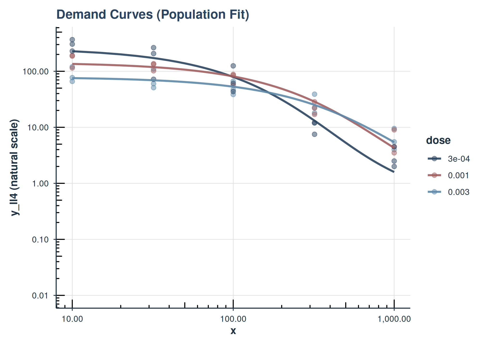

# Advanced Mixed-Effects Demand Modeling

## Introduction

This vignette covers advanced topics for mixed-effects nonlinear demand
modeling with `beezdemand`. It assumes you are already familiar with the
basics covered in
[`vignette("mixed-demand")`](https://brentkaplan.github.io/beezdemand/articles/mixed-demand.md),
including fitting models with
[`fit_demand_mixed()`](https://brentkaplan.github.io/beezdemand/reference/fit_demand_mixed.md),
inspecting results with
[`tidy()`](https://generics.r-lib.org/reference/tidy.html) /
[`glance()`](https://generics.r-lib.org/reference/glance.html) /
[`augment()`](https://generics.r-lib.org/reference/augment.html), and
basic plotting.

Topics covered here include:

- **Multi-factor models** (additive and interaction)
- **Collapsing factor levels** (asymmetric specifications for Q0 and
  alpha)
- **Estimated marginal means** and **pairwise comparisons**
- **Multi-factor visualization** with faceting
- **Complex random effects structures**
- **Continuous covariates** and `fixed_rhs`
- **Trends** with `emtrends`
- **Model comparison and overlay** with
  [`compare_models()`](https://brentkaplan.github.io/beezdemand/reference/compare_models.md),
  [`anova()`](https://rdrr.io/r/stats/anova.html), and
  [`plot_demand_overlay()`](https://brentkaplan.github.io/beezdemand/reference/plot_demand_overlay.md)

``` r

quick_nlme_control <- nlme::nlmeControl(
  msMaxIter = 100,
  niterEM = 20,
  maxIter = 100, # Low iterations for speed
  pnlsTol = 0.1,
  tolerance = 1e-4, # Looser tolerance
  opt = "nlminb",
  msVerbose = FALSE
)

# Prepare data subsets used throughout
ko_alf <- ko[ko$drug == "Alfentanil", ]

# Fit the no-factor (intercept-only) model for comparison
fit_no_factors_alf <- fit_demand_mixed(
  data = ko_alf,
  y_var = "y_ll4",
  x_var = "x",
  id_var = "monkey",
  equation_form = "zben",
  nlme_control = quick_nlme_control,
  start_value_method = "heuristic"
)

# Fit the one-factor model used as a baseline/fallback in later sections
fit_one_factor_dose <- fit_demand_mixed(
  data = ko_alf,
  y_var = "y_ll4",
  x_var = "x",
  id_var = "monkey",
  factors = "dose",
  equation_form = "zben",
  nlme_control = quick_nlme_control,
  start_value_method = "heuristic"
)
```

### Model with Two Factors (Additive)

Here, Q\_{0} and \alpha vary by drug and dose additively. For this, we
need more data than just ko_alf, so we use `ko`. Note: With complex
models and small sample sizes, convergence can be challenging. The
start_value_method = “pooled_nls” is often more robust for complex
models.

*This example is computationally intensive and is not run during
standard vignette building. To run it, set
`BEEZDEMAND_VIGNETTE_MODE=full` as an environment variable before
building. When successful, the output shows fixed-effect estimates for
each drug and dose combination on Q0 and alpha, plus random-effects
variance components.*

#### Model with Two Factors and Interaction

This allows the effect of dose to be different for each drug (and
vice-versa).

*This example is computationally intensive and is not run during
standard vignette building. The interaction model allows the effect of
dose to differ by drug (and vice versa), producing drug:dose interaction
terms in the fixed-effects table.*

#### Using Different equation_form and y_var

The simplified equation form expects y_var to be raw consumption.

*This example uses `equation_form = "simplified"` with raw consumption
values (no LL4 transformation needed). The simplified equation handles
zeros natively. When this example runs, the output resembles the `zben`
model output but with `y` as the dependent variable.*

### Collapsing Factor Levels

Sometimes you might want to group levels of a factor, and you may want
different groupings for Q\_{0} versus \alpha. The `collapse_levels`
argument allows you to specify separate collapsing schemes for each
parameter.

**Structure:**

``` r

collapse_levels = list(
  Q0 = list(factor_name = list(new_level = c("old_level1", "old_level2"), ...)),
  alpha = list(factor_name = list(new_level = c("old_level1", ...), ...))
)
```

Either `Q0` or `alpha` (or both) can be omitted to keep original levels
for that parameter.

#### Example: Same collapsing for both parameters

``` r

# Ensure levels to collapse are present in ko_alf$dose
# levels(ko_alf$dose) are "0.001", "0.003", "3e-04"
fit_collapsed_same <- try(
  fit_demand_mixed(
    data = ko_alf,
    y_var = "y_ll4",
    x_var = "x",
    id_var = "monkey",
    factors = "dose",
    collapse_levels = list(
      Q0 = list(
        dose = list(low_doses = c("3e-04", "0.001"), high_dose = "0.003")
      ),
      alpha = list(
        dose = list(low_doses = c("3e-04", "0.001"), high_dose = "0.003")
      )
    ),
    equation_form = "zben",
    nlme_control = quick_nlme_control
  ),
  silent = TRUE
)

if (
  !is.null(fit_collapsed_same) &&
    !inherits(fit_collapsed_same, "try-error") &&
    !is.null(fit_collapsed_same$model)
) {
  print(fit_collapsed_same)
  cat("\nQ0 params:", fit_collapsed_same$param_info$num_params_Q0, "\n")
  cat("alpha params:", fit_collapsed_same$param_info$num_params_alpha, "\n")
} else {
  cat("Collapsed levels model failed to converge.\n")
}
#> Demand NLME Model Fit ('beezdemand_nlme' object)
#> ---------------------------------------------------
#> 
#> Call:
#> fit_demand_mixed(data = ko_alf, y_var = "y_ll4", x_var = "x", 
#>     id_var = "monkey", factors = "dose", equation_form = "zben", 
#>     collapse_levels = list(Q0 = list(dose = list(low_doses = c("3e-04", 
#>         "0.001"), high_dose = "0.003")), alpha = list(dose = list(low_doses = c("3e-04", 
#>         "0.001"), high_dose = "0.003"))), nlme_control = quick_nlme_control)
#> 
#> Equation Form Selected:  zben 
#> NLME Model Formula:
#> y_ll4 ~ Q0 * exp(-(10^alpha/Q0) * (10^Q0) * x)
#> <environment: 0x556dd2093160>
#> Fixed Effects Structure (Q0):     ~ dose_Q0 
#> Fixed Effects Structure (alpha):  ~ dose_alpha 
#> Factors:  dose 
#> Interaction Term Included:  FALSE 
#> ID Variable for Random Effects:  monkey 
#> 
#> Start Values Used (Fixed Effects Intercepts):
#>   Q0 Intercept (log10 scale):  2.271 
#>   alpha Intercept (log10 scale):  -3 
#> 
#> --- NLME Model Fit Summary (from nlme object) ---
#> Nonlinear mixed-effects model fit by maximum likelihood
#>   Model: nlme_model_formula_obj 
#>   Data: data 
#>   Log-likelihood: 10.80738
#>   Fixed: list(Q0 ~ dose_Q0, alpha ~ dose_alpha) 
#>            Q0.(Intercept)       Q0.dose_Q0low_doses         alpha.(Intercept) 
#>                1.89628442                0.37072017               -4.64112061 
#> alpha.dose_alphalow_doses 
#>               -0.04341491 
#> 
#> Random effects:
#>  Formula: list(Q0 ~ 1, alpha ~ 1)
#>  Level: monkey
#>  Structure: Diagonal
#>         Q0.(Intercept) alpha.(Intercept)  Residual
#> StdDev:   4.401177e-06      2.693877e-06 0.1903097
#> 
#> Number of Observations: 45
#> Number of Groups: 3 
#> 
#> --- Additional Fit Statistics ---
#> Log-likelihood:  10.81 
#> AIC:  -7.615 
#> BIC:  5.032 
#> ---------------------------------------------------
#> 
#> Q0 params: 2 
#> alpha params: 2
```

#### Example: Different collapsing for Q0 and alpha

This is particularly useful when you want fine-grained distinctions for
one parameter but not the other. For instance, you might hypothesize
that maximum consumption (Q\_{0}) varies by dose, but sensitivity
(\alpha) does not.

``` r

# Q0: keep 2 collapsed levels (low vs high)
# alpha: collapse all to 1 level (intercept only)
fit_collapsed_asymmetric <- try(
  fit_demand_mixed(
    data = ko_alf,
    y_var = "y_ll4",
    x_var = "x",
    id_var = "monkey",
    factors = "dose",
    collapse_levels = list(
      Q0 = list(
        dose = list(low_doses = c("3e-04", "0.001"), high_dose = "0.003")
      ),
      alpha = list(dose = list(all_doses = c("3e-04", "0.001", "0.003")))
    ),
    equation_form = "zben",
    nlme_control = quick_nlme_control
  ),
  silent = TRUE
)

if (
  !is.null(fit_collapsed_asymmetric) &&
    !inherits(fit_collapsed_asymmetric, "try-error") &&
    !is.null(fit_collapsed_asymmetric$model)
) {
  print(fit_collapsed_asymmetric)
  cat("\nQ0 params:", fit_collapsed_asymmetric$param_info$num_params_Q0, "\n")
  cat(
    "alpha params:",
    fit_collapsed_asymmetric$param_info$num_params_alpha,
    "\n"
  )
  cat(
    "\nQ0 formula:",
    fit_collapsed_asymmetric$formula_details$fixed_effects_formula_str_Q0,
    "\n"
  )
  cat(
    "alpha formula:",
    fit_collapsed_asymmetric$formula_details$fixed_effects_formula_str_alpha,
    "\n"
  )
} else {
  cat("Asymmetric collapsed levels model failed to converge.\n")
}
#> Demand NLME Model Fit ('beezdemand_nlme' object)
#> ---------------------------------------------------
#> 
#> Call:
#> fit_demand_mixed(data = ko_alf, y_var = "y_ll4", x_var = "x", 
#>     id_var = "monkey", factors = "dose", equation_form = "zben", 
#>     collapse_levels = list(Q0 = list(dose = list(low_doses = c("3e-04", 
#>         "0.001"), high_dose = "0.003")), alpha = list(dose = list(all_doses = c("3e-04", 
#>         "0.001", "0.003")))), nlme_control = quick_nlme_control)
#> 
#> Equation Form Selected:  zben 
#> NLME Model Formula:
#> y_ll4 ~ Q0 * exp(-(10^alpha/Q0) * (10^Q0) * x)
#> <environment: 0x556dd720b230>
#> Fixed Effects Structure (Q0):     ~ dose_Q0 
#> Fixed Effects Structure (alpha):  ~ 1 
#> Factors:  dose 
#> Interaction Term Included:  FALSE 
#> ID Variable for Random Effects:  monkey 
#> 
#> Start Values Used (Fixed Effects Intercepts):
#>   Could not determine Q0/alpha intercepts from start_values_used structure.
#>   Full start_values_used vector:
#> [1]  2.271  0.000 -3.000
#> 
#> --- NLME Model Fit Summary (from nlme object) ---
#> Nonlinear mixed-effects model fit by maximum likelihood
#>   Model: nlme_model_formula_obj 
#>   Data: data 
#>   Log-likelihood: 10.73793
#>   Fixed: list(Q0 ~ dose_Q0, alpha ~ 1) 
#>      Q0.(Intercept) Q0.dose_Q0low_doses               alpha 
#>           1.9041039           0.3572637          -4.6750675 
#> 
#> Random effects:
#>  Formula: list(Q0 ~ 1, alpha ~ 1)
#>  Level: monkey
#>  Structure: Diagonal
#>         Q0.(Intercept)        alpha  Residual
#> StdDev:   4.409119e-06 2.697381e-06 0.1906036
#> 
#> Number of Observations: 45
#> Number of Groups: 3 
#> 
#> --- Additional Fit Statistics ---
#> Log-likelihood:  10.74 
#> AIC:  -9.476 
#> BIC:  1.364 
#> ---------------------------------------------------
#> 
#> Q0 params: 2 
#> alpha params: 1 
#> 
#> Q0 formula: ~ dose_Q0 
#> alpha formula: ~ 1
```

**Note:** When all levels of a factor are collapsed to a single level
for a parameter, that factor is automatically removed from the formula
for that parameter (it contributes only to the intercept). A message
will inform you when this occurs.

#### EMMs and Comparisons with Collapsed Factors

When using `collapse_levels`, the
[`get_demand_param_emms()`](https://brentkaplan.github.io/beezdemand/reference/get_demand_param_emms.md)
and
[`get_demand_comparisons()`](https://brentkaplan.github.io/beezdemand/reference/get_demand_comparisons.md)
functions automatically handle the asymmetric factor structures. EMMs
will be computed using the collapsed levels, and comparisons will only
be performed when there are multiple levels to compare.

**Differential Collapsing Output:** When Q0 and alpha have different
numbers of factor levels (e.g., Q0 keeps original `dose` levels while
alpha collapses to fewer groups), the EMM output will include separate
factor columns:

- Original factor column (e.g., `dose`) for the uncollapsed parameter
  (Q0)
- Suffixed column (e.g., `dose_alpha`) for the collapsed parameter
  (alpha)

This results in a cross-joined table showing all combinations of Q0
levels and alpha levels. For example, if dose has 5 original levels and
alpha collapses to 2 groups, the EMM table will have 10 rows (5 × 2).

``` r

# Using the asymmetric collapsed model from above (if it converged)
if (
  !is.null(fit_collapsed_asymmetric) &&
    !inherits(fit_collapsed_asymmetric, "try-error") &&
    !is.null(fit_collapsed_asymmetric$model)
) {
  cat("--- EMMs with collapsed factors ---\n")
  # EMMs will show collapsed Q0 levels but single alpha value
  collapsed_emms <- get_demand_param_emms(
    fit_obj = fit_collapsed_asymmetric,
    factors_in_emm = "dose", # Use original factor name
    include_ev = TRUE
  )
  print(collapsed_emms)

  cat("\n--- Comparisons with collapsed factors ---\n")
  # Q0 will have comparisons (2 levels), alpha will have none (1 level)
  collapsed_comparisons <- get_demand_comparisons(
    fit_obj = fit_collapsed_asymmetric,
    compare_specs = ~dose, # Use original factor name
    param = c("Q0", "alpha")
  )

  cat("\nQ0 contrasts (collapsed levels):\n")
  print(collapsed_comparisons$Q0$contrasts_log10)

  cat("\nalpha contrasts (intercept-only, no comparisons):\n")
  print(collapsed_comparisons$alpha$contrasts_log10)
} else {
  cat("Asymmetric collapsed model not available for EMM demonstration.\n")
}
#> --- EMMs with collapsed factors ---
#> # A tibble: 2 × 16
#>   dose      Q0_param_log10 LCL_Q0_param_log10 UCL_Q0_param_log10 Q0_natural
#>   <fct>              <dbl>              <dbl>              <dbl>      <dbl>
#> 1 high_dose           1.90               1.77               2.04       80.2
#> 2 low_doses           2.26               2.16               2.36      183. 
#> # ℹ 11 more variables: LCL_Q0_natural <dbl>, UCL_Q0_natural <dbl>,
#> #   alpha_param_log10 <dbl>, LCL_alpha_param_log10 <dbl>,
#> #   UCL_alpha_param_log10 <dbl>, alpha_natural <dbl>, LCL_alpha_natural <dbl>,
#> #   UCL_alpha_natural <dbl>, EV <dbl>, LCL_EV <dbl>, UCL_EV <dbl>
#> 
#> --- Comparisons with collapsed factors ---
#> 
#> Q0 contrasts (collapsed levels):
#> # A tibble: 1 × 8
#>   contrast_definition   estimate     SE    df lower.CL upper.CL t.ratio  p.value
#>   <chr>                    <dbl>  <dbl> <dbl>    <dbl>    <dbl>   <dbl>    <dbl>
#> 1 high_dose - low_doses   -0.357 0.0803    40   -0.520   -0.195   -4.45  6.73e-5
#> 
#> alpha contrasts (intercept-only, no comparisons):
#> # A tibble: 0 × 0
```

### Visualizing Multi-Factor Models

#### Plotting a Two-Factor Model with Faceting

Let’s use fit_two_factors_add (if it converged: y_ll4 ~ drug + dose). We
can facet by one factor and color by another.

``` r

# Assuming fit_two_factors_add was successfully created earlier
# If it failed, this chunk won't produce a plot.
active_two_factor_fit <- if (
  !is.null(fit_two_factors_add) && !is.null(fit_two_factors_add$model)
) {
  fit_two_factors_add
} else {
  # Fallback to a simpler model if the two-factor one failed in the vignette
  if (!is.null(fit_one_factor_dose$model)) fit_one_factor_dose else NULL
}

if (
  !is.null(active_two_factor_fit$model) &&
    !is.null(active_two_factor_fit$param_info$factors) &&
    length(active_two_factor_fit$param_info$factors) >= 1
) {
  # Determine factors for aesthetics based on what's in active_two_factor_fit
  color_factor <- if ("dose" %in% active_two_factor_fit$param_info$factors) {
    "dose"
  } else {
    NULL
  }
  facet_factor_name <- if (
    "drug" %in% active_two_factor_fit$param_info$factors
  ) {
    "drug"
  } else {
    # If only 'dose' is available from fit_one_factor_dose, we can't facet by 'drug'
    # So, maybe facet by dose instead, or don't facet.
    if (
      "dose" %in%
        active_two_factor_fit$param_info$factors &&
        is.null(color_factor)
    ) {
      color_factor <- "dose" # color by dose if not faceting by it
      NULL # No faceting
    } else {
      NULL
    }
  }

  facet_formula_plot <- if (!is.null(facet_factor_name)) {
    stats::as.formula(paste("~", facet_factor_name))
  } else {
    NULL
  }

  plot(
    active_two_factor_fit,
    inv_fun = ll4_inv,
    color_by = color_factor,
    # linetype_by = if("dose" %in% active_two_factor_fit$param_info$factors) "dose" else NULL, # Example
    facet_formula = facet_formula_plot,
    title = "Demand Curves (Population Fit)",
    observed_point_alpha = 0.5,
    ind_line_alpha = .5
  )
} else {
  cat(
    "A suitable two-factor or one-factor model object not available for this plotting example.\n"
  )
}
```



This example attempts to use fit_two_factors_add. If that model didn’t
converge (common with minimal iterations for vignette speed), it falls
back to fit_one_factor_dose and adjusts aesthetics. The plot will show
population lines, colored by one factor and faceted by another (if two
factors are available).

#### Plotting a Model Fit with equation_form = “simplified”

If you fit a model using equation_form = “simplified” (which models raw
y), the inv_fun is typically identity because predictions are already on
the natural scale.

``` r

# Assuming fit_simplified_example converged earlier
if (
  !is.null(fit_simplified_example) && !is.null(fit_simplified_example$model)
) {
  plot(
    fit_simplified_example,
    inv_fun = identity, # Predictions are already on raw y scale
    color_by = "dose",
    shape_by = "dose",
    title = "Demand Model ('simplified' equation, Raw Y)"
  )
} else {
  cat("fit_simplified_example model object not available for plotting.\n")
}
#> fit_simplified_example model object not available for plotting.
```

Users can further customize the returned ggplot object by adding more
layers or theme adjustments. For instance, to add custom axis limits or
breaks:

``` r

plot_object +
    ggplot2::scale_x_continuous(
        limits = c(0, 1000),
        breaks = c(0, 100, 500, 1000)
    )
```

### Analyzing Estimated Marginal Means (`get_demand_param_emms`)

This function helps interpret how factors affect Q\_{0} and \alpha,
providing estimates on both log10 and natural scales, and optionally
Essential Value (EV).

**Note on `collapse_levels`:** When a model is fit using
`collapse_levels` with asymmetric specifications (different collapsing
for Q0 and alpha), the EMM functions automatically use the appropriate
collapsed factor names for each parameter. You still specify the
original factor name in `factors_in_emm`, and the output will show the
collapsed levels. If a parameter has only one level (intercept-only),
that parameter’s values will be the same across all rows.

``` r

# We'll use a model with factors.
# If fit_two_factors_add converged, use it. Otherwise, use fit_one_factor_dose.
# For the vignette, let's ensure we use one that is likely available.
# If fit_two_factors_add is NULL (failed to converge in example), this will use fit_one_factor_dose
emm_model_to_use <- if (
  !is.null(fit_two_factors_add) && !is.null(fit_two_factors_add$model)
) {
  fit_two_factors_add
} else if (!is.null(fit_one_factor_dose$model)) {
  fit_one_factor_dose
} else {
  NULL
}

if (!is.null(emm_model_to_use)) {
  cat(
    "--- EMMs for model with factors:",
    paste(emm_model_to_use$param_info$factors, collapse = ", "),
    "---\n"
  )

  factors_for_emms <- emm_model_to_use$param_info$factors

  demand_emms_output <- get_demand_param_emms(
    fit_obj = emm_model_to_use,
    factors_in_emm = factors_for_emms, # Use factors from the model
    include_ev = TRUE
  )
  print(demand_emms_output)

  cat("\n--- EMMs for observed factor combinations only: ---\n")
  # This is useful if the EMM grid includes combinations not in data
  observed_demand_emms <- get_observed_demand_param_emms(
    fit_obj = emm_model_to_use,
    factors_in_emm = factors_for_emms,
    include_ev = TRUE
  )
  print(observed_demand_emms)
} else {
  cat(
    "No suitable model with factors converged for EMM analysis in the vignette.\n"
  )
}
#> --- EMMs for model with factors: dose ---
#> # A tibble: 3 × 16
#>   dose  Q0_param_log10 LCL_Q0_param_log10 UCL_Q0_param_log10 Q0_natural
#>   <fct>          <dbl>              <dbl>              <dbl>      <dbl>
#> 1 3e-04           2.42               2.27               2.56      260. 
#> 2 0.001           2.16               2.03               2.28      144. 
#> 3 0.003           1.90               1.78               2.02       78.8
#> # ℹ 11 more variables: LCL_Q0_natural <dbl>, UCL_Q0_natural <dbl>,
#> #   alpha_param_log10 <dbl>, LCL_alpha_param_log10 <dbl>,
#> #   UCL_alpha_param_log10 <dbl>, alpha_natural <dbl>, LCL_alpha_natural <dbl>,
#> #   UCL_alpha_natural <dbl>, EV <dbl>, LCL_EV <dbl>, UCL_EV <dbl>
#> 
#> --- EMMs for observed factor combinations only: ---
#> # A tibble: 3 × 16
#>   dose  Q0_param_log10 LCL_Q0_param_log10 UCL_Q0_param_log10 Q0_natural
#>   <fct>          <dbl>              <dbl>              <dbl>      <dbl>
#> 1 3e-04           2.42               2.27               2.56      260. 
#> 2 0.001           2.16               2.03               2.28      144. 
#> 3 0.003           1.90               1.78               2.02       78.8
#> # ℹ 11 more variables: LCL_Q0_natural <dbl>, UCL_Q0_natural <dbl>,
#> #   alpha_param_log10 <dbl>, LCL_alpha_param_log10 <dbl>,
#> #   UCL_alpha_param_log10 <dbl>, alpha_natural <dbl>, LCL_alpha_natural <dbl>,
#> #   UCL_alpha_natural <dbl>, EV <dbl>, LCL_EV <dbl>, UCL_EV <dbl>
```

### Performing Pairwise Comparisons (`get_demand_comparisons`)

Compare levels of factors for Q\_{0} and \alpha.

**Note on `collapse_levels`:** When using models fit with asymmetric
`collapse_levels`, comparisons are only performed for parameters that
have multiple levels. If a parameter was collapsed to a single level
(intercept-only), the comparisons for that parameter will be empty.

``` r

# Using the same emm_model_to_use
if (
  !is.null(emm_model_to_use) && length(emm_model_to_use$param_info$factors) > 0
) {
  factors_present <- emm_model_to_use$param_info$factors

  if ("dose" %in% factors_present) {
    cat(
      "--- Pairwise comparisons for 'dose' (averaging over other factors if any): ---\n"
    )
    comparisons_dose <- get_demand_comparisons(
      fit_obj = emm_model_to_use,
      compare_specs = ~dose,
      contrast_type = "pairwise",
      adjust = "fdr",
      report_ratios = TRUE
    )
    print(comparisons_dose)
  }

  if (all(c("drug", "dose") %in% factors_present)) {
    cat(
      "\n--- Pairwise comparisons for 'drug' within each level of 'dose': ---\n"
    )
    # EMMs calculated over drug*dose, then contrast drug within each dose
    comparisons_drug_by_dose <- get_demand_comparisons(
      fit_obj = emm_model_to_use,
      compare_specs = ~ drug * dose,
      contrast_type = "pairwise",
      contrast_by = "dose", # Compare 'drug' levels, holding 'dose' constant
      adjust = "fdr",
      report_ratios = TRUE
    )
    print(comparisons_drug_by_dose)
  }
} else {
  cat(
    "No suitable model with factors converged for comparisons in the vignette.\n"
  )
}
#> --- Pairwise comparisons for 'dose' (averaging over other factors if any): ---
#> Demand Parameter Comparisons (nlme backend)
#> EMMs computed over: ~dose 
#> Contrast type: pairwise
#> P-value adjustment method: fdr 
#> ================================================== 
#> 
#> Q0 (log10-scale contrasts):
#>                 contrast estimate std.error conf.low conf.high p.value
#>  (dose3e-04) - dose0.001    0.258     0.093    0.026     0.490   0.008
#>  (dose3e-04) - dose0.003    0.519     0.091    0.290     0.748   0.000
#>    dose0.001 - dose0.003    0.261     0.085    0.048     0.475   0.006
#> 
#> alpha (log10-scale contrasts):
#>                 contrast estimate std.error conf.low conf.high p.value
#>  (dose3e-04) - dose0.001    0.084     0.068   -0.087     0.255   0.337
#>  (dose3e-04) - dose0.003   -0.010     0.071   -0.187     0.168   0.891
#>    dose0.001 - dose0.003   -0.094     0.070   -0.269     0.082   0.337
```

### Advanced Topics

**Note**: This section covers advanced modeling techniques for
experienced users. These advanced topics require deeper understanding of
mixed-effects models and may be computationally intensive.

**Performance Note**: The code examples in the sections below are
computationally intensive and are not evaluated during standard vignette
building. The code is shown for reference. To run these examples, set
the environment variable `BEEZDEMAND_VIGNETTE_MODE=full` before building
vignettes.

#### More Complex Random Effects Structures

This example shows how to specify a more complex random-effects
structure (e.g., random slopes) for Q\_{0} and \alpha.

Now let’s demonstrate how to extract individual-level predicted
coefficients using the
[`get_individual_coefficients()`](https://brentkaplan.github.io/beezdemand/reference/get_individual_coefficients.md)
function. This combines fixed and random effects to calculate
individual-level parameter estimates for each subject.

#### Continuous Covariates and `fixed_rhs`

In addition to factor predictors, you can include continuous covariates
in the fixed-effects linear models for `Q0` and `alpha`.

There are two convenient ways to do this:

1.  Add continuous covariates additively using the
    `continuous_covariates` argument (no formula writing required).
2.  Specify a full right-hand-side using `fixed_rhs` (formula), which
    gives you complete control, including interactions (e.g.,
    factor-by-continuous).

Below we demonstrate both, using a made-up continuous covariate `age`
assigned per subject (`monkey`).

##### A) Additive continuous covariate via `continuous_covariates`

Here we keep a single factor (`dose`) and add `age` as an additive
continuous covariate. The RHS becomes `~ 1 + dose + age` for both
parameters.

##### B) fixed_rhs with a factor (drug) and a continuous covariate (dose)

Here we specify `drug` as a factor but treat `dose` as a continuous
covariate (`dose_num`, a numeric version of `dose`), and include `age`
as an additional continuous covariate. This uses a shared RHS for `Q0`
and `alpha`: `~ 1 + drug + dose_num + age`.

#### Trends with `emtrends`

We can examine how the parameters change with continuous covariates
using
[`get_demand_param_trends()`](https://brentkaplan.github.io/beezdemand/reference/get_demand_param_trends.md),
which wraps
[`emmeans::emtrends()`](https://rvlenth.github.io/emmeans/reference/emtrends.html)
and returns tidy results for Q0 and alpha trends on the log10 scale.

Below we compute trends with respect to `age` and `dose_num`, first
overall and then by `drug` (if the model includes `drug` as a factor).

### Model Comparison and Overlay

#### Comparing Nested Models

Use [`anova()`](https://rdrr.io/r/stats/anova.html) to formally compare
nested NLME models via likelihood ratio test. For example, compare a
one-factor model against a no-factor (intercept-only) baseline:

``` r

# Compare one-factor dose model vs intercept-only
anova(fit_no_factors_alf, fit_one_factor_dose)
#>                                                                                                                                                                                                                                                                                                                                                                                                                                                                                                                                                                                                                                                                                                                                                                                                                                                                                                                                                                                                                                                                                                                                                                                                                                                                                                                                                                                                                                                                                                                                                                                                                                                                                                                                                                                                                                                                                                                                                                                                                                                                                                                                                                                                                                                                                                                                                                                                                                                                                                                                                                                                                                                                                                                                                                                                                                                                                                                                                                                                                                                                                                                                                                                                                                                                                                                                                                                                                                                                                                                                                                                                                                                                                                                                                                                                                                                                                                                                                                                                                                                                                                                                                                                                                                                                                                                                                                                                                                                                                                                                                                                                                                                                                                                                                                                                                                                                                                                                                                                                                                                                                                                                                                                                                                                                                                                                                                                                                                                                                                                                                                                                                                                                                                                                                                                                                                                                                                                                                                                                                                                                                                                                                                                                                                                                                                                                                                                                                                                                                                                                                                                                                                                                                                                                                                                                                                                                                                                                                                                                                                                                                                                                                                                                                                                                                                                                                                                                                                                                                                                                                                                                                                                                                                                                                                                                                                                                                                                                                                                                                                                                                                                                                                                                                                                                                                                                                                                                                                                                                                                                                                                                                                                                                                                                                                                                                                                                                                                                                                                                                                                                                                                                                                                                                                                                                                                                                                                                                                                                                                                                                                                                                                                                                                                                                                                                                                                                                                                                                                                                                                                                                                                                                                                                                                                                                                                                                                                                                                                                                                                                                                                                                                                                                                                                                                                                                                                                                                                                                                                                                                                                                                                                                                                                                                                                                                                                                                                                                                                                                                                                                                                                                                                                                                                                                                                                                          Model
#> structure(list(modelStruct = structure(list(reStruct = structure(list(monkey = structure(c(-10.6742009396964, -11.1664060891139), formula = structure(list(Q0 ~ 1, alpha ~ 1), class = "listForm"), Dimnames = list(c("Q0", "alpha"), c("Q0", "alpha")), class = c("pdDiag", "pdMat"))), settings = c(0L, 1L, 0L, 1L), class = "reStruct", plen = c(monkey = 2L))), class = c("lmeStructInt", "nlmeStruct", "lmeStruct", "modelStruct"), pmap = structure(c(TRUE, TRUE), dim = 2:1, dimnames = list(NULL, "reStruct")), fixedSigma = FALSE),     dims = list(N = 45L, Q = 1L, qvec = c(monkey = 2, 0, 0), ngrps = c(monkey = 3L, X = 1L, y = 1L), ncol = c(monkey = 2, 2, 1)), contrasts = list(), coefficients = list(fixed = c(Q0 = 2.13111288451249, alpha = -4.66522247407214), random = list(monkey = structure(c(3.25552819984982e-11, 1.8241566470199e-10, -2.14970946700134e-10, -3.64514481514856e-10, 5.32485573347258e-11, 3.1126592418032e-10), dim = 3:2, dimnames = list(c("A", "B", "C"), c("Q0", "alpha"))))), varFix = structure(c(0.002518767581279,     -0.000993766413664752, -0.000993766413664752, 0.00149109228167247), dim = c(2L, 2L), dimnames = list(c("Q0", "alpha"), c("Q0", "alpha"))), sigma = 0.227557261543747, apVar = "Non-positive definite approximate variance-covariance", logLik = 2.76366778620325, numIter = 2, groups = structure(list(monkey = structure(c(1L, 1L, 1L, 1L, 1L, 2L, 2L, 2L, 2L, 2L, 3L, 3L, 3L, 3L, 3L, 1L, 1L, 1L, 1L, 1L, 2L, 2L, 2L, 2L, 2L, 3L, 3L, 3L, 3L, 3L, 1L, 1L, 1L, 1L, 1L, 2L, 2L, 2L, 2L, 2L, 3L, 3L, 3L, 3L, 3L), levels = c("A",     "B", "C"), class = "factor")), row.names = c("1", "2", "3", "4", "5", "6", "7", "8", "9", "10", "11", "12", "13", "14", "15", "16", "17", "18", "19", "20", "21", "22", "23", "24", "25", "26", "27", "28", "29", "30", "31", "32", "33", "34", "35", "36", "37", "38", "39", "40", "41", "42", "43", "44", "45"), class = "data.frame"), call = nlme.formula(model = nlme_model_formula_obj, data = data, fixed = list(Q0 ~ 1, alpha ~ 1), random = structure(numeric(0), class = c("pdDiag", "pdMat"), formula = structure(list(        Q0 ~ 1, alpha ~ 1), class = "listForm"), Dimnames = list(NULL, NULL)), groups = groups_formula, start = start_values, method = method, control = control_obj), method = "ML", fitted = structure(c(2.10207833870312, 2.03958716224111, 1.85793654166641, 1.37392999243176, 0.540568421087688, 2.10207833870312, 2.03958716224111, 1.85793654166641, 1.37392999243176, 0.540568421087688, 2.10207833870312, 2.03958716224111, 1.85793654166641, 1.37392999243176, 0.540568421087688, 2.10207833870312, 2.03958716224111,     1.85793654166641, 1.37392999243176, 0.540568421087688, 2.10207833870312, 2.03958716224111, 1.85793654166641, 1.37392999243176, 0.540568421087688, 2.10207833870312, 2.03958716224111, 1.85793654166641, 1.37392999243176, 0.540568421087688, 2.10207833870312, 2.03958716224111, 1.85793654166641, 1.37392999243176, 0.540568421087688, 2.10207833870312, 2.03958716224111, 1.85793654166641, 1.37392999243176, 0.540568421087688, 2.10207833870312, 2.03958716224111, 1.85793654166641, 1.37392999243176, 0.540568421087688,     2.10207833875771, 2.03958716234207, 1.8579365418935, 1.37392999292296, 0.54056842167408, 2.10207833886987, 2.03958716237478, 1.85793654170896, 1.37392999227372, 0.540568420795044, 2.10207833848177, 2.03958716200649, 1.85793654139678, 1.37392999209861, 0.540568420793939, 2.10207833875771, 2.03958716234207, 1.8579365418935, 1.37392999292296, 0.54056842167408, 2.10207833886987, 2.03958716237478, 1.85793654170896, 1.37392999227372, 0.540568420795044, 2.10207833848177, 2.03958716200649, 1.85793654139678,     1.37392999209861, 0.540568420793939, 2.10207833875771, 2.03958716234207, 1.8579365418935, 1.37392999292296, 0.54056842167408, 2.10207833886987, 2.03958716237478, 1.85793654170896, 1.37392999227372, 0.540568420795044, 2.10207833848177, 2.03958716200649, 1.85793654139678, 1.37392999209861, 0.540568420793939), dim = c(45L, 2L), dimnames = list(c("1", "2", "3", "4", "5", "6", "7", "8", "9", "10", "11", "12", "13", "14", "15", "16", "17", "18", "19", "20", "21", "22", "23", "24", "25", "26", "27",     "28", "29", "30", "31", "32", "33", "34", "35", "36", "37", "38", "39", "40", "41", "42", "43", "44", "45"), c("fixed", "monkey"))), residuals = structure(c(-0.0210912912772656, 0.00180552365868403, -0.0351148908114562, 0.217134661526384, 0.437168513375249, -0.215587610442036, -0.261435903479876, -0.185838661480549, -0.0217470506838719, 0.199912855211137, -0.282534397439238, -0.332016970094339, -0.27247576274035, -0.118656453062497, 0.0619148597451359, 0.181222890080329, 0.0842644790729628, 0.0865461322942374,     -0.0315068481277727, 0.413690635424819, 0.168600497531335, 0.0955454894484089, 0.0689201694128787, 0.080915032144429, 0.00422074585024368, -0.0432728513955216, -0.0309869894761436, -0.105888083192535, -0.143479771105326, 0.112908543713145, 0.462587725554958, 0.382016764651069, 0.238973471786363, -0.29474351051403, 0.112908543713145, 0.382932875887922, 0.276383183274939, -0.0726066988140388, -0.29474351051403, -0.139883909371965, 0.258704351209302, -0.182254661769724, -0.219447254389118, -0.498834419835748,     -0.232956190743119, -0.0210912913318593, 0.00180552355772434, -0.0351148910385437, 0.217134661035184, 0.437168512788856, -0.215587610608787, -0.261435903613538, -0.185838661523096, -0.0217470505258279, 0.199912855503781, -0.282534397217893, -0.332016969859718, -0.272475762470714, -0.118656452729342, 0.0619148600388847, 0.181222890025735, 0.0842644789720031, 0.0865461320671499, -0.0315068486189722, 0.413690634838427, 0.168600497364584, 0.0955454893147469, 0.0689201693703307, 0.080915032302473,     0.00422074614288781, -0.0432728511741769, -0.030986989241522, -0.1058880829229, -0.14347977077217, 0.112908544006894, 0.462587725500365, 0.38201676455011, 0.238973471559276, -0.294743511005229, 0.112908543126752, 0.38293287572117, 0.276383183141277, -0.0726066988565868, -0.294743510355986, -0.13988390907932, 0.258704351430647, -0.182254661535103, -0.219447254119483, -0.498834419502592, -0.23295619044937), dim = c(45L, 2L), dimnames = list(c("1", "2", "3", "4", "5", "6", "7", "8", "9", "10", "11",     "12", "13", "14", "15", "16", "17", "18", "19", "20", "21", "22", "23", "24", "25", "26", "27", "28", "29", "30", "31", "32", "33", "34", "35", "36", "37", "38", "39", "40", "41", "42", "43", "44", "45"), c("fixed", "monkey")), std = c(0.227557261543747, 0.227557261543747, 0.227557261543747, 0.227557261543747, 0.227557261543747, 0.227557261543747, 0.227557261543747, 0.227557261543747, 0.227557261543747, 0.227557261543747, 0.227557261543747, 0.227557261543747, 0.227557261543747, 0.227557261543747,     0.227557261543747, 0.227557261543747, 0.227557261543747, 0.227557261543747, 0.227557261543747, 0.227557261543747, 0.227557261543747, 0.227557261543747, 0.227557261543747, 0.227557261543747, 0.227557261543747, 0.227557261543747, 0.227557261543747, 0.227557261543747, 0.227557261543747, 0.227557261543747, 0.227557261543747, 0.227557261543747, 0.227557261543747, 0.227557261543747, 0.227557261543747, 0.227557261543747, 0.227557261543747, 0.227557261543747, 0.227557261543747, 0.227557261543747, 0.227557261543747,     0.227557261543747, 0.227557261543747, 0.227557261543747, 0.227557261543747)), plist = list(Q0 = list(fixed = TRUE, random = list(monkey = TRUE)), alpha = list(fixed = TRUE, random = list(monkey = TRUE))), map = list(fmap = list(Q0 = 1, alpha = 2), rmap = list(monkey = list(Q0 = 1, alpha = 2)), rmapRel = list(monkey = list(Q0 = 1, alpha = 2)), bmap = c(0, monkey = 6)), fixDF = structure(list(X = c(Q0 = 41, alpha = 41), terms = c(Q0 = 41, alpha = 41)), assign = list(Q0 = 1, alpha = 2), varFixFact = structure(c(-0.0430865793342916,     -0.0257354670163336, 0, 0.0386146640756134), dim = c(2L, 2L))), formula = y_ll4 ~ Q0 * exp(-(10^alpha/Q0) * (10^Q0) * x)), class = c("nlme", "lme"))                                                                                                                                                                                                                                                                                                                                                                                                                                                                                                                                                                                                                                                                                                                                                                                                                                                                                                                                                                                                                                                                                                                                                                                                                                                                                                                                                                                                                                                                                                                                                                                                                                                                                                                                                                                                                                                                                                                                                                                                                                                                                                                                                                                                                                                                                                                                                                                                                                                                                                                                                                                                                                                                                                                                                                                                                                                                                                                                                                                                                                                                                                                                                                                                                                                                                                                                                                                                                                                                                                                                                                                                                                        1
#> structure(list(modelStruct = structure(list(reStruct = structure(list(monkey = structure(c(-10.6743584582821, -11.1653749433608), formula = structure(list(Q0 ~ 1, alpha ~ 1), class = "listForm"), Dimnames = list(c("Q0.(Intercept)", "alpha.(Intercept)"), c("Q0.(Intercept)", "alpha.(Intercept)")), class = c("pdDiag", "pdMat"))), settings = c(0L, 1L, 0L, 1L), class = "reStruct", plen = c(monkey = 2L))), class = c("lmeStructInt", "nlmeStruct", "lmeStruct", "modelStruct"), pmap = structure(c(TRUE, TRUE), dim = 2:1, dimnames = list(NULL, "reStruct")), fixedSigma = FALSE), dims = list(N = 45L, Q = 1L, qvec = c(monkey = 2, 0, 0), ngrps = c(monkey = 3L, X = 1L, y = 1L), ncol = c(monkey = 2, 6, 1)), contrasts = list(dose = structure(c(0, 1, 0, 0, 0, 1), dim = 3:2, dimnames = list(c("3e-04", "0.001", "0.003"), c("2", "3")))), coefficients = list(fixed = c("Q0.(Intercept)" = 2.41534969749575, Q0.dose0.001 = -0.257733998017947, Q0.dose0.003 = -0.519065273739336, "alpha.(Intercept)" = -4.65085466207242, alpha.dose0.001 = -0.0840812818899326, alpha.dose0.003 = 0.00973404785410541), random = list(monkey = structure(c(8.8302970682857e-11, 1.24626510987831e-10, -2.12929481670785e-10, -3.42485257121594e-10, 3.35230587439245e-11, 3.08962198377629e-10), dim = 3:2, dimnames = list(c("A", "B", "C"), c("Q0.(Intercept)", "alpha.(Intercept)"))))), varFix = structure(c(0.00483094656738683, -0.00483094656267421, -0.00483094656267421, -0.00226083064364111, 0.00226083064364111, 0.00226083064364111, -0.00483094656267421, 0.00856034352770773, 0.00483094656267421, 0.00226083064364111, -0.00372868756603682, -0.00226083064364111, -0.00483094656267421, 0.00483094656267421, 0.00833279601034647, 0.00226083064364111, -0.00226083064364111, -0.00320415501607924, -0.00226083064364111, 0.00226083064364111, 0.00226083064364111, 0.00237901775893379, -0.00237901775716869, -0.00237901775716869, 0.00226083064364111, -0.00372868756603682, -0.00226083064364111, -0.00237901775716869, 0.0046319533067913, 0.00237901775716869, 0.00226083064364111, -0.00226083064364111, -0.00320415501607924, -0.00237901775716869, 0.00237901775716869, 0.0050193565658835), dim = c(6L, 6L), dimnames = list(c("Q0.(Intercept)", "Q0.dose0.001", "Q0.dose0.003", "alpha.(Intercept)", "alpha.dose0.001", "alpha.dose0.003"), c("Q0.(Intercept)", "Q0.dose0.001", "Q0.dose0.003", "alpha.(Intercept)", "alpha.dose0.001", "alpha.dose0.003"))), sigma = 0.162557410572928, apVar = "Non-positive definite approximate variance-covariance", logLik = 17.9003479634721, numIter = 2, groups = structure(list(    monkey = structure(c(1L, 1L, 1L, 1L, 1L, 2L, 2L, 2L, 2L, 2L, 3L, 3L, 3L, 3L, 3L, 1L, 1L, 1L, 1L, 1L, 2L, 2L, 2L, 2L, 2L, 3L, 3L, 3L, 3L, 3L, 1L, 1L, 1L, 1L, 1L, 2L, 2L, 2L, 2L, 2L, 3L, 3L, 3L, 3L, 3L), levels = c("A", "B", "C"), class = "factor")), row.names = c("1", "2", "3", "4", "5", "6", "7", "8", "9", "10", "11", "12", "13", "14", "15", "16", "17", "18", "19", "20", "21", "22", "23", "24", "25", "26", "27", "28", "29", "30", "31", "32", "33", "34", "35", "36", "37", "38", "39", "40", "41", "42", "43", "44", "45"), class = "data.frame"), call = nlme.formula(model = nlme_model_formula_obj, data = data, fixed = list(Q0 ~ dose, alpha ~ dose), random = structure(numeric(0), class = c("pdDiag", "pdMat"), formula = structure(list(Q0 ~ 1, alpha ~ 1), class = "listForm"), Dimnames = list(NULL, NULL)), groups = groups_formula, start = start_values, method = method, control = control_obj), method = "ML", fitted = structure(c(1.8783740462511, 1.83956442179413, 1.7246043987228, 1.39964763702214, 0.734114149872722, 1.8783740462511, 1.83956442179413, 1.7246043987228, 1.39964763702214, 0.734114149872722, 1.8783740462511, 1.83956442179413, 1.7246043987228, 1.39964763702214, 0.734114149872722, 2.13131187284304, 2.07456672573546, 1.90854850119911, 1.45715998771859, 0.632798102415721, 2.13131187284304, 2.07456672573546, 1.90854850119911, 1.45715998771859, 0.632798102415721, 2.13131187284304, 2.07456672573546, 1.90854850119911, 1.45715998771859, 0.632798102415721, 2.35790124709964, 2.23627866608367, 1.8986108798297, 1.11799291298204, 0.217540186261623, 2.35790124709964, 2.23627866608367, 1.8986108798297, 1.11799291298204, 0.217540186261623, 2.35790124709964, 2.23627866608367, 1.8986108798297, 1.11799291298204, 0.217540186261623, 1.87837404634983, 1.83956442191509, 1.72460439890652, 1.39964763735587, 0.734114150347089, 1.87837404636923, 1.83956442189835, 1.7246043987873, 1.39964763698728, 0.734114149713062, 1.87837404603424, 1.83956442156894, 1.72460439847458, 1.39964763672326, 0.734114149558013, 2.13131187294664, 2.07456672587136, 1.90854850142382, 1.45715998813639, 0.632798102927674, 2.13131187295814, 2.07456672583034, 1.90854850123762, 1.45715998762752, 0.632798102214452, 2.13131187262435, 2.07456672550469, 1.90854850093589, 1.45715998739187, 0.632798102105036, 2.35790124722114, 2.23627866627255, 1.89861088018332, 1.11799291355844, 0.21754018659521, 2.35790124720356, 2.23627866614522, 1.89861087978482, 1.11799291277055, 0.217540186109173, 2.35790124687422, 2.23627866583325, 1.89861087952097, 1.11799291261713, 0.217540186080486), dim = c(45L, 2L), dimnames = list(c("1", "2", "3", "4", "5", "6", "7", "8", "9", "10", "11", "12", "13", "14", "15", "16", "17", "18", "19", "20", "21", "22", "23", "24", "25", "26", "27", "28", "29", "30", "31", "32", "33", "34", "35", "36", "37", "38", "39", "40", "41", "42", "43", "44", "45"), c("fixed", "monkey"))), residuals = structure(c(0.202613001174749, 0.20182826410567, 0.0982172521321552, 0.191417016936011, 0.243622784590214, 0.0081166820099785, -0.0614131630328896, -0.0525065185369371, -0.0474646952742452, 0.00636712642610315, -0.0588301049872235, -0.131994229647353, -0.139143619796738, -0.144374097652871, -0.131630869039898, 0.151989355940404, 0.0492849155786148, 0.0359341727615361, -0.114736843414603, 0.321460954096786, 0.139366963391411, 0.060565925954061, 0.0183082098801775, -0.00231496314240176, -0.0880089354777893, -0.0725063855354464, -0.0659665529704916, -0.156500042725237, -0.226709766392157, 0.0206788623851121, 0.206764817158434, 0.185325260808511, 0.198299133623071, -0.0388064310643048, 0.43593677853921, 0.127109967491398, 0.0796916794323814, -0.113281036977331, -0.0388064310643048, 0.1831443254541, 0.00288144281277791, -0.378946165612282, -0.26012159255241, -0.242897340386023, 0.0900720440829452, 0.202613001076017, 0.201828263984712, 0.0982172519484374, 0.191417016602276, 0.243622784115847, 0.00811668189184878, -0.0614131631371171, -0.0525065186014384, -0.0474646952393867, 0.00636712658576355, -0.0588301047703619, -0.131994229422167, -0.139143619548519, -0.144374097353994, -0.13163086872519, 0.151989355836807, 0.0492849154427186, 0.0359341725368298, -0.114736843832399, 0.321460953584834, 0.139366963276313, 0.0605659258591809, 0.0183082098416649, -0.00231496305132595, -0.0880089352765201, -0.0725063853167516, -0.0659665527397162, -0.156500042462018, -0.226709766065435, 0.0206788626957973, 0.206764817036936, 0.185325260619636, 0.198299133269458, -0.0388064316407022, 0.435936778205623, 0.127109967387476, 0.079691679370836, -0.113281036932445, -0.0388064308528175, 0.18314432560655, 0.00288144303819804, -0.378946165361862, -0.260121592243682, -0.242897340021112, 0.0900720442640828), dim = c(45L, 2L), dimnames = list(c("1", "2", "3", "4", "5", "6", "7", "8", "9", "10", "11", "12", "13", "14", "15", "16", "17", "18", "19", "20", "21", "22", "23", "24", "25", "26", "27", "28", "29", "30", "31", "32", "33", "34", "35", "36", "37", "38", "39", "40", "41", "42", "43", "44", "45"), c("fixed", "monkey")), std = c(0.162557410572928, 0.162557410572928, 0.162557410572928, 0.162557410572928, 0.162557410572928, 0.162557410572928, 0.162557410572928, 0.162557410572928, 0.162557410572928, 0.162557410572928, 0.162557410572928, 0.162557410572928, 0.162557410572928, 0.162557410572928, 0.162557410572928, 0.162557410572928, 0.162557410572928, 0.162557410572928, 0.162557410572928, 0.162557410572928, 0.162557410572928, 0.162557410572928, 0.162557410572928, 0.162557410572928, 0.162557410572928, 0.162557410572928, 0.162557410572928, 0.162557410572928, 0.162557410572928, 0.162557410572928, 0.162557410572928, 0.162557410572928, 0.162557410572928, 0.162557410572928, 0.162557410572928, 0.162557410572928, 0.162557410572928, 0.162557410572928, 0.162557410572928, 0.162557410572928, 0.162557410572928, 0.162557410572928, 0.162557410572928, 0.162557410572928, 0.162557410572928)), plist = list(Q0 = list(fixed = structure(c(1, 1, 1, 1, 1, 1, 1, 1, 1, 1, 1, 1, 1, 1, 1, 1, 1, 1, 1, 1, 1, 1, 1, 1, 1, 1, 1, 1, 1, 1, 1, 1, 1, 1, 1, 1, 1, 1, 1, 1, 1, 1, 1, 1, 1, 0, 0, 0, 0, 0, 1, 1, 1, 1, 1, 0, 0, 0, 0, 0, 0, 0, 0, 0, 0, 1, 1, 1, 1, 1, 0, 0, 0, 0, 0, 0, 0, 0, 0, 0, 1, 1, 1, 1, 1, 0, 0, 0, 0, 0, 1, 1, 1, 1, 1, 0, 0, 0, 0, 0, 0, 0, 0, 0, 0, 1, 1, 1, 1, 1, 0, 0, 0, 0, 0, 0, 0, 0, 0, 0, 1, 1, 1, 1, 1, 0, 0, 0, 0, 0, 0, 0, 0, 0, 0), dim = c(45L, 3L), dimnames = list(c("1", "2", "3", "4", "5", "16", "17", "18", "19", "20", "31", "32", "33", "34", "35", "6", "7", "8", "9", "10", "21", "22", "23", "24", "25", "36", "37", "38", "39", "40", "11", "12", "13", "14", "15", "26", "27", "28", "29", "30", "41", "42", "43", "44", "45"), c("(Intercept)", "dose0.001", "dose0.003")), assign = c(0L, 1L, 1L), contrasts = list(dose = "contr.treatment")), random = list(monkey = TRUE)), alpha = list(fixed = structure(c(1, 1, 1, 1, 1, 1, 1, 1, 1, 1, 1, 1, 1, 1, 1, 1, 1, 1, 1, 1, 1, 1, 1, 1, 1, 1, 1, 1, 1, 1, 1, 1, 1, 1, 1, 1, 1, 1, 1, 1, 1, 1, 1, 1, 1, 0, 0, 0, 0, 0, 1, 1, 1, 1, 1, 0, 0, 0, 0, 0, 0, 0, 0, 0, 0, 1, 1, 1, 1, 1, 0, 0, 0, 0, 0, 0, 0, 0, 0, 0, 1, 1, 1, 1, 1, 0, 0, 0, 0, 0, 1, 1, 1, 1, 1, 0, 0, 0, 0, 0, 0, 0, 0, 0, 0, 1, 1, 1, 1, 1, 0, 0, 0, 0, 0, 0, 0, 0, 0, 0, 1, 1, 1, 1, 1, 0, 0, 0, 0, 0, 0, 0, 0, 0, 0), dim = c(45L, 3L), dimnames = list(c("1", "2", "3", "4", "5", "16", "17", "18", "19", "20", "31", "32", "33", "34", "35", "6", "7", "8", "9", "10", "21", "22", "23", "24", "25", "36", "37", "38", "39", "40", "11", "12", "13", "14", "15", "26", "27", "28", "29", "30", "41", "42", "43", "44", "45"), c("(Intercept)", "dose0.001", "dose0.003")), assign = c(0L, 1L, 1L), contrasts = list(dose = "contr.treatment")),     random = list(monkey = TRUE))), map = list(fmap = list(Q0 = 1:3, alpha = 4:6), rmap = list(monkey = list(Q0 = 1, alpha = 2)), rmapRel = list(monkey = list(Q0 = 1, alpha = 2)), bmap = c(0, monkey = 6)), fixDF = structure(list(X = c("Q0.(Intercept)" = 37, Q0.dose0.001 = 37, Q0.dose0.003 = 37, "alpha.(Intercept)" = 37, alpha.dose0.001 = 37, alpha.dose0.003 = 37), terms = c("Q0.(Intercept)" = 37, Q0.dose = 37, "alpha.(Intercept)" = 37, alpha.dose = 37)), assign = list("Q0.(Intercept)" = 1, Q0.dose = c(2, 3), "alpha.(Intercept)" = 4, alpha.dose = c(5, 6)), varFixFact = structure(c(-0.0308697253331854, 0.0223366244842915, -0.0350794368712247, -0.0269553012045752, 0.0200897463248754, -0.0319112640028379, 0, -0.0649992898894354, 0.0350794368623056, 0.00847501047912291, -0.0448855698206041, 0.0319112640028379, 0, 0, 0.0764673512643884, 0.016821433325021, -0.0125369895055418, 0.0452261370889103, 0, 0, 0, 0.0283644157675285, -0.0211399572888485, 0.0335794562631117, 0, 0, 0, 0, 0.0591977484695581, -0.0335794562631117, 0, 0, 0, 0, 0, -0.0708474174962186), dim = c(6L, 6L))), formula = y_ll4 ~ Q0 * exp(-(10^alpha/Q0) * (10^Q0) * x)), class = c("nlme", "lme"))     2
#>                                                                                                                                                                                                                                                                                                                                                                                                                                                                                                                                                                                                                                                                                                                                                                                                                                                                                                                                                                                                                                                                                                                                                                                                                                                                                                                                                                                                                                                                                                                                                                                                                                                                                                                                                                                                                                                                                                                                                                                                                                                                                                                                                                                                                                                                                                                                                                                                                                                                                                                                                                                                                                                                                                                                                                                                                                                                                                                                                                                                                                                                                                                                                                                                                                                                                                                                                                                                                                                                                                                                                                                                                                                                                                                                                                                                                                                                                                                                                                                                                                                                                                                                                                                                                                                                                                                                                                                                                                                                                                                                                                                                                                                                                                                                                                                                                                                                                                                                                                                                                                                                                                                                                                                                                                                                                                                                                                                                                                                                                                                                                                                                                                                                                                                                                                                                                                                                                                                                                                                                                                                                                                                                                                                                                                                                                                                                                                                                                                                                                                                                                                                                                                                                                                                                                                                                                                                                                                                                                                                                                                                                                                                                                                                                                                                                                                                                                                                                                                                                                                                                                                                                                                                                                                                                                                                                                                                                                                                                                                                                                                                                                                                                                                                                                                                                                                                                                                                                                                                                                                                                                                                                                                                                                                                                                                                                                                                                                                                                                                                                                                                                                                                                                                                                                                                                                                                                                                                                                                                                                                                                                                                                                                                                                                                                                                                                                                                                                                                                                                                                                                                                                                                                                                                                                                                                                                                                                                                                                                                                                                                                                                                                                                                                                                                                                                                                                                                                                                                                                                                                                                                                                                                                                                                                                                                                                                                                                                                                                                                                                                                                                                                                                                                                                                                                                                                                                          df
#> structure(list(modelStruct = structure(list(reStruct = structure(list(monkey = structure(c(-10.6742009396964, -11.1664060891139), formula = structure(list(Q0 ~ 1, alpha ~ 1), class = "listForm"), Dimnames = list(c("Q0", "alpha"), c("Q0", "alpha")), class = c("pdDiag", "pdMat"))), settings = c(0L, 1L, 0L, 1L), class = "reStruct", plen = c(monkey = 2L))), class = c("lmeStructInt", "nlmeStruct", "lmeStruct", "modelStruct"), pmap = structure(c(TRUE, TRUE), dim = 2:1, dimnames = list(NULL, "reStruct")), fixedSigma = FALSE),     dims = list(N = 45L, Q = 1L, qvec = c(monkey = 2, 0, 0), ngrps = c(monkey = 3L, X = 1L, y = 1L), ncol = c(monkey = 2, 2, 1)), contrasts = list(), coefficients = list(fixed = c(Q0 = 2.13111288451249, alpha = -4.66522247407214), random = list(monkey = structure(c(3.25552819984982e-11, 1.8241566470199e-10, -2.14970946700134e-10, -3.64514481514856e-10, 5.32485573347258e-11, 3.1126592418032e-10), dim = 3:2, dimnames = list(c("A", "B", "C"), c("Q0", "alpha"))))), varFix = structure(c(0.002518767581279,     -0.000993766413664752, -0.000993766413664752, 0.00149109228167247), dim = c(2L, 2L), dimnames = list(c("Q0", "alpha"), c("Q0", "alpha"))), sigma = 0.227557261543747, apVar = "Non-positive definite approximate variance-covariance", logLik = 2.76366778620325, numIter = 2, groups = structure(list(monkey = structure(c(1L, 1L, 1L, 1L, 1L, 2L, 2L, 2L, 2L, 2L, 3L, 3L, 3L, 3L, 3L, 1L, 1L, 1L, 1L, 1L, 2L, 2L, 2L, 2L, 2L, 3L, 3L, 3L, 3L, 3L, 1L, 1L, 1L, 1L, 1L, 2L, 2L, 2L, 2L, 2L, 3L, 3L, 3L, 3L, 3L), levels = c("A",     "B", "C"), class = "factor")), row.names = c("1", "2", "3", "4", "5", "6", "7", "8", "9", "10", "11", "12", "13", "14", "15", "16", "17", "18", "19", "20", "21", "22", "23", "24", "25", "26", "27", "28", "29", "30", "31", "32", "33", "34", "35", "36", "37", "38", "39", "40", "41", "42", "43", "44", "45"), class = "data.frame"), call = nlme.formula(model = nlme_model_formula_obj, data = data, fixed = list(Q0 ~ 1, alpha ~ 1), random = structure(numeric(0), class = c("pdDiag", "pdMat"), formula = structure(list(        Q0 ~ 1, alpha ~ 1), class = "listForm"), Dimnames = list(NULL, NULL)), groups = groups_formula, start = start_values, method = method, control = control_obj), method = "ML", fitted = structure(c(2.10207833870312, 2.03958716224111, 1.85793654166641, 1.37392999243176, 0.540568421087688, 2.10207833870312, 2.03958716224111, 1.85793654166641, 1.37392999243176, 0.540568421087688, 2.10207833870312, 2.03958716224111, 1.85793654166641, 1.37392999243176, 0.540568421087688, 2.10207833870312, 2.03958716224111,     1.85793654166641, 1.37392999243176, 0.540568421087688, 2.10207833870312, 2.03958716224111, 1.85793654166641, 1.37392999243176, 0.540568421087688, 2.10207833870312, 2.03958716224111, 1.85793654166641, 1.37392999243176, 0.540568421087688, 2.10207833870312, 2.03958716224111, 1.85793654166641, 1.37392999243176, 0.540568421087688, 2.10207833870312, 2.03958716224111, 1.85793654166641, 1.37392999243176, 0.540568421087688, 2.10207833870312, 2.03958716224111, 1.85793654166641, 1.37392999243176, 0.540568421087688,     2.10207833875771, 2.03958716234207, 1.8579365418935, 1.37392999292296, 0.54056842167408, 2.10207833886987, 2.03958716237478, 1.85793654170896, 1.37392999227372, 0.540568420795044, 2.10207833848177, 2.03958716200649, 1.85793654139678, 1.37392999209861, 0.540568420793939, 2.10207833875771, 2.03958716234207, 1.8579365418935, 1.37392999292296, 0.54056842167408, 2.10207833886987, 2.03958716237478, 1.85793654170896, 1.37392999227372, 0.540568420795044, 2.10207833848177, 2.03958716200649, 1.85793654139678,     1.37392999209861, 0.540568420793939, 2.10207833875771, 2.03958716234207, 1.8579365418935, 1.37392999292296, 0.54056842167408, 2.10207833886987, 2.03958716237478, 1.85793654170896, 1.37392999227372, 0.540568420795044, 2.10207833848177, 2.03958716200649, 1.85793654139678, 1.37392999209861, 0.540568420793939), dim = c(45L, 2L), dimnames = list(c("1", "2", "3", "4", "5", "6", "7", "8", "9", "10", "11", "12", "13", "14", "15", "16", "17", "18", "19", "20", "21", "22", "23", "24", "25", "26", "27",     "28", "29", "30", "31", "32", "33", "34", "35", "36", "37", "38", "39", "40", "41", "42", "43", "44", "45"), c("fixed", "monkey"))), residuals = structure(c(-0.0210912912772656, 0.00180552365868403, -0.0351148908114562, 0.217134661526384, 0.437168513375249, -0.215587610442036, -0.261435903479876, -0.185838661480549, -0.0217470506838719, 0.199912855211137, -0.282534397439238, -0.332016970094339, -0.27247576274035, -0.118656453062497, 0.0619148597451359, 0.181222890080329, 0.0842644790729628, 0.0865461322942374,     -0.0315068481277727, 0.413690635424819, 0.168600497531335, 0.0955454894484089, 0.0689201694128787, 0.080915032144429, 0.00422074585024368, -0.0432728513955216, -0.0309869894761436, -0.105888083192535, -0.143479771105326, 0.112908543713145, 0.462587725554958, 0.382016764651069, 0.238973471786363, -0.29474351051403, 0.112908543713145, 0.382932875887922, 0.276383183274939, -0.0726066988140388, -0.29474351051403, -0.139883909371965, 0.258704351209302, -0.182254661769724, -0.219447254389118, -0.498834419835748,     -0.232956190743119, -0.0210912913318593, 0.00180552355772434, -0.0351148910385437, 0.217134661035184, 0.437168512788856, -0.215587610608787, -0.261435903613538, -0.185838661523096, -0.0217470505258279, 0.199912855503781, -0.282534397217893, -0.332016969859718, -0.272475762470714, -0.118656452729342, 0.0619148600388847, 0.181222890025735, 0.0842644789720031, 0.0865461320671499, -0.0315068486189722, 0.413690634838427, 0.168600497364584, 0.0955454893147469, 0.0689201693703307, 0.080915032302473,     0.00422074614288781, -0.0432728511741769, -0.030986989241522, -0.1058880829229, -0.14347977077217, 0.112908544006894, 0.462587725500365, 0.38201676455011, 0.238973471559276, -0.294743511005229, 0.112908543126752, 0.38293287572117, 0.276383183141277, -0.0726066988565868, -0.294743510355986, -0.13988390907932, 0.258704351430647, -0.182254661535103, -0.219447254119483, -0.498834419502592, -0.23295619044937), dim = c(45L, 2L), dimnames = list(c("1", "2", "3", "4", "5", "6", "7", "8", "9", "10", "11",     "12", "13", "14", "15", "16", "17", "18", "19", "20", "21", "22", "23", "24", "25", "26", "27", "28", "29", "30", "31", "32", "33", "34", "35", "36", "37", "38", "39", "40", "41", "42", "43", "44", "45"), c("fixed", "monkey")), std = c(0.227557261543747, 0.227557261543747, 0.227557261543747, 0.227557261543747, 0.227557261543747, 0.227557261543747, 0.227557261543747, 0.227557261543747, 0.227557261543747, 0.227557261543747, 0.227557261543747, 0.227557261543747, 0.227557261543747, 0.227557261543747,     0.227557261543747, 0.227557261543747, 0.227557261543747, 0.227557261543747, 0.227557261543747, 0.227557261543747, 0.227557261543747, 0.227557261543747, 0.227557261543747, 0.227557261543747, 0.227557261543747, 0.227557261543747, 0.227557261543747, 0.227557261543747, 0.227557261543747, 0.227557261543747, 0.227557261543747, 0.227557261543747, 0.227557261543747, 0.227557261543747, 0.227557261543747, 0.227557261543747, 0.227557261543747, 0.227557261543747, 0.227557261543747, 0.227557261543747, 0.227557261543747,     0.227557261543747, 0.227557261543747, 0.227557261543747, 0.227557261543747)), plist = list(Q0 = list(fixed = TRUE, random = list(monkey = TRUE)), alpha = list(fixed = TRUE, random = list(monkey = TRUE))), map = list(fmap = list(Q0 = 1, alpha = 2), rmap = list(monkey = list(Q0 = 1, alpha = 2)), rmapRel = list(monkey = list(Q0 = 1, alpha = 2)), bmap = c(0, monkey = 6)), fixDF = structure(list(X = c(Q0 = 41, alpha = 41), terms = c(Q0 = 41, alpha = 41)), assign = list(Q0 = 1, alpha = 2), varFixFact = structure(c(-0.0430865793342916,     -0.0257354670163336, 0, 0.0386146640756134), dim = c(2L, 2L))), formula = y_ll4 ~ Q0 * exp(-(10^alpha/Q0) * (10^Q0) * x)), class = c("nlme", "lme"))                                                                                                                                                                                                                                                                                                                                                                                                                                                                                                                                                                                                                                                                                                                                                                                                                                                                                                                                                                                                                                                                                                                                                                                                                                                                                                                                                                                                                                                                                                                                                                                                                                                                                                                                                                                                                                                                                                                                                                                                                                                                                                                                                                                                                                                                                                                                                                                                                                                                                                                                                                                                                                                                                                                                                                                                                                                                                                                                                                                                                                                                                                                                                                                                                                                                                                                                                                                                                                                                                                                                                                                                                                     5
#> structure(list(modelStruct = structure(list(reStruct = structure(list(monkey = structure(c(-10.6743584582821, -11.1653749433608), formula = structure(list(Q0 ~ 1, alpha ~ 1), class = "listForm"), Dimnames = list(c("Q0.(Intercept)", "alpha.(Intercept)"), c("Q0.(Intercept)", "alpha.(Intercept)")), class = c("pdDiag", "pdMat"))), settings = c(0L, 1L, 0L, 1L), class = "reStruct", plen = c(monkey = 2L))), class = c("lmeStructInt", "nlmeStruct", "lmeStruct", "modelStruct"), pmap = structure(c(TRUE, TRUE), dim = 2:1, dimnames = list(NULL, "reStruct")), fixedSigma = FALSE), dims = list(N = 45L, Q = 1L, qvec = c(monkey = 2, 0, 0), ngrps = c(monkey = 3L, X = 1L, y = 1L), ncol = c(monkey = 2, 6, 1)), contrasts = list(dose = structure(c(0, 1, 0, 0, 0, 1), dim = 3:2, dimnames = list(c("3e-04", "0.001", "0.003"), c("2", "3")))), coefficients = list(fixed = c("Q0.(Intercept)" = 2.41534969749575, Q0.dose0.001 = -0.257733998017947, Q0.dose0.003 = -0.519065273739336, "alpha.(Intercept)" = -4.65085466207242, alpha.dose0.001 = -0.0840812818899326, alpha.dose0.003 = 0.00973404785410541), random = list(monkey = structure(c(8.8302970682857e-11, 1.24626510987831e-10, -2.12929481670785e-10, -3.42485257121594e-10, 3.35230587439245e-11, 3.08962198377629e-10), dim = 3:2, dimnames = list(c("A", "B", "C"), c("Q0.(Intercept)", "alpha.(Intercept)"))))), varFix = structure(c(0.00483094656738683, -0.00483094656267421, -0.00483094656267421, -0.00226083064364111, 0.00226083064364111, 0.00226083064364111, -0.00483094656267421, 0.00856034352770773, 0.00483094656267421, 0.00226083064364111, -0.00372868756603682, -0.00226083064364111, -0.00483094656267421, 0.00483094656267421, 0.00833279601034647, 0.00226083064364111, -0.00226083064364111, -0.00320415501607924, -0.00226083064364111, 0.00226083064364111, 0.00226083064364111, 0.00237901775893379, -0.00237901775716869, -0.00237901775716869, 0.00226083064364111, -0.00372868756603682, -0.00226083064364111, -0.00237901775716869, 0.0046319533067913, 0.00237901775716869, 0.00226083064364111, -0.00226083064364111, -0.00320415501607924, -0.00237901775716869, 0.00237901775716869, 0.0050193565658835), dim = c(6L, 6L), dimnames = list(c("Q0.(Intercept)", "Q0.dose0.001", "Q0.dose0.003", "alpha.(Intercept)", "alpha.dose0.001", "alpha.dose0.003"), c("Q0.(Intercept)", "Q0.dose0.001", "Q0.dose0.003", "alpha.(Intercept)", "alpha.dose0.001", "alpha.dose0.003"))), sigma = 0.162557410572928, apVar = "Non-positive definite approximate variance-covariance", logLik = 17.9003479634721, numIter = 2, groups = structure(list(    monkey = structure(c(1L, 1L, 1L, 1L, 1L, 2L, 2L, 2L, 2L, 2L, 3L, 3L, 3L, 3L, 3L, 1L, 1L, 1L, 1L, 1L, 2L, 2L, 2L, 2L, 2L, 3L, 3L, 3L, 3L, 3L, 1L, 1L, 1L, 1L, 1L, 2L, 2L, 2L, 2L, 2L, 3L, 3L, 3L, 3L, 3L), levels = c("A", "B", "C"), class = "factor")), row.names = c("1", "2", "3", "4", "5", "6", "7", "8", "9", "10", "11", "12", "13", "14", "15", "16", "17", "18", "19", "20", "21", "22", "23", "24", "25", "26", "27", "28", "29", "30", "31", "32", "33", "34", "35", "36", "37", "38", "39", "40", "41", "42", "43", "44", "45"), class = "data.frame"), call = nlme.formula(model = nlme_model_formula_obj, data = data, fixed = list(Q0 ~ dose, alpha ~ dose), random = structure(numeric(0), class = c("pdDiag", "pdMat"), formula = structure(list(Q0 ~ 1, alpha ~ 1), class = "listForm"), Dimnames = list(NULL, NULL)), groups = groups_formula, start = start_values, method = method, control = control_obj), method = "ML", fitted = structure(c(1.8783740462511, 1.83956442179413, 1.7246043987228, 1.39964763702214, 0.734114149872722, 1.8783740462511, 1.83956442179413, 1.7246043987228, 1.39964763702214, 0.734114149872722, 1.8783740462511, 1.83956442179413, 1.7246043987228, 1.39964763702214, 0.734114149872722, 2.13131187284304, 2.07456672573546, 1.90854850119911, 1.45715998771859, 0.632798102415721, 2.13131187284304, 2.07456672573546, 1.90854850119911, 1.45715998771859, 0.632798102415721, 2.13131187284304, 2.07456672573546, 1.90854850119911, 1.45715998771859, 0.632798102415721, 2.35790124709964, 2.23627866608367, 1.8986108798297, 1.11799291298204, 0.217540186261623, 2.35790124709964, 2.23627866608367, 1.8986108798297, 1.11799291298204, 0.217540186261623, 2.35790124709964, 2.23627866608367, 1.8986108798297, 1.11799291298204, 0.217540186261623, 1.87837404634983, 1.83956442191509, 1.72460439890652, 1.39964763735587, 0.734114150347089, 1.87837404636923, 1.83956442189835, 1.7246043987873, 1.39964763698728, 0.734114149713062, 1.87837404603424, 1.83956442156894, 1.72460439847458, 1.39964763672326, 0.734114149558013, 2.13131187294664, 2.07456672587136, 1.90854850142382, 1.45715998813639, 0.632798102927674, 2.13131187295814, 2.07456672583034, 1.90854850123762, 1.45715998762752, 0.632798102214452, 2.13131187262435, 2.07456672550469, 1.90854850093589, 1.45715998739187, 0.632798102105036, 2.35790124722114, 2.23627866627255, 1.89861088018332, 1.11799291355844, 0.21754018659521, 2.35790124720356, 2.23627866614522, 1.89861087978482, 1.11799291277055, 0.217540186109173, 2.35790124687422, 2.23627866583325, 1.89861087952097, 1.11799291261713, 0.217540186080486), dim = c(45L, 2L), dimnames = list(c("1", "2", "3", "4", "5", "6", "7", "8", "9", "10", "11", "12", "13", "14", "15", "16", "17", "18", "19", "20", "21", "22", "23", "24", "25", "26", "27", "28", "29", "30", "31", "32", "33", "34", "35", "36", "37", "38", "39", "40", "41", "42", "43", "44", "45"), c("fixed", "monkey"))), residuals = structure(c(0.202613001174749, 0.20182826410567, 0.0982172521321552, 0.191417016936011, 0.243622784590214, 0.0081166820099785, -0.0614131630328896, -0.0525065185369371, -0.0474646952742452, 0.00636712642610315, -0.0588301049872235, -0.131994229647353, -0.139143619796738, -0.144374097652871, -0.131630869039898, 0.151989355940404, 0.0492849155786148, 0.0359341727615361, -0.114736843414603, 0.321460954096786, 0.139366963391411, 0.060565925954061, 0.0183082098801775, -0.00231496314240176, -0.0880089354777893, -0.0725063855354464, -0.0659665529704916, -0.156500042725237, -0.226709766392157, 0.0206788623851121, 0.206764817158434, 0.185325260808511, 0.198299133623071, -0.0388064310643048, 0.43593677853921, 0.127109967491398, 0.0796916794323814, -0.113281036977331, -0.0388064310643048, 0.1831443254541, 0.00288144281277791, -0.378946165612282, -0.26012159255241, -0.242897340386023, 0.0900720440829452, 0.202613001076017, 0.201828263984712, 0.0982172519484374, 0.191417016602276, 0.243622784115847, 0.00811668189184878, -0.0614131631371171, -0.0525065186014384, -0.0474646952393867, 0.00636712658576355, -0.0588301047703619, -0.131994229422167, -0.139143619548519, -0.144374097353994, -0.13163086872519, 0.151989355836807, 0.0492849154427186, 0.0359341725368298, -0.114736843832399, 0.321460953584834, 0.139366963276313, 0.0605659258591809, 0.0183082098416649, -0.00231496305132595, -0.0880089352765201, -0.0725063853167516, -0.0659665527397162, -0.156500042462018, -0.226709766065435, 0.0206788626957973, 0.206764817036936, 0.185325260619636, 0.198299133269458, -0.0388064316407022, 0.435936778205623, 0.127109967387476, 0.079691679370836, -0.113281036932445, -0.0388064308528175, 0.18314432560655, 0.00288144303819804, -0.378946165361862, -0.260121592243682, -0.242897340021112, 0.0900720442640828), dim = c(45L, 2L), dimnames = list(c("1", "2", "3", "4", "5", "6", "7", "8", "9", "10", "11", "12", "13", "14", "15", "16", "17", "18", "19", "20", "21", "22", "23", "24", "25", "26", "27", "28", "29", "30", "31", "32", "33", "34", "35", "36", "37", "38", "39", "40", "41", "42", "43", "44", "45"), c("fixed", "monkey")), std = c(0.162557410572928, 0.162557410572928, 0.162557410572928, 0.162557410572928, 0.162557410572928, 0.162557410572928, 0.162557410572928, 0.162557410572928, 0.162557410572928, 0.162557410572928, 0.162557410572928, 0.162557410572928, 0.162557410572928, 0.162557410572928, 0.162557410572928, 0.162557410572928, 0.162557410572928, 0.162557410572928, 0.162557410572928, 0.162557410572928, 0.162557410572928, 0.162557410572928, 0.162557410572928, 0.162557410572928, 0.162557410572928, 0.162557410572928, 0.162557410572928, 0.162557410572928, 0.162557410572928, 0.162557410572928, 0.162557410572928, 0.162557410572928, 0.162557410572928, 0.162557410572928, 0.162557410572928, 0.162557410572928, 0.162557410572928, 0.162557410572928, 0.162557410572928, 0.162557410572928, 0.162557410572928, 0.162557410572928, 0.162557410572928, 0.162557410572928, 0.162557410572928)), plist = list(Q0 = list(fixed = structure(c(1, 1, 1, 1, 1, 1, 1, 1, 1, 1, 1, 1, 1, 1, 1, 1, 1, 1, 1, 1, 1, 1, 1, 1, 1, 1, 1, 1, 1, 1, 1, 1, 1, 1, 1, 1, 1, 1, 1, 1, 1, 1, 1, 1, 1, 0, 0, 0, 0, 0, 1, 1, 1, 1, 1, 0, 0, 0, 0, 0, 0, 0, 0, 0, 0, 1, 1, 1, 1, 1, 0, 0, 0, 0, 0, 0, 0, 0, 0, 0, 1, 1, 1, 1, 1, 0, 0, 0, 0, 0, 1, 1, 1, 1, 1, 0, 0, 0, 0, 0, 0, 0, 0, 0, 0, 1, 1, 1, 1, 1, 0, 0, 0, 0, 0, 0, 0, 0, 0, 0, 1, 1, 1, 1, 1, 0, 0, 0, 0, 0, 0, 0, 0, 0, 0), dim = c(45L, 3L), dimnames = list(c("1", "2", "3", "4", "5", "16", "17", "18", "19", "20", "31", "32", "33", "34", "35", "6", "7", "8", "9", "10", "21", "22", "23", "24", "25", "36", "37", "38", "39", "40", "11", "12", "13", "14", "15", "26", "27", "28", "29", "30", "41", "42", "43", "44", "45"), c("(Intercept)", "dose0.001", "dose0.003")), assign = c(0L, 1L, 1L), contrasts = list(dose = "contr.treatment")), random = list(monkey = TRUE)), alpha = list(fixed = structure(c(1, 1, 1, 1, 1, 1, 1, 1, 1, 1, 1, 1, 1, 1, 1, 1, 1, 1, 1, 1, 1, 1, 1, 1, 1, 1, 1, 1, 1, 1, 1, 1, 1, 1, 1, 1, 1, 1, 1, 1, 1, 1, 1, 1, 1, 0, 0, 0, 0, 0, 1, 1, 1, 1, 1, 0, 0, 0, 0, 0, 0, 0, 0, 0, 0, 1, 1, 1, 1, 1, 0, 0, 0, 0, 0, 0, 0, 0, 0, 0, 1, 1, 1, 1, 1, 0, 0, 0, 0, 0, 1, 1, 1, 1, 1, 0, 0, 0, 0, 0, 0, 0, 0, 0, 0, 1, 1, 1, 1, 1, 0, 0, 0, 0, 0, 0, 0, 0, 0, 0, 1, 1, 1, 1, 1, 0, 0, 0, 0, 0, 0, 0, 0, 0, 0), dim = c(45L, 3L), dimnames = list(c("1", "2", "3", "4", "5", "16", "17", "18", "19", "20", "31", "32", "33", "34", "35", "6", "7", "8", "9", "10", "21", "22", "23", "24", "25", "36", "37", "38", "39", "40", "11", "12", "13", "14", "15", "26", "27", "28", "29", "30", "41", "42", "43", "44", "45"), c("(Intercept)", "dose0.001", "dose0.003")), assign = c(0L, 1L, 1L), contrasts = list(dose = "contr.treatment")),     random = list(monkey = TRUE))), map = list(fmap = list(Q0 = 1:3, alpha = 4:6), rmap = list(monkey = list(Q0 = 1, alpha = 2)), rmapRel = list(monkey = list(Q0 = 1, alpha = 2)), bmap = c(0, monkey = 6)), fixDF = structure(list(X = c("Q0.(Intercept)" = 37, Q0.dose0.001 = 37, Q0.dose0.003 = 37, "alpha.(Intercept)" = 37, alpha.dose0.001 = 37, alpha.dose0.003 = 37), terms = c("Q0.(Intercept)" = 37, Q0.dose = 37, "alpha.(Intercept)" = 37, alpha.dose = 37)), assign = list("Q0.(Intercept)" = 1, Q0.dose = c(2, 3), "alpha.(Intercept)" = 4, alpha.dose = c(5, 6)), varFixFact = structure(c(-0.0308697253331854, 0.0223366244842915, -0.0350794368712247, -0.0269553012045752, 0.0200897463248754, -0.0319112640028379, 0, -0.0649992898894354, 0.0350794368623056, 0.00847501047912291, -0.0448855698206041, 0.0319112640028379, 0, 0, 0.0764673512643884, 0.016821433325021, -0.0125369895055418, 0.0452261370889103, 0, 0, 0, 0.0283644157675285, -0.0211399572888485, 0.0335794562631117, 0, 0, 0, 0, 0.0591977484695581, -0.0335794562631117, 0, 0, 0, 0, 0, -0.0708474174962186), dim = c(6L, 6L))), formula = y_ll4 ~ Q0 * exp(-(10^alpha/Q0) * (10^Q0) * x)), class = c("nlme", "lme"))  9
#>                                                                                                                                                                                                                                                                                                                                                                                                                                                                                                                                                                                                                                                                                                                                                                                                                                                                                                                                                                                                                                                                                                                                                                                                                                                                                                                                                                                                                                                                                                                                                                                                                                                                                                                                                                                                                                                                                                                                                                                                                                                                                                                                                                                                                                                                                                                                                                                                                                                                                                                                                                                                                                                                                                                                                                                                                                                                                                                                                                                                                                                                                                                                                                                                                                                                                                                                                                                                                                                                                                                                                                                                                                                                                                                                                                                                                                                                                                                                                                                                                                                                                                                                                                                                                                                                                                                                                                                                                                                                                                                                                                                                                                                                                                                                                                                                                                                                                                                                                                                                                                                                                                                                                                                                                                                                                                                                                                                                                                                                                                                                                                                                                                                                                                                                                                                                                                                                                                                                                                                                                                                                                                                                                                                                                                                                                                                                                                                                                                                                                                                                                                                                                                                                                                                                                                                                                                                                                                                                                                                                                                                                                                                                                                                                                                                                                                                                                                                                                                                                                                                                                                                                                                                                                                                                                                                                                                                                                                                                                                                                                                                                                                                                                                                                                                                                                                                                                                                                                                                                                                                                                                                                                                                                                                                                                                                                                                                                                                                                                                                                                                                                                                                                                                                                                                                                                                                                                                                                                                                                                                                                                                                                                                                                                                                                                                                                                                                                                                                                                                                                                                                                                                                                                                                                                                                                                                                                                                                                                                                                                                                                                                                                                                                                                                                                                                                                                                                                                                                                                                                                                                                                                                                                                                                                                                                                                                                                                                                                                                                                                                                                                                                                                                                                                                                                                                                                                                 AIC
#> structure(list(modelStruct = structure(list(reStruct = structure(list(monkey = structure(c(-10.6742009396964, -11.1664060891139), formula = structure(list(Q0 ~ 1, alpha ~ 1), class = "listForm"), Dimnames = list(c("Q0", "alpha"), c("Q0", "alpha")), class = c("pdDiag", "pdMat"))), settings = c(0L, 1L, 0L, 1L), class = "reStruct", plen = c(monkey = 2L))), class = c("lmeStructInt", "nlmeStruct", "lmeStruct", "modelStruct"), pmap = structure(c(TRUE, TRUE), dim = 2:1, dimnames = list(NULL, "reStruct")), fixedSigma = FALSE),     dims = list(N = 45L, Q = 1L, qvec = c(monkey = 2, 0, 0), ngrps = c(monkey = 3L, X = 1L, y = 1L), ncol = c(monkey = 2, 2, 1)), contrasts = list(), coefficients = list(fixed = c(Q0 = 2.13111288451249, alpha = -4.66522247407214), random = list(monkey = structure(c(3.25552819984982e-11, 1.8241566470199e-10, -2.14970946700134e-10, -3.64514481514856e-10, 5.32485573347258e-11, 3.1126592418032e-10), dim = 3:2, dimnames = list(c("A", "B", "C"), c("Q0", "alpha"))))), varFix = structure(c(0.002518767581279,     -0.000993766413664752, -0.000993766413664752, 0.00149109228167247), dim = c(2L, 2L), dimnames = list(c("Q0", "alpha"), c("Q0", "alpha"))), sigma = 0.227557261543747, apVar = "Non-positive definite approximate variance-covariance", logLik = 2.76366778620325, numIter = 2, groups = structure(list(monkey = structure(c(1L, 1L, 1L, 1L, 1L, 2L, 2L, 2L, 2L, 2L, 3L, 3L, 3L, 3L, 3L, 1L, 1L, 1L, 1L, 1L, 2L, 2L, 2L, 2L, 2L, 3L, 3L, 3L, 3L, 3L, 1L, 1L, 1L, 1L, 1L, 2L, 2L, 2L, 2L, 2L, 3L, 3L, 3L, 3L, 3L), levels = c("A",     "B", "C"), class = "factor")), row.names = c("1", "2", "3", "4", "5", "6", "7", "8", "9", "10", "11", "12", "13", "14", "15", "16", "17", "18", "19", "20", "21", "22", "23", "24", "25", "26", "27", "28", "29", "30", "31", "32", "33", "34", "35", "36", "37", "38", "39", "40", "41", "42", "43", "44", "45"), class = "data.frame"), call = nlme.formula(model = nlme_model_formula_obj, data = data, fixed = list(Q0 ~ 1, alpha ~ 1), random = structure(numeric(0), class = c("pdDiag", "pdMat"), formula = structure(list(        Q0 ~ 1, alpha ~ 1), class = "listForm"), Dimnames = list(NULL, NULL)), groups = groups_formula, start = start_values, method = method, control = control_obj), method = "ML", fitted = structure(c(2.10207833870312, 2.03958716224111, 1.85793654166641, 1.37392999243176, 0.540568421087688, 2.10207833870312, 2.03958716224111, 1.85793654166641, 1.37392999243176, 0.540568421087688, 2.10207833870312, 2.03958716224111, 1.85793654166641, 1.37392999243176, 0.540568421087688, 2.10207833870312, 2.03958716224111,     1.85793654166641, 1.37392999243176, 0.540568421087688, 2.10207833870312, 2.03958716224111, 1.85793654166641, 1.37392999243176, 0.540568421087688, 2.10207833870312, 2.03958716224111, 1.85793654166641, 1.37392999243176, 0.540568421087688, 2.10207833870312, 2.03958716224111, 1.85793654166641, 1.37392999243176, 0.540568421087688, 2.10207833870312, 2.03958716224111, 1.85793654166641, 1.37392999243176, 0.540568421087688, 2.10207833870312, 2.03958716224111, 1.85793654166641, 1.37392999243176, 0.540568421087688,     2.10207833875771, 2.03958716234207, 1.8579365418935, 1.37392999292296, 0.54056842167408, 2.10207833886987, 2.03958716237478, 1.85793654170896, 1.37392999227372, 0.540568420795044, 2.10207833848177, 2.03958716200649, 1.85793654139678, 1.37392999209861, 0.540568420793939, 2.10207833875771, 2.03958716234207, 1.8579365418935, 1.37392999292296, 0.54056842167408, 2.10207833886987, 2.03958716237478, 1.85793654170896, 1.37392999227372, 0.540568420795044, 2.10207833848177, 2.03958716200649, 1.85793654139678,     1.37392999209861, 0.540568420793939, 2.10207833875771, 2.03958716234207, 1.8579365418935, 1.37392999292296, 0.54056842167408, 2.10207833886987, 2.03958716237478, 1.85793654170896, 1.37392999227372, 0.540568420795044, 2.10207833848177, 2.03958716200649, 1.85793654139678, 1.37392999209861, 0.540568420793939), dim = c(45L, 2L), dimnames = list(c("1", "2", "3", "4", "5", "6", "7", "8", "9", "10", "11", "12", "13", "14", "15", "16", "17", "18", "19", "20", "21", "22", "23", "24", "25", "26", "27",     "28", "29", "30", "31", "32", "33", "34", "35", "36", "37", "38", "39", "40", "41", "42", "43", "44", "45"), c("fixed", "monkey"))), residuals = structure(c(-0.0210912912772656, 0.00180552365868403, -0.0351148908114562, 0.217134661526384, 0.437168513375249, -0.215587610442036, -0.261435903479876, -0.185838661480549, -0.0217470506838719, 0.199912855211137, -0.282534397439238, -0.332016970094339, -0.27247576274035, -0.118656453062497, 0.0619148597451359, 0.181222890080329, 0.0842644790729628, 0.0865461322942374,     -0.0315068481277727, 0.413690635424819, 0.168600497531335, 0.0955454894484089, 0.0689201694128787, 0.080915032144429, 0.00422074585024368, -0.0432728513955216, -0.0309869894761436, -0.105888083192535, -0.143479771105326, 0.112908543713145, 0.462587725554958, 0.382016764651069, 0.238973471786363, -0.29474351051403, 0.112908543713145, 0.382932875887922, 0.276383183274939, -0.0726066988140388, -0.29474351051403, -0.139883909371965, 0.258704351209302, -0.182254661769724, -0.219447254389118, -0.498834419835748,     -0.232956190743119, -0.0210912913318593, 0.00180552355772434, -0.0351148910385437, 0.217134661035184, 0.437168512788856, -0.215587610608787, -0.261435903613538, -0.185838661523096, -0.0217470505258279, 0.199912855503781, -0.282534397217893, -0.332016969859718, -0.272475762470714, -0.118656452729342, 0.0619148600388847, 0.181222890025735, 0.0842644789720031, 0.0865461320671499, -0.0315068486189722, 0.413690634838427, 0.168600497364584, 0.0955454893147469, 0.0689201693703307, 0.080915032302473,     0.00422074614288781, -0.0432728511741769, -0.030986989241522, -0.1058880829229, -0.14347977077217, 0.112908544006894, 0.462587725500365, 0.38201676455011, 0.238973471559276, -0.294743511005229, 0.112908543126752, 0.38293287572117, 0.276383183141277, -0.0726066988565868, -0.294743510355986, -0.13988390907932, 0.258704351430647, -0.182254661535103, -0.219447254119483, -0.498834419502592, -0.23295619044937), dim = c(45L, 2L), dimnames = list(c("1", "2", "3", "4", "5", "6", "7", "8", "9", "10", "11",     "12", "13", "14", "15", "16", "17", "18", "19", "20", "21", "22", "23", "24", "25", "26", "27", "28", "29", "30", "31", "32", "33", "34", "35", "36", "37", "38", "39", "40", "41", "42", "43", "44", "45"), c("fixed", "monkey")), std = c(0.227557261543747, 0.227557261543747, 0.227557261543747, 0.227557261543747, 0.227557261543747, 0.227557261543747, 0.227557261543747, 0.227557261543747, 0.227557261543747, 0.227557261543747, 0.227557261543747, 0.227557261543747, 0.227557261543747, 0.227557261543747,     0.227557261543747, 0.227557261543747, 0.227557261543747, 0.227557261543747, 0.227557261543747, 0.227557261543747, 0.227557261543747, 0.227557261543747, 0.227557261543747, 0.227557261543747, 0.227557261543747, 0.227557261543747, 0.227557261543747, 0.227557261543747, 0.227557261543747, 0.227557261543747, 0.227557261543747, 0.227557261543747, 0.227557261543747, 0.227557261543747, 0.227557261543747, 0.227557261543747, 0.227557261543747, 0.227557261543747, 0.227557261543747, 0.227557261543747, 0.227557261543747,     0.227557261543747, 0.227557261543747, 0.227557261543747, 0.227557261543747)), plist = list(Q0 = list(fixed = TRUE, random = list(monkey = TRUE)), alpha = list(fixed = TRUE, random = list(monkey = TRUE))), map = list(fmap = list(Q0 = 1, alpha = 2), rmap = list(monkey = list(Q0 = 1, alpha = 2)), rmapRel = list(monkey = list(Q0 = 1, alpha = 2)), bmap = c(0, monkey = 6)), fixDF = structure(list(X = c(Q0 = 41, alpha = 41), terms = c(Q0 = 41, alpha = 41)), assign = list(Q0 = 1, alpha = 2), varFixFact = structure(c(-0.0430865793342916,     -0.0257354670163336, 0, 0.0386146640756134), dim = c(2L, 2L))), formula = y_ll4 ~ Q0 * exp(-(10^alpha/Q0) * (10^Q0) * x)), class = c("nlme", "lme"))                                                                                                                                                                                                                                                                                                                                                                                                                                                                                                                                                                                                                                                                                                                                                                                                                                                                                                                                                                                                                                                                                                                                                                                                                                                                                                                                                                                                                                                                                                                                                                                                                                                                                                                                                                                                                                                                                                                                                                                                                                                                                                                                                                                                                                                                                                                                                                                                                                                                                                                                                                                                                                                                                                                                                                                                                                                                                                                                                                                                                                                                                                                                                                                                                                                                                                                                                                                                                                                                                                                                                                                                                                      4.472664
#> structure(list(modelStruct = structure(list(reStruct = structure(list(monkey = structure(c(-10.6743584582821, -11.1653749433608), formula = structure(list(Q0 ~ 1, alpha ~ 1), class = "listForm"), Dimnames = list(c("Q0.(Intercept)", "alpha.(Intercept)"), c("Q0.(Intercept)", "alpha.(Intercept)")), class = c("pdDiag", "pdMat"))), settings = c(0L, 1L, 0L, 1L), class = "reStruct", plen = c(monkey = 2L))), class = c("lmeStructInt", "nlmeStruct", "lmeStruct", "modelStruct"), pmap = structure(c(TRUE, TRUE), dim = 2:1, dimnames = list(NULL, "reStruct")), fixedSigma = FALSE), dims = list(N = 45L, Q = 1L, qvec = c(monkey = 2, 0, 0), ngrps = c(monkey = 3L, X = 1L, y = 1L), ncol = c(monkey = 2, 6, 1)), contrasts = list(dose = structure(c(0, 1, 0, 0, 0, 1), dim = 3:2, dimnames = list(c("3e-04", "0.001", "0.003"), c("2", "3")))), coefficients = list(fixed = c("Q0.(Intercept)" = 2.41534969749575, Q0.dose0.001 = -0.257733998017947, Q0.dose0.003 = -0.519065273739336, "alpha.(Intercept)" = -4.65085466207242, alpha.dose0.001 = -0.0840812818899326, alpha.dose0.003 = 0.00973404785410541), random = list(monkey = structure(c(8.8302970682857e-11, 1.24626510987831e-10, -2.12929481670785e-10, -3.42485257121594e-10, 3.35230587439245e-11, 3.08962198377629e-10), dim = 3:2, dimnames = list(c("A", "B", "C"), c("Q0.(Intercept)", "alpha.(Intercept)"))))), varFix = structure(c(0.00483094656738683, -0.00483094656267421, -0.00483094656267421, -0.00226083064364111, 0.00226083064364111, 0.00226083064364111, -0.00483094656267421, 0.00856034352770773, 0.00483094656267421, 0.00226083064364111, -0.00372868756603682, -0.00226083064364111, -0.00483094656267421, 0.00483094656267421, 0.00833279601034647, 0.00226083064364111, -0.00226083064364111, -0.00320415501607924, -0.00226083064364111, 0.00226083064364111, 0.00226083064364111, 0.00237901775893379, -0.00237901775716869, -0.00237901775716869, 0.00226083064364111, -0.00372868756603682, -0.00226083064364111, -0.00237901775716869, 0.0046319533067913, 0.00237901775716869, 0.00226083064364111, -0.00226083064364111, -0.00320415501607924, -0.00237901775716869, 0.00237901775716869, 0.0050193565658835), dim = c(6L, 6L), dimnames = list(c("Q0.(Intercept)", "Q0.dose0.001", "Q0.dose0.003", "alpha.(Intercept)", "alpha.dose0.001", "alpha.dose0.003"), c("Q0.(Intercept)", "Q0.dose0.001", "Q0.dose0.003", "alpha.(Intercept)", "alpha.dose0.001", "alpha.dose0.003"))), sigma = 0.162557410572928, apVar = "Non-positive definite approximate variance-covariance", logLik = 17.9003479634721, numIter = 2, groups = structure(list(    monkey = structure(c(1L, 1L, 1L, 1L, 1L, 2L, 2L, 2L, 2L, 2L, 3L, 3L, 3L, 3L, 3L, 1L, 1L, 1L, 1L, 1L, 2L, 2L, 2L, 2L, 2L, 3L, 3L, 3L, 3L, 3L, 1L, 1L, 1L, 1L, 1L, 2L, 2L, 2L, 2L, 2L, 3L, 3L, 3L, 3L, 3L), levels = c("A", "B", "C"), class = "factor")), row.names = c("1", "2", "3", "4", "5", "6", "7", "8", "9", "10", "11", "12", "13", "14", "15", "16", "17", "18", "19", "20", "21", "22", "23", "24", "25", "26", "27", "28", "29", "30", "31", "32", "33", "34", "35", "36", "37", "38", "39", "40", "41", "42", "43", "44", "45"), class = "data.frame"), call = nlme.formula(model = nlme_model_formula_obj, data = data, fixed = list(Q0 ~ dose, alpha ~ dose), random = structure(numeric(0), class = c("pdDiag", "pdMat"), formula = structure(list(Q0 ~ 1, alpha ~ 1), class = "listForm"), Dimnames = list(NULL, NULL)), groups = groups_formula, start = start_values, method = method, control = control_obj), method = "ML", fitted = structure(c(1.8783740462511, 1.83956442179413, 1.7246043987228, 1.39964763702214, 0.734114149872722, 1.8783740462511, 1.83956442179413, 1.7246043987228, 1.39964763702214, 0.734114149872722, 1.8783740462511, 1.83956442179413, 1.7246043987228, 1.39964763702214, 0.734114149872722, 2.13131187284304, 2.07456672573546, 1.90854850119911, 1.45715998771859, 0.632798102415721, 2.13131187284304, 2.07456672573546, 1.90854850119911, 1.45715998771859, 0.632798102415721, 2.13131187284304, 2.07456672573546, 1.90854850119911, 1.45715998771859, 0.632798102415721, 2.35790124709964, 2.23627866608367, 1.8986108798297, 1.11799291298204, 0.217540186261623, 2.35790124709964, 2.23627866608367, 1.8986108798297, 1.11799291298204, 0.217540186261623, 2.35790124709964, 2.23627866608367, 1.8986108798297, 1.11799291298204, 0.217540186261623, 1.87837404634983, 1.83956442191509, 1.72460439890652, 1.39964763735587, 0.734114150347089, 1.87837404636923, 1.83956442189835, 1.7246043987873, 1.39964763698728, 0.734114149713062, 1.87837404603424, 1.83956442156894, 1.72460439847458, 1.39964763672326, 0.734114149558013, 2.13131187294664, 2.07456672587136, 1.90854850142382, 1.45715998813639, 0.632798102927674, 2.13131187295814, 2.07456672583034, 1.90854850123762, 1.45715998762752, 0.632798102214452, 2.13131187262435, 2.07456672550469, 1.90854850093589, 1.45715998739187, 0.632798102105036, 2.35790124722114, 2.23627866627255, 1.89861088018332, 1.11799291355844, 0.21754018659521, 2.35790124720356, 2.23627866614522, 1.89861087978482, 1.11799291277055, 0.217540186109173, 2.35790124687422, 2.23627866583325, 1.89861087952097, 1.11799291261713, 0.217540186080486), dim = c(45L, 2L), dimnames = list(c("1", "2", "3", "4", "5", "6", "7", "8", "9", "10", "11", "12", "13", "14", "15", "16", "17", "18", "19", "20", "21", "22", "23", "24", "25", "26", "27", "28", "29", "30", "31", "32", "33", "34", "35", "36", "37", "38", "39", "40", "41", "42", "43", "44", "45"), c("fixed", "monkey"))), residuals = structure(c(0.202613001174749, 0.20182826410567, 0.0982172521321552, 0.191417016936011, 0.243622784590214, 0.0081166820099785, -0.0614131630328896, -0.0525065185369371, -0.0474646952742452, 0.00636712642610315, -0.0588301049872235, -0.131994229647353, -0.139143619796738, -0.144374097652871, -0.131630869039898, 0.151989355940404, 0.0492849155786148, 0.0359341727615361, -0.114736843414603, 0.321460954096786, 0.139366963391411, 0.060565925954061, 0.0183082098801775, -0.00231496314240176, -0.0880089354777893, -0.0725063855354464, -0.0659665529704916, -0.156500042725237, -0.226709766392157, 0.0206788623851121, 0.206764817158434, 0.185325260808511, 0.198299133623071, -0.0388064310643048, 0.43593677853921, 0.127109967491398, 0.0796916794323814, -0.113281036977331, -0.0388064310643048, 0.1831443254541, 0.00288144281277791, -0.378946165612282, -0.26012159255241, -0.242897340386023, 0.0900720440829452, 0.202613001076017, 0.201828263984712, 0.0982172519484374, 0.191417016602276, 0.243622784115847, 0.00811668189184878, -0.0614131631371171, -0.0525065186014384, -0.0474646952393867, 0.00636712658576355, -0.0588301047703619, -0.131994229422167, -0.139143619548519, -0.144374097353994, -0.13163086872519, 0.151989355836807, 0.0492849154427186, 0.0359341725368298, -0.114736843832399, 0.321460953584834, 0.139366963276313, 0.0605659258591809, 0.0183082098416649, -0.00231496305132595, -0.0880089352765201, -0.0725063853167516, -0.0659665527397162, -0.156500042462018, -0.226709766065435, 0.0206788626957973, 0.206764817036936, 0.185325260619636, 0.198299133269458, -0.0388064316407022, 0.435936778205623, 0.127109967387476, 0.079691679370836, -0.113281036932445, -0.0388064308528175, 0.18314432560655, 0.00288144303819804, -0.378946165361862, -0.260121592243682, -0.242897340021112, 0.0900720442640828), dim = c(45L, 2L), dimnames = list(c("1", "2", "3", "4", "5", "6", "7", "8", "9", "10", "11", "12", "13", "14", "15", "16", "17", "18", "19", "20", "21", "22", "23", "24", "25", "26", "27", "28", "29", "30", "31", "32", "33", "34", "35", "36", "37", "38", "39", "40", "41", "42", "43", "44", "45"), c("fixed", "monkey")), std = c(0.162557410572928, 0.162557410572928, 0.162557410572928, 0.162557410572928, 0.162557410572928, 0.162557410572928, 0.162557410572928, 0.162557410572928, 0.162557410572928, 0.162557410572928, 0.162557410572928, 0.162557410572928, 0.162557410572928, 0.162557410572928, 0.162557410572928, 0.162557410572928, 0.162557410572928, 0.162557410572928, 0.162557410572928, 0.162557410572928, 0.162557410572928, 0.162557410572928, 0.162557410572928, 0.162557410572928, 0.162557410572928, 0.162557410572928, 0.162557410572928, 0.162557410572928, 0.162557410572928, 0.162557410572928, 0.162557410572928, 0.162557410572928, 0.162557410572928, 0.162557410572928, 0.162557410572928, 0.162557410572928, 0.162557410572928, 0.162557410572928, 0.162557410572928, 0.162557410572928, 0.162557410572928, 0.162557410572928, 0.162557410572928, 0.162557410572928, 0.162557410572928)), plist = list(Q0 = list(fixed = structure(c(1, 1, 1, 1, 1, 1, 1, 1, 1, 1, 1, 1, 1, 1, 1, 1, 1, 1, 1, 1, 1, 1, 1, 1, 1, 1, 1, 1, 1, 1, 1, 1, 1, 1, 1, 1, 1, 1, 1, 1, 1, 1, 1, 1, 1, 0, 0, 0, 0, 0, 1, 1, 1, 1, 1, 0, 0, 0, 0, 0, 0, 0, 0, 0, 0, 1, 1, 1, 1, 1, 0, 0, 0, 0, 0, 0, 0, 0, 0, 0, 1, 1, 1, 1, 1, 0, 0, 0, 0, 0, 1, 1, 1, 1, 1, 0, 0, 0, 0, 0, 0, 0, 0, 0, 0, 1, 1, 1, 1, 1, 0, 0, 0, 0, 0, 0, 0, 0, 0, 0, 1, 1, 1, 1, 1, 0, 0, 0, 0, 0, 0, 0, 0, 0, 0), dim = c(45L, 3L), dimnames = list(c("1", "2", "3", "4", "5", "16", "17", "18", "19", "20", "31", "32", "33", "34", "35", "6", "7", "8", "9", "10", "21", "22", "23", "24", "25", "36", "37", "38", "39", "40", "11", "12", "13", "14", "15", "26", "27", "28", "29", "30", "41", "42", "43", "44", "45"), c("(Intercept)", "dose0.001", "dose0.003")), assign = c(0L, 1L, 1L), contrasts = list(dose = "contr.treatment")), random = list(monkey = TRUE)), alpha = list(fixed = structure(c(1, 1, 1, 1, 1, 1, 1, 1, 1, 1, 1, 1, 1, 1, 1, 1, 1, 1, 1, 1, 1, 1, 1, 1, 1, 1, 1, 1, 1, 1, 1, 1, 1, 1, 1, 1, 1, 1, 1, 1, 1, 1, 1, 1, 1, 0, 0, 0, 0, 0, 1, 1, 1, 1, 1, 0, 0, 0, 0, 0, 0, 0, 0, 0, 0, 1, 1, 1, 1, 1, 0, 0, 0, 0, 0, 0, 0, 0, 0, 0, 1, 1, 1, 1, 1, 0, 0, 0, 0, 0, 1, 1, 1, 1, 1, 0, 0, 0, 0, 0, 0, 0, 0, 0, 0, 1, 1, 1, 1, 1, 0, 0, 0, 0, 0, 0, 0, 0, 0, 0, 1, 1, 1, 1, 1, 0, 0, 0, 0, 0, 0, 0, 0, 0, 0), dim = c(45L, 3L), dimnames = list(c("1", "2", "3", "4", "5", "16", "17", "18", "19", "20", "31", "32", "33", "34", "35", "6", "7", "8", "9", "10", "21", "22", "23", "24", "25", "36", "37", "38", "39", "40", "11", "12", "13", "14", "15", "26", "27", "28", "29", "30", "41", "42", "43", "44", "45"), c("(Intercept)", "dose0.001", "dose0.003")), assign = c(0L, 1L, 1L), contrasts = list(dose = "contr.treatment")),     random = list(monkey = TRUE))), map = list(fmap = list(Q0 = 1:3, alpha = 4:6), rmap = list(monkey = list(Q0 = 1, alpha = 2)), rmapRel = list(monkey = list(Q0 = 1, alpha = 2)), bmap = c(0, monkey = 6)), fixDF = structure(list(X = c("Q0.(Intercept)" = 37, Q0.dose0.001 = 37, Q0.dose0.003 = 37, "alpha.(Intercept)" = 37, alpha.dose0.001 = 37, alpha.dose0.003 = 37), terms = c("Q0.(Intercept)" = 37, Q0.dose = 37, "alpha.(Intercept)" = 37, alpha.dose = 37)), assign = list("Q0.(Intercept)" = 1, Q0.dose = c(2, 3), "alpha.(Intercept)" = 4, alpha.dose = c(5, 6)), varFixFact = structure(c(-0.0308697253331854, 0.0223366244842915, -0.0350794368712247, -0.0269553012045752, 0.0200897463248754, -0.0319112640028379, 0, -0.0649992898894354, 0.0350794368623056, 0.00847501047912291, -0.0448855698206041, 0.0319112640028379, 0, 0, 0.0764673512643884, 0.016821433325021, -0.0125369895055418, 0.0452261370889103, 0, 0, 0, 0.0283644157675285, -0.0211399572888485, 0.0335794562631117, 0, 0, 0, 0, 0.0591977484695581, -0.0335794562631117, 0, 0, 0, 0, 0, -0.0708474174962186), dim = c(6L, 6L))), formula = y_ll4 ~ Q0 * exp(-(10^alpha/Q0) * (10^Q0) * x)), class = c("nlme", "lme")) -17.800696
#>                                                                                                                                                                                                                                                                                                                                                                                                                                                                                                                                                                                                                                                                                                                                                                                                                                                                                                                                                                                                                                                                                                                                                                                                                                                                                                                                                                                                                                                                                                                                                                                                                                                                                                                                                                                                                                                                                                                                                                                                                                                                                                                                                                                                                                                                                                                                                                                                                                                                                                                                                                                                                                                                                                                                                                                                                                                                                                                                                                                                                                                                                                                                                                                                                                                                                                                                                                                                                                                                                                                                                                                                                                                                                                                                                                                                                                                                                                                                                                                                                                                                                                                                                                                                                                                                                                                                                                                                                                                                                                                                                                                                                                                                                                                                                                                                                                                                                                                                                                                                                                                                                                                                                                                                                                                                                                                                                                                                                                                                                                                                                                                                                                                                                                                                                                                                                                                                                                                                                                                                                                                                                                                                                                                                                                                                                                                                                                                                                                                                                                                                                                                                                                                                                                                                                                                                                                                                                                                                                                                                                                                                                                                                                                                                                                                                                                                                                                                                                                                                                                                                                                                                                                                                                                                                                                                                                                                                                                                                                                                                                                                                                                                                                                                                                                                                                                                                                                                                                                                                                                                                                                                                                                                                                                                                                                                                                                                                                                                                                                                                                                                                                                                                                                                                                                                                                                                                                                                                                                                                                                                                                                                                                                                                                                                                                                                                                                                                                                                                                                                                                                                                                                                                                                                                                                                                                                                                                                                                                                                                                                                                                                                                                                                                                                                                                                                                                                                                                                                                                                                                                                                                                                                                                                                                                                                                                                                                                                                                                                                                                                                                                                                                                                                                                                                                                                                                                                BIC
#> structure(list(modelStruct = structure(list(reStruct = structure(list(monkey = structure(c(-10.6742009396964, -11.1664060891139), formula = structure(list(Q0 ~ 1, alpha ~ 1), class = "listForm"), Dimnames = list(c("Q0", "alpha"), c("Q0", "alpha")), class = c("pdDiag", "pdMat"))), settings = c(0L, 1L, 0L, 1L), class = "reStruct", plen = c(monkey = 2L))), class = c("lmeStructInt", "nlmeStruct", "lmeStruct", "modelStruct"), pmap = structure(c(TRUE, TRUE), dim = 2:1, dimnames = list(NULL, "reStruct")), fixedSigma = FALSE),     dims = list(N = 45L, Q = 1L, qvec = c(monkey = 2, 0, 0), ngrps = c(monkey = 3L, X = 1L, y = 1L), ncol = c(monkey = 2, 2, 1)), contrasts = list(), coefficients = list(fixed = c(Q0 = 2.13111288451249, alpha = -4.66522247407214), random = list(monkey = structure(c(3.25552819984982e-11, 1.8241566470199e-10, -2.14970946700134e-10, -3.64514481514856e-10, 5.32485573347258e-11, 3.1126592418032e-10), dim = 3:2, dimnames = list(c("A", "B", "C"), c("Q0", "alpha"))))), varFix = structure(c(0.002518767581279,     -0.000993766413664752, -0.000993766413664752, 0.00149109228167247), dim = c(2L, 2L), dimnames = list(c("Q0", "alpha"), c("Q0", "alpha"))), sigma = 0.227557261543747, apVar = "Non-positive definite approximate variance-covariance", logLik = 2.76366778620325, numIter = 2, groups = structure(list(monkey = structure(c(1L, 1L, 1L, 1L, 1L, 2L, 2L, 2L, 2L, 2L, 3L, 3L, 3L, 3L, 3L, 1L, 1L, 1L, 1L, 1L, 2L, 2L, 2L, 2L, 2L, 3L, 3L, 3L, 3L, 3L, 1L, 1L, 1L, 1L, 1L, 2L, 2L, 2L, 2L, 2L, 3L, 3L, 3L, 3L, 3L), levels = c("A",     "B", "C"), class = "factor")), row.names = c("1", "2", "3", "4", "5", "6", "7", "8", "9", "10", "11", "12", "13", "14", "15", "16", "17", "18", "19", "20", "21", "22", "23", "24", "25", "26", "27", "28", "29", "30", "31", "32", "33", "34", "35", "36", "37", "38", "39", "40", "41", "42", "43", "44", "45"), class = "data.frame"), call = nlme.formula(model = nlme_model_formula_obj, data = data, fixed = list(Q0 ~ 1, alpha ~ 1), random = structure(numeric(0), class = c("pdDiag", "pdMat"), formula = structure(list(        Q0 ~ 1, alpha ~ 1), class = "listForm"), Dimnames = list(NULL, NULL)), groups = groups_formula, start = start_values, method = method, control = control_obj), method = "ML", fitted = structure(c(2.10207833870312, 2.03958716224111, 1.85793654166641, 1.37392999243176, 0.540568421087688, 2.10207833870312, 2.03958716224111, 1.85793654166641, 1.37392999243176, 0.540568421087688, 2.10207833870312, 2.03958716224111, 1.85793654166641, 1.37392999243176, 0.540568421087688, 2.10207833870312, 2.03958716224111,     1.85793654166641, 1.37392999243176, 0.540568421087688, 2.10207833870312, 2.03958716224111, 1.85793654166641, 1.37392999243176, 0.540568421087688, 2.10207833870312, 2.03958716224111, 1.85793654166641, 1.37392999243176, 0.540568421087688, 2.10207833870312, 2.03958716224111, 1.85793654166641, 1.37392999243176, 0.540568421087688, 2.10207833870312, 2.03958716224111, 1.85793654166641, 1.37392999243176, 0.540568421087688, 2.10207833870312, 2.03958716224111, 1.85793654166641, 1.37392999243176, 0.540568421087688,     2.10207833875771, 2.03958716234207, 1.8579365418935, 1.37392999292296, 0.54056842167408, 2.10207833886987, 2.03958716237478, 1.85793654170896, 1.37392999227372, 0.540568420795044, 2.10207833848177, 2.03958716200649, 1.85793654139678, 1.37392999209861, 0.540568420793939, 2.10207833875771, 2.03958716234207, 1.8579365418935, 1.37392999292296, 0.54056842167408, 2.10207833886987, 2.03958716237478, 1.85793654170896, 1.37392999227372, 0.540568420795044, 2.10207833848177, 2.03958716200649, 1.85793654139678,     1.37392999209861, 0.540568420793939, 2.10207833875771, 2.03958716234207, 1.8579365418935, 1.37392999292296, 0.54056842167408, 2.10207833886987, 2.03958716237478, 1.85793654170896, 1.37392999227372, 0.540568420795044, 2.10207833848177, 2.03958716200649, 1.85793654139678, 1.37392999209861, 0.540568420793939), dim = c(45L, 2L), dimnames = list(c("1", "2", "3", "4", "5", "6", "7", "8", "9", "10", "11", "12", "13", "14", "15", "16", "17", "18", "19", "20", "21", "22", "23", "24", "25", "26", "27",     "28", "29", "30", "31", "32", "33", "34", "35", "36", "37", "38", "39", "40", "41", "42", "43", "44", "45"), c("fixed", "monkey"))), residuals = structure(c(-0.0210912912772656, 0.00180552365868403, -0.0351148908114562, 0.217134661526384, 0.437168513375249, -0.215587610442036, -0.261435903479876, -0.185838661480549, -0.0217470506838719, 0.199912855211137, -0.282534397439238, -0.332016970094339, -0.27247576274035, -0.118656453062497, 0.0619148597451359, 0.181222890080329, 0.0842644790729628, 0.0865461322942374,     -0.0315068481277727, 0.413690635424819, 0.168600497531335, 0.0955454894484089, 0.0689201694128787, 0.080915032144429, 0.00422074585024368, -0.0432728513955216, -0.0309869894761436, -0.105888083192535, -0.143479771105326, 0.112908543713145, 0.462587725554958, 0.382016764651069, 0.238973471786363, -0.29474351051403, 0.112908543713145, 0.382932875887922, 0.276383183274939, -0.0726066988140388, -0.29474351051403, -0.139883909371965, 0.258704351209302, -0.182254661769724, -0.219447254389118, -0.498834419835748,     -0.232956190743119, -0.0210912913318593, 0.00180552355772434, -0.0351148910385437, 0.217134661035184, 0.437168512788856, -0.215587610608787, -0.261435903613538, -0.185838661523096, -0.0217470505258279, 0.199912855503781, -0.282534397217893, -0.332016969859718, -0.272475762470714, -0.118656452729342, 0.0619148600388847, 0.181222890025735, 0.0842644789720031, 0.0865461320671499, -0.0315068486189722, 0.413690634838427, 0.168600497364584, 0.0955454893147469, 0.0689201693703307, 0.080915032302473,     0.00422074614288781, -0.0432728511741769, -0.030986989241522, -0.1058880829229, -0.14347977077217, 0.112908544006894, 0.462587725500365, 0.38201676455011, 0.238973471559276, -0.294743511005229, 0.112908543126752, 0.38293287572117, 0.276383183141277, -0.0726066988565868, -0.294743510355986, -0.13988390907932, 0.258704351430647, -0.182254661535103, -0.219447254119483, -0.498834419502592, -0.23295619044937), dim = c(45L, 2L), dimnames = list(c("1", "2", "3", "4", "5", "6", "7", "8", "9", "10", "11",     "12", "13", "14", "15", "16", "17", "18", "19", "20", "21", "22", "23", "24", "25", "26", "27", "28", "29", "30", "31", "32", "33", "34", "35", "36", "37", "38", "39", "40", "41", "42", "43", "44", "45"), c("fixed", "monkey")), std = c(0.227557261543747, 0.227557261543747, 0.227557261543747, 0.227557261543747, 0.227557261543747, 0.227557261543747, 0.227557261543747, 0.227557261543747, 0.227557261543747, 0.227557261543747, 0.227557261543747, 0.227557261543747, 0.227557261543747, 0.227557261543747,     0.227557261543747, 0.227557261543747, 0.227557261543747, 0.227557261543747, 0.227557261543747, 0.227557261543747, 0.227557261543747, 0.227557261543747, 0.227557261543747, 0.227557261543747, 0.227557261543747, 0.227557261543747, 0.227557261543747, 0.227557261543747, 0.227557261543747, 0.227557261543747, 0.227557261543747, 0.227557261543747, 0.227557261543747, 0.227557261543747, 0.227557261543747, 0.227557261543747, 0.227557261543747, 0.227557261543747, 0.227557261543747, 0.227557261543747, 0.227557261543747,     0.227557261543747, 0.227557261543747, 0.227557261543747, 0.227557261543747)), plist = list(Q0 = list(fixed = TRUE, random = list(monkey = TRUE)), alpha = list(fixed = TRUE, random = list(monkey = TRUE))), map = list(fmap = list(Q0 = 1, alpha = 2), rmap = list(monkey = list(Q0 = 1, alpha = 2)), rmapRel = list(monkey = list(Q0 = 1, alpha = 2)), bmap = c(0, monkey = 6)), fixDF = structure(list(X = c(Q0 = 41, alpha = 41), terms = c(Q0 = 41, alpha = 41)), assign = list(Q0 = 1, alpha = 2), varFixFact = structure(c(-0.0430865793342916,     -0.0257354670163336, 0, 0.0386146640756134), dim = c(2L, 2L))), formula = y_ll4 ~ Q0 * exp(-(10^alpha/Q0) * (10^Q0) * x)), class = c("nlme", "lme"))                                                                                                                                                                                                                                                                                                                                                                                                                                                                                                                                                                                                                                                                                                                                                                                                                                                                                                                                                                                                                                                                                                                                                                                                                                                                                                                                                                                                                                                                                                                                                                                                                                                                                                                                                                                                                                                                                                                                                                                                                                                                                                                                                                                                                                                                                                                                                                                                                                                                                                                                                                                                                                                                                                                                                                                                                                                                                                                                                                                                                                                                                                                                                                                                                                                                                                                                                                                                                                                                                                                                                                                                                                    13.505977
#> structure(list(modelStruct = structure(list(reStruct = structure(list(monkey = structure(c(-10.6743584582821, -11.1653749433608), formula = structure(list(Q0 ~ 1, alpha ~ 1), class = "listForm"), Dimnames = list(c("Q0.(Intercept)", "alpha.(Intercept)"), c("Q0.(Intercept)", "alpha.(Intercept)")), class = c("pdDiag", "pdMat"))), settings = c(0L, 1L, 0L, 1L), class = "reStruct", plen = c(monkey = 2L))), class = c("lmeStructInt", "nlmeStruct", "lmeStruct", "modelStruct"), pmap = structure(c(TRUE, TRUE), dim = 2:1, dimnames = list(NULL, "reStruct")), fixedSigma = FALSE), dims = list(N = 45L, Q = 1L, qvec = c(monkey = 2, 0, 0), ngrps = c(monkey = 3L, X = 1L, y = 1L), ncol = c(monkey = 2, 6, 1)), contrasts = list(dose = structure(c(0, 1, 0, 0, 0, 1), dim = 3:2, dimnames = list(c("3e-04", "0.001", "0.003"), c("2", "3")))), coefficients = list(fixed = c("Q0.(Intercept)" = 2.41534969749575, Q0.dose0.001 = -0.257733998017947, Q0.dose0.003 = -0.519065273739336, "alpha.(Intercept)" = -4.65085466207242, alpha.dose0.001 = -0.0840812818899326, alpha.dose0.003 = 0.00973404785410541), random = list(monkey = structure(c(8.8302970682857e-11, 1.24626510987831e-10, -2.12929481670785e-10, -3.42485257121594e-10, 3.35230587439245e-11, 3.08962198377629e-10), dim = 3:2, dimnames = list(c("A", "B", "C"), c("Q0.(Intercept)", "alpha.(Intercept)"))))), varFix = structure(c(0.00483094656738683, -0.00483094656267421, -0.00483094656267421, -0.00226083064364111, 0.00226083064364111, 0.00226083064364111, -0.00483094656267421, 0.00856034352770773, 0.00483094656267421, 0.00226083064364111, -0.00372868756603682, -0.00226083064364111, -0.00483094656267421, 0.00483094656267421, 0.00833279601034647, 0.00226083064364111, -0.00226083064364111, -0.00320415501607924, -0.00226083064364111, 0.00226083064364111, 0.00226083064364111, 0.00237901775893379, -0.00237901775716869, -0.00237901775716869, 0.00226083064364111, -0.00372868756603682, -0.00226083064364111, -0.00237901775716869, 0.0046319533067913, 0.00237901775716869, 0.00226083064364111, -0.00226083064364111, -0.00320415501607924, -0.00237901775716869, 0.00237901775716869, 0.0050193565658835), dim = c(6L, 6L), dimnames = list(c("Q0.(Intercept)", "Q0.dose0.001", "Q0.dose0.003", "alpha.(Intercept)", "alpha.dose0.001", "alpha.dose0.003"), c("Q0.(Intercept)", "Q0.dose0.001", "Q0.dose0.003", "alpha.(Intercept)", "alpha.dose0.001", "alpha.dose0.003"))), sigma = 0.162557410572928, apVar = "Non-positive definite approximate variance-covariance", logLik = 17.9003479634721, numIter = 2, groups = structure(list(    monkey = structure(c(1L, 1L, 1L, 1L, 1L, 2L, 2L, 2L, 2L, 2L, 3L, 3L, 3L, 3L, 3L, 1L, 1L, 1L, 1L, 1L, 2L, 2L, 2L, 2L, 2L, 3L, 3L, 3L, 3L, 3L, 1L, 1L, 1L, 1L, 1L, 2L, 2L, 2L, 2L, 2L, 3L, 3L, 3L, 3L, 3L), levels = c("A", "B", "C"), class = "factor")), row.names = c("1", "2", "3", "4", "5", "6", "7", "8", "9", "10", "11", "12", "13", "14", "15", "16", "17", "18", "19", "20", "21", "22", "23", "24", "25", "26", "27", "28", "29", "30", "31", "32", "33", "34", "35", "36", "37", "38", "39", "40", "41", "42", "43", "44", "45"), class = "data.frame"), call = nlme.formula(model = nlme_model_formula_obj, data = data, fixed = list(Q0 ~ dose, alpha ~ dose), random = structure(numeric(0), class = c("pdDiag", "pdMat"), formula = structure(list(Q0 ~ 1, alpha ~ 1), class = "listForm"), Dimnames = list(NULL, NULL)), groups = groups_formula, start = start_values, method = method, control = control_obj), method = "ML", fitted = structure(c(1.8783740462511, 1.83956442179413, 1.7246043987228, 1.39964763702214, 0.734114149872722, 1.8783740462511, 1.83956442179413, 1.7246043987228, 1.39964763702214, 0.734114149872722, 1.8783740462511, 1.83956442179413, 1.7246043987228, 1.39964763702214, 0.734114149872722, 2.13131187284304, 2.07456672573546, 1.90854850119911, 1.45715998771859, 0.632798102415721, 2.13131187284304, 2.07456672573546, 1.90854850119911, 1.45715998771859, 0.632798102415721, 2.13131187284304, 2.07456672573546, 1.90854850119911, 1.45715998771859, 0.632798102415721, 2.35790124709964, 2.23627866608367, 1.8986108798297, 1.11799291298204, 0.217540186261623, 2.35790124709964, 2.23627866608367, 1.8986108798297, 1.11799291298204, 0.217540186261623, 2.35790124709964, 2.23627866608367, 1.8986108798297, 1.11799291298204, 0.217540186261623, 1.87837404634983, 1.83956442191509, 1.72460439890652, 1.39964763735587, 0.734114150347089, 1.87837404636923, 1.83956442189835, 1.7246043987873, 1.39964763698728, 0.734114149713062, 1.87837404603424, 1.83956442156894, 1.72460439847458, 1.39964763672326, 0.734114149558013, 2.13131187294664, 2.07456672587136, 1.90854850142382, 1.45715998813639, 0.632798102927674, 2.13131187295814, 2.07456672583034, 1.90854850123762, 1.45715998762752, 0.632798102214452, 2.13131187262435, 2.07456672550469, 1.90854850093589, 1.45715998739187, 0.632798102105036, 2.35790124722114, 2.23627866627255, 1.89861088018332, 1.11799291355844, 0.21754018659521, 2.35790124720356, 2.23627866614522, 1.89861087978482, 1.11799291277055, 0.217540186109173, 2.35790124687422, 2.23627866583325, 1.89861087952097, 1.11799291261713, 0.217540186080486), dim = c(45L, 2L), dimnames = list(c("1", "2", "3", "4", "5", "6", "7", "8", "9", "10", "11", "12", "13", "14", "15", "16", "17", "18", "19", "20", "21", "22", "23", "24", "25", "26", "27", "28", "29", "30", "31", "32", "33", "34", "35", "36", "37", "38", "39", "40", "41", "42", "43", "44", "45"), c("fixed", "monkey"))), residuals = structure(c(0.202613001174749, 0.20182826410567, 0.0982172521321552, 0.191417016936011, 0.243622784590214, 0.0081166820099785, -0.0614131630328896, -0.0525065185369371, -0.0474646952742452, 0.00636712642610315, -0.0588301049872235, -0.131994229647353, -0.139143619796738, -0.144374097652871, -0.131630869039898, 0.151989355940404, 0.0492849155786148, 0.0359341727615361, -0.114736843414603, 0.321460954096786, 0.139366963391411, 0.060565925954061, 0.0183082098801775, -0.00231496314240176, -0.0880089354777893, -0.0725063855354464, -0.0659665529704916, -0.156500042725237, -0.226709766392157, 0.0206788623851121, 0.206764817158434, 0.185325260808511, 0.198299133623071, -0.0388064310643048, 0.43593677853921, 0.127109967491398, 0.0796916794323814, -0.113281036977331, -0.0388064310643048, 0.1831443254541, 0.00288144281277791, -0.378946165612282, -0.26012159255241, -0.242897340386023, 0.0900720440829452, 0.202613001076017, 0.201828263984712, 0.0982172519484374, 0.191417016602276, 0.243622784115847, 0.00811668189184878, -0.0614131631371171, -0.0525065186014384, -0.0474646952393867, 0.00636712658576355, -0.0588301047703619, -0.131994229422167, -0.139143619548519, -0.144374097353994, -0.13163086872519, 0.151989355836807, 0.0492849154427186, 0.0359341725368298, -0.114736843832399, 0.321460953584834, 0.139366963276313, 0.0605659258591809, 0.0183082098416649, -0.00231496305132595, -0.0880089352765201, -0.0725063853167516, -0.0659665527397162, -0.156500042462018, -0.226709766065435, 0.0206788626957973, 0.206764817036936, 0.185325260619636, 0.198299133269458, -0.0388064316407022, 0.435936778205623, 0.127109967387476, 0.079691679370836, -0.113281036932445, -0.0388064308528175, 0.18314432560655, 0.00288144303819804, -0.378946165361862, -0.260121592243682, -0.242897340021112, 0.0900720442640828), dim = c(45L, 2L), dimnames = list(c("1", "2", "3", "4", "5", "6", "7", "8", "9", "10", "11", "12", "13", "14", "15", "16", "17", "18", "19", "20", "21", "22", "23", "24", "25", "26", "27", "28", "29", "30", "31", "32", "33", "34", "35", "36", "37", "38", "39", "40", "41", "42", "43", "44", "45"), c("fixed", "monkey")), std = c(0.162557410572928, 0.162557410572928, 0.162557410572928, 0.162557410572928, 0.162557410572928, 0.162557410572928, 0.162557410572928, 0.162557410572928, 0.162557410572928, 0.162557410572928, 0.162557410572928, 0.162557410572928, 0.162557410572928, 0.162557410572928, 0.162557410572928, 0.162557410572928, 0.162557410572928, 0.162557410572928, 0.162557410572928, 0.162557410572928, 0.162557410572928, 0.162557410572928, 0.162557410572928, 0.162557410572928, 0.162557410572928, 0.162557410572928, 0.162557410572928, 0.162557410572928, 0.162557410572928, 0.162557410572928, 0.162557410572928, 0.162557410572928, 0.162557410572928, 0.162557410572928, 0.162557410572928, 0.162557410572928, 0.162557410572928, 0.162557410572928, 0.162557410572928, 0.162557410572928, 0.162557410572928, 0.162557410572928, 0.162557410572928, 0.162557410572928, 0.162557410572928)), plist = list(Q0 = list(fixed = structure(c(1, 1, 1, 1, 1, 1, 1, 1, 1, 1, 1, 1, 1, 1, 1, 1, 1, 1, 1, 1, 1, 1, 1, 1, 1, 1, 1, 1, 1, 1, 1, 1, 1, 1, 1, 1, 1, 1, 1, 1, 1, 1, 1, 1, 1, 0, 0, 0, 0, 0, 1, 1, 1, 1, 1, 0, 0, 0, 0, 0, 0, 0, 0, 0, 0, 1, 1, 1, 1, 1, 0, 0, 0, 0, 0, 0, 0, 0, 0, 0, 1, 1, 1, 1, 1, 0, 0, 0, 0, 0, 1, 1, 1, 1, 1, 0, 0, 0, 0, 0, 0, 0, 0, 0, 0, 1, 1, 1, 1, 1, 0, 0, 0, 0, 0, 0, 0, 0, 0, 0, 1, 1, 1, 1, 1, 0, 0, 0, 0, 0, 0, 0, 0, 0, 0), dim = c(45L, 3L), dimnames = list(c("1", "2", "3", "4", "5", "16", "17", "18", "19", "20", "31", "32", "33", "34", "35", "6", "7", "8", "9", "10", "21", "22", "23", "24", "25", "36", "37", "38", "39", "40", "11", "12", "13", "14", "15", "26", "27", "28", "29", "30", "41", "42", "43", "44", "45"), c("(Intercept)", "dose0.001", "dose0.003")), assign = c(0L, 1L, 1L), contrasts = list(dose = "contr.treatment")), random = list(monkey = TRUE)), alpha = list(fixed = structure(c(1, 1, 1, 1, 1, 1, 1, 1, 1, 1, 1, 1, 1, 1, 1, 1, 1, 1, 1, 1, 1, 1, 1, 1, 1, 1, 1, 1, 1, 1, 1, 1, 1, 1, 1, 1, 1, 1, 1, 1, 1, 1, 1, 1, 1, 0, 0, 0, 0, 0, 1, 1, 1, 1, 1, 0, 0, 0, 0, 0, 0, 0, 0, 0, 0, 1, 1, 1, 1, 1, 0, 0, 0, 0, 0, 0, 0, 0, 0, 0, 1, 1, 1, 1, 1, 0, 0, 0, 0, 0, 1, 1, 1, 1, 1, 0, 0, 0, 0, 0, 0, 0, 0, 0, 0, 1, 1, 1, 1, 1, 0, 0, 0, 0, 0, 0, 0, 0, 0, 0, 1, 1, 1, 1, 1, 0, 0, 0, 0, 0, 0, 0, 0, 0, 0), dim = c(45L, 3L), dimnames = list(c("1", "2", "3", "4", "5", "16", "17", "18", "19", "20", "31", "32", "33", "34", "35", "6", "7", "8", "9", "10", "21", "22", "23", "24", "25", "36", "37", "38", "39", "40", "11", "12", "13", "14", "15", "26", "27", "28", "29", "30", "41", "42", "43", "44", "45"), c("(Intercept)", "dose0.001", "dose0.003")), assign = c(0L, 1L, 1L), contrasts = list(dose = "contr.treatment")),     random = list(monkey = TRUE))), map = list(fmap = list(Q0 = 1:3, alpha = 4:6), rmap = list(monkey = list(Q0 = 1, alpha = 2)), rmapRel = list(monkey = list(Q0 = 1, alpha = 2)), bmap = c(0, monkey = 6)), fixDF = structure(list(X = c("Q0.(Intercept)" = 37, Q0.dose0.001 = 37, Q0.dose0.003 = 37, "alpha.(Intercept)" = 37, alpha.dose0.001 = 37, alpha.dose0.003 = 37), terms = c("Q0.(Intercept)" = 37, Q0.dose = 37, "alpha.(Intercept)" = 37, alpha.dose = 37)), assign = list("Q0.(Intercept)" = 1, Q0.dose = c(2, 3), "alpha.(Intercept)" = 4, alpha.dose = c(5, 6)), varFixFact = structure(c(-0.0308697253331854, 0.0223366244842915, -0.0350794368712247, -0.0269553012045752, 0.0200897463248754, -0.0319112640028379, 0, -0.0649992898894354, 0.0350794368623056, 0.00847501047912291, -0.0448855698206041, 0.0319112640028379, 0, 0, 0.0764673512643884, 0.016821433325021, -0.0125369895055418, 0.0452261370889103, 0, 0, 0, 0.0283644157675285, -0.0211399572888485, 0.0335794562631117, 0, 0, 0, 0, 0.0591977484695581, -0.0335794562631117, 0, 0, 0, 0, 0, -0.0708474174962186), dim = c(6L, 6L))), formula = y_ll4 ~ Q0 * exp(-(10^alpha/Q0) * (10^Q0) * x)), class = c("nlme", "lme")) -1.540734
#>                                                                                                                                                                                                                                                                                                                                                                                                                                                                                                                                                                                                                                                                                                                                                                                                                                                                                                                                                                                                                                                                                                                                                                                                                                                                                                                                                                                                                                                                                                                                                                                                                                                                                                                                                                                                                                                                                                                                                                                                                                                                                                                                                                                                                                                                                                                                                                                                                                                                                                                                                                                                                                                                                                                                                                                                                                                                                                                                                                                                                                                                                                                                                                                                                                                                                                                                                                                                                                                                                                                                                                                                                                                                                                                                                                                                                                                                                                                                                                                                                                                                                                                                                                                                                                                                                                                                                                                                                                                                                                                                                                                                                                                                                                                                                                                                                                                                                                                                                                                                                                                                                                                                                                                                                                                                                                                                                                                                                                                                                                                                                                                                                                                                                                                                                                                                                                                                                                                                                                                                                                                                                                                                                                                                                                                                                                                                                                                                                                                                                                                                                                                                                                                                                                                                                                                                                                                                                                                                                                                                                                                                                                                                                                                                                                                                                                                                                                                                                                                                                                                                                                                                                                                                                                                                                                                                                                                                                                                                                                                                                                                                                                                                                                                                                                                                                                                                                                                                                                                                                                                                                                                                                                                                                                                                                                                                                                                                                                                                                                                                                                                                                                                                                                                                                                                                                                                                                                                                                                                                                                                                                                                                                                                                                                                                                                                                                                                                                                                                                                                                                                                                                                                                                                                                                                                                                                                                                                                                                                                                                                                                                                                                                                                                                                                                                                                                                                                                                                                                                                                                                                                                                                                                                                                                                                                                                                                                                                                                                                                                                                                                                                                                                                                                                                                                                                                                                             logLik
#> structure(list(modelStruct = structure(list(reStruct = structure(list(monkey = structure(c(-10.6742009396964, -11.1664060891139), formula = structure(list(Q0 ~ 1, alpha ~ 1), class = "listForm"), Dimnames = list(c("Q0", "alpha"), c("Q0", "alpha")), class = c("pdDiag", "pdMat"))), settings = c(0L, 1L, 0L, 1L), class = "reStruct", plen = c(monkey = 2L))), class = c("lmeStructInt", "nlmeStruct", "lmeStruct", "modelStruct"), pmap = structure(c(TRUE, TRUE), dim = 2:1, dimnames = list(NULL, "reStruct")), fixedSigma = FALSE),     dims = list(N = 45L, Q = 1L, qvec = c(monkey = 2, 0, 0), ngrps = c(monkey = 3L, X = 1L, y = 1L), ncol = c(monkey = 2, 2, 1)), contrasts = list(), coefficients = list(fixed = c(Q0 = 2.13111288451249, alpha = -4.66522247407214), random = list(monkey = structure(c(3.25552819984982e-11, 1.8241566470199e-10, -2.14970946700134e-10, -3.64514481514856e-10, 5.32485573347258e-11, 3.1126592418032e-10), dim = 3:2, dimnames = list(c("A", "B", "C"), c("Q0", "alpha"))))), varFix = structure(c(0.002518767581279,     -0.000993766413664752, -0.000993766413664752, 0.00149109228167247), dim = c(2L, 2L), dimnames = list(c("Q0", "alpha"), c("Q0", "alpha"))), sigma = 0.227557261543747, apVar = "Non-positive definite approximate variance-covariance", logLik = 2.76366778620325, numIter = 2, groups = structure(list(monkey = structure(c(1L, 1L, 1L, 1L, 1L, 2L, 2L, 2L, 2L, 2L, 3L, 3L, 3L, 3L, 3L, 1L, 1L, 1L, 1L, 1L, 2L, 2L, 2L, 2L, 2L, 3L, 3L, 3L, 3L, 3L, 1L, 1L, 1L, 1L, 1L, 2L, 2L, 2L, 2L, 2L, 3L, 3L, 3L, 3L, 3L), levels = c("A",     "B", "C"), class = "factor")), row.names = c("1", "2", "3", "4", "5", "6", "7", "8", "9", "10", "11", "12", "13", "14", "15", "16", "17", "18", "19", "20", "21", "22", "23", "24", "25", "26", "27", "28", "29", "30", "31", "32", "33", "34", "35", "36", "37", "38", "39", "40", "41", "42", "43", "44", "45"), class = "data.frame"), call = nlme.formula(model = nlme_model_formula_obj, data = data, fixed = list(Q0 ~ 1, alpha ~ 1), random = structure(numeric(0), class = c("pdDiag", "pdMat"), formula = structure(list(        Q0 ~ 1, alpha ~ 1), class = "listForm"), Dimnames = list(NULL, NULL)), groups = groups_formula, start = start_values, method = method, control = control_obj), method = "ML", fitted = structure(c(2.10207833870312, 2.03958716224111, 1.85793654166641, 1.37392999243176, 0.540568421087688, 2.10207833870312, 2.03958716224111, 1.85793654166641, 1.37392999243176, 0.540568421087688, 2.10207833870312, 2.03958716224111, 1.85793654166641, 1.37392999243176, 0.540568421087688, 2.10207833870312, 2.03958716224111,     1.85793654166641, 1.37392999243176, 0.540568421087688, 2.10207833870312, 2.03958716224111, 1.85793654166641, 1.37392999243176, 0.540568421087688, 2.10207833870312, 2.03958716224111, 1.85793654166641, 1.37392999243176, 0.540568421087688, 2.10207833870312, 2.03958716224111, 1.85793654166641, 1.37392999243176, 0.540568421087688, 2.10207833870312, 2.03958716224111, 1.85793654166641, 1.37392999243176, 0.540568421087688, 2.10207833870312, 2.03958716224111, 1.85793654166641, 1.37392999243176, 0.540568421087688,     2.10207833875771, 2.03958716234207, 1.8579365418935, 1.37392999292296, 0.54056842167408, 2.10207833886987, 2.03958716237478, 1.85793654170896, 1.37392999227372, 0.540568420795044, 2.10207833848177, 2.03958716200649, 1.85793654139678, 1.37392999209861, 0.540568420793939, 2.10207833875771, 2.03958716234207, 1.8579365418935, 1.37392999292296, 0.54056842167408, 2.10207833886987, 2.03958716237478, 1.85793654170896, 1.37392999227372, 0.540568420795044, 2.10207833848177, 2.03958716200649, 1.85793654139678,     1.37392999209861, 0.540568420793939, 2.10207833875771, 2.03958716234207, 1.8579365418935, 1.37392999292296, 0.54056842167408, 2.10207833886987, 2.03958716237478, 1.85793654170896, 1.37392999227372, 0.540568420795044, 2.10207833848177, 2.03958716200649, 1.85793654139678, 1.37392999209861, 0.540568420793939), dim = c(45L, 2L), dimnames = list(c("1", "2", "3", "4", "5", "6", "7", "8", "9", "10", "11", "12", "13", "14", "15", "16", "17", "18", "19", "20", "21", "22", "23", "24", "25", "26", "27",     "28", "29", "30", "31", "32", "33", "34", "35", "36", "37", "38", "39", "40", "41", "42", "43", "44", "45"), c("fixed", "monkey"))), residuals = structure(c(-0.0210912912772656, 0.00180552365868403, -0.0351148908114562, 0.217134661526384, 0.437168513375249, -0.215587610442036, -0.261435903479876, -0.185838661480549, -0.0217470506838719, 0.199912855211137, -0.282534397439238, -0.332016970094339, -0.27247576274035, -0.118656453062497, 0.0619148597451359, 0.181222890080329, 0.0842644790729628, 0.0865461322942374,     -0.0315068481277727, 0.413690635424819, 0.168600497531335, 0.0955454894484089, 0.0689201694128787, 0.080915032144429, 0.00422074585024368, -0.0432728513955216, -0.0309869894761436, -0.105888083192535, -0.143479771105326, 0.112908543713145, 0.462587725554958, 0.382016764651069, 0.238973471786363, -0.29474351051403, 0.112908543713145, 0.382932875887922, 0.276383183274939, -0.0726066988140388, -0.29474351051403, -0.139883909371965, 0.258704351209302, -0.182254661769724, -0.219447254389118, -0.498834419835748,     -0.232956190743119, -0.0210912913318593, 0.00180552355772434, -0.0351148910385437, 0.217134661035184, 0.437168512788856, -0.215587610608787, -0.261435903613538, -0.185838661523096, -0.0217470505258279, 0.199912855503781, -0.282534397217893, -0.332016969859718, -0.272475762470714, -0.118656452729342, 0.0619148600388847, 0.181222890025735, 0.0842644789720031, 0.0865461320671499, -0.0315068486189722, 0.413690634838427, 0.168600497364584, 0.0955454893147469, 0.0689201693703307, 0.080915032302473,     0.00422074614288781, -0.0432728511741769, -0.030986989241522, -0.1058880829229, -0.14347977077217, 0.112908544006894, 0.462587725500365, 0.38201676455011, 0.238973471559276, -0.294743511005229, 0.112908543126752, 0.38293287572117, 0.276383183141277, -0.0726066988565868, -0.294743510355986, -0.13988390907932, 0.258704351430647, -0.182254661535103, -0.219447254119483, -0.498834419502592, -0.23295619044937), dim = c(45L, 2L), dimnames = list(c("1", "2", "3", "4", "5", "6", "7", "8", "9", "10", "11",     "12", "13", "14", "15", "16", "17", "18", "19", "20", "21", "22", "23", "24", "25", "26", "27", "28", "29", "30", "31", "32", "33", "34", "35", "36", "37", "38", "39", "40", "41", "42", "43", "44", "45"), c("fixed", "monkey")), std = c(0.227557261543747, 0.227557261543747, 0.227557261543747, 0.227557261543747, 0.227557261543747, 0.227557261543747, 0.227557261543747, 0.227557261543747, 0.227557261543747, 0.227557261543747, 0.227557261543747, 0.227557261543747, 0.227557261543747, 0.227557261543747,     0.227557261543747, 0.227557261543747, 0.227557261543747, 0.227557261543747, 0.227557261543747, 0.227557261543747, 0.227557261543747, 0.227557261543747, 0.227557261543747, 0.227557261543747, 0.227557261543747, 0.227557261543747, 0.227557261543747, 0.227557261543747, 0.227557261543747, 0.227557261543747, 0.227557261543747, 0.227557261543747, 0.227557261543747, 0.227557261543747, 0.227557261543747, 0.227557261543747, 0.227557261543747, 0.227557261543747, 0.227557261543747, 0.227557261543747, 0.227557261543747,     0.227557261543747, 0.227557261543747, 0.227557261543747, 0.227557261543747)), plist = list(Q0 = list(fixed = TRUE, random = list(monkey = TRUE)), alpha = list(fixed = TRUE, random = list(monkey = TRUE))), map = list(fmap = list(Q0 = 1, alpha = 2), rmap = list(monkey = list(Q0 = 1, alpha = 2)), rmapRel = list(monkey = list(Q0 = 1, alpha = 2)), bmap = c(0, monkey = 6)), fixDF = structure(list(X = c(Q0 = 41, alpha = 41), terms = c(Q0 = 41, alpha = 41)), assign = list(Q0 = 1, alpha = 2), varFixFact = structure(c(-0.0430865793342916,     -0.0257354670163336, 0, 0.0386146640756134), dim = c(2L, 2L))), formula = y_ll4 ~ Q0 * exp(-(10^alpha/Q0) * (10^Q0) * x)), class = c("nlme", "lme"))                                                                                                                                                                                                                                                                                                                                                                                                                                                                                                                                                                                                                                                                                                                                                                                                                                                                                                                                                                                                                                                                                                                                                                                                                                                                                                                                                                                                                                                                                                                                                                                                                                                                                                                                                                                                                                                                                                                                                                                                                                                                                                                                                                                                                                                                                                                                                                                                                                                                                                                                                                                                                                                                                                                                                                                                                                                                                                                                                                                                                                                                                                                                                                                                                                                                                                                                                                                                                                                                                                                                                                                                                                     2.763668
#> structure(list(modelStruct = structure(list(reStruct = structure(list(monkey = structure(c(-10.6743584582821, -11.1653749433608), formula = structure(list(Q0 ~ 1, alpha ~ 1), class = "listForm"), Dimnames = list(c("Q0.(Intercept)", "alpha.(Intercept)"), c("Q0.(Intercept)", "alpha.(Intercept)")), class = c("pdDiag", "pdMat"))), settings = c(0L, 1L, 0L, 1L), class = "reStruct", plen = c(monkey = 2L))), class = c("lmeStructInt", "nlmeStruct", "lmeStruct", "modelStruct"), pmap = structure(c(TRUE, TRUE), dim = 2:1, dimnames = list(NULL, "reStruct")), fixedSigma = FALSE), dims = list(N = 45L, Q = 1L, qvec = c(monkey = 2, 0, 0), ngrps = c(monkey = 3L, X = 1L, y = 1L), ncol = c(monkey = 2, 6, 1)), contrasts = list(dose = structure(c(0, 1, 0, 0, 0, 1), dim = 3:2, dimnames = list(c("3e-04", "0.001", "0.003"), c("2", "3")))), coefficients = list(fixed = c("Q0.(Intercept)" = 2.41534969749575, Q0.dose0.001 = -0.257733998017947, Q0.dose0.003 = -0.519065273739336, "alpha.(Intercept)" = -4.65085466207242, alpha.dose0.001 = -0.0840812818899326, alpha.dose0.003 = 0.00973404785410541), random = list(monkey = structure(c(8.8302970682857e-11, 1.24626510987831e-10, -2.12929481670785e-10, -3.42485257121594e-10, 3.35230587439245e-11, 3.08962198377629e-10), dim = 3:2, dimnames = list(c("A", "B", "C"), c("Q0.(Intercept)", "alpha.(Intercept)"))))), varFix = structure(c(0.00483094656738683, -0.00483094656267421, -0.00483094656267421, -0.00226083064364111, 0.00226083064364111, 0.00226083064364111, -0.00483094656267421, 0.00856034352770773, 0.00483094656267421, 0.00226083064364111, -0.00372868756603682, -0.00226083064364111, -0.00483094656267421, 0.00483094656267421, 0.00833279601034647, 0.00226083064364111, -0.00226083064364111, -0.00320415501607924, -0.00226083064364111, 0.00226083064364111, 0.00226083064364111, 0.00237901775893379, -0.00237901775716869, -0.00237901775716869, 0.00226083064364111, -0.00372868756603682, -0.00226083064364111, -0.00237901775716869, 0.0046319533067913, 0.00237901775716869, 0.00226083064364111, -0.00226083064364111, -0.00320415501607924, -0.00237901775716869, 0.00237901775716869, 0.0050193565658835), dim = c(6L, 6L), dimnames = list(c("Q0.(Intercept)", "Q0.dose0.001", "Q0.dose0.003", "alpha.(Intercept)", "alpha.dose0.001", "alpha.dose0.003"), c("Q0.(Intercept)", "Q0.dose0.001", "Q0.dose0.003", "alpha.(Intercept)", "alpha.dose0.001", "alpha.dose0.003"))), sigma = 0.162557410572928, apVar = "Non-positive definite approximate variance-covariance", logLik = 17.9003479634721, numIter = 2, groups = structure(list(    monkey = structure(c(1L, 1L, 1L, 1L, 1L, 2L, 2L, 2L, 2L, 2L, 3L, 3L, 3L, 3L, 3L, 1L, 1L, 1L, 1L, 1L, 2L, 2L, 2L, 2L, 2L, 3L, 3L, 3L, 3L, 3L, 1L, 1L, 1L, 1L, 1L, 2L, 2L, 2L, 2L, 2L, 3L, 3L, 3L, 3L, 3L), levels = c("A", "B", "C"), class = "factor")), row.names = c("1", "2", "3", "4", "5", "6", "7", "8", "9", "10", "11", "12", "13", "14", "15", "16", "17", "18", "19", "20", "21", "22", "23", "24", "25", "26", "27", "28", "29", "30", "31", "32", "33", "34", "35", "36", "37", "38", "39", "40", "41", "42", "43", "44", "45"), class = "data.frame"), call = nlme.formula(model = nlme_model_formula_obj, data = data, fixed = list(Q0 ~ dose, alpha ~ dose), random = structure(numeric(0), class = c("pdDiag", "pdMat"), formula = structure(list(Q0 ~ 1, alpha ~ 1), class = "listForm"), Dimnames = list(NULL, NULL)), groups = groups_formula, start = start_values, method = method, control = control_obj), method = "ML", fitted = structure(c(1.8783740462511, 1.83956442179413, 1.7246043987228, 1.39964763702214, 0.734114149872722, 1.8783740462511, 1.83956442179413, 1.7246043987228, 1.39964763702214, 0.734114149872722, 1.8783740462511, 1.83956442179413, 1.7246043987228, 1.39964763702214, 0.734114149872722, 2.13131187284304, 2.07456672573546, 1.90854850119911, 1.45715998771859, 0.632798102415721, 2.13131187284304, 2.07456672573546, 1.90854850119911, 1.45715998771859, 0.632798102415721, 2.13131187284304, 2.07456672573546, 1.90854850119911, 1.45715998771859, 0.632798102415721, 2.35790124709964, 2.23627866608367, 1.8986108798297, 1.11799291298204, 0.217540186261623, 2.35790124709964, 2.23627866608367, 1.8986108798297, 1.11799291298204, 0.217540186261623, 2.35790124709964, 2.23627866608367, 1.8986108798297, 1.11799291298204, 0.217540186261623, 1.87837404634983, 1.83956442191509, 1.72460439890652, 1.39964763735587, 0.734114150347089, 1.87837404636923, 1.83956442189835, 1.7246043987873, 1.39964763698728, 0.734114149713062, 1.87837404603424, 1.83956442156894, 1.72460439847458, 1.39964763672326, 0.734114149558013, 2.13131187294664, 2.07456672587136, 1.90854850142382, 1.45715998813639, 0.632798102927674, 2.13131187295814, 2.07456672583034, 1.90854850123762, 1.45715998762752, 0.632798102214452, 2.13131187262435, 2.07456672550469, 1.90854850093589, 1.45715998739187, 0.632798102105036, 2.35790124722114, 2.23627866627255, 1.89861088018332, 1.11799291355844, 0.21754018659521, 2.35790124720356, 2.23627866614522, 1.89861087978482, 1.11799291277055, 0.217540186109173, 2.35790124687422, 2.23627866583325, 1.89861087952097, 1.11799291261713, 0.217540186080486), dim = c(45L, 2L), dimnames = list(c("1", "2", "3", "4", "5", "6", "7", "8", "9", "10", "11", "12", "13", "14", "15", "16", "17", "18", "19", "20", "21", "22", "23", "24", "25", "26", "27", "28", "29", "30", "31", "32", "33", "34", "35", "36", "37", "38", "39", "40", "41", "42", "43", "44", "45"), c("fixed", "monkey"))), residuals = structure(c(0.202613001174749, 0.20182826410567, 0.0982172521321552, 0.191417016936011, 0.243622784590214, 0.0081166820099785, -0.0614131630328896, -0.0525065185369371, -0.0474646952742452, 0.00636712642610315, -0.0588301049872235, -0.131994229647353, -0.139143619796738, -0.144374097652871, -0.131630869039898, 0.151989355940404, 0.0492849155786148, 0.0359341727615361, -0.114736843414603, 0.321460954096786, 0.139366963391411, 0.060565925954061, 0.0183082098801775, -0.00231496314240176, -0.0880089354777893, -0.0725063855354464, -0.0659665529704916, -0.156500042725237, -0.226709766392157, 0.0206788623851121, 0.206764817158434, 0.185325260808511, 0.198299133623071, -0.0388064310643048, 0.43593677853921, 0.127109967491398, 0.0796916794323814, -0.113281036977331, -0.0388064310643048, 0.1831443254541, 0.00288144281277791, -0.378946165612282, -0.26012159255241, -0.242897340386023, 0.0900720440829452, 0.202613001076017, 0.201828263984712, 0.0982172519484374, 0.191417016602276, 0.243622784115847, 0.00811668189184878, -0.0614131631371171, -0.0525065186014384, -0.0474646952393867, 0.00636712658576355, -0.0588301047703619, -0.131994229422167, -0.139143619548519, -0.144374097353994, -0.13163086872519, 0.151989355836807, 0.0492849154427186, 0.0359341725368298, -0.114736843832399, 0.321460953584834, 0.139366963276313, 0.0605659258591809, 0.0183082098416649, -0.00231496305132595, -0.0880089352765201, -0.0725063853167516, -0.0659665527397162, -0.156500042462018, -0.226709766065435, 0.0206788626957973, 0.206764817036936, 0.185325260619636, 0.198299133269458, -0.0388064316407022, 0.435936778205623, 0.127109967387476, 0.079691679370836, -0.113281036932445, -0.0388064308528175, 0.18314432560655, 0.00288144303819804, -0.378946165361862, -0.260121592243682, -0.242897340021112, 0.0900720442640828), dim = c(45L, 2L), dimnames = list(c("1", "2", "3", "4", "5", "6", "7", "8", "9", "10", "11", "12", "13", "14", "15", "16", "17", "18", "19", "20", "21", "22", "23", "24", "25", "26", "27", "28", "29", "30", "31", "32", "33", "34", "35", "36", "37", "38", "39", "40", "41", "42", "43", "44", "45"), c("fixed", "monkey")), std = c(0.162557410572928, 0.162557410572928, 0.162557410572928, 0.162557410572928, 0.162557410572928, 0.162557410572928, 0.162557410572928, 0.162557410572928, 0.162557410572928, 0.162557410572928, 0.162557410572928, 0.162557410572928, 0.162557410572928, 0.162557410572928, 0.162557410572928, 0.162557410572928, 0.162557410572928, 0.162557410572928, 0.162557410572928, 0.162557410572928, 0.162557410572928, 0.162557410572928, 0.162557410572928, 0.162557410572928, 0.162557410572928, 0.162557410572928, 0.162557410572928, 0.162557410572928, 0.162557410572928, 0.162557410572928, 0.162557410572928, 0.162557410572928, 0.162557410572928, 0.162557410572928, 0.162557410572928, 0.162557410572928, 0.162557410572928, 0.162557410572928, 0.162557410572928, 0.162557410572928, 0.162557410572928, 0.162557410572928, 0.162557410572928, 0.162557410572928, 0.162557410572928)), plist = list(Q0 = list(fixed = structure(c(1, 1, 1, 1, 1, 1, 1, 1, 1, 1, 1, 1, 1, 1, 1, 1, 1, 1, 1, 1, 1, 1, 1, 1, 1, 1, 1, 1, 1, 1, 1, 1, 1, 1, 1, 1, 1, 1, 1, 1, 1, 1, 1, 1, 1, 0, 0, 0, 0, 0, 1, 1, 1, 1, 1, 0, 0, 0, 0, 0, 0, 0, 0, 0, 0, 1, 1, 1, 1, 1, 0, 0, 0, 0, 0, 0, 0, 0, 0, 0, 1, 1, 1, 1, 1, 0, 0, 0, 0, 0, 1, 1, 1, 1, 1, 0, 0, 0, 0, 0, 0, 0, 0, 0, 0, 1, 1, 1, 1, 1, 0, 0, 0, 0, 0, 0, 0, 0, 0, 0, 1, 1, 1, 1, 1, 0, 0, 0, 0, 0, 0, 0, 0, 0, 0), dim = c(45L, 3L), dimnames = list(c("1", "2", "3", "4", "5", "16", "17", "18", "19", "20", "31", "32", "33", "34", "35", "6", "7", "8", "9", "10", "21", "22", "23", "24", "25", "36", "37", "38", "39", "40", "11", "12", "13", "14", "15", "26", "27", "28", "29", "30", "41", "42", "43", "44", "45"), c("(Intercept)", "dose0.001", "dose0.003")), assign = c(0L, 1L, 1L), contrasts = list(dose = "contr.treatment")), random = list(monkey = TRUE)), alpha = list(fixed = structure(c(1, 1, 1, 1, 1, 1, 1, 1, 1, 1, 1, 1, 1, 1, 1, 1, 1, 1, 1, 1, 1, 1, 1, 1, 1, 1, 1, 1, 1, 1, 1, 1, 1, 1, 1, 1, 1, 1, 1, 1, 1, 1, 1, 1, 1, 0, 0, 0, 0, 0, 1, 1, 1, 1, 1, 0, 0, 0, 0, 0, 0, 0, 0, 0, 0, 1, 1, 1, 1, 1, 0, 0, 0, 0, 0, 0, 0, 0, 0, 0, 1, 1, 1, 1, 1, 0, 0, 0, 0, 0, 1, 1, 1, 1, 1, 0, 0, 0, 0, 0, 0, 0, 0, 0, 0, 1, 1, 1, 1, 1, 0, 0, 0, 0, 0, 0, 0, 0, 0, 0, 1, 1, 1, 1, 1, 0, 0, 0, 0, 0, 0, 0, 0, 0, 0), dim = c(45L, 3L), dimnames = list(c("1", "2", "3", "4", "5", "16", "17", "18", "19", "20", "31", "32", "33", "34", "35", "6", "7", "8", "9", "10", "21", "22", "23", "24", "25", "36", "37", "38", "39", "40", "11", "12", "13", "14", "15", "26", "27", "28", "29", "30", "41", "42", "43", "44", "45"), c("(Intercept)", "dose0.001", "dose0.003")), assign = c(0L, 1L, 1L), contrasts = list(dose = "contr.treatment")),     random = list(monkey = TRUE))), map = list(fmap = list(Q0 = 1:3, alpha = 4:6), rmap = list(monkey = list(Q0 = 1, alpha = 2)), rmapRel = list(monkey = list(Q0 = 1, alpha = 2)), bmap = c(0, monkey = 6)), fixDF = structure(list(X = c("Q0.(Intercept)" = 37, Q0.dose0.001 = 37, Q0.dose0.003 = 37, "alpha.(Intercept)" = 37, alpha.dose0.001 = 37, alpha.dose0.003 = 37), terms = c("Q0.(Intercept)" = 37, Q0.dose = 37, "alpha.(Intercept)" = 37, alpha.dose = 37)), assign = list("Q0.(Intercept)" = 1, Q0.dose = c(2, 3), "alpha.(Intercept)" = 4, alpha.dose = c(5, 6)), varFixFact = structure(c(-0.0308697253331854, 0.0223366244842915, -0.0350794368712247, -0.0269553012045752, 0.0200897463248754, -0.0319112640028379, 0, -0.0649992898894354, 0.0350794368623056, 0.00847501047912291, -0.0448855698206041, 0.0319112640028379, 0, 0, 0.0764673512643884, 0.016821433325021, -0.0125369895055418, 0.0452261370889103, 0, 0, 0, 0.0283644157675285, -0.0211399572888485, 0.0335794562631117, 0, 0, 0, 0, 0.0591977484695581, -0.0335794562631117, 0, 0, 0, 0, 0, -0.0708474174962186), dim = c(6L, 6L))), formula = y_ll4 ~ Q0 * exp(-(10^alpha/Q0) * (10^Q0) * x)), class = c("nlme", "lme")) 17.900348
#>                                                                                                                                                                                                                                                                                                                                                                                                                                                                                                                                                                                                                                                                                                                                                                                                                                                                                                                                                                                                                                                                                                                                                                                                                                                                                                                                                                                                                                                                                                                                                                                                                                                                                                                                                                                                                                                                                                                                                                                                                                                                                                                                                                                                                                                                                                                                                                                                                                                                                                                                                                                                                                                                                                                                                                                                                                                                                                                                                                                                                                                                                                                                                                                                                                                                                                                                                                                                                                                                                                                                                                                                                                                                                                                                                                                                                                                                                                                                                                                                                                                                                                                                                                                                                                                                                                                                                                                                                                                                                                                                                                                                                                                                                                                                                                                                                                                                                                                                                                                                                                                                                                                                                                                                                                                                                                                                                                                                                                                                                                                                                                                                                                                                                                                                                                                                                                                                                                                                                                                                                                                                                                                                                                                                                                                                                                                                                                                                                                                                                                                                                                                                                                                                                                                                                                                                                                                                                                                                                                                                                                                                                                                                                                                                                                                                                                                                                                                                                                                                                                                                                                                                                                                                                                                                                                                                                                                                                                                                                                                                                                                                                                                                                                                                                                                                                                                                                                                                                                                                                                                                                                                                                                                                                                                                                                                                                                                                                                                                                                                                                                                                                                                                                                                                                                                                                                                                                                                                                                                                                                                                                                                                                                                                                                                                                                                                                                                                                                                                                                                                                                                                                                                                                                                                                                                                                                                                                                                                                                                                                                                                                                                                                                                                                                                                                                                                                                                                                                                                                                                                                                                                                                                                                                                                                                                                                                                                                                                                                                                                                                                                                                                                                                                                                                                                                                                                                            Test
#> structure(list(modelStruct = structure(list(reStruct = structure(list(monkey = structure(c(-10.6742009396964, -11.1664060891139), formula = structure(list(Q0 ~ 1, alpha ~ 1), class = "listForm"), Dimnames = list(c("Q0", "alpha"), c("Q0", "alpha")), class = c("pdDiag", "pdMat"))), settings = c(0L, 1L, 0L, 1L), class = "reStruct", plen = c(monkey = 2L))), class = c("lmeStructInt", "nlmeStruct", "lmeStruct", "modelStruct"), pmap = structure(c(TRUE, TRUE), dim = 2:1, dimnames = list(NULL, "reStruct")), fixedSigma = FALSE),     dims = list(N = 45L, Q = 1L, qvec = c(monkey = 2, 0, 0), ngrps = c(monkey = 3L, X = 1L, y = 1L), ncol = c(monkey = 2, 2, 1)), contrasts = list(), coefficients = list(fixed = c(Q0 = 2.13111288451249, alpha = -4.66522247407214), random = list(monkey = structure(c(3.25552819984982e-11, 1.8241566470199e-10, -2.14970946700134e-10, -3.64514481514856e-10, 5.32485573347258e-11, 3.1126592418032e-10), dim = 3:2, dimnames = list(c("A", "B", "C"), c("Q0", "alpha"))))), varFix = structure(c(0.002518767581279,     -0.000993766413664752, -0.000993766413664752, 0.00149109228167247), dim = c(2L, 2L), dimnames = list(c("Q0", "alpha"), c("Q0", "alpha"))), sigma = 0.227557261543747, apVar = "Non-positive definite approximate variance-covariance", logLik = 2.76366778620325, numIter = 2, groups = structure(list(monkey = structure(c(1L, 1L, 1L, 1L, 1L, 2L, 2L, 2L, 2L, 2L, 3L, 3L, 3L, 3L, 3L, 1L, 1L, 1L, 1L, 1L, 2L, 2L, 2L, 2L, 2L, 3L, 3L, 3L, 3L, 3L, 1L, 1L, 1L, 1L, 1L, 2L, 2L, 2L, 2L, 2L, 3L, 3L, 3L, 3L, 3L), levels = c("A",     "B", "C"), class = "factor")), row.names = c("1", "2", "3", "4", "5", "6", "7", "8", "9", "10", "11", "12", "13", "14", "15", "16", "17", "18", "19", "20", "21", "22", "23", "24", "25", "26", "27", "28", "29", "30", "31", "32", "33", "34", "35", "36", "37", "38", "39", "40", "41", "42", "43", "44", "45"), class = "data.frame"), call = nlme.formula(model = nlme_model_formula_obj, data = data, fixed = list(Q0 ~ 1, alpha ~ 1), random = structure(numeric(0), class = c("pdDiag", "pdMat"), formula = structure(list(        Q0 ~ 1, alpha ~ 1), class = "listForm"), Dimnames = list(NULL, NULL)), groups = groups_formula, start = start_values, method = method, control = control_obj), method = "ML", fitted = structure(c(2.10207833870312, 2.03958716224111, 1.85793654166641, 1.37392999243176, 0.540568421087688, 2.10207833870312, 2.03958716224111, 1.85793654166641, 1.37392999243176, 0.540568421087688, 2.10207833870312, 2.03958716224111, 1.85793654166641, 1.37392999243176, 0.540568421087688, 2.10207833870312, 2.03958716224111,     1.85793654166641, 1.37392999243176, 0.540568421087688, 2.10207833870312, 2.03958716224111, 1.85793654166641, 1.37392999243176, 0.540568421087688, 2.10207833870312, 2.03958716224111, 1.85793654166641, 1.37392999243176, 0.540568421087688, 2.10207833870312, 2.03958716224111, 1.85793654166641, 1.37392999243176, 0.540568421087688, 2.10207833870312, 2.03958716224111, 1.85793654166641, 1.37392999243176, 0.540568421087688, 2.10207833870312, 2.03958716224111, 1.85793654166641, 1.37392999243176, 0.540568421087688,     2.10207833875771, 2.03958716234207, 1.8579365418935, 1.37392999292296, 0.54056842167408, 2.10207833886987, 2.03958716237478, 1.85793654170896, 1.37392999227372, 0.540568420795044, 2.10207833848177, 2.03958716200649, 1.85793654139678, 1.37392999209861, 0.540568420793939, 2.10207833875771, 2.03958716234207, 1.8579365418935, 1.37392999292296, 0.54056842167408, 2.10207833886987, 2.03958716237478, 1.85793654170896, 1.37392999227372, 0.540568420795044, 2.10207833848177, 2.03958716200649, 1.85793654139678,     1.37392999209861, 0.540568420793939, 2.10207833875771, 2.03958716234207, 1.8579365418935, 1.37392999292296, 0.54056842167408, 2.10207833886987, 2.03958716237478, 1.85793654170896, 1.37392999227372, 0.540568420795044, 2.10207833848177, 2.03958716200649, 1.85793654139678, 1.37392999209861, 0.540568420793939), dim = c(45L, 2L), dimnames = list(c("1", "2", "3", "4", "5", "6", "7", "8", "9", "10", "11", "12", "13", "14", "15", "16", "17", "18", "19", "20", "21", "22", "23", "24", "25", "26", "27",     "28", "29", "30", "31", "32", "33", "34", "35", "36", "37", "38", "39", "40", "41", "42", "43", "44", "45"), c("fixed", "monkey"))), residuals = structure(c(-0.0210912912772656, 0.00180552365868403, -0.0351148908114562, 0.217134661526384, 0.437168513375249, -0.215587610442036, -0.261435903479876, -0.185838661480549, -0.0217470506838719, 0.199912855211137, -0.282534397439238, -0.332016970094339, -0.27247576274035, -0.118656453062497, 0.0619148597451359, 0.181222890080329, 0.0842644790729628, 0.0865461322942374,     -0.0315068481277727, 0.413690635424819, 0.168600497531335, 0.0955454894484089, 0.0689201694128787, 0.080915032144429, 0.00422074585024368, -0.0432728513955216, -0.0309869894761436, -0.105888083192535, -0.143479771105326, 0.112908543713145, 0.462587725554958, 0.382016764651069, 0.238973471786363, -0.29474351051403, 0.112908543713145, 0.382932875887922, 0.276383183274939, -0.0726066988140388, -0.29474351051403, -0.139883909371965, 0.258704351209302, -0.182254661769724, -0.219447254389118, -0.498834419835748,     -0.232956190743119, -0.0210912913318593, 0.00180552355772434, -0.0351148910385437, 0.217134661035184, 0.437168512788856, -0.215587610608787, -0.261435903613538, -0.185838661523096, -0.0217470505258279, 0.199912855503781, -0.282534397217893, -0.332016969859718, -0.272475762470714, -0.118656452729342, 0.0619148600388847, 0.181222890025735, 0.0842644789720031, 0.0865461320671499, -0.0315068486189722, 0.413690634838427, 0.168600497364584, 0.0955454893147469, 0.0689201693703307, 0.080915032302473,     0.00422074614288781, -0.0432728511741769, -0.030986989241522, -0.1058880829229, -0.14347977077217, 0.112908544006894, 0.462587725500365, 0.38201676455011, 0.238973471559276, -0.294743511005229, 0.112908543126752, 0.38293287572117, 0.276383183141277, -0.0726066988565868, -0.294743510355986, -0.13988390907932, 0.258704351430647, -0.182254661535103, -0.219447254119483, -0.498834419502592, -0.23295619044937), dim = c(45L, 2L), dimnames = list(c("1", "2", "3", "4", "5", "6", "7", "8", "9", "10", "11",     "12", "13", "14", "15", "16", "17", "18", "19", "20", "21", "22", "23", "24", "25", "26", "27", "28", "29", "30", "31", "32", "33", "34", "35", "36", "37", "38", "39", "40", "41", "42", "43", "44", "45"), c("fixed", "monkey")), std = c(0.227557261543747, 0.227557261543747, 0.227557261543747, 0.227557261543747, 0.227557261543747, 0.227557261543747, 0.227557261543747, 0.227557261543747, 0.227557261543747, 0.227557261543747, 0.227557261543747, 0.227557261543747, 0.227557261543747, 0.227557261543747,     0.227557261543747, 0.227557261543747, 0.227557261543747, 0.227557261543747, 0.227557261543747, 0.227557261543747, 0.227557261543747, 0.227557261543747, 0.227557261543747, 0.227557261543747, 0.227557261543747, 0.227557261543747, 0.227557261543747, 0.227557261543747, 0.227557261543747, 0.227557261543747, 0.227557261543747, 0.227557261543747, 0.227557261543747, 0.227557261543747, 0.227557261543747, 0.227557261543747, 0.227557261543747, 0.227557261543747, 0.227557261543747, 0.227557261543747, 0.227557261543747,     0.227557261543747, 0.227557261543747, 0.227557261543747, 0.227557261543747)), plist = list(Q0 = list(fixed = TRUE, random = list(monkey = TRUE)), alpha = list(fixed = TRUE, random = list(monkey = TRUE))), map = list(fmap = list(Q0 = 1, alpha = 2), rmap = list(monkey = list(Q0 = 1, alpha = 2)), rmapRel = list(monkey = list(Q0 = 1, alpha = 2)), bmap = c(0, monkey = 6)), fixDF = structure(list(X = c(Q0 = 41, alpha = 41), terms = c(Q0 = 41, alpha = 41)), assign = list(Q0 = 1, alpha = 2), varFixFact = structure(c(-0.0430865793342916,     -0.0257354670163336, 0, 0.0386146640756134), dim = c(2L, 2L))), formula = y_ll4 ~ Q0 * exp(-(10^alpha/Q0) * (10^Q0) * x)), class = c("nlme", "lme"))                                                                                                                                                                                                                                                                                                                                                                                                                                                                                                                                                                                                                                                                                                                                                                                                                                                                                                                                                                                                                                                                                                                                                                                                                                                                                                                                                                                                                                                                                                                                                                                                                                                                                                                                                                                                                                                                                                                                                                                                                                                                                                                                                                                                                                                                                                                                                                                                                                                                                                                                                                                                                                                                                                                                                                                                                                                                                                                                                                                                                                                                                                                                                                                                                                                                                                                                                                                                                                                                                                                                                                                                                                          
#> structure(list(modelStruct = structure(list(reStruct = structure(list(monkey = structure(c(-10.6743584582821, -11.1653749433608), formula = structure(list(Q0 ~ 1, alpha ~ 1), class = "listForm"), Dimnames = list(c("Q0.(Intercept)", "alpha.(Intercept)"), c("Q0.(Intercept)", "alpha.(Intercept)")), class = c("pdDiag", "pdMat"))), settings = c(0L, 1L, 0L, 1L), class = "reStruct", plen = c(monkey = 2L))), class = c("lmeStructInt", "nlmeStruct", "lmeStruct", "modelStruct"), pmap = structure(c(TRUE, TRUE), dim = 2:1, dimnames = list(NULL, "reStruct")), fixedSigma = FALSE), dims = list(N = 45L, Q = 1L, qvec = c(monkey = 2, 0, 0), ngrps = c(monkey = 3L, X = 1L, y = 1L), ncol = c(monkey = 2, 6, 1)), contrasts = list(dose = structure(c(0, 1, 0, 0, 0, 1), dim = 3:2, dimnames = list(c("3e-04", "0.001", "0.003"), c("2", "3")))), coefficients = list(fixed = c("Q0.(Intercept)" = 2.41534969749575, Q0.dose0.001 = -0.257733998017947, Q0.dose0.003 = -0.519065273739336, "alpha.(Intercept)" = -4.65085466207242, alpha.dose0.001 = -0.0840812818899326, alpha.dose0.003 = 0.00973404785410541), random = list(monkey = structure(c(8.8302970682857e-11, 1.24626510987831e-10, -2.12929481670785e-10, -3.42485257121594e-10, 3.35230587439245e-11, 3.08962198377629e-10), dim = 3:2, dimnames = list(c("A", "B", "C"), c("Q0.(Intercept)", "alpha.(Intercept)"))))), varFix = structure(c(0.00483094656738683, -0.00483094656267421, -0.00483094656267421, -0.00226083064364111, 0.00226083064364111, 0.00226083064364111, -0.00483094656267421, 0.00856034352770773, 0.00483094656267421, 0.00226083064364111, -0.00372868756603682, -0.00226083064364111, -0.00483094656267421, 0.00483094656267421, 0.00833279601034647, 0.00226083064364111, -0.00226083064364111, -0.00320415501607924, -0.00226083064364111, 0.00226083064364111, 0.00226083064364111, 0.00237901775893379, -0.00237901775716869, -0.00237901775716869, 0.00226083064364111, -0.00372868756603682, -0.00226083064364111, -0.00237901775716869, 0.0046319533067913, 0.00237901775716869, 0.00226083064364111, -0.00226083064364111, -0.00320415501607924, -0.00237901775716869, 0.00237901775716869, 0.0050193565658835), dim = c(6L, 6L), dimnames = list(c("Q0.(Intercept)", "Q0.dose0.001", "Q0.dose0.003", "alpha.(Intercept)", "alpha.dose0.001", "alpha.dose0.003"), c("Q0.(Intercept)", "Q0.dose0.001", "Q0.dose0.003", "alpha.(Intercept)", "alpha.dose0.001", "alpha.dose0.003"))), sigma = 0.162557410572928, apVar = "Non-positive definite approximate variance-covariance", logLik = 17.9003479634721, numIter = 2, groups = structure(list(    monkey = structure(c(1L, 1L, 1L, 1L, 1L, 2L, 2L, 2L, 2L, 2L, 3L, 3L, 3L, 3L, 3L, 1L, 1L, 1L, 1L, 1L, 2L, 2L, 2L, 2L, 2L, 3L, 3L, 3L, 3L, 3L, 1L, 1L, 1L, 1L, 1L, 2L, 2L, 2L, 2L, 2L, 3L, 3L, 3L, 3L, 3L), levels = c("A", "B", "C"), class = "factor")), row.names = c("1", "2", "3", "4", "5", "6", "7", "8", "9", "10", "11", "12", "13", "14", "15", "16", "17", "18", "19", "20", "21", "22", "23", "24", "25", "26", "27", "28", "29", "30", "31", "32", "33", "34", "35", "36", "37", "38", "39", "40", "41", "42", "43", "44", "45"), class = "data.frame"), call = nlme.formula(model = nlme_model_formula_obj, data = data, fixed = list(Q0 ~ dose, alpha ~ dose), random = structure(numeric(0), class = c("pdDiag", "pdMat"), formula = structure(list(Q0 ~ 1, alpha ~ 1), class = "listForm"), Dimnames = list(NULL, NULL)), groups = groups_formula, start = start_values, method = method, control = control_obj), method = "ML", fitted = structure(c(1.8783740462511, 1.83956442179413, 1.7246043987228, 1.39964763702214, 0.734114149872722, 1.8783740462511, 1.83956442179413, 1.7246043987228, 1.39964763702214, 0.734114149872722, 1.8783740462511, 1.83956442179413, 1.7246043987228, 1.39964763702214, 0.734114149872722, 2.13131187284304, 2.07456672573546, 1.90854850119911, 1.45715998771859, 0.632798102415721, 2.13131187284304, 2.07456672573546, 1.90854850119911, 1.45715998771859, 0.632798102415721, 2.13131187284304, 2.07456672573546, 1.90854850119911, 1.45715998771859, 0.632798102415721, 2.35790124709964, 2.23627866608367, 1.8986108798297, 1.11799291298204, 0.217540186261623, 2.35790124709964, 2.23627866608367, 1.8986108798297, 1.11799291298204, 0.217540186261623, 2.35790124709964, 2.23627866608367, 1.8986108798297, 1.11799291298204, 0.217540186261623, 1.87837404634983, 1.83956442191509, 1.72460439890652, 1.39964763735587, 0.734114150347089, 1.87837404636923, 1.83956442189835, 1.7246043987873, 1.39964763698728, 0.734114149713062, 1.87837404603424, 1.83956442156894, 1.72460439847458, 1.39964763672326, 0.734114149558013, 2.13131187294664, 2.07456672587136, 1.90854850142382, 1.45715998813639, 0.632798102927674, 2.13131187295814, 2.07456672583034, 1.90854850123762, 1.45715998762752, 0.632798102214452, 2.13131187262435, 2.07456672550469, 1.90854850093589, 1.45715998739187, 0.632798102105036, 2.35790124722114, 2.23627866627255, 1.89861088018332, 1.11799291355844, 0.21754018659521, 2.35790124720356, 2.23627866614522, 1.89861087978482, 1.11799291277055, 0.217540186109173, 2.35790124687422, 2.23627866583325, 1.89861087952097, 1.11799291261713, 0.217540186080486), dim = c(45L, 2L), dimnames = list(c("1", "2", "3", "4", "5", "6", "7", "8", "9", "10", "11", "12", "13", "14", "15", "16", "17", "18", "19", "20", "21", "22", "23", "24", "25", "26", "27", "28", "29", "30", "31", "32", "33", "34", "35", "36", "37", "38", "39", "40", "41", "42", "43", "44", "45"), c("fixed", "monkey"))), residuals = structure(c(0.202613001174749, 0.20182826410567, 0.0982172521321552, 0.191417016936011, 0.243622784590214, 0.0081166820099785, -0.0614131630328896, -0.0525065185369371, -0.0474646952742452, 0.00636712642610315, -0.0588301049872235, -0.131994229647353, -0.139143619796738, -0.144374097652871, -0.131630869039898, 0.151989355940404, 0.0492849155786148, 0.0359341727615361, -0.114736843414603, 0.321460954096786, 0.139366963391411, 0.060565925954061, 0.0183082098801775, -0.00231496314240176, -0.0880089354777893, -0.0725063855354464, -0.0659665529704916, -0.156500042725237, -0.226709766392157, 0.0206788623851121, 0.206764817158434, 0.185325260808511, 0.198299133623071, -0.0388064310643048, 0.43593677853921, 0.127109967491398, 0.0796916794323814, -0.113281036977331, -0.0388064310643048, 0.1831443254541, 0.00288144281277791, -0.378946165612282, -0.26012159255241, -0.242897340386023, 0.0900720440829452, 0.202613001076017, 0.201828263984712, 0.0982172519484374, 0.191417016602276, 0.243622784115847, 0.00811668189184878, -0.0614131631371171, -0.0525065186014384, -0.0474646952393867, 0.00636712658576355, -0.0588301047703619, -0.131994229422167, -0.139143619548519, -0.144374097353994, -0.13163086872519, 0.151989355836807, 0.0492849154427186, 0.0359341725368298, -0.114736843832399, 0.321460953584834, 0.139366963276313, 0.0605659258591809, 0.0183082098416649, -0.00231496305132595, -0.0880089352765201, -0.0725063853167516, -0.0659665527397162, -0.156500042462018, -0.226709766065435, 0.0206788626957973, 0.206764817036936, 0.185325260619636, 0.198299133269458, -0.0388064316407022, 0.435936778205623, 0.127109967387476, 0.079691679370836, -0.113281036932445, -0.0388064308528175, 0.18314432560655, 0.00288144303819804, -0.378946165361862, -0.260121592243682, -0.242897340021112, 0.0900720442640828), dim = c(45L, 2L), dimnames = list(c("1", "2", "3", "4", "5", "6", "7", "8", "9", "10", "11", "12", "13", "14", "15", "16", "17", "18", "19", "20", "21", "22", "23", "24", "25", "26", "27", "28", "29", "30", "31", "32", "33", "34", "35", "36", "37", "38", "39", "40", "41", "42", "43", "44", "45"), c("fixed", "monkey")), std = c(0.162557410572928, 0.162557410572928, 0.162557410572928, 0.162557410572928, 0.162557410572928, 0.162557410572928, 0.162557410572928, 0.162557410572928, 0.162557410572928, 0.162557410572928, 0.162557410572928, 0.162557410572928, 0.162557410572928, 0.162557410572928, 0.162557410572928, 0.162557410572928, 0.162557410572928, 0.162557410572928, 0.162557410572928, 0.162557410572928, 0.162557410572928, 0.162557410572928, 0.162557410572928, 0.162557410572928, 0.162557410572928, 0.162557410572928, 0.162557410572928, 0.162557410572928, 0.162557410572928, 0.162557410572928, 0.162557410572928, 0.162557410572928, 0.162557410572928, 0.162557410572928, 0.162557410572928, 0.162557410572928, 0.162557410572928, 0.162557410572928, 0.162557410572928, 0.162557410572928, 0.162557410572928, 0.162557410572928, 0.162557410572928, 0.162557410572928, 0.162557410572928)), plist = list(Q0 = list(fixed = structure(c(1, 1, 1, 1, 1, 1, 1, 1, 1, 1, 1, 1, 1, 1, 1, 1, 1, 1, 1, 1, 1, 1, 1, 1, 1, 1, 1, 1, 1, 1, 1, 1, 1, 1, 1, 1, 1, 1, 1, 1, 1, 1, 1, 1, 1, 0, 0, 0, 0, 0, 1, 1, 1, 1, 1, 0, 0, 0, 0, 0, 0, 0, 0, 0, 0, 1, 1, 1, 1, 1, 0, 0, 0, 0, 0, 0, 0, 0, 0, 0, 1, 1, 1, 1, 1, 0, 0, 0, 0, 0, 1, 1, 1, 1, 1, 0, 0, 0, 0, 0, 0, 0, 0, 0, 0, 1, 1, 1, 1, 1, 0, 0, 0, 0, 0, 0, 0, 0, 0, 0, 1, 1, 1, 1, 1, 0, 0, 0, 0, 0, 0, 0, 0, 0, 0), dim = c(45L, 3L), dimnames = list(c("1", "2", "3", "4", "5", "16", "17", "18", "19", "20", "31", "32", "33", "34", "35", "6", "7", "8", "9", "10", "21", "22", "23", "24", "25", "36", "37", "38", "39", "40", "11", "12", "13", "14", "15", "26", "27", "28", "29", "30", "41", "42", "43", "44", "45"), c("(Intercept)", "dose0.001", "dose0.003")), assign = c(0L, 1L, 1L), contrasts = list(dose = "contr.treatment")), random = list(monkey = TRUE)), alpha = list(fixed = structure(c(1, 1, 1, 1, 1, 1, 1, 1, 1, 1, 1, 1, 1, 1, 1, 1, 1, 1, 1, 1, 1, 1, 1, 1, 1, 1, 1, 1, 1, 1, 1, 1, 1, 1, 1, 1, 1, 1, 1, 1, 1, 1, 1, 1, 1, 0, 0, 0, 0, 0, 1, 1, 1, 1, 1, 0, 0, 0, 0, 0, 0, 0, 0, 0, 0, 1, 1, 1, 1, 1, 0, 0, 0, 0, 0, 0, 0, 0, 0, 0, 1, 1, 1, 1, 1, 0, 0, 0, 0, 0, 1, 1, 1, 1, 1, 0, 0, 0, 0, 0, 0, 0, 0, 0, 0, 1, 1, 1, 1, 1, 0, 0, 0, 0, 0, 0, 0, 0, 0, 0, 1, 1, 1, 1, 1, 0, 0, 0, 0, 0, 0, 0, 0, 0, 0), dim = c(45L, 3L), dimnames = list(c("1", "2", "3", "4", "5", "16", "17", "18", "19", "20", "31", "32", "33", "34", "35", "6", "7", "8", "9", "10", "21", "22", "23", "24", "25", "36", "37", "38", "39", "40", "11", "12", "13", "14", "15", "26", "27", "28", "29", "30", "41", "42", "43", "44", "45"), c("(Intercept)", "dose0.001", "dose0.003")), assign = c(0L, 1L, 1L), contrasts = list(dose = "contr.treatment")),     random = list(monkey = TRUE))), map = list(fmap = list(Q0 = 1:3, alpha = 4:6), rmap = list(monkey = list(Q0 = 1, alpha = 2)), rmapRel = list(monkey = list(Q0 = 1, alpha = 2)), bmap = c(0, monkey = 6)), fixDF = structure(list(X = c("Q0.(Intercept)" = 37, Q0.dose0.001 = 37, Q0.dose0.003 = 37, "alpha.(Intercept)" = 37, alpha.dose0.001 = 37, alpha.dose0.003 = 37), terms = c("Q0.(Intercept)" = 37, Q0.dose = 37, "alpha.(Intercept)" = 37, alpha.dose = 37)), assign = list("Q0.(Intercept)" = 1, Q0.dose = c(2, 3), "alpha.(Intercept)" = 4, alpha.dose = c(5, 6)), varFixFact = structure(c(-0.0308697253331854, 0.0223366244842915, -0.0350794368712247, -0.0269553012045752, 0.0200897463248754, -0.0319112640028379, 0, -0.0649992898894354, 0.0350794368623056, 0.00847501047912291, -0.0448855698206041, 0.0319112640028379, 0, 0, 0.0764673512643884, 0.016821433325021, -0.0125369895055418, 0.0452261370889103, 0, 0, 0, 0.0283644157675285, -0.0211399572888485, 0.0335794562631117, 0, 0, 0, 0, 0.0591977484695581, -0.0335794562631117, 0, 0, 0, 0, 0, -0.0708474174962186), dim = c(6L, 6L))), formula = y_ll4 ~ Q0 * exp(-(10^alpha/Q0) * (10^Q0) * x)), class = c("nlme", "lme")) 1 vs 2
#>                                                                                                                                                                                                                                                                                                                                                                                                                                                                                                                                                                                                                                                                                                                                                                                                                                                                                                                                                                                                                                                                                                                                                                                                                                                                                                                                                                                                                                                                                                                                                                                                                                                                                                                                                                                                                                                                                                                                                                                                                                                                                                                                                                                                                                                                                                                                                                                                                                                                                                                                                                                                                                                                                                                                                                                                                                                                                                                                                                                                                                                                                                                                                                                                                                                                                                                                                                                                                                                                                                                                                                                                                                                                                                                                                                                                                                                                                                                                                                                                                                                                                                                                                                                                                                                                                                                                                                                                                                                                                                                                                                                                                                                                                                                                                                                                                                                                                                                                                                                                                                                                                                                                                                                                                                                                                                                                                                                                                                                                                                                                                                                                                                                                                                                                                                                                                                                                                                                                                                                                                                                                                                                                                                                                                                                                                                                                                                                                                                                                                                                                                                                                                                                                                                                                                                                                                                                                                                                                                                                                                                                                                                                                                                                                                                                                                                                                                                                                                                                                                                                                                                                                                                                                                                                                                                                                                                                                                                                                                                                                                                                                                                                                                                                                                                                                                                                                                                                                                                                                                                                                                                                                                                                                                                                                                                                                                                                                                                                                                                                                                                                                                                                                                                                                                                                                                                                                                                                                                                                                                                                                                                                                                                                                                                                                                                                                                                                                                                                                                                                                                                                                                                                                                                                                                                                                                                                                                                                                                                                                                                                                                                                                                                                                                                                                                                                                                                                                                                                                                                                                                                                                                                                                                                                                                                                                                                                                                                                                                                                                                                                                                                                                                                                                                                                                                                                                                           L.Ratio
#> structure(list(modelStruct = structure(list(reStruct = structure(list(monkey = structure(c(-10.6742009396964, -11.1664060891139), formula = structure(list(Q0 ~ 1, alpha ~ 1), class = "listForm"), Dimnames = list(c("Q0", "alpha"), c("Q0", "alpha")), class = c("pdDiag", "pdMat"))), settings = c(0L, 1L, 0L, 1L), class = "reStruct", plen = c(monkey = 2L))), class = c("lmeStructInt", "nlmeStruct", "lmeStruct", "modelStruct"), pmap = structure(c(TRUE, TRUE), dim = 2:1, dimnames = list(NULL, "reStruct")), fixedSigma = FALSE),     dims = list(N = 45L, Q = 1L, qvec = c(monkey = 2, 0, 0), ngrps = c(monkey = 3L, X = 1L, y = 1L), ncol = c(monkey = 2, 2, 1)), contrasts = list(), coefficients = list(fixed = c(Q0 = 2.13111288451249, alpha = -4.66522247407214), random = list(monkey = structure(c(3.25552819984982e-11, 1.8241566470199e-10, -2.14970946700134e-10, -3.64514481514856e-10, 5.32485573347258e-11, 3.1126592418032e-10), dim = 3:2, dimnames = list(c("A", "B", "C"), c("Q0", "alpha"))))), varFix = structure(c(0.002518767581279,     -0.000993766413664752, -0.000993766413664752, 0.00149109228167247), dim = c(2L, 2L), dimnames = list(c("Q0", "alpha"), c("Q0", "alpha"))), sigma = 0.227557261543747, apVar = "Non-positive definite approximate variance-covariance", logLik = 2.76366778620325, numIter = 2, groups = structure(list(monkey = structure(c(1L, 1L, 1L, 1L, 1L, 2L, 2L, 2L, 2L, 2L, 3L, 3L, 3L, 3L, 3L, 1L, 1L, 1L, 1L, 1L, 2L, 2L, 2L, 2L, 2L, 3L, 3L, 3L, 3L, 3L, 1L, 1L, 1L, 1L, 1L, 2L, 2L, 2L, 2L, 2L, 3L, 3L, 3L, 3L, 3L), levels = c("A",     "B", "C"), class = "factor")), row.names = c("1", "2", "3", "4", "5", "6", "7", "8", "9", "10", "11", "12", "13", "14", "15", "16", "17", "18", "19", "20", "21", "22", "23", "24", "25", "26", "27", "28", "29", "30", "31", "32", "33", "34", "35", "36", "37", "38", "39", "40", "41", "42", "43", "44", "45"), class = "data.frame"), call = nlme.formula(model = nlme_model_formula_obj, data = data, fixed = list(Q0 ~ 1, alpha ~ 1), random = structure(numeric(0), class = c("pdDiag", "pdMat"), formula = structure(list(        Q0 ~ 1, alpha ~ 1), class = "listForm"), Dimnames = list(NULL, NULL)), groups = groups_formula, start = start_values, method = method, control = control_obj), method = "ML", fitted = structure(c(2.10207833870312, 2.03958716224111, 1.85793654166641, 1.37392999243176, 0.540568421087688, 2.10207833870312, 2.03958716224111, 1.85793654166641, 1.37392999243176, 0.540568421087688, 2.10207833870312, 2.03958716224111, 1.85793654166641, 1.37392999243176, 0.540568421087688, 2.10207833870312, 2.03958716224111,     1.85793654166641, 1.37392999243176, 0.540568421087688, 2.10207833870312, 2.03958716224111, 1.85793654166641, 1.37392999243176, 0.540568421087688, 2.10207833870312, 2.03958716224111, 1.85793654166641, 1.37392999243176, 0.540568421087688, 2.10207833870312, 2.03958716224111, 1.85793654166641, 1.37392999243176, 0.540568421087688, 2.10207833870312, 2.03958716224111, 1.85793654166641, 1.37392999243176, 0.540568421087688, 2.10207833870312, 2.03958716224111, 1.85793654166641, 1.37392999243176, 0.540568421087688,     2.10207833875771, 2.03958716234207, 1.8579365418935, 1.37392999292296, 0.54056842167408, 2.10207833886987, 2.03958716237478, 1.85793654170896, 1.37392999227372, 0.540568420795044, 2.10207833848177, 2.03958716200649, 1.85793654139678, 1.37392999209861, 0.540568420793939, 2.10207833875771, 2.03958716234207, 1.8579365418935, 1.37392999292296, 0.54056842167408, 2.10207833886987, 2.03958716237478, 1.85793654170896, 1.37392999227372, 0.540568420795044, 2.10207833848177, 2.03958716200649, 1.85793654139678,     1.37392999209861, 0.540568420793939, 2.10207833875771, 2.03958716234207, 1.8579365418935, 1.37392999292296, 0.54056842167408, 2.10207833886987, 2.03958716237478, 1.85793654170896, 1.37392999227372, 0.540568420795044, 2.10207833848177, 2.03958716200649, 1.85793654139678, 1.37392999209861, 0.540568420793939), dim = c(45L, 2L), dimnames = list(c("1", "2", "3", "4", "5", "6", "7", "8", "9", "10", "11", "12", "13", "14", "15", "16", "17", "18", "19", "20", "21", "22", "23", "24", "25", "26", "27",     "28", "29", "30", "31", "32", "33", "34", "35", "36", "37", "38", "39", "40", "41", "42", "43", "44", "45"), c("fixed", "monkey"))), residuals = structure(c(-0.0210912912772656, 0.00180552365868403, -0.0351148908114562, 0.217134661526384, 0.437168513375249, -0.215587610442036, -0.261435903479876, -0.185838661480549, -0.0217470506838719, 0.199912855211137, -0.282534397439238, -0.332016970094339, -0.27247576274035, -0.118656453062497, 0.0619148597451359, 0.181222890080329, 0.0842644790729628, 0.0865461322942374,     -0.0315068481277727, 0.413690635424819, 0.168600497531335, 0.0955454894484089, 0.0689201694128787, 0.080915032144429, 0.00422074585024368, -0.0432728513955216, -0.0309869894761436, -0.105888083192535, -0.143479771105326, 0.112908543713145, 0.462587725554958, 0.382016764651069, 0.238973471786363, -0.29474351051403, 0.112908543713145, 0.382932875887922, 0.276383183274939, -0.0726066988140388, -0.29474351051403, -0.139883909371965, 0.258704351209302, -0.182254661769724, -0.219447254389118, -0.498834419835748,     -0.232956190743119, -0.0210912913318593, 0.00180552355772434, -0.0351148910385437, 0.217134661035184, 0.437168512788856, -0.215587610608787, -0.261435903613538, -0.185838661523096, -0.0217470505258279, 0.199912855503781, -0.282534397217893, -0.332016969859718, -0.272475762470714, -0.118656452729342, 0.0619148600388847, 0.181222890025735, 0.0842644789720031, 0.0865461320671499, -0.0315068486189722, 0.413690634838427, 0.168600497364584, 0.0955454893147469, 0.0689201693703307, 0.080915032302473,     0.00422074614288781, -0.0432728511741769, -0.030986989241522, -0.1058880829229, -0.14347977077217, 0.112908544006894, 0.462587725500365, 0.38201676455011, 0.238973471559276, -0.294743511005229, 0.112908543126752, 0.38293287572117, 0.276383183141277, -0.0726066988565868, -0.294743510355986, -0.13988390907932, 0.258704351430647, -0.182254661535103, -0.219447254119483, -0.498834419502592, -0.23295619044937), dim = c(45L, 2L), dimnames = list(c("1", "2", "3", "4", "5", "6", "7", "8", "9", "10", "11",     "12", "13", "14", "15", "16", "17", "18", "19", "20", "21", "22", "23", "24", "25", "26", "27", "28", "29", "30", "31", "32", "33", "34", "35", "36", "37", "38", "39", "40", "41", "42", "43", "44", "45"), c("fixed", "monkey")), std = c(0.227557261543747, 0.227557261543747, 0.227557261543747, 0.227557261543747, 0.227557261543747, 0.227557261543747, 0.227557261543747, 0.227557261543747, 0.227557261543747, 0.227557261543747, 0.227557261543747, 0.227557261543747, 0.227557261543747, 0.227557261543747,     0.227557261543747, 0.227557261543747, 0.227557261543747, 0.227557261543747, 0.227557261543747, 0.227557261543747, 0.227557261543747, 0.227557261543747, 0.227557261543747, 0.227557261543747, 0.227557261543747, 0.227557261543747, 0.227557261543747, 0.227557261543747, 0.227557261543747, 0.227557261543747, 0.227557261543747, 0.227557261543747, 0.227557261543747, 0.227557261543747, 0.227557261543747, 0.227557261543747, 0.227557261543747, 0.227557261543747, 0.227557261543747, 0.227557261543747, 0.227557261543747,     0.227557261543747, 0.227557261543747, 0.227557261543747, 0.227557261543747)), plist = list(Q0 = list(fixed = TRUE, random = list(monkey = TRUE)), alpha = list(fixed = TRUE, random = list(monkey = TRUE))), map = list(fmap = list(Q0 = 1, alpha = 2), rmap = list(monkey = list(Q0 = 1, alpha = 2)), rmapRel = list(monkey = list(Q0 = 1, alpha = 2)), bmap = c(0, monkey = 6)), fixDF = structure(list(X = c(Q0 = 41, alpha = 41), terms = c(Q0 = 41, alpha = 41)), assign = list(Q0 = 1, alpha = 2), varFixFact = structure(c(-0.0430865793342916,     -0.0257354670163336, 0, 0.0386146640756134), dim = c(2L, 2L))), formula = y_ll4 ~ Q0 * exp(-(10^alpha/Q0) * (10^Q0) * x)), class = c("nlme", "lme"))                                                                                                                                                                                                                                                                                                                                                                                                                                                                                                                                                                                                                                                                                                                                                                                                                                                                                                                                                                                                                                                                                                                                                                                                                                                                                                                                                                                                                                                                                                                                                                                                                                                                                                                                                                                                                                                                                                                                                                                                                                                                                                                                                                                                                                                                                                                                                                                                                                                                                                                                                                                                                                                                                                                                                                                                                                                                                                                                                                                                                                                                                                                                                                                                                                                                                                                                                                                                                                                                                                                                                                                                                                            
#> structure(list(modelStruct = structure(list(reStruct = structure(list(monkey = structure(c(-10.6743584582821, -11.1653749433608), formula = structure(list(Q0 ~ 1, alpha ~ 1), class = "listForm"), Dimnames = list(c("Q0.(Intercept)", "alpha.(Intercept)"), c("Q0.(Intercept)", "alpha.(Intercept)")), class = c("pdDiag", "pdMat"))), settings = c(0L, 1L, 0L, 1L), class = "reStruct", plen = c(monkey = 2L))), class = c("lmeStructInt", "nlmeStruct", "lmeStruct", "modelStruct"), pmap = structure(c(TRUE, TRUE), dim = 2:1, dimnames = list(NULL, "reStruct")), fixedSigma = FALSE), dims = list(N = 45L, Q = 1L, qvec = c(monkey = 2, 0, 0), ngrps = c(monkey = 3L, X = 1L, y = 1L), ncol = c(monkey = 2, 6, 1)), contrasts = list(dose = structure(c(0, 1, 0, 0, 0, 1), dim = 3:2, dimnames = list(c("3e-04", "0.001", "0.003"), c("2", "3")))), coefficients = list(fixed = c("Q0.(Intercept)" = 2.41534969749575, Q0.dose0.001 = -0.257733998017947, Q0.dose0.003 = -0.519065273739336, "alpha.(Intercept)" = -4.65085466207242, alpha.dose0.001 = -0.0840812818899326, alpha.dose0.003 = 0.00973404785410541), random = list(monkey = structure(c(8.8302970682857e-11, 1.24626510987831e-10, -2.12929481670785e-10, -3.42485257121594e-10, 3.35230587439245e-11, 3.08962198377629e-10), dim = 3:2, dimnames = list(c("A", "B", "C"), c("Q0.(Intercept)", "alpha.(Intercept)"))))), varFix = structure(c(0.00483094656738683, -0.00483094656267421, -0.00483094656267421, -0.00226083064364111, 0.00226083064364111, 0.00226083064364111, -0.00483094656267421, 0.00856034352770773, 0.00483094656267421, 0.00226083064364111, -0.00372868756603682, -0.00226083064364111, -0.00483094656267421, 0.00483094656267421, 0.00833279601034647, 0.00226083064364111, -0.00226083064364111, -0.00320415501607924, -0.00226083064364111, 0.00226083064364111, 0.00226083064364111, 0.00237901775893379, -0.00237901775716869, -0.00237901775716869, 0.00226083064364111, -0.00372868756603682, -0.00226083064364111, -0.00237901775716869, 0.0046319533067913, 0.00237901775716869, 0.00226083064364111, -0.00226083064364111, -0.00320415501607924, -0.00237901775716869, 0.00237901775716869, 0.0050193565658835), dim = c(6L, 6L), dimnames = list(c("Q0.(Intercept)", "Q0.dose0.001", "Q0.dose0.003", "alpha.(Intercept)", "alpha.dose0.001", "alpha.dose0.003"), c("Q0.(Intercept)", "Q0.dose0.001", "Q0.dose0.003", "alpha.(Intercept)", "alpha.dose0.001", "alpha.dose0.003"))), sigma = 0.162557410572928, apVar = "Non-positive definite approximate variance-covariance", logLik = 17.9003479634721, numIter = 2, groups = structure(list(    monkey = structure(c(1L, 1L, 1L, 1L, 1L, 2L, 2L, 2L, 2L, 2L, 3L, 3L, 3L, 3L, 3L, 1L, 1L, 1L, 1L, 1L, 2L, 2L, 2L, 2L, 2L, 3L, 3L, 3L, 3L, 3L, 1L, 1L, 1L, 1L, 1L, 2L, 2L, 2L, 2L, 2L, 3L, 3L, 3L, 3L, 3L), levels = c("A", "B", "C"), class = "factor")), row.names = c("1", "2", "3", "4", "5", "6", "7", "8", "9", "10", "11", "12", "13", "14", "15", "16", "17", "18", "19", "20", "21", "22", "23", "24", "25", "26", "27", "28", "29", "30", "31", "32", "33", "34", "35", "36", "37", "38", "39", "40", "41", "42", "43", "44", "45"), class = "data.frame"), call = nlme.formula(model = nlme_model_formula_obj, data = data, fixed = list(Q0 ~ dose, alpha ~ dose), random = structure(numeric(0), class = c("pdDiag", "pdMat"), formula = structure(list(Q0 ~ 1, alpha ~ 1), class = "listForm"), Dimnames = list(NULL, NULL)), groups = groups_formula, start = start_values, method = method, control = control_obj), method = "ML", fitted = structure(c(1.8783740462511, 1.83956442179413, 1.7246043987228, 1.39964763702214, 0.734114149872722, 1.8783740462511, 1.83956442179413, 1.7246043987228, 1.39964763702214, 0.734114149872722, 1.8783740462511, 1.83956442179413, 1.7246043987228, 1.39964763702214, 0.734114149872722, 2.13131187284304, 2.07456672573546, 1.90854850119911, 1.45715998771859, 0.632798102415721, 2.13131187284304, 2.07456672573546, 1.90854850119911, 1.45715998771859, 0.632798102415721, 2.13131187284304, 2.07456672573546, 1.90854850119911, 1.45715998771859, 0.632798102415721, 2.35790124709964, 2.23627866608367, 1.8986108798297, 1.11799291298204, 0.217540186261623, 2.35790124709964, 2.23627866608367, 1.8986108798297, 1.11799291298204, 0.217540186261623, 2.35790124709964, 2.23627866608367, 1.8986108798297, 1.11799291298204, 0.217540186261623, 1.87837404634983, 1.83956442191509, 1.72460439890652, 1.39964763735587, 0.734114150347089, 1.87837404636923, 1.83956442189835, 1.7246043987873, 1.39964763698728, 0.734114149713062, 1.87837404603424, 1.83956442156894, 1.72460439847458, 1.39964763672326, 0.734114149558013, 2.13131187294664, 2.07456672587136, 1.90854850142382, 1.45715998813639, 0.632798102927674, 2.13131187295814, 2.07456672583034, 1.90854850123762, 1.45715998762752, 0.632798102214452, 2.13131187262435, 2.07456672550469, 1.90854850093589, 1.45715998739187, 0.632798102105036, 2.35790124722114, 2.23627866627255, 1.89861088018332, 1.11799291355844, 0.21754018659521, 2.35790124720356, 2.23627866614522, 1.89861087978482, 1.11799291277055, 0.217540186109173, 2.35790124687422, 2.23627866583325, 1.89861087952097, 1.11799291261713, 0.217540186080486), dim = c(45L, 2L), dimnames = list(c("1", "2", "3", "4", "5", "6", "7", "8", "9", "10", "11", "12", "13", "14", "15", "16", "17", "18", "19", "20", "21", "22", "23", "24", "25", "26", "27", "28", "29", "30", "31", "32", "33", "34", "35", "36", "37", "38", "39", "40", "41", "42", "43", "44", "45"), c("fixed", "monkey"))), residuals = structure(c(0.202613001174749, 0.20182826410567, 0.0982172521321552, 0.191417016936011, 0.243622784590214, 0.0081166820099785, -0.0614131630328896, -0.0525065185369371, -0.0474646952742452, 0.00636712642610315, -0.0588301049872235, -0.131994229647353, -0.139143619796738, -0.144374097652871, -0.131630869039898, 0.151989355940404, 0.0492849155786148, 0.0359341727615361, -0.114736843414603, 0.321460954096786, 0.139366963391411, 0.060565925954061, 0.0183082098801775, -0.00231496314240176, -0.0880089354777893, -0.0725063855354464, -0.0659665529704916, -0.156500042725237, -0.226709766392157, 0.0206788623851121, 0.206764817158434, 0.185325260808511, 0.198299133623071, -0.0388064310643048, 0.43593677853921, 0.127109967491398, 0.0796916794323814, -0.113281036977331, -0.0388064310643048, 0.1831443254541, 0.00288144281277791, -0.378946165612282, -0.26012159255241, -0.242897340386023, 0.0900720440829452, 0.202613001076017, 0.201828263984712, 0.0982172519484374, 0.191417016602276, 0.243622784115847, 0.00811668189184878, -0.0614131631371171, -0.0525065186014384, -0.0474646952393867, 0.00636712658576355, -0.0588301047703619, -0.131994229422167, -0.139143619548519, -0.144374097353994, -0.13163086872519, 0.151989355836807, 0.0492849154427186, 0.0359341725368298, -0.114736843832399, 0.321460953584834, 0.139366963276313, 0.0605659258591809, 0.0183082098416649, -0.00231496305132595, -0.0880089352765201, -0.0725063853167516, -0.0659665527397162, -0.156500042462018, -0.226709766065435, 0.0206788626957973, 0.206764817036936, 0.185325260619636, 0.198299133269458, -0.0388064316407022, 0.435936778205623, 0.127109967387476, 0.079691679370836, -0.113281036932445, -0.0388064308528175, 0.18314432560655, 0.00288144303819804, -0.378946165361862, -0.260121592243682, -0.242897340021112, 0.0900720442640828), dim = c(45L, 2L), dimnames = list(c("1", "2", "3", "4", "5", "6", "7", "8", "9", "10", "11", "12", "13", "14", "15", "16", "17", "18", "19", "20", "21", "22", "23", "24", "25", "26", "27", "28", "29", "30", "31", "32", "33", "34", "35", "36", "37", "38", "39", "40", "41", "42", "43", "44", "45"), c("fixed", "monkey")), std = c(0.162557410572928, 0.162557410572928, 0.162557410572928, 0.162557410572928, 0.162557410572928, 0.162557410572928, 0.162557410572928, 0.162557410572928, 0.162557410572928, 0.162557410572928, 0.162557410572928, 0.162557410572928, 0.162557410572928, 0.162557410572928, 0.162557410572928, 0.162557410572928, 0.162557410572928, 0.162557410572928, 0.162557410572928, 0.162557410572928, 0.162557410572928, 0.162557410572928, 0.162557410572928, 0.162557410572928, 0.162557410572928, 0.162557410572928, 0.162557410572928, 0.162557410572928, 0.162557410572928, 0.162557410572928, 0.162557410572928, 0.162557410572928, 0.162557410572928, 0.162557410572928, 0.162557410572928, 0.162557410572928, 0.162557410572928, 0.162557410572928, 0.162557410572928, 0.162557410572928, 0.162557410572928, 0.162557410572928, 0.162557410572928, 0.162557410572928, 0.162557410572928)), plist = list(Q0 = list(fixed = structure(c(1, 1, 1, 1, 1, 1, 1, 1, 1, 1, 1, 1, 1, 1, 1, 1, 1, 1, 1, 1, 1, 1, 1, 1, 1, 1, 1, 1, 1, 1, 1, 1, 1, 1, 1, 1, 1, 1, 1, 1, 1, 1, 1, 1, 1, 0, 0, 0, 0, 0, 1, 1, 1, 1, 1, 0, 0, 0, 0, 0, 0, 0, 0, 0, 0, 1, 1, 1, 1, 1, 0, 0, 0, 0, 0, 0, 0, 0, 0, 0, 1, 1, 1, 1, 1, 0, 0, 0, 0, 0, 1, 1, 1, 1, 1, 0, 0, 0, 0, 0, 0, 0, 0, 0, 0, 1, 1, 1, 1, 1, 0, 0, 0, 0, 0, 0, 0, 0, 0, 0, 1, 1, 1, 1, 1, 0, 0, 0, 0, 0, 0, 0, 0, 0, 0), dim = c(45L, 3L), dimnames = list(c("1", "2", "3", "4", "5", "16", "17", "18", "19", "20", "31", "32", "33", "34", "35", "6", "7", "8", "9", "10", "21", "22", "23", "24", "25", "36", "37", "38", "39", "40", "11", "12", "13", "14", "15", "26", "27", "28", "29", "30", "41", "42", "43", "44", "45"), c("(Intercept)", "dose0.001", "dose0.003")), assign = c(0L, 1L, 1L), contrasts = list(dose = "contr.treatment")), random = list(monkey = TRUE)), alpha = list(fixed = structure(c(1, 1, 1, 1, 1, 1, 1, 1, 1, 1, 1, 1, 1, 1, 1, 1, 1, 1, 1, 1, 1, 1, 1, 1, 1, 1, 1, 1, 1, 1, 1, 1, 1, 1, 1, 1, 1, 1, 1, 1, 1, 1, 1, 1, 1, 0, 0, 0, 0, 0, 1, 1, 1, 1, 1, 0, 0, 0, 0, 0, 0, 0, 0, 0, 0, 1, 1, 1, 1, 1, 0, 0, 0, 0, 0, 0, 0, 0, 0, 0, 1, 1, 1, 1, 1, 0, 0, 0, 0, 0, 1, 1, 1, 1, 1, 0, 0, 0, 0, 0, 0, 0, 0, 0, 0, 1, 1, 1, 1, 1, 0, 0, 0, 0, 0, 0, 0, 0, 0, 0, 1, 1, 1, 1, 1, 0, 0, 0, 0, 0, 0, 0, 0, 0, 0), dim = c(45L, 3L), dimnames = list(c("1", "2", "3", "4", "5", "16", "17", "18", "19", "20", "31", "32", "33", "34", "35", "6", "7", "8", "9", "10", "21", "22", "23", "24", "25", "36", "37", "38", "39", "40", "11", "12", "13", "14", "15", "26", "27", "28", "29", "30", "41", "42", "43", "44", "45"), c("(Intercept)", "dose0.001", "dose0.003")), assign = c(0L, 1L, 1L), contrasts = list(dose = "contr.treatment")),     random = list(monkey = TRUE))), map = list(fmap = list(Q0 = 1:3, alpha = 4:6), rmap = list(monkey = list(Q0 = 1, alpha = 2)), rmapRel = list(monkey = list(Q0 = 1, alpha = 2)), bmap = c(0, monkey = 6)), fixDF = structure(list(X = c("Q0.(Intercept)" = 37, Q0.dose0.001 = 37, Q0.dose0.003 = 37, "alpha.(Intercept)" = 37, alpha.dose0.001 = 37, alpha.dose0.003 = 37), terms = c("Q0.(Intercept)" = 37, Q0.dose = 37, "alpha.(Intercept)" = 37, alpha.dose = 37)), assign = list("Q0.(Intercept)" = 1, Q0.dose = c(2, 3), "alpha.(Intercept)" = 4, alpha.dose = c(5, 6)), varFixFact = structure(c(-0.0308697253331854, 0.0223366244842915, -0.0350794368712247, -0.0269553012045752, 0.0200897463248754, -0.0319112640028379, 0, -0.0649992898894354, 0.0350794368623056, 0.00847501047912291, -0.0448855698206041, 0.0319112640028379, 0, 0, 0.0764673512643884, 0.016821433325021, -0.0125369895055418, 0.0452261370889103, 0, 0, 0, 0.0283644157675285, -0.0211399572888485, 0.0335794562631117, 0, 0, 0, 0, 0.0591977484695581, -0.0335794562631117, 0, 0, 0, 0, 0, -0.0708474174962186), dim = c(6L, 6L))), formula = y_ll4 ~ Q0 * exp(-(10^alpha/Q0) * (10^Q0) * x)), class = c("nlme", "lme")) 30.27336
#>                                                                                                                                                                                                                                                                                                                                                                                                                                                                                                                                                                                                                                                                                                                                                                                                                                                                                                                                                                                                                                                                                                                                                                                                                                                                                                                                                                                                                                                                                                                                                                                                                                                                                                                                                                                                                                                                                                                                                                                                                                                                                                                                                                                                                                                                                                                                                                                                                                                                                                                                                                                                                                                                                                                                                                                                                                                                                                                                                                                                                                                                                                                                                                                                                                                                                                                                                                                                                                                                                                                                                                                                                                                                                                                                                                                                                                                                                                                                                                                                                                                                                                                                                                                                                                                                                                                                                                                                                                                                                                                                                                                                                                                                                                                                                                                                                                                                                                                                                                                                                                                                                                                                                                                                                                                                                                                                                                                                                                                                                                                                                                                                                                                                                                                                                                                                                                                                                                                                                                                                                                                                                                                                                                                                                                                                                                                                                                                                                                                                                                                                                                                                                                                                                                                                                                                                                                                                                                                                                                                                                                                                                                                                                                                                                                                                                                                                                                                                                                                                                                                                                                                                                                                                                                                                                                                                                                                                                                                                                                                                                                                                                                                                                                                                                                                                                                                                                                                                                                                                                                                                                                                                                                                                                                                                                                                                                                                                                                                                                                                                                                                                                                                                                                                                                                                                                                                                                                                                                                                                                                                                                                                                                                                                                                                                                                                                                                                                                                                                                                                                                                                                                                                                                                                                                                                                                                                                                                                                                                                                                                                                                                                                                                                                                                                                                                                                                                                                                                                                                                                                                                                                                                                                                                                                                                                                                                                                                                                                                                                                                                                                                                                                                                                                                                                                                                                                                          p-value
#> structure(list(modelStruct = structure(list(reStruct = structure(list(monkey = structure(c(-10.6742009396964, -11.1664060891139), formula = structure(list(Q0 ~ 1, alpha ~ 1), class = "listForm"), Dimnames = list(c("Q0", "alpha"), c("Q0", "alpha")), class = c("pdDiag", "pdMat"))), settings = c(0L, 1L, 0L, 1L), class = "reStruct", plen = c(monkey = 2L))), class = c("lmeStructInt", "nlmeStruct", "lmeStruct", "modelStruct"), pmap = structure(c(TRUE, TRUE), dim = 2:1, dimnames = list(NULL, "reStruct")), fixedSigma = FALSE),     dims = list(N = 45L, Q = 1L, qvec = c(monkey = 2, 0, 0), ngrps = c(monkey = 3L, X = 1L, y = 1L), ncol = c(monkey = 2, 2, 1)), contrasts = list(), coefficients = list(fixed = c(Q0 = 2.13111288451249, alpha = -4.66522247407214), random = list(monkey = structure(c(3.25552819984982e-11, 1.8241566470199e-10, -2.14970946700134e-10, -3.64514481514856e-10, 5.32485573347258e-11, 3.1126592418032e-10), dim = 3:2, dimnames = list(c("A", "B", "C"), c("Q0", "alpha"))))), varFix = structure(c(0.002518767581279,     -0.000993766413664752, -0.000993766413664752, 0.00149109228167247), dim = c(2L, 2L), dimnames = list(c("Q0", "alpha"), c("Q0", "alpha"))), sigma = 0.227557261543747, apVar = "Non-positive definite approximate variance-covariance", logLik = 2.76366778620325, numIter = 2, groups = structure(list(monkey = structure(c(1L, 1L, 1L, 1L, 1L, 2L, 2L, 2L, 2L, 2L, 3L, 3L, 3L, 3L, 3L, 1L, 1L, 1L, 1L, 1L, 2L, 2L, 2L, 2L, 2L, 3L, 3L, 3L, 3L, 3L, 1L, 1L, 1L, 1L, 1L, 2L, 2L, 2L, 2L, 2L, 3L, 3L, 3L, 3L, 3L), levels = c("A",     "B", "C"), class = "factor")), row.names = c("1", "2", "3", "4", "5", "6", "7", "8", "9", "10", "11", "12", "13", "14", "15", "16", "17", "18", "19", "20", "21", "22", "23", "24", "25", "26", "27", "28", "29", "30", "31", "32", "33", "34", "35", "36", "37", "38", "39", "40", "41", "42", "43", "44", "45"), class = "data.frame"), call = nlme.formula(model = nlme_model_formula_obj, data = data, fixed = list(Q0 ~ 1, alpha ~ 1), random = structure(numeric(0), class = c("pdDiag", "pdMat"), formula = structure(list(        Q0 ~ 1, alpha ~ 1), class = "listForm"), Dimnames = list(NULL, NULL)), groups = groups_formula, start = start_values, method = method, control = control_obj), method = "ML", fitted = structure(c(2.10207833870312, 2.03958716224111, 1.85793654166641, 1.37392999243176, 0.540568421087688, 2.10207833870312, 2.03958716224111, 1.85793654166641, 1.37392999243176, 0.540568421087688, 2.10207833870312, 2.03958716224111, 1.85793654166641, 1.37392999243176, 0.540568421087688, 2.10207833870312, 2.03958716224111,     1.85793654166641, 1.37392999243176, 0.540568421087688, 2.10207833870312, 2.03958716224111, 1.85793654166641, 1.37392999243176, 0.540568421087688, 2.10207833870312, 2.03958716224111, 1.85793654166641, 1.37392999243176, 0.540568421087688, 2.10207833870312, 2.03958716224111, 1.85793654166641, 1.37392999243176, 0.540568421087688, 2.10207833870312, 2.03958716224111, 1.85793654166641, 1.37392999243176, 0.540568421087688, 2.10207833870312, 2.03958716224111, 1.85793654166641, 1.37392999243176, 0.540568421087688,     2.10207833875771, 2.03958716234207, 1.8579365418935, 1.37392999292296, 0.54056842167408, 2.10207833886987, 2.03958716237478, 1.85793654170896, 1.37392999227372, 0.540568420795044, 2.10207833848177, 2.03958716200649, 1.85793654139678, 1.37392999209861, 0.540568420793939, 2.10207833875771, 2.03958716234207, 1.8579365418935, 1.37392999292296, 0.54056842167408, 2.10207833886987, 2.03958716237478, 1.85793654170896, 1.37392999227372, 0.540568420795044, 2.10207833848177, 2.03958716200649, 1.85793654139678,     1.37392999209861, 0.540568420793939, 2.10207833875771, 2.03958716234207, 1.8579365418935, 1.37392999292296, 0.54056842167408, 2.10207833886987, 2.03958716237478, 1.85793654170896, 1.37392999227372, 0.540568420795044, 2.10207833848177, 2.03958716200649, 1.85793654139678, 1.37392999209861, 0.540568420793939), dim = c(45L, 2L), dimnames = list(c("1", "2", "3", "4", "5", "6", "7", "8", "9", "10", "11", "12", "13", "14", "15", "16", "17", "18", "19", "20", "21", "22", "23", "24", "25", "26", "27",     "28", "29", "30", "31", "32", "33", "34", "35", "36", "37", "38", "39", "40", "41", "42", "43", "44", "45"), c("fixed", "monkey"))), residuals = structure(c(-0.0210912912772656, 0.00180552365868403, -0.0351148908114562, 0.217134661526384, 0.437168513375249, -0.215587610442036, -0.261435903479876, -0.185838661480549, -0.0217470506838719, 0.199912855211137, -0.282534397439238, -0.332016970094339, -0.27247576274035, -0.118656453062497, 0.0619148597451359, 0.181222890080329, 0.0842644790729628, 0.0865461322942374,     -0.0315068481277727, 0.413690635424819, 0.168600497531335, 0.0955454894484089, 0.0689201694128787, 0.080915032144429, 0.00422074585024368, -0.0432728513955216, -0.0309869894761436, -0.105888083192535, -0.143479771105326, 0.112908543713145, 0.462587725554958, 0.382016764651069, 0.238973471786363, -0.29474351051403, 0.112908543713145, 0.382932875887922, 0.276383183274939, -0.0726066988140388, -0.29474351051403, -0.139883909371965, 0.258704351209302, -0.182254661769724, -0.219447254389118, -0.498834419835748,     -0.232956190743119, -0.0210912913318593, 0.00180552355772434, -0.0351148910385437, 0.217134661035184, 0.437168512788856, -0.215587610608787, -0.261435903613538, -0.185838661523096, -0.0217470505258279, 0.199912855503781, -0.282534397217893, -0.332016969859718, -0.272475762470714, -0.118656452729342, 0.0619148600388847, 0.181222890025735, 0.0842644789720031, 0.0865461320671499, -0.0315068486189722, 0.413690634838427, 0.168600497364584, 0.0955454893147469, 0.0689201693703307, 0.080915032302473,     0.00422074614288781, -0.0432728511741769, -0.030986989241522, -0.1058880829229, -0.14347977077217, 0.112908544006894, 0.462587725500365, 0.38201676455011, 0.238973471559276, -0.294743511005229, 0.112908543126752, 0.38293287572117, 0.276383183141277, -0.0726066988565868, -0.294743510355986, -0.13988390907932, 0.258704351430647, -0.182254661535103, -0.219447254119483, -0.498834419502592, -0.23295619044937), dim = c(45L, 2L), dimnames = list(c("1", "2", "3", "4", "5", "6", "7", "8", "9", "10", "11",     "12", "13", "14", "15", "16", "17", "18", "19", "20", "21", "22", "23", "24", "25", "26", "27", "28", "29", "30", "31", "32", "33", "34", "35", "36", "37", "38", "39", "40", "41", "42", "43", "44", "45"), c("fixed", "monkey")), std = c(0.227557261543747, 0.227557261543747, 0.227557261543747, 0.227557261543747, 0.227557261543747, 0.227557261543747, 0.227557261543747, 0.227557261543747, 0.227557261543747, 0.227557261543747, 0.227557261543747, 0.227557261543747, 0.227557261543747, 0.227557261543747,     0.227557261543747, 0.227557261543747, 0.227557261543747, 0.227557261543747, 0.227557261543747, 0.227557261543747, 0.227557261543747, 0.227557261543747, 0.227557261543747, 0.227557261543747, 0.227557261543747, 0.227557261543747, 0.227557261543747, 0.227557261543747, 0.227557261543747, 0.227557261543747, 0.227557261543747, 0.227557261543747, 0.227557261543747, 0.227557261543747, 0.227557261543747, 0.227557261543747, 0.227557261543747, 0.227557261543747, 0.227557261543747, 0.227557261543747, 0.227557261543747,     0.227557261543747, 0.227557261543747, 0.227557261543747, 0.227557261543747)), plist = list(Q0 = list(fixed = TRUE, random = list(monkey = TRUE)), alpha = list(fixed = TRUE, random = list(monkey = TRUE))), map = list(fmap = list(Q0 = 1, alpha = 2), rmap = list(monkey = list(Q0 = 1, alpha = 2)), rmapRel = list(monkey = list(Q0 = 1, alpha = 2)), bmap = c(0, monkey = 6)), fixDF = structure(list(X = c(Q0 = 41, alpha = 41), terms = c(Q0 = 41, alpha = 41)), assign = list(Q0 = 1, alpha = 2), varFixFact = structure(c(-0.0430865793342916,     -0.0257354670163336, 0, 0.0386146640756134), dim = c(2L, 2L))), formula = y_ll4 ~ Q0 * exp(-(10^alpha/Q0) * (10^Q0) * x)), class = c("nlme", "lme"))                                                                                                                                                                                                                                                                                                                                                                                                                                                                                                                                                                                                                                                                                                                                                                                                                                                                                                                                                                                                                                                                                                                                                                                                                                                                                                                                                                                                                                                                                                                                                                                                                                                                                                                                                                                                                                                                                                                                                                                                                                                                                                                                                                                                                                                                                                                                                                                                                                                                                                                                                                                                                                                                                                                                                                                                                                                                                                                                                                                                                                                                                                                                                                                                                                                                                                                                                                                                                                                                                                                                                                                                                                           
#> structure(list(modelStruct = structure(list(reStruct = structure(list(monkey = structure(c(-10.6743584582821, -11.1653749433608), formula = structure(list(Q0 ~ 1, alpha ~ 1), class = "listForm"), Dimnames = list(c("Q0.(Intercept)", "alpha.(Intercept)"), c("Q0.(Intercept)", "alpha.(Intercept)")), class = c("pdDiag", "pdMat"))), settings = c(0L, 1L, 0L, 1L), class = "reStruct", plen = c(monkey = 2L))), class = c("lmeStructInt", "nlmeStruct", "lmeStruct", "modelStruct"), pmap = structure(c(TRUE, TRUE), dim = 2:1, dimnames = list(NULL, "reStruct")), fixedSigma = FALSE), dims = list(N = 45L, Q = 1L, qvec = c(monkey = 2, 0, 0), ngrps = c(monkey = 3L, X = 1L, y = 1L), ncol = c(monkey = 2, 6, 1)), contrasts = list(dose = structure(c(0, 1, 0, 0, 0, 1), dim = 3:2, dimnames = list(c("3e-04", "0.001", "0.003"), c("2", "3")))), coefficients = list(fixed = c("Q0.(Intercept)" = 2.41534969749575, Q0.dose0.001 = -0.257733998017947, Q0.dose0.003 = -0.519065273739336, "alpha.(Intercept)" = -4.65085466207242, alpha.dose0.001 = -0.0840812818899326, alpha.dose0.003 = 0.00973404785410541), random = list(monkey = structure(c(8.8302970682857e-11, 1.24626510987831e-10, -2.12929481670785e-10, -3.42485257121594e-10, 3.35230587439245e-11, 3.08962198377629e-10), dim = 3:2, dimnames = list(c("A", "B", "C"), c("Q0.(Intercept)", "alpha.(Intercept)"))))), varFix = structure(c(0.00483094656738683, -0.00483094656267421, -0.00483094656267421, -0.00226083064364111, 0.00226083064364111, 0.00226083064364111, -0.00483094656267421, 0.00856034352770773, 0.00483094656267421, 0.00226083064364111, -0.00372868756603682, -0.00226083064364111, -0.00483094656267421, 0.00483094656267421, 0.00833279601034647, 0.00226083064364111, -0.00226083064364111, -0.00320415501607924, -0.00226083064364111, 0.00226083064364111, 0.00226083064364111, 0.00237901775893379, -0.00237901775716869, -0.00237901775716869, 0.00226083064364111, -0.00372868756603682, -0.00226083064364111, -0.00237901775716869, 0.0046319533067913, 0.00237901775716869, 0.00226083064364111, -0.00226083064364111, -0.00320415501607924, -0.00237901775716869, 0.00237901775716869, 0.0050193565658835), dim = c(6L, 6L), dimnames = list(c("Q0.(Intercept)", "Q0.dose0.001", "Q0.dose0.003", "alpha.(Intercept)", "alpha.dose0.001", "alpha.dose0.003"), c("Q0.(Intercept)", "Q0.dose0.001", "Q0.dose0.003", "alpha.(Intercept)", "alpha.dose0.001", "alpha.dose0.003"))), sigma = 0.162557410572928, apVar = "Non-positive definite approximate variance-covariance", logLik = 17.9003479634721, numIter = 2, groups = structure(list(    monkey = structure(c(1L, 1L, 1L, 1L, 1L, 2L, 2L, 2L, 2L, 2L, 3L, 3L, 3L, 3L, 3L, 1L, 1L, 1L, 1L, 1L, 2L, 2L, 2L, 2L, 2L, 3L, 3L, 3L, 3L, 3L, 1L, 1L, 1L, 1L, 1L, 2L, 2L, 2L, 2L, 2L, 3L, 3L, 3L, 3L, 3L), levels = c("A", "B", "C"), class = "factor")), row.names = c("1", "2", "3", "4", "5", "6", "7", "8", "9", "10", "11", "12", "13", "14", "15", "16", "17", "18", "19", "20", "21", "22", "23", "24", "25", "26", "27", "28", "29", "30", "31", "32", "33", "34", "35", "36", "37", "38", "39", "40", "41", "42", "43", "44", "45"), class = "data.frame"), call = nlme.formula(model = nlme_model_formula_obj, data = data, fixed = list(Q0 ~ dose, alpha ~ dose), random = structure(numeric(0), class = c("pdDiag", "pdMat"), formula = structure(list(Q0 ~ 1, alpha ~ 1), class = "listForm"), Dimnames = list(NULL, NULL)), groups = groups_formula, start = start_values, method = method, control = control_obj), method = "ML", fitted = structure(c(1.8783740462511, 1.83956442179413, 1.7246043987228, 1.39964763702214, 0.734114149872722, 1.8783740462511, 1.83956442179413, 1.7246043987228, 1.39964763702214, 0.734114149872722, 1.8783740462511, 1.83956442179413, 1.7246043987228, 1.39964763702214, 0.734114149872722, 2.13131187284304, 2.07456672573546, 1.90854850119911, 1.45715998771859, 0.632798102415721, 2.13131187284304, 2.07456672573546, 1.90854850119911, 1.45715998771859, 0.632798102415721, 2.13131187284304, 2.07456672573546, 1.90854850119911, 1.45715998771859, 0.632798102415721, 2.35790124709964, 2.23627866608367, 1.8986108798297, 1.11799291298204, 0.217540186261623, 2.35790124709964, 2.23627866608367, 1.8986108798297, 1.11799291298204, 0.217540186261623, 2.35790124709964, 2.23627866608367, 1.8986108798297, 1.11799291298204, 0.217540186261623, 1.87837404634983, 1.83956442191509, 1.72460439890652, 1.39964763735587, 0.734114150347089, 1.87837404636923, 1.83956442189835, 1.7246043987873, 1.39964763698728, 0.734114149713062, 1.87837404603424, 1.83956442156894, 1.72460439847458, 1.39964763672326, 0.734114149558013, 2.13131187294664, 2.07456672587136, 1.90854850142382, 1.45715998813639, 0.632798102927674, 2.13131187295814, 2.07456672583034, 1.90854850123762, 1.45715998762752, 0.632798102214452, 2.13131187262435, 2.07456672550469, 1.90854850093589, 1.45715998739187, 0.632798102105036, 2.35790124722114, 2.23627866627255, 1.89861088018332, 1.11799291355844, 0.21754018659521, 2.35790124720356, 2.23627866614522, 1.89861087978482, 1.11799291277055, 0.217540186109173, 2.35790124687422, 2.23627866583325, 1.89861087952097, 1.11799291261713, 0.217540186080486), dim = c(45L, 2L), dimnames = list(c("1", "2", "3", "4", "5", "6", "7", "8", "9", "10", "11", "12", "13", "14", "15", "16", "17", "18", "19", "20", "21", "22", "23", "24", "25", "26", "27", "28", "29", "30", "31", "32", "33", "34", "35", "36", "37", "38", "39", "40", "41", "42", "43", "44", "45"), c("fixed", "monkey"))), residuals = structure(c(0.202613001174749, 0.20182826410567, 0.0982172521321552, 0.191417016936011, 0.243622784590214, 0.0081166820099785, -0.0614131630328896, -0.0525065185369371, -0.0474646952742452, 0.00636712642610315, -0.0588301049872235, -0.131994229647353, -0.139143619796738, -0.144374097652871, -0.131630869039898, 0.151989355940404, 0.0492849155786148, 0.0359341727615361, -0.114736843414603, 0.321460954096786, 0.139366963391411, 0.060565925954061, 0.0183082098801775, -0.00231496314240176, -0.0880089354777893, -0.0725063855354464, -0.0659665529704916, -0.156500042725237, -0.226709766392157, 0.0206788623851121, 0.206764817158434, 0.185325260808511, 0.198299133623071, -0.0388064310643048, 0.43593677853921, 0.127109967491398, 0.0796916794323814, -0.113281036977331, -0.0388064310643048, 0.1831443254541, 0.00288144281277791, -0.378946165612282, -0.26012159255241, -0.242897340386023, 0.0900720440829452, 0.202613001076017, 0.201828263984712, 0.0982172519484374, 0.191417016602276, 0.243622784115847, 0.00811668189184878, -0.0614131631371171, -0.0525065186014384, -0.0474646952393867, 0.00636712658576355, -0.0588301047703619, -0.131994229422167, -0.139143619548519, -0.144374097353994, -0.13163086872519, 0.151989355836807, 0.0492849154427186, 0.0359341725368298, -0.114736843832399, 0.321460953584834, 0.139366963276313, 0.0605659258591809, 0.0183082098416649, -0.00231496305132595, -0.0880089352765201, -0.0725063853167516, -0.0659665527397162, -0.156500042462018, -0.226709766065435, 0.0206788626957973, 0.206764817036936, 0.185325260619636, 0.198299133269458, -0.0388064316407022, 0.435936778205623, 0.127109967387476, 0.079691679370836, -0.113281036932445, -0.0388064308528175, 0.18314432560655, 0.00288144303819804, -0.378946165361862, -0.260121592243682, -0.242897340021112, 0.0900720442640828), dim = c(45L, 2L), dimnames = list(c("1", "2", "3", "4", "5", "6", "7", "8", "9", "10", "11", "12", "13", "14", "15", "16", "17", "18", "19", "20", "21", "22", "23", "24", "25", "26", "27", "28", "29", "30", "31", "32", "33", "34", "35", "36", "37", "38", "39", "40", "41", "42", "43", "44", "45"), c("fixed", "monkey")), std = c(0.162557410572928, 0.162557410572928, 0.162557410572928, 0.162557410572928, 0.162557410572928, 0.162557410572928, 0.162557410572928, 0.162557410572928, 0.162557410572928, 0.162557410572928, 0.162557410572928, 0.162557410572928, 0.162557410572928, 0.162557410572928, 0.162557410572928, 0.162557410572928, 0.162557410572928, 0.162557410572928, 0.162557410572928, 0.162557410572928, 0.162557410572928, 0.162557410572928, 0.162557410572928, 0.162557410572928, 0.162557410572928, 0.162557410572928, 0.162557410572928, 0.162557410572928, 0.162557410572928, 0.162557410572928, 0.162557410572928, 0.162557410572928, 0.162557410572928, 0.162557410572928, 0.162557410572928, 0.162557410572928, 0.162557410572928, 0.162557410572928, 0.162557410572928, 0.162557410572928, 0.162557410572928, 0.162557410572928, 0.162557410572928, 0.162557410572928, 0.162557410572928)), plist = list(Q0 = list(fixed = structure(c(1, 1, 1, 1, 1, 1, 1, 1, 1, 1, 1, 1, 1, 1, 1, 1, 1, 1, 1, 1, 1, 1, 1, 1, 1, 1, 1, 1, 1, 1, 1, 1, 1, 1, 1, 1, 1, 1, 1, 1, 1, 1, 1, 1, 1, 0, 0, 0, 0, 0, 1, 1, 1, 1, 1, 0, 0, 0, 0, 0, 0, 0, 0, 0, 0, 1, 1, 1, 1, 1, 0, 0, 0, 0, 0, 0, 0, 0, 0, 0, 1, 1, 1, 1, 1, 0, 0, 0, 0, 0, 1, 1, 1, 1, 1, 0, 0, 0, 0, 0, 0, 0, 0, 0, 0, 1, 1, 1, 1, 1, 0, 0, 0, 0, 0, 0, 0, 0, 0, 0, 1, 1, 1, 1, 1, 0, 0, 0, 0, 0, 0, 0, 0, 0, 0), dim = c(45L, 3L), dimnames = list(c("1", "2", "3", "4", "5", "16", "17", "18", "19", "20", "31", "32", "33", "34", "35", "6", "7", "8", "9", "10", "21", "22", "23", "24", "25", "36", "37", "38", "39", "40", "11", "12", "13", "14", "15", "26", "27", "28", "29", "30", "41", "42", "43", "44", "45"), c("(Intercept)", "dose0.001", "dose0.003")), assign = c(0L, 1L, 1L), contrasts = list(dose = "contr.treatment")), random = list(monkey = TRUE)), alpha = list(fixed = structure(c(1, 1, 1, 1, 1, 1, 1, 1, 1, 1, 1, 1, 1, 1, 1, 1, 1, 1, 1, 1, 1, 1, 1, 1, 1, 1, 1, 1, 1, 1, 1, 1, 1, 1, 1, 1, 1, 1, 1, 1, 1, 1, 1, 1, 1, 0, 0, 0, 0, 0, 1, 1, 1, 1, 1, 0, 0, 0, 0, 0, 0, 0, 0, 0, 0, 1, 1, 1, 1, 1, 0, 0, 0, 0, 0, 0, 0, 0, 0, 0, 1, 1, 1, 1, 1, 0, 0, 0, 0, 0, 1, 1, 1, 1, 1, 0, 0, 0, 0, 0, 0, 0, 0, 0, 0, 1, 1, 1, 1, 1, 0, 0, 0, 0, 0, 0, 0, 0, 0, 0, 1, 1, 1, 1, 1, 0, 0, 0, 0, 0, 0, 0, 0, 0, 0), dim = c(45L, 3L), dimnames = list(c("1", "2", "3", "4", "5", "16", "17", "18", "19", "20", "31", "32", "33", "34", "35", "6", "7", "8", "9", "10", "21", "22", "23", "24", "25", "36", "37", "38", "39", "40", "11", "12", "13", "14", "15", "26", "27", "28", "29", "30", "41", "42", "43", "44", "45"), c("(Intercept)", "dose0.001", "dose0.003")), assign = c(0L, 1L, 1L), contrasts = list(dose = "contr.treatment")),     random = list(monkey = TRUE))), map = list(fmap = list(Q0 = 1:3, alpha = 4:6), rmap = list(monkey = list(Q0 = 1, alpha = 2)), rmapRel = list(monkey = list(Q0 = 1, alpha = 2)), bmap = c(0, monkey = 6)), fixDF = structure(list(X = c("Q0.(Intercept)" = 37, Q0.dose0.001 = 37, Q0.dose0.003 = 37, "alpha.(Intercept)" = 37, alpha.dose0.001 = 37, alpha.dose0.003 = 37), terms = c("Q0.(Intercept)" = 37, Q0.dose = 37, "alpha.(Intercept)" = 37, alpha.dose = 37)), assign = list("Q0.(Intercept)" = 1, Q0.dose = c(2, 3), "alpha.(Intercept)" = 4, alpha.dose = c(5, 6)), varFixFact = structure(c(-0.0308697253331854, 0.0223366244842915, -0.0350794368712247, -0.0269553012045752, 0.0200897463248754, -0.0319112640028379, 0, -0.0649992898894354, 0.0350794368623056, 0.00847501047912291, -0.0448855698206041, 0.0319112640028379, 0, 0, 0.0764673512643884, 0.016821433325021, -0.0125369895055418, 0.0452261370889103, 0, 0, 0, 0.0283644157675285, -0.0211399572888485, 0.0335794562631117, 0, 0, 0, 0, 0.0591977484695581, -0.0335794562631117, 0, 0, 0, 0, 0, -0.0708474174962186), dim = c(6L, 6L))), formula = y_ll4 ~ Q0 * exp(-(10^alpha/Q0) * (10^Q0) * x)), class = c("nlme", "lme"))  <.0001
```

The cross-tier
[`compare_models()`](https://brentkaplan.github.io/beezdemand/reference/compare_models.md)
function also works with NLME objects and provides a unified output
format:

``` r

compare_models(fit_no_factors_alf, fit_one_factor_dose)
#> 
#> Model Comparison
#> ================================================== 
#> 
#>    Model           Class Backend nobs df  logLik      AIC     BIC delta_AIC
#>  Model_1 beezdemand_nlme    nlme   45  5  2.7637   4.4727 13.5060   22.2734
#>  Model_2 beezdemand_nlme    nlme   45  9 17.9003 -17.8007 -1.5407    0.0000
#>  delta_BIC
#>    15.0467
#>     0.0000
#> 
#> Best model by BIC: Model_2 
#> 
#> Likelihood Ratio Tests:
#> ---------------------------------------- 
#>          Comparison LR_stat df  p_value
#>  Model_1 vs Model_2 30.2734  4 4.31e-06
#> 
#> Notes:
#>   - LRT nesting assumption not verified.
```

#### Overlaying Demand Curves

[`plot_demand_overlay()`](https://brentkaplan.github.io/beezdemand/reference/plot_demand_overlay.md)
superimposes population demand curves from multiple models, making it
easy to see how different specifications shift the predicted curve:

``` r

plot_demand_overlay(
  fit_no_factors_alf, fit_one_factor_dose,
  labels = c("No factors", "Dose factor"),
  inv_fun = ll4_inv
)
```


Demand curves from intercept-only and dose-factor models overlaid.

[`plot_model_comparison()`](https://brentkaplan.github.io/beezdemand/reference/plot_model_comparison.md)
compares parameter distributions side by side:

``` r

plot_model_comparison(
  fit_no_factors_alf, fit_one_factor_dose,
  labels = c("No factors", "Dose factor")
)
```


Side-by-side parameter estimates from two NLME models.

## See Also

- [`vignette("mixed-demand")`](https://brentkaplan.github.io/beezdemand/articles/mixed-demand.md)
  – Basic mixed-effects demand modeling
- [`vignette("model-selection")`](https://brentkaplan.github.io/beezdemand/articles/model-selection.md)
  – Choosing the right model class
- [`vignette("fixed-demand")`](https://brentkaplan.github.io/beezdemand/articles/fixed-demand.md)
  – Fixed-effect demand modeling
- [`vignette("hurdle-demand-models")`](https://brentkaplan.github.io/beezdemand/articles/hurdle-demand-models.md)
  – Two-part hurdle demand models
- [`vignette("cross-price-models")`](https://brentkaplan.github.io/beezdemand/articles/cross-price-models.md)
  – Cross-price demand analysis
- [`vignette("group-comparisons")`](https://brentkaplan.github.io/beezdemand/articles/group-comparisons.md)
  – Group comparisons
- [`vignette("migration-guide")`](https://brentkaplan.github.io/beezdemand/articles/migration-guide.md)
  – Migrating from
  [`FitCurves()`](https://brentkaplan.github.io/beezdemand/reference/FitCurves.md)
- [`vignette("beezdemand")`](https://brentkaplan.github.io/beezdemand/articles/beezdemand.md)
  – Getting started with beezdemand
