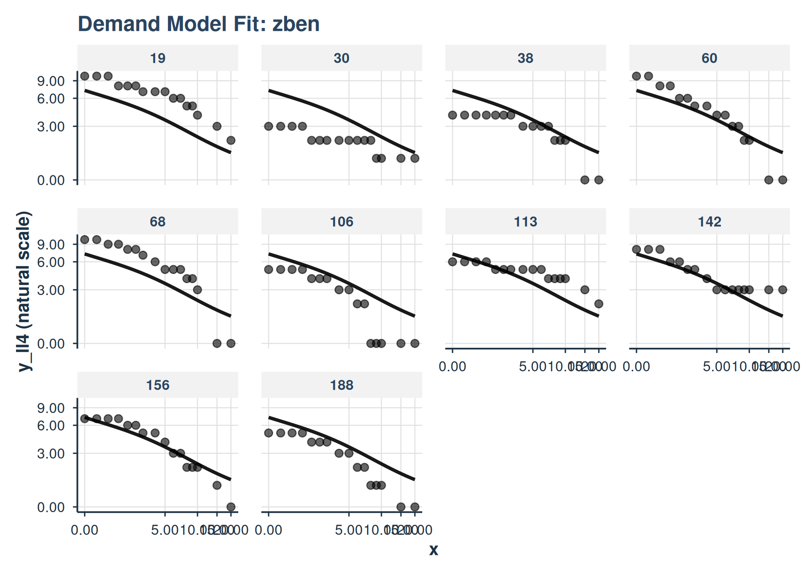
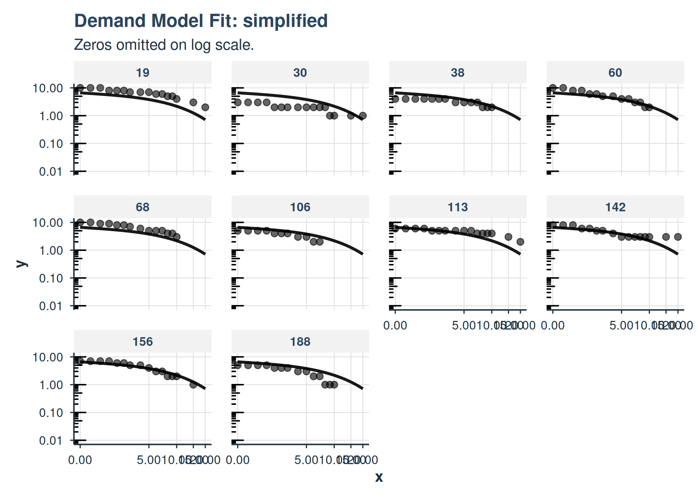
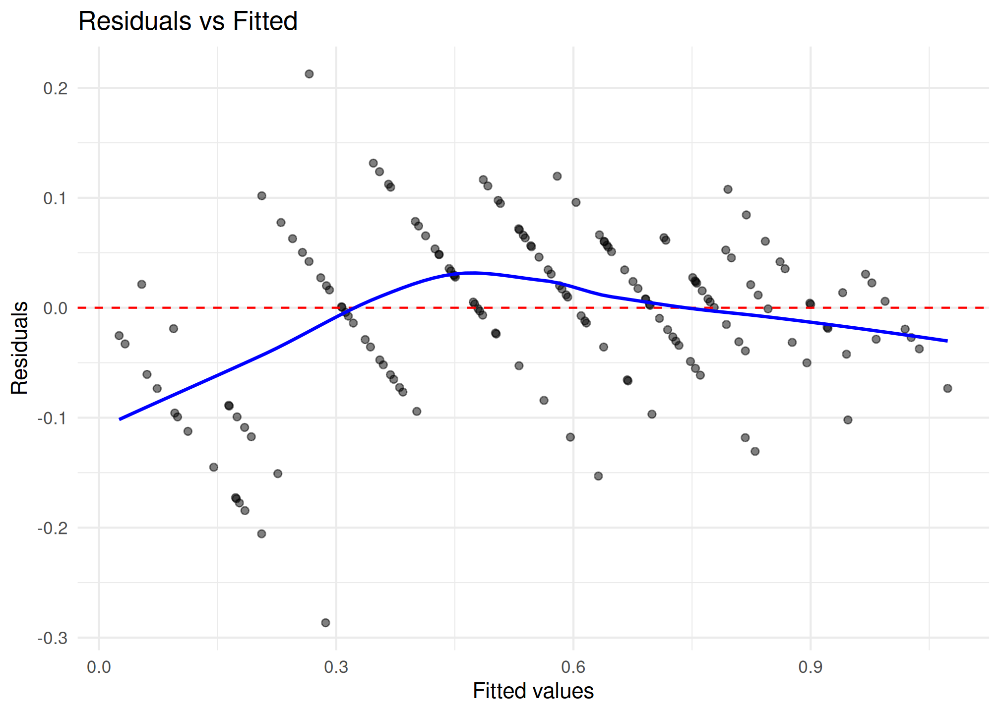
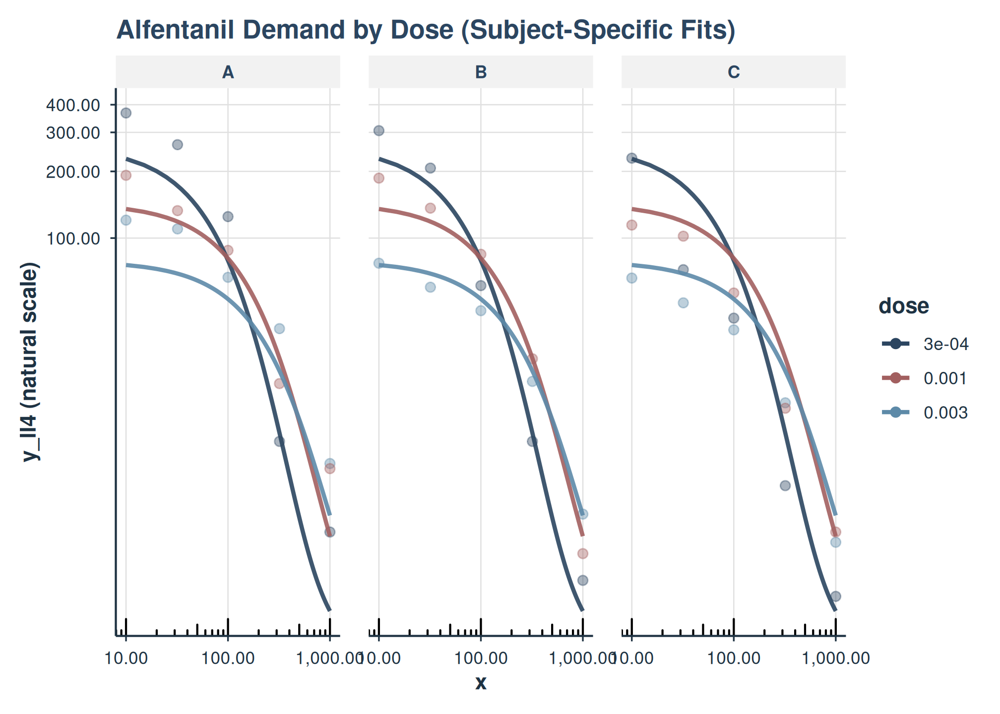
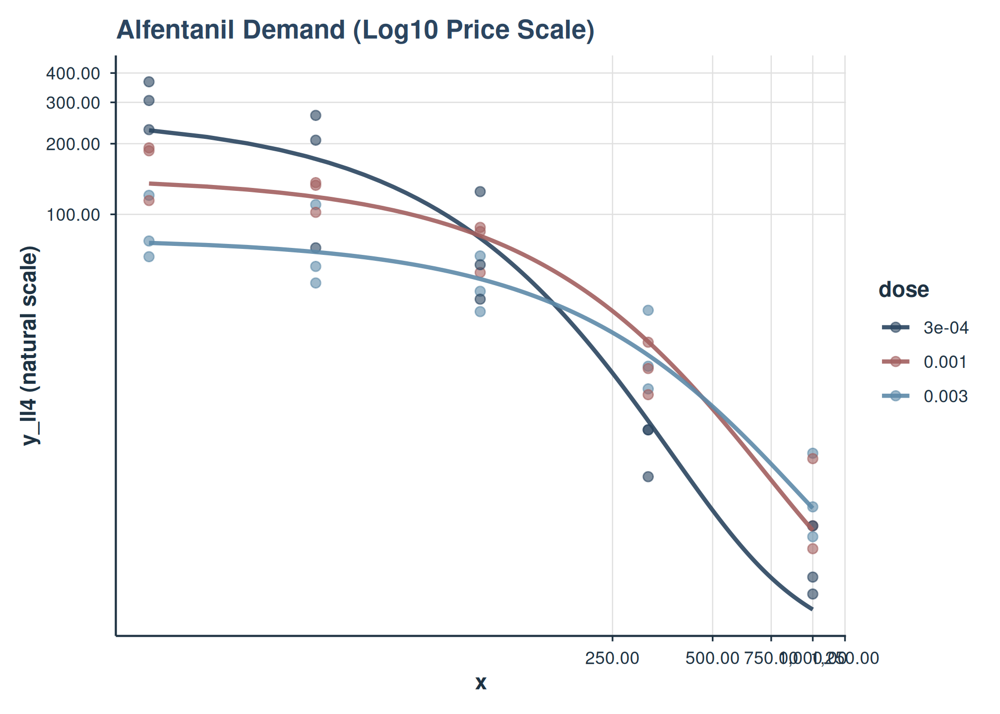

# Mixed-Effects Demand Modeling with \`beezdemand\`

## Introduction

This vignette demonstrates how to perform mixed-effects nonlinear
modeling of behavioral economic demand data using the beezdemand
package. We will focus on the
[`fit_demand_mixed()`](https://brentkaplan.github.io/beezdemand/reference/fit_demand_mixed.md)
function and its associated helper functions for extracting results,
making predictions, and visualizing fits. These models allow for
individual differences (random effects) and the examination of how
various factors (fixed effects) influence demand parameters like Q\_{0}
(maximum consumption at zero price) and \alpha (sensitivity of demand to
price). The parameters Q\_{0} and \alpha are estimated on a log10 scale
for numerical stability, but reporting functions will provide them on
their natural, interpretable scale.

For advanced topics including multi-factor models, collapsing factor
levels, estimated marginal means, pairwise comparisons, continuous
covariates, and complex random effects structures, see
[`vignette("mixed-demand-advanced")`](https://brentkaplan.github.io/beezdemand/articles/mixed-demand-advanced.md).

### Data Preparation

For these examples, we will use the apt and ko datasets, which is
assumed to be available and pre-processed.

The apt dataset should contain:

- id: A unique identifier for each subject.

- x: The price of the drug.

- y: The consumption of the drug.

The ko dataset should contain:

- monkey: A subject or group identifier for random effects.

- x: The price of the commodity (in this case the fixed-ratio
  requirement).

- y: Raw consumption values. This is typically used with the simplified
  exponentiated equation.

- y_ll4: Consumption, ll4 transformed. This is typically used with the
  zben equation.

- Factor columns like drug and dose.

``` r
quick_nlme_control <- nlme::nlmeControl(
  msMaxIter = 100,
  niterEM = 20,
  maxIter = 100, # Low iterations for speed
  pnlsTol = 0.1,
  tolerance = 1e-4, # Looser tolerance
  opt = "nlminb",
  msVerbose = FALSE
)
```

### Fitting Demand Models with fit_demand_mixed()

The core function for fitting nonlinear mixed-effects demand models is
[`fit_demand_mixed()`](https://brentkaplan.github.io/beezdemand/reference/fit_demand_mixed.md).

#### APT Fit and Plot

##### LL4 transformation with ZBEn

``` r
apt_ll4 <- apt |>
  mutate(y_ll4 = ll4(y))

fit_apt_zben <- fit_demand_mixed(
  data = apt_ll4,
  y_var = "y_ll4",
  x_var = "x",
  id_var = "id",
  equation_form = "zben",
  nlme_control = quick_nlme_control,
  start_value_method = "heuristic"
)
print(fit_apt_zben)
#> Demand NLME Model Fit ('beezdemand_nlme' object)
#> ---------------------------------------------------
#> 
#> Call:
#> fit_demand_mixed(data = apt_ll4, y_var = "y_ll4", x_var = "x", 
#>     id_var = "id", equation_form = "zben", start_value_method = "heuristic", 
#>     nlme_control = quick_nlme_control)
#> 
#> Equation Form Selected:  zben 
#> NLME Model Formula:
#> y_ll4 ~ Q0 * exp(-(10^alpha/Q0) * (10^Q0) * x)
#> <environment: 0x563224e2d900>
#> Fixed Effects Structure (Q0 & alpha):  ~ 1 
#> Factors: None
#> ID Variable for Random Effects:  id 
#> 
#> Start Values Used (Fixed Effects Intercepts):
#>   Q0 Intercept (log10 scale):  0.8117 
#>   alpha Intercept (log10 scale):  -3 
#> 
#> --- NLME Model Fit Summary (from nlme object) ---
#> Nonlinear mixed-effects model fit by maximum likelihood
#>   Model: nlme_model_formula_obj 
#>   Data: data 
#>   Log-likelihood: 146.7928
#>   Fixed: list(Q0 ~ 1, alpha ~ 1) 
#>         Q0      alpha 
#>  0.8578019 -1.9749801 
#> 
#> Random effects:
#>  Formula: list(Q0 ~ 1, alpha ~ 1)
#>  Level: id
#>  Structure: Diagonal
#>                Q0     alpha   Residual
#> StdDev: 0.1691518 0.2287771 0.07914016
#> 
#> Number of Observations: 160
#> Number of Groups: 10 
#> 
#> --- Additional Fit Statistics ---
#> Log-likelihood:  146.8 
#> AIC:  -283.6 
#> BIC:  -268.2 
#> ---------------------------------------------------
```

``` r
plot(
  fit_apt_zben,
  inv_fun = ll4_inv,
  y_trans = "pseudo_log",
  x_trans = "pseudo_log",
  show_pred_lines = c("population", "individual")
) +
  facet_wrap(
    ~id
  )
```



##### Simplified Exponential

``` r
fit_apt_simplified <- fit_demand_mixed(
  data = apt_ll4,
  y_var = "y",
  x_var = "x",
  id_var = "id",
  equation_form = "simplified",
  nlme_control = quick_nlme_control,
  start_value_method = "heuristic"
)
print(fit_apt_simplified)
#> Demand NLME Model Fit ('beezdemand_nlme' object)
#> ---------------------------------------------------
#> 
#> Call:
#> fit_demand_mixed(data = apt_ll4, y_var = "y", x_var = "x", id_var = "id", 
#>     equation_form = "simplified", start_value_method = "heuristic", 
#>     nlme_control = quick_nlme_control)
#> 
#> Equation Form Selected:  simplified 
#> NLME Model Formula:
#> y ~ (10^Q0) * exp(-(10^alpha) * (10^Q0) * x)
#> <environment: 0x563218b28268>
#> Fixed Effects Structure (Q0 & alpha):  ~ 1 
#> Factors: None
#> ID Variable for Random Effects:  id 
#> 
#> Start Values Used (Fixed Effects Intercepts):
#>   Q0 Intercept (log10 scale):  0.8129 
#>   alpha Intercept (log10 scale):  -3 
#> 
#> --- NLME Model Fit Summary (from nlme object) ---
#> Nonlinear mixed-effects model fit by maximum likelihood
#>   Model: nlme_model_formula_obj 
#>   Data: data 
#>   Log-likelihood: -172.7978
#>   Fixed: list(Q0 ~ 1, alpha ~ 1) 
#>         Q0      alpha 
#>  0.8218145 -1.7748511 
#> 
#> Random effects:
#>  Formula: list(Q0 ~ 1, alpha ~ 1)
#>  Level: id
#>  Structure: Diagonal
#>                Q0     alpha  Residual
#> StdDev: 0.1626688 0.1969346 0.5590275
#> 
#> Number of Observations: 160
#> Number of Groups: 10 
#> 
#> --- Additional Fit Statistics ---
#> Log-likelihood:  -172.8 
#> AIC:  355.6 
#> BIC:  371 
#> ---------------------------------------------------
```

``` r
plot(
  fit_apt_simplified,
  x_trans = "pseudo_log",
  show_pred_lines = c("population", "individual")
) +
  facet_wrap(
    ~id
  )
```



##### Koffarnus (Exponentiated) Equation Form

[`fit_demand_mixed()`](https://brentkaplan.github.io/beezdemand/reference/fit_demand_mixed.md)
also supports the Koffarnus et al. (2015) equation via
`equation_form = "exponentiated"`. By default, the scaling constant `k`
will be computed from the data range (you can also specify it directly).

``` r
fit_apt_exponentiated <- fit_demand_mixed(
  data = apt,
  y_var = "y",
  x_var = "x",
  id_var = "id",
  equation_form = "exponentiated",
  k = NULL,
  nlme_control = quick_nlme_control,
  start_value_method = "heuristic"
)
print(fit_apt_exponentiated)
#> Demand NLME Model Fit ('beezdemand_nlme' object)
#> ---------------------------------------------------
#> 
#> Call:
#> fit_demand_mixed(data = apt, y_var = "y", x_var = "x", id_var = "id", 
#>     equation_form = "exponentiated", k = NULL, start_value_method = "heuristic", 
#>     nlme_control = quick_nlme_control)
#> 
#> Equation Form Selected:  exponentiated 
#> NLME Model Formula:
#> y ~ (10^Q0) * 10^(1.5 * (exp(-(10^alpha) * (10^Q0) * x) - 1))
#> <environment: 0x56321595f420>
#> Fixed Effects Structure (Q0 & alpha):  ~ 1 
#> Factors: None
#> ID Variable for Random Effects:  id 
#> 
#> Start Values Used (Fixed Effects Intercepts):
#>   Q0 Intercept (log10 scale):  0.8129 
#>   alpha Intercept (log10 scale):  -3 
#> 
#> --- NLME Model Fit Summary (from nlme object) ---
#> Nonlinear mixed-effects model fit by maximum likelihood
#>   Model: nlme_model_formula_obj 
#>   Data: data 
#>   Log-likelihood: -181.3817
#>   Fixed: list(Q0 ~ 1, alpha ~ 1) 
#>         Q0      alpha 
#>  0.8334103 -2.2391878 
#> 
#> Random effects:
#>  Formula: list(Q0 ~ 1, alpha ~ 1)
#>  Level: id
#>  Structure: Diagonal
#>                Q0     alpha  Residual
#> StdDev: 0.1648661 0.2001946 0.5988898
#> 
#> Number of Observations: 160
#> Number of Groups: 10 
#> 
#> --- Additional Fit Statistics ---
#> Log-likelihood:  -181.4 
#> AIC:  372.8 
#> BIC:  388.1 
#> ---------------------------------------------------
```

### Inspecting Fits (tidy / glance / augment)

All modern model classes support
[`tidy()`](https://generics.r-lib.org/reference/tidy.html),
[`glance()`](https://generics.r-lib.org/reference/glance.html), and
[`augment()`](https://generics.r-lib.org/reference/augment.html) to
standardize programmatic access to estimates, model summaries, and
residuals.

``` r
glance(fit_apt_zben)
#> # A tibble: 1 × 10
#>   model_class     backend equation_form  nobs n_subjects converged logLik   AIC
#>   <chr>           <chr>   <chr>         <int>      <int> <lgl>      <dbl> <dbl>
#> 1 beezdemand_nlme nlme    zben            160         10 TRUE        147. -284.
#> # ℹ 2 more variables: BIC <dbl>, sigma <dbl>
tidy(fit_apt_zben) |> head()
#> # A tibble: 5 × 9
#>   term     estimate std.error statistic   p.value component estimate_scale
#>   <chr>       <dbl>     <dbl>     <dbl>     <dbl> <chr>     <chr>         
#> 1 Q0        7.21      0.919        7.85  4.29e-15 fixed     natural       
#> 2 alpha     0.0106    0.00182      5.83  5.69e- 9 fixed     natural       
#> 3 Q0        0.0286   NA           NA    NA        variance  natural       
#> 4 alpha     0.0523   NA           NA    NA        variance  natural       
#> 5 Residual  0.00626  NA           NA    NA        variance  natural       
#> # ℹ 2 more variables: term_display <chr>, estimate_internal <dbl>
augment(fit_apt_zben) |> head()
#> # A tibble: 6 × 7
#>   id        x     y y_ll4 .fitted   .resid .fixed
#>   <fct> <dbl> <dbl> <dbl>   <dbl>    <dbl>  <dbl>
#> 1 19      0      10 1.00    1.02  -0.0195   0.858
#> 2 19      0.5    10 1.00    0.994  0.00585  0.820
#> 3 19      1      10 1.00    0.969  0.0305   0.785
#> 4 19      1.5     8 0.903   0.945 -0.0423   0.751
#> 5 19      2       8 0.903   0.922 -0.0188   0.718
#> 6 19      2.5     8 0.903   0.899  0.00413  0.687
```

### Diagnostics

Use
[`check_demand_model()`](https://brentkaplan.github.io/beezdemand/reference/check_demand_model.md)
and the residual plotting helpers as standard post-fit checks.

``` r
check_demand_model(fit_apt_zben)
#> 
#> Model Diagnostics
#> ================================================== 
#> Model class: beezdemand_nlme 
#> 
#> Convergence:
#>   Status: Converged
#> 
#> Random Effects:
#>   Q0 variance: 0.02861
#>   alpha variance: 0.05234
#> 
#> Residuals:
#>   Mean: -0.06639
#>   SD: 0.9396
#>   Range: [-3.621, 2.686]
#>   Outliers: 1 observations
#> 
#> --------------------------------------------------
#> Issues Detected (1):
#>   1. Detected 1 potential outliers (|resid| > 3 SD)
#> 
#> Recommendations:
#>   - Investigate outlying observations
plot_residuals(fit_apt_zben)$fitted
```



#### Basic Model (No Factors)

This model estimates global Q\_{0} and \alpha parameters with random
effects for subjects.

``` r
# Make sure a similar 'fit_no_factors' was created successfully in your environment
# For the vignette, let's create one that is more likely to converge quickly
# by using only Alfentanil data, which is less complex than the full dataset.
ko_alf <- ko[ko$drug == "Alfentanil", ]

fit_no_factors_vignette <- fit_demand_mixed(
  data = ko_alf,
  y_var = "y_ll4",
  x_var = "x",
  id_var = "monkey",
  equation_form = "zben",
  nlme_control = quick_nlme_control, # Use quicker control for vignette
  start_value_method = "heuristic" # Heuristic is faster for simple model
)
print(fit_no_factors_vignette)
#> Demand NLME Model Fit ('beezdemand_nlme' object)
#> ---------------------------------------------------
#> 
#> Call:
#> fit_demand_mixed(data = ko_alf, y_var = "y_ll4", x_var = "x", 
#>     id_var = "monkey", equation_form = "zben", start_value_method = "heuristic", 
#>     nlme_control = quick_nlme_control)
#> 
#> Equation Form Selected:  zben 
#> NLME Model Formula:
#> y_ll4 ~ Q0 * exp(-(10^alpha/Q0) * (10^Q0) * x)
#> <environment: 0x563218059bd8>
#> Fixed Effects Structure (Q0 & alpha):  ~ 1 
#> Factors: None
#> ID Variable for Random Effects:  monkey 
#> 
#> Start Values Used (Fixed Effects Intercepts):
#>   Q0 Intercept (log10 scale):  2.271 
#>   alpha Intercept (log10 scale):  -3 
#> 
#> --- NLME Model Fit Summary (from nlme object) ---
#> Nonlinear mixed-effects model fit by maximum likelihood
#>   Model: nlme_model_formula_obj 
#>   Data: data 
#>   Log-likelihood: 2.763668
#>   Fixed: list(Q0 ~ 1, alpha ~ 1) 
#>        Q0     alpha 
#>  2.131113 -4.665222 
#> 
#> Random effects:
#>  Formula: list(Q0 ~ 1, alpha ~ 1)
#>  Level: monkey
#>  Structure: Diagonal
#>                   Q0        alpha  Residual
#> StdDev: 5.264342e-06 3.217971e-06 0.2275573
#> 
#> Number of Observations: 45
#> Number of Groups: 3 
#> 
#> --- Additional Fit Statistics ---
#> Log-likelihood:  2.764 
#> AIC:  4.473 
#> BIC:  13.51 
#> ---------------------------------------------------
```

The output shows the model call, selected equation form, and if the
model converged, it prints the nlme model summary.

#### Model with One Factor

Let’s model Q\_{0} and \alpha as varying by dose for Alfentanil.

``` r
fit_one_factor_dose <- fit_demand_mixed(
  data = ko_alf,
  y_var = "y_ll4",
  x_var = "x",
  id_var = "monkey",
  factors = "dose",
  equation_form = "zben",
  nlme_control = quick_nlme_control,
  start_value_method = "heuristic"
)
print(fit_one_factor_dose)
#> Demand NLME Model Fit ('beezdemand_nlme' object)
#> ---------------------------------------------------
#> 
#> Call:
#> fit_demand_mixed(data = ko_alf, y_var = "y_ll4", x_var = "x", 
#>     id_var = "monkey", factors = "dose", equation_form = "zben", 
#>     start_value_method = "heuristic", nlme_control = quick_nlme_control)
#> 
#> Equation Form Selected:  zben 
#> NLME Model Formula:
#> y_ll4 ~ Q0 * exp(-(10^alpha/Q0) * (10^Q0) * x)
#> <environment: 0x5632163651a0>
#> Fixed Effects Structure (Q0 & alpha):  ~ dose 
#> Factors:  dose 
#> Interaction Term Included:  FALSE 
#> ID Variable for Random Effects:  monkey 
#> 
#> Start Values Used (Fixed Effects Intercepts):
#>   Q0 Intercept (log10 scale):  2.271 
#>   alpha Intercept (log10 scale):  -3 
#> 
#> --- NLME Model Fit Summary (from nlme object) ---
#> Nonlinear mixed-effects model fit by maximum likelihood
#>   Model: nlme_model_formula_obj 
#>   Data: data 
#>   Log-likelihood: 17.90035
#>   Fixed: list(Q0 ~ dose, alpha ~ dose) 
#>    Q0.(Intercept)      Q0.dose0.001      Q0.dose0.003 alpha.(Intercept) 
#>       2.415349697      -0.257733998      -0.519065274      -4.650854662 
#>   alpha.dose0.001   alpha.dose0.003 
#>      -0.084081282       0.009734048 
#> 
#> Random effects:
#>  Formula: list(Q0 ~ 1, alpha ~ 1)
#>  Level: monkey
#>  Structure: Diagonal
#>         Q0.(Intercept) alpha.(Intercept)  Residual
#> StdDev:   3.760034e-06      2.301156e-06 0.1625574
#> 
#> Number of Observations: 45
#> Number of Groups: 3 
#> 
#> --- Additional Fit Statistics ---
#> Log-likelihood:  17.9 
#> AIC:  -17.8 
#> BIC:  -1.541 
#> ---------------------------------------------------
```

#### Inspecting Model Fits

Once a model is fit, you can inspect it using several S3 methods.

``` r
# Summary
summary(fit_one_factor_dose)
#> 
#> Nonlinear Mixed-Effects Demand Model Summary
#> ================================================== 
#> 
#> Model Specification:
#>   Equation form: zben 
#>   Factors: dose 
#>   Interaction: FALSE 
#>   ID variable: monkey 
#> 
#> Data Summary:
#>   Subjects: 3 
#>   Observations: 45 
#> 
#> Fixed Effects:
#>                       Value Std.Error        DF t-value  p-value    
#> Q0.(Intercept)    2.602e+02 4.474e+01 3.700e+01   5.817 5.99e-09 ***
#> Q0.dose0.001      5.524e-01 1.264e-01 3.700e+01   4.370 1.24e-05 ***
#> Q0.dose0.003      3.026e-01 6.833e-02 3.700e+01   4.429 9.46e-06 ***
#> alpha.(Intercept) 2.234e-05 2.695e-06 3.700e+01   8.289  < 2e-16 ***
#> alpha.dose0.001   8.240e-01 1.387e-01 3.700e+01   5.941 2.84e-09 ***
#> alpha.dose0.003   1.023e+00 1.792e-01 3.700e+01   5.707 1.15e-08 ***
#> ---
#> Signif. codes:  0 '***' 0.001 '**' 0.01 '*' 0.05 '.' 0.1 ' ' 1
#> 
#> Random Effects:
#> monkey = pdDiag(list(Q0 ~ 1,alpha ~ 1)) 
#>                   Variance     StdDev      
#> Q0.(Intercept)    1.413786e-11 3.760034e-06
#> alpha.(Intercept) 5.295319e-12 2.301156e-06
#> Residual          2.642491e-02 1.625574e-01
#> 
#> Residual standard error: 0.1626 
#> 
#> Model Fit:
#>   Log-Likelihood: 17.9 
#>   AIC: -17.8 
#>   BIC: -1.54

# Fixed effects
coef(fit_one_factor_dose, type = "fixed")
#>    Q0.(Intercept)      Q0.dose0.001      Q0.dose0.003 alpha.(Intercept) 
#>       2.415349697      -0.257733998      -0.519065274      -4.650854662 
#>   alpha.dose0.001   alpha.dose0.003 
#>      -0.084081282       0.009734048

# Random effects (deviations from fixed)
head(coef(fit_one_factor_dose, type = "random"))
#>   Q0.(Intercept) alpha.(Intercept)
#> A   8.830297e-11     -3.424853e-10
#> B   1.246265e-10      3.352306e-11
#> C  -2.129295e-10      3.089622e-10

# Subject-specific coefficients (fixed + random)
head(coef(fit_one_factor_dose, type = "combined"))
#>   Q0.(Intercept) Q0.dose0.001 Q0.dose0.003 alpha.(Intercept) alpha.dose0.001
#> A        2.41535    -0.257734   -0.5190653         -4.650855     -0.08408128
#> B        2.41535    -0.257734   -0.5190653         -4.650855     -0.08408128
#> C        2.41535    -0.257734   -0.5190653         -4.650855     -0.08408128
#>   alpha.dose0.003
#> A     0.009734048
#> B     0.009734048
#> C     0.009734048

# Access nlme fixef/ranef directly
nlme::fixef(fit_one_factor_dose)
#>    Q0.(Intercept)      Q0.dose0.001      Q0.dose0.003 alpha.(Intercept) 
#>       2.415349697      -0.257733998      -0.519065274      -4.650854662 
#>   alpha.dose0.001   alpha.dose0.003 
#>      -0.084081282       0.009734048
utils::head(nlme::ranef(fit_one_factor_dose))
#>   Q0.(Intercept) alpha.(Intercept)
#> A   8.830297e-11     -3.424853e-10
#> B   1.246265e-10      3.352306e-11
#> C  -2.129295e-10      3.089622e-10

# Start values that were used for the NLME fit
fit_one_factor_dose$start_values_used
#> [1]  2.270679  0.000000  0.000000 -3.000000  0.000000  0.000000
```

#### Making Predictions (predict())

The S3 [`predict()`](https://rdrr.io/r/stats/predict.html) method can
generate population-level or group-level predictions.

``` r
# Population-level predictions (log10 scale for 'zben')
preds_pop_log <- predict(fit_one_factor_dose, level = 0)
head(preds_pop_log)
#> # A tibble: 6 × 7
#>   monkey     x     y y_ll4 drug       dose  .fitted
#>   <fct>  <dbl> <dbl> <dbl> <fct>      <fct>   <dbl>
#> 1 A         10 120.  2.08  Alfentanil 0.003   1.88 
#> 2 A         32 110   2.04  Alfentanil 0.003   1.84 
#> 3 A        100  66.5 1.82  Alfentanil 0.003   1.72 
#> 4 A        320  39   1.59  Alfentanil 0.003   1.40 
#> 5 A       1000   9.5 0.978 Alfentanil 0.003   0.734
#> 6 B         10  77   1.89  Alfentanil 0.003   1.88

# Population-level predictions (natural scale, back-transformed)
preds_pop_natural <- predict(
  fit_one_factor_dose,
  level = 0,
  inv_fun = ll4_inv
)
head(preds_pop_natural)
#> # A tibble: 6 × 7
#>   monkey     x     y y_ll4 drug       dose  .fitted
#>   <fct>  <dbl> <dbl> <dbl> <fct>      <fct>   <dbl>
#> 1 A         10 120.  2.08  Alfentanil 0.003   75.6 
#> 2 A         32 110   2.04  Alfentanil 0.003   69.1 
#> 3 A        100  66.5 1.82  Alfentanil 0.003   53.0 
#> 4 A        320  39   1.59  Alfentanil 0.003   25.1 
#> 5 A       1000   9.5 0.978 Alfentanil 0.003    5.42
#> 6 B         10  77   1.89  Alfentanil 0.003   75.6

# Group-level predictions for first few data points
sample_newdata <- fit_one_factor_dose$data[1:5, ]
preds_group_log <- predict(fit_one_factor_dose, newdata = sample_newdata, level = 1)
preds_group_log
#> # A tibble: 5 × 7
#>   monkey     x     y y_ll4 drug       dose  .fitted
#>   <fct>  <dbl> <dbl> <dbl> <fct>      <fct>   <dbl>
#> 1 A         10 120.  2.08  Alfentanil 0.003   1.88 
#> 2 A         32 110   2.04  Alfentanil 0.003   1.84 
#> 3 A        100  66.5 1.82  Alfentanil 0.003   1.72 
#> 4 A        320  39   1.59  Alfentanil 0.003   1.40 
#> 5 A       1000   9.5 0.978 Alfentanil 0.003   0.734
```

### Visualizing Model Fits with `plot()`

The `beezdemand` package provides an S3
[`plot()`](https://rdrr.io/r/graphics/plot.default.html) method for
`beezdemand_nlme` objects, built using `ggplot2`, to help visualize the
fitted demand curves against observed data.

**Key Features:**

- **Observed Data:** Can display the original data points.

- **Prediction Lines:** Plots model-predicted demand curves at the
  population level (fixed effects, `pred_level = 0`) or group/subject
  level (fixed + random effects, `pred_level = 1`).

- **Inverse Transformation (`inv_fun`):** Allows back-transformation of
  the y-axis and predictions to the natural scale (e.g., from log10
  consumption back to raw consumption units).

- **Aesthetic Mapping:** Factors can be mapped to `color`, `linetype`
  (for lines), and `shape` (for points).

- **Faceting:** Supports `ggplot2` faceting via `facet_formula`.

- **Axis Transformations:** Allows `x_trans` and `y_trans` (e.g.,
  “log10”, “pseudo_log”).

#### Example 1: Plotting a Single-Factor Model

Let’s use `fit_one_factor_dose` (modeling demand for Alfentanil by
`dose`, with `y_ll4` as the dependent variable).

``` r
plot(
  fit_one_factor_dose,
  inv_fun = ll4_inv,
  color_by = "dose",
  shape_by = "dose",
  observed_point_alpha = 0.7,
  title = "Alfentanil Demand by Dose (Population Fit)"
)
```


Demand curves for Alfentanil by dose (population level). y-axis on
natural scale.

This plot shows the population-level demand curves for each dose of
Alfentanil. The y-axis has been back-transformed to the natural
consumption scale using inv_fun.

#### Example 2: Plotting Subject-Specific Lines

We can also visualize the individual subject fits by setting
`show_pred_lines = "individual"`.

``` r
plot(
  fit_one_factor_dose,
  show_pred_lines = "individual",
  inv_fun = ll4_inv,
  color_by = "dose",
  observed_point_alpha = 0.4,
  y_trans = "pseudo_log",
  ind_line_alpha = .5,
  title = "Alfentanil Demand by Dose (Subject-Specific Fits)"
) +
  ggplot2::guides(color = guide_legend(override.aes = list(alpha = 1))) +
  facet_grid(~monkey)
```



Here, each thin line represents the fitted curve for an individual
subject (monkey), colored by dose.

#### Example 3: Customizing Axes (e.g., Log Scale)

You can use `x_trans` and `y_trans` for axis transformations.

``` r
plot(
  fit_one_factor_dose,
  inv_fun = ll4_inv,
  color_by = "dose",
  x_trans = "pseudo_log",
  y_trans = "pseudo_log",
  title = "Alfentanil Demand (Log10 Price Scale)"
)
```



Users can further customize the returned ggplot object by adding more
layers or theme adjustments. For instance, to add custom axis limits or
breaks:

``` r
plot_object +
    ggplot2::scale_x_continuous(
        limits = c(0, 1000),
        breaks = c(0, 100, 500, 1000)
    )
```

## Conclusion

The beezdemand package provides a suite of tools for robustly fitting
nonlinear mixed-effects demand models and interpreting their parameters.
By parameterizing Q\_{0} and \alpha on the log10 scale, numerical
stability is enhanced, while helper functions allow for easy
back-transformation and interpretation on the natural scale.

## See Also

- [`vignette("mixed-demand-advanced")`](https://brentkaplan.github.io/beezdemand/articles/mixed-demand-advanced.md)
  – Multi-factor models, collapsing levels, EMMs, comparisons,
  covariates, and trends
- [`vignette("model-selection")`](https://brentkaplan.github.io/beezdemand/articles/model-selection.md)
  – Choosing the right model class
- [`vignette("fixed-demand")`](https://brentkaplan.github.io/beezdemand/articles/fixed-demand.md)
  – Fixed-effect demand modeling
- [`vignette("hurdle-demand-models")`](https://brentkaplan.github.io/beezdemand/articles/hurdle-demand-models.md)
  – Two-part hurdle demand models
- [`vignette("cross-price-models")`](https://brentkaplan.github.io/beezdemand/articles/cross-price-models.md)
  – Cross-price demand analysis
- [`vignette("group-comparisons")`](https://brentkaplan.github.io/beezdemand/articles/group-comparisons.md)
  – Group comparisons
- [`vignette("migration-guide")`](https://brentkaplan.github.io/beezdemand/articles/migration-guide.md)
  – Migrating from
  [`FitCurves()`](https://brentkaplan.github.io/beezdemand/reference/FitCurves.md)
- [`vignette("beezdemand")`](https://brentkaplan.github.io/beezdemand/articles/beezdemand.md)
  – Getting started with beezdemand
