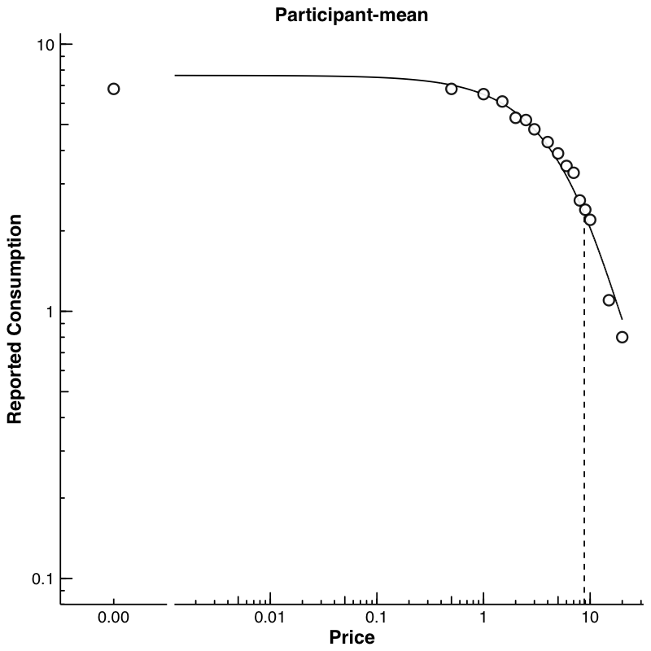
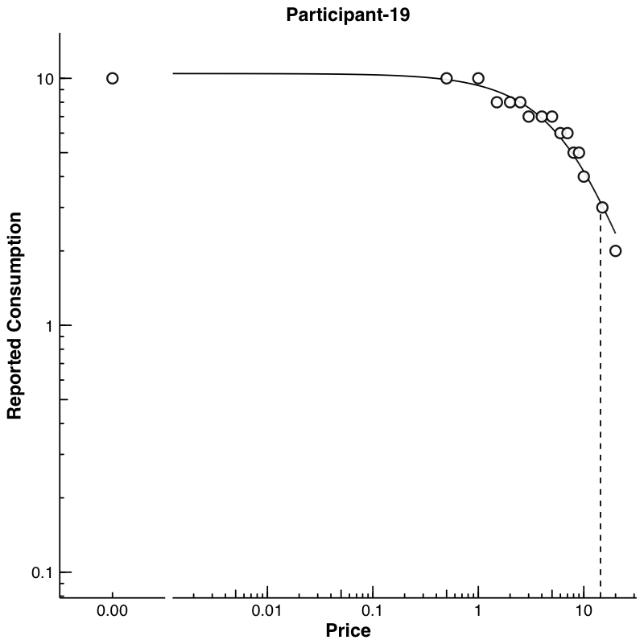

```{r setup, include = FALSE}
knitr::opts_chunk$set(echo=TRUE, comment=NA)
```

## Rationale Behind beezdemand

Behavioral economic demand is gaining in popularity. The motivation behind beezdemand was to 
create an alternative tool to conduct these
analyses. This package is not necessarily meant to be a replacement
for other softwares; rather, it is meant to serve as an
additional tool in the behavioral economist's toolbox. It is meant for
researchers to conduct behavioral economic (be) demand the easy (ez) way.

[`R`](https://www.r-project.org/) is an open-source statistical programming language. It is powerful and allows for nearly endless
customizability.

## Note About Use

This package is a work in progress. I welcome suggestions, feedback,
questions, and comments regarding what other researchers might be
interested in seeing. If you encounter bugs, errors, or other
discrepancies please either open an issue on the package's [GitHub page](https://github.com/brentkaplan/beezdemand) or
[contact me](mailto:bkaplan.ku@gmail.com?Subject=Question/comment%20Regarding%20beezdemand%20Package "Email bkaplan.ku@gmail.com") and I will do my best to fix
the problem.

## Installation

Right now the package can be obtained from my [GitHub page](https://github.com/brentkaplan). 
There are plans to make it available
properly on CRAN. In any case, to install the package first install
Hadley Wickham's `devtools` package:

```install.packages("devtools")```

Then simply install the package using the following command:

```devtools::install_github("brentkaplan/beezdemand", build_vignettes
= TRUE)```

By indicating `build_vignettes = TRUE`, the installation will compile this vignette.

```{r include = FALSE}
library(beezdemand)
```

## Using the Package

### Example Dataset

I include an example dataset to demonstrate how data should be
entered and how to use the functions. This example dataset consists
of participant responses on an alcohol purchase task. Participants (id)
reported the number of alcoholic drinks (y) they would be willing to
purchase and consume at various prices (x; USD). Note the long format:

```{r example-data-set, echo=FALSE, results='asis'}
knitr::kable(apt[c(1:8, 17:24), ])
```

### Converting from Wide to Long and vice versa

Some datasets read into `R` will be in a "wide" format, where column names indicate dataset identifiers:

```{r example-wide, results = 'asis', echo = FALSE}
wide <- tidyr::spread(apt, id, y)
knitr::kable(wide)
```

The functions in this package primarily deal with data that is in long format, for example the provided dataset `apt` described initially. In order to convert from wide to long formats and vice versa, I recommend using the following commands.

__Wide to Long__

```{r example-w2l, eval = FALSE}
long <- tidyr::gather(wide, id, y, -x)
```

__Long to Wide__

```{r example-l2w, eval = FALSE}
wide <- tidyr::spread(long, id, y)
```

### Obtain Descriptive Data

Descriptive values of responses at each price. Includes mean, standard
deviation, proportion of zeros, numer of NAs, and minimum and maximum values. If `bwplot = TRUE`, a box-and-whisker plot is also created and saved. Notice the red crosses indicate the mean. User may additionally specify the directory that the plot should save into, the type of file (either `"png"` or `"pdf"`), and the filename. Defaults are shown here:

```{r descriptive, eval=FALSE}
GetDescriptives(apt, bwplot = TRUE, outdir = "../plots/", device = "png", filename = "bwplot")
```

```{r descriptive-output, echo=FALSE, results='asis'}
descr <- GetDescriptives(apt)
knitr::kable(descr)
```

<center></center>

### Change Data

There are certain instances in which data are to be modified before fitting, for example when using an equation that logarithmically transforms y values. The following function can help with modifying data:

* `nrepl` indicates number of replacement 0 values, either as an integer or `"all"`

* `replnum` indicates the number that should replace 0 values

* `rem0` removes all zeros

* `remq0e` removes y value where x (or price) equals 0

* `replfree` replaces where x (or price) equals 0 with a specified number

```{r change-data, eval = FALSE}
ChangeData(apt, nrepl = 1, replnum = 0.01, rem0 = FALSE, remq0e = FALSE, replfree = NULL)
```

### Identify Unsystematic Responses

Examine consistency of demand data using Stein et al.'s (2015)
alogrithm for identifying unsystematic responses. Default values
shown, but they can be customized.

```{r unsystematic, eval=FALSE}
CheckUnsystematic(apt, deltaq = 0.025, bounce = 0.1, reversals = 0, ncons0 = 2)
```

```{r unsystematic-output, echo=FALSE, results='asis'}
knitr::kable(head(CheckUnsystematic(apt, deltaq = 0.025, bounce = 0.1, reversals = 0, ncons0 = 2), 5))
```

### Analyze Demand Data

Results of the analysis return both empirical and derived measures for
use in additional analyses and model specification. Equations include
the linear model, exponential model, and exponentiated model. Soon, I
will be including the nonlinear mixed effects model, mixed effects
versions of the exponential and exponentiated model, and others.

#### Obtaining Empirical Measures

Empirical measures can be obtained separately on their own:

```{r empirical, eval=FALSE}
GetEmpirical(apt)
```

```{r empirical-output, echo=FALSE, results='asis'}
knitr::kable(head(GetEmpirical(apt), 5))
```

#### Obtaining Derived Measures

`FitCurves()` has several important arguments that can be passed:

* `equation` can accept `hs` or `koff`, two of the contemporary equations proposed by Hursh & Silberberg (2008) and Koffarnus et al. (2015), respectively. 

* `k` by default will be calculated based on the maximum and minimum y values of the entire sample and adding .5. Adding this amount was originally proposed by Steven R. Hursh in an early iteration of a Microsoft Excel spreadsheet used to calculate demand metrics. This adjustment was adopted for two reasons. First, when fitting $Q_0$ as a derived parameter, the value may exceed the empirically observed intensity value. Thus, a k value calculated based only on the observed range of data may underestimate the full fitted range of the curve. Second, we have found that values of $\alpha$ (as well as values that rely on $\alpha$, i.e. approximate $P_{max}$) display greater discrepancies when smaller values of k are used compared to larger values of k. Other options include `"ind"`, which will calculate k based on individual basis, `"fit"`, which will fit k as a free parameter on an individual basis, `"share"`, which will fit k as a single shared parameter across all data sets (while fitting individual $Q_0$ and $\alpha$).

* `agg = NULL` is the default. When `agg = "Mean"`, data are fit averaged data disregarding any error. When `agg = "Pooled"`, all data are used and clustering within individual is ignored.

* `detailed = FALSE` is the default. This will output a single dataframe of results, as shown below. When `detailed = TRUE`, the output is a 3 element list that includes (1) dataframe of results, (2) list of nonlinear regression model objects, (3) list of dataframes containing predicted x and y values (to be used in subsequent plotting), and (4) list of individual dataframes used in fitting.

* `lobound` and `hibound` can accept named vectors that will be used as lower and upper bounds, respectively during fitting. If `k = "fit"`, then it should look as follows: `lobound = c("q0" = 0, "k" = 0, "alpha" = 0)` and `hibound = c("q0" = 25, "k" = 10, "alpha" = 1)`. If `k` is not being fit as a parameter, then only `"q0"` and `"alpha"` should be used in bounding.

Note: Fitting with an equation that doesn't work happily with zero consumption values results in the following. One, a message will appear saying that zeros are incompatible with the equation. Two, because zeros are removed prior to finding empirical (i.e., observed) measures, resulting BP0 values will be all NAs (reflective of the data transformations). The warning message will look as follows:

```{r zero-warning, eval=FALSE}
Warning message:
Zeros found in data not compatible with equation! Dropping zeros!
```

The simplest use of `FitCurves()` is shown here, only needing to specify `dat` and `equation`. All other arguments shown are set to their default values.

```{r hs, eval=FALSE}
FitCurves(dat = apt, equation = "hs", k, agg = NULL, detailed = FALSE, xcol = "x", ycol = "y", idcol = "id", groupcol = NULL, lobound, hibound)
```

Note that this ouput returns a message (`No k value specified. Defaulting to empirical mean range +.5`) and the aforementioned warning (`Warning message: Zeros found in data not compatible with equation! Dropping zeros!`). With `detailed = FALSE`, the only output is the dataframe of results (broken up to show the different types of results). This example fits the exponential equation proposed by Hursh & Silberberg (2008):

```{r hs-setup, include=FALSE}
fc <- FitCurves(apt, "hs")
hs1 <- head(fc, 5)[ , 1:6]
hs2 <- head(fc, 5)[ , 7:11]
hs3 <- head(fc, 5)[ , 12:20]
hs4 <- head(fc, 5)[ , 21:24]
```

```{r hs-output, echo=FALSE, results='asis'}
knitr::kable(hs1, caption = "Empirical Measures")
knitr::kable(hs2, caption = "Fitted Measures")
knitr::kable(hs3, caption = "Uncertainty and Model Information")
knitr::kable(hs4, caption = "Derived Measures")
```

Here, the simplest form is shown specifying another equation, `"koff"`. This fits the modified exponential equation proposed by Koffarnus et al. (2015):

```{r koff, eval=FALSE}
FitCurves(apt, "koff")
```

```{r koff-setup, include = FALSE}
fc <- FitCurves(apt, "koff")
koff1 <- head(fc, 5)[ , 1:6]
koff2 <- head(fc, 5)[ , 7:11]
koff3 <- head(fc, 5)[ , 12:20]
koff4 <- head(fc, 5)[ , 21:24]
```

```{r koff-output, echo=FALSE, results='asis'}
knitr::kable(koff1, caption = "Empirical Measures")
knitr::kable(koff2, caption = "Fitted Measures")
knitr::kable(koff3, caption = "Uncertainty and Model Information")
knitr::kable(koff4, caption = "Derived Measures")
```

```{r agg-mean, eval = FALSE}
FitCurves(apt, "hs", agg = "Mean")
```

```{r agg-mean-setup, include = FALSE}
mn <- FitCurves(apt, "hs", agg = "Mean")
mn1 <- head(mn)[ , 1:6]
mn2 <- head(mn)[ , 7:11]
mn3 <- head(mn)[ , 12:20]
mn4 <- head(mn)[ , 21:24]
```

```{r agg-mean-output, echo = FALSE, results = 'asis'}
knitr::kable(mn1, caption = "Empirical Measures")
knitr::kable(mn2, caption = "Fitted Measures")
knitr::kable(mn3, caption = "Uncertainty and Model Information")
knitr::kable(mn4, caption = "Derived Measures")
```

```{r agg-pooled, eval = FALSE}
FitCurves(apt, "hs", agg = "Pooled")
```

```{r agg-pooled-setup, include = FALSE}
pl <- FitCurves(apt, "hs", agg = "Pooled")
pl1 <- head(pl)[ , 1:6]
pl2 <- head(pl)[ , 7:11]
pl3 <- head(pl)[ , 12:20]
pl4 <- head(pl)[ , 21:24]
```

```{r agg-pooled-output, echo = FALSE, results = 'asis'}
knitr::kable(pl1, caption = "Empirical Measures")
knitr::kable(pl2, caption = "Fitted Measures")
knitr::kable(pl3, caption = "Uncertainty and Model Information")
knitr::kable(pl4, caption = "Derived Measures")
```

### Share k Globally; Fit Other Parameters Locally

As mentioned earlier, in the function `FitCurves`, when `k = "share"` this parameter will be a shared parameter across all datasets (globally) while estimating $Q_0$ and $\alpha$ locally. While this works, it may take some time with larger sample sizes.

```{r share, eval=FALSE}
FitCurves(apt, "hs", k = "share")
```

```{r, include=FALSE}
df <- FitCurves(apt, "hs", k = "share")
```

```{r share-output, echo=FALSE, results='asis'}
knitr::kable(head(df, 5)[ , 1:6], caption = "Empirical Measures")
knitr::kable(head(df, 5)[ , 7:11], caption = "Fitted Measures")
knitr::kable(head(df, 5)[ , 12:20], caption = "Uncertainty and Model Information")
knitr::kable(head(df, 5)[ , 21:24], caption = "Derived Measures")
```

### Compare Values of $\alpha$ and $Q_0$ via Extra Sum-of-Squares F-Test

When one has multiple groups, it may be beneficial to compare whether separate curves are preferred over a single curve. This is accomplished by the Extra Sum-of-Squares F-test. This function (using the argument `compare`) will determine whether a single $\alpha$ or a single $Q_0$ is better than multiple $\alpha$s or $Q_0$s. A single curve will be fit, the residual deviations calculated and those residuals are compared to residuals obtained from multiple curves. A resulting _F_ statistic will be reporting along with a _p_ value. 

Example forthcoming.
```{r ftest, eval=FALSE}
ExtraF(apt, "hs")
```

### Plots

Plots can be created using the `PlotCurves` function. This function takes the output from `FitCurves` when the argument from `FitCurves`, `detailed = TRUE`. The default will be to save figures into a plots folder created one directory above the current working directory. Figures can be saved as either PNG or PDF. If the argument `ask = TRUE`, then plots will be shown interactively and not saved (`ask = FALSE` is the default). Graphs can automatically be created at both an aggregate and individual level.

<center></center>

<center></center>


### Learn More About Functions

To learn more about a function and what arguments it takes, type "?" in front of the function name.

```{r learn, eval=FALSE}
?CheckUnsystematic
```

```{r learn-output, eval=FALSE}
CheckUnsystematic          package:beezdemand          R Documentation

Systematic Purchase Task Data Checker

Description:

     Applies Stein, Koffarnus, Snider, Quisenberry, & Bickels (2015)
     criteria for identification of nonsystematic purchase task data.

Usage:

     CheckUnsystematic(dat, deltaq = 0.025, bounce = 0.1, reversals = 0,
       ncons0 = 2)

Arguments:

     dat: Dataframe in long form. Colums are id, x, y.

  deltaq: Numeric vector of length equal to one. The criterion by which
          the relative change in quantity purchased will be compared.
          Relative changes in quantity purchased below this criterion
          will be flagged. Default value is 0.025.

  bounce: Numeric vector of length equal to one. The criterion by which
          the number of price-to-price increases in consumption that
          exceed 25% of initial consumption at the lowest price,
          expressed relative to the total number of price increments,
          will be compared. The relative number of price-to-price
          increases above this criterion will be flagged. Default value
          is 0.10.

reversals: Numeric vector of length equal to one. The criterion by
          which the number of reversals from number of consecutive (see
          ncons0) 0s will be compared. Number of reversals above this
          criterion will be flagged. Default value is 0.

  ncons0: Numer of consecutive 0s prior to a positive value is used to
          flag for a reversal. Value can be either 1 (relatively more
          conservative) or 2 (default; as recommended by Stein et al.,
          (2015).

Details:

     This function applies the 3 criteria proposed by Stein et al.,
     (2015) for identification of nonsystematic purchase task data. The
     three criteria include trend (deltaq), bounce, and reversals from
     0. Also reports number of positive consumption values.

Value:

     Dataframe

Author(s):

     Brent Kaplan <bkaplan.ku@gmail.com>

Examples:

     ## Using all default values
     CheckUnsystematic(apt, deltaq = 0.025, bounce = 0.10, reversals = 0, ncons0 = 2)
     ## Specifying just 1 zero to flag as reversal
     CheckUnsystematic(apt, deltaq = 0.025, bounce = 0.10, reversals = 0, ncons0 = 1)
```

## Acknowledgments

- Derek D. Reed, Applied Behavioral Economics Laboratory
[www.behavioraleconlab.com](www.behavioraleconlab.com)

- Paul E. Johnson, Center for Research Methods and Data Analysis, University of Kansas
[www.crmda.ku.edu](www.crmda.ku.edu)

- Michael Amlung, Cognitive Neuroscience of Addictions Laboratory
[www.cnalab.weebly.com](www.cnalab.weebly.com)

- Peter G. Roma, Institutes for Behavior Resources, Inc.
[www.ibrinc.org](www.ibrinc.org)

- Steven R. Hursh, Institutes for Behavior Resources, Inc.
[www.ibrinc.org](www.ibrinc.org)

- Shawn P. Gilroy, [GitHub](https://github.com/miyamot0)

## Recommended Readings

- Reed, D. D., Niileksela, C. R., & Kaplan, B. A. (2013). Behavioral economics: A tutorial for behavior analysts in practice. *Behavior Analysis in Practice, 6* (1), 34–54.

- Reed, D. D., Kaplan, B. A., & Becirevic, A. (2015). Basic research on the behavioral economics of reinforcer value. In *Autism Service Delivery* (pp. 279-306). Springer New York.

- Hursh, S. R., & Silberberg, A. (2008). Economic demand and essential value. *Psychological Review, 115* (1), 186-198.

- Koffarnus, M. N., Franck, C. T., Stein, J. S., & Bickel, W. K. (2015). A modified exponential behavioral economic demand model to better describe consumption data. *Experimental and Clinical Psychopharmacology, 23* (6), 504-512.

- Stein, J. S., Koffarnus, M. N., Snider, S. E., Quisenberry, A. J., & Bickel, W. K. (2015). Identification and management of nonsystematic purchase task data: Toward best practice. *Experimental and Clinical Psychopharmacology*

