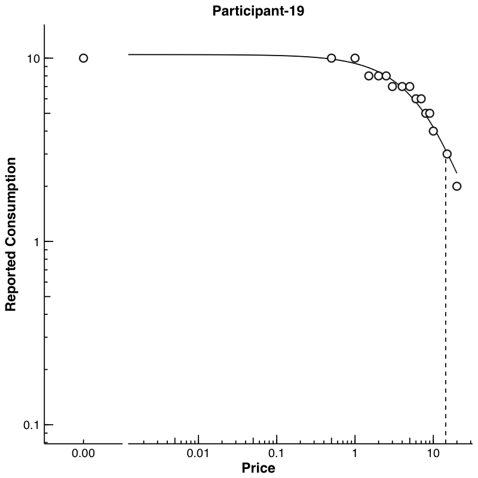
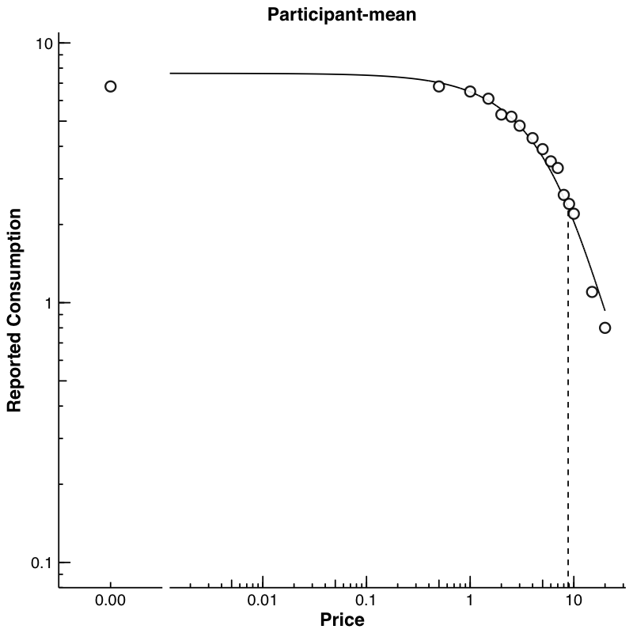

```{r setup, include = FALSE}
knitr::opts_chunk$set(
  echo = TRUE,
  comment = NA,
  dev = "png",
  dpi = 144
)
```

# Rationale Behind `beezdemand`

Behavioral economic demand is gaining in popularity. The motivation behind `beezdemand` was to 
create an alternative tool to conduct these
analyses. This package is not necessarily meant to be a replacement
for other softwares; rather, it is meant to serve as an
additional tool in the behavioral economist's toolbox. It is meant for
researchers to conduct behavioral economic (be) demand the easy (ez) way.

## Note About Use

`beezdemand` is under active development but aims to be stable for typical applied use.
If you find issues or would like to contribute, please open an issue on my [GitHub page](https://github.com/brentkaplan/beezdemand) or [email me](mailto:bkaplan.ku@gmail.com).
Please check `NEWS.md` for changes in recent versions.

## Installing `beezdemand`

### CRAN Release (recommended method)

The latest stable version of `beezdemand` can be found on [CRAN](https://CRAN.R-project.org/package=beezdemand) and installed using the following command. The first time you install the package, you may be asked to select a CRAN mirror. Simply select the mirror geographically closest to you.

```{r cran-install, eval = FALSE}
install.packages("beezdemand")

library(beezdemand)
```

### GitHub Release

To install a stable release directly from [GitHub](https://github.com/brentkaplan/beezdemand), first install and load the `devtools` package. Then, use `install_github` to install the package and associated vignette. You *don't* need to download anything directly from [GitHub](https://github.com/brentkaplan/beezdemand), as you should use the following instructions:

```{r git-install, eval = FALSE}
install.packages("devtools")

devtools::install_github("brentkaplan/beezdemand", build_vignettes = TRUE)

library(beezdemand)
```

### GitHub Development Version

To install the development version of the package, specify the development branch in `install_github`:

```{r gitdev-install, eval = FALSE}
devtools::install_github("brentkaplan/beezdemand@develop")
```

## Using the Package

```{r packages, include = FALSE, echo = FALSE}
# Package dependencies are specified in DESCRIPTION
# They should already be installed when building vignettes
library(dplyr)
library(tidyr)
library(ggplot2)
library(beezdemand)
```

### Example Dataset

An example dataset of responses on an Alcohol Purchase Task is provided. This object is called `apt` and is located within the `beezdemand` package. These data are a subset of from the paper by Kaplan & Reed (2018). Participants (id) reported the number of alcoholic drinks (y) they would be willing to purchase and consume at various prices (x; USD). Note the format of the data, which is called "long format". Long format data are data structured such that repeated observations are stacked in multiple rows, rather than across columns. First, take a look at an extract of the dataset `apt`, where I've subsetted rows 1 through 10 and 17 through 26:

```{r example-data-set, echo=FALSE, results='asis'}
knitr::kable(apt[c(1:10, 17:26), ])
```

The first column contains the row number. The second column contains the id number of the series within the dataset. The third column contains the x values (in this specific dataset, price per drink) and the fourth column contains the associated responses (number of alcoholic drinks purchased at each respective price). There are replicates of id because for each series (or participant), several x values were presented.

### Converting from Wide to Long and Vice Versa

Take for example the format of most datasets that would be exported from a data collection software such as Qualtrics or SurveyMonkey or Google Forms:

```{r example-wide}
## the following code takes the apt data, which are in long format, and converts
## to a wide format that might be seen from data collection software
wide <- spread(apt, x, y)
colnames(wide) <- c("id", paste0("price_", seq(1, 16, by = 1)))
knitr::kable(wide[1:5, 1:10])
```

A dataset such as this is referred to as "wide format" because each participant series contains a single row and multiple measurements within the participant are indicated by the columns. This data format is fine for some purposes; however, for `beezdemand`, data are required to be in "long format" (in the same format as the example data described earlier. In order to convert to the long format, some steps will be required.

First, it is helpful to rename the columns to what the prices actually were. For example, for the purposes of our example dataset, price_1 was \$0.00 (free), price_2 was \$0.50, price_3 was \$1.00, and so on. 

```{r example-wide1}
## make an object to hold what will be the new column names
newcolnames <- c("id", "0", "0.5", "1", "1.50", "2", "2.50", "3", 
                 "4", "5", "6", "7", "8", "9", "10", "15", "20")
## current column names
colnames(wide)

## replace current column names with new column names
colnames(wide) <- newcolnames

## how new data look (first 5 rows only)
knitr::kable(wide[1:5, ])
```

Now we can convert into a long format using some of the helpful functions in the `tidyverse` package (make sure the package is loaded before trying the commands below).

```{r example-w2l}
## using the dataframe 'wide', we specify the key will be 'price', the values 
## will be 'consumption', and we will select all columns besides the first ('id')
long <- tidyr::gather(wide, price, consumption, -id)

## we'll sort the rows by id
long <- arrange(long, id)

## view the first 20 rows
knitr::kable(long[1:20, ])
```

Two final modifications we will make will be to (1) rename our columns to what the functions in `beezdemand` will expect to see: `id`, `x`, and `y`, and (2) ensure both x and y are in numeric format.
```{r example-w2l2}
colnames(long) <- c("id", "x", "y")

long$x <- as.numeric(long$x)
long$y <- as.numeric(long$y)
knitr::kable(head(long))
```

The dataset is now "tidy" because: (1) each variable forms a column, (2) each observation forms a row, and (3) each type of observational unit forms a table (in this case, our observational unit is the Alcohol Purchase Task data). To learn more about the benefits of tidy data, readers are encouraged to consult Hadley Wikham's essay on [Tidy Data](https://vita.had.co.nz/papers/tidy-data.html).

### Obtain Descriptive Data

Descriptive values of responses at each price can be obtained easily. The resulting table includes mean, standard
deviation, proportion of zeros, number of NAs, and minimum and maximum values. If `bwplot = TRUE`, a box-and-whisker plot is also created and saved. By default, this location is a folder named "plots" one level up from the current working directory.  The user may additionally specify the directory that the plot should save into, the type of file (either `"png"` or `"pdf"`), and the filename. Notice the red crosses indicate the mean. Defaults are shown here:

```{r descriptive, eval = FALSE}
GetDescriptives(dat = apt, bwplot = FALSE, outdir = "../plots/", device = "png", 
                filename = "bwplot")
```

<center></center>

And here is the table that is returned from the function:

```{r descriptive-output, echo=FALSE, results='asis'}
descr <- GetDescriptives(apt)
knitr::kable(descr)
```

### Change Data

There are certain instances in which data are to be modified before fitting, for example when using an equation that logarithmically transforms y values. The following function can help with modifying data:

* `nrepl` indicates number of replacement 0 values, either as an integer or `"all"`. If this value is an integer, `n`, then the first `n` 0s will be replaced

* `replnum` indicates the number that should replace 0 values

* `rem0` removes all zeros

* `remq0e` removes y value where x (or price) equals 0

* `replfree` replaces where x (or price) equals 0 with a specified number

```{r change-data, eval = FALSE}
ChangeData(apt, nrepl = 1, replnum = 0.01, rem0 = FALSE, remq0e = FALSE, replfree = NULL)
```

### Identify Unsystematic Responses

Use `check_systematic_demand()` to examine the consistency of purchase task data using Stein et al.'s (2015)
algorithm for identifying unsystematic responses. Default values are shown, but they can be customized.

```{r unsystematic, eval=FALSE}
check_systematic_demand(
  data = apt,
  trend_threshold = 0.025,
  bounce_threshold = 0.1,
  max_reversals = 0,
  consecutive_zeros = 2
)
```

```{r unsystematic-output, echo=FALSE, results='asis'}
unsys <- check_systematic_demand(
  data = apt,
  trend_threshold = 0.025,
  bounce_threshold = 0.1,
  max_reversals = 0,
  consecutive_zeros = 2
)
knitr::kable(head(unsys$results, 5))
```

### Analyze Demand Data

Results of the analysis return both empirical and derived measures for
use in additional analyses and model specification. Equations include
the linear model, exponential model, and exponentiated model. `beezdemand`
also supports mixed-effects and hurdle demand models (see the dedicated
vignettes for those workflows).

#### Obtaining Empirical Measures

Empirical measures can be obtained separately on their own:

```{r empirical, eval=FALSE}
GetEmpirical(apt)
```

```{r empirical-output, echo=FALSE, results='asis'}
knitr::kable(head(GetEmpirical(apt), 5))
```

#### Obtaining Derived Measures

Starting with `beezdemand` version `0.2.0`, the recommended interface for fitting
demand curves is `fit_demand_fixed()`. It returns a structured S3 object with
consistent methods like `summary()`, `tidy()`, `glance()`, `predict()`,
`confint()`, `augment()`, and `plot()`.

Key arguments:

* `equation` can be `"linear"`, `"hs"`, or `"koff"` (Hursh & Silberberg, 2008; Koffarnus et al., 2015).

* `k` can be a fixed numeric value (e.g., `2`) or one of the helper modes:
  `"ind"`, `"fit"`, or `"share"`.

* `agg = NULL` fits per-subject curves. Use `agg = "Mean"` or `agg = "Pooled"`
  for group-level curves.

* `param_space` controls whether optimization happens on the natural scale or
  log10 scale (see `?fit_demand_fixed`).

Note: Fitting with an equation (e.g., `"linear"`, `"hs"`) that doesn't work happily with zero consumption values results in the following. One, a message will appear saying that zeros are incompatible with the equation. Two, because zeros are removed prior to finding empirical (i.e., observed) measures, resulting BP0 values will be all NAs (reflective of the data transformations). The warning message will look as follows:

```{r zero-warning, eval=FALSE}
Warning message:
Zeros found in data not compatible with equation! Dropping zeros!
```

The simplest use of `fit_demand_fixed()` is shown here. This example fits the
exponential equation proposed by Hursh & Silberberg (2008):

```{r hs, eval=FALSE}
fit_demand_fixed(data = apt, equation = "hs", k = 2)
```

```{r hs-setup, include=FALSE}
fit_hs <- fit_demand_fixed(apt, equation = "hs", k = 2)
hs_tidy <- tidy(fit_hs)
hs_glance <- glance(fit_hs)
hs_confint <- confint(fit_hs)
hs_aug <- augment(fit_hs)
hs_diag <- check_demand_model(fit_hs)
```

```{r hs-output, echo=FALSE, results='asis'}
knitr::kable(head(hs_tidy, 10), caption = "Parameter estimates (`tidy()`, first 10 rows)")
knitr::kable(hs_glance, caption = "Model summary (`glance()`)")
knitr::kable(head(hs_confint, 10), caption = "Confidence intervals (`confint()`, first 10 rows)")
knitr::kable(head(hs_aug, 10), caption = "Fitted values and residuals (`augment()`, first 10 rows)")
```

```{r hs-diagnostics}
hs_diag
```

```{r hs-plot, fig.width=7, fig.height=4}
plot(fit_hs)
```

```{r hs-residuals, fig.width=7, fig.height=4}
plot_residuals(fit_hs)$fitted
```

Here is the same idea specifying the `"koff"` equation (Koffarnus et al., 2015):

```{r koff, eval=FALSE}
fit_demand_fixed(data = apt, equation = "koff", k = 2)
```

By specifying `agg = "Mean"`, y values at each x value are aggregated and a single curve is fit to the data (disregarding error around each averaged point):

```{r agg-mean, eval = FALSE}
fit_demand_fixed(data = apt, equation = "hs", k = 2, agg = "Mean")
```

By specifying `agg = "Pooled"`, y values at each x value are aggregated and a single curve is fit to the data and error around each averaged point (but disregarding within-subject clustering):

```{r agg-pooled, eval = FALSE}
fit_demand_fixed(data = apt, equation = "hs", k = 2, agg = "Pooled")
```

### Share k Globally; Fit Other Parameters Locally

As mentioned earlier, in `fit_demand_fixed()`, when `k = "share"` this parameter will be a shared parameter across all datasets (globally) while estimating $Q_0$ and $\alpha$ locally. While this works, it may take some time with larger sample sizes.

```{r share, eval=FALSE}
fit_demand_fixed(data = apt, equation = "hs", k = "share")
```

```{r share-setup, include=FALSE}
fit_share <- fit_demand_fixed(apt, equation = "hs", k = "share")
share_tidy <- tidy(fit_share)
share_glance <- glance(fit_share)
```

```{r share-output, echo=FALSE, results='asis'}
knitr::kable(head(share_tidy, 10), caption = "Parameter estimates (`tidy()`, first 10 rows)")
knitr::kable(share_glance, caption = "Model summary (`glance()`)")
```

### Compare Values of $\alpha$ and $Q_0$ via Extra Sum-of-Squares F-Test

When one has multiple groups, it may be beneficial to compare whether separate curves are preferred over a single curve. This is accomplished by the Extra Sum-of-Squares _F_-test. This function (using the argument `compare`) will determine whether a single $\alpha$ or a single $Q_0$ is better than multiple $\alpha$s or $Q_0$s. A single curve will be fit, the residual deviations calculated and those residuals are compared to residuals obtained from multiple curves. A resulting _F_ statistic will be reporting along with a _p_ value. 

```{r ftest}
## setting the seed initializes the random number generator so results will be 
## reproducible
set.seed(1234)

## manufacture random grouping
apt$group <- NA
apt[apt$id %in% sample(unique(apt$id), length(unique(apt$id))/2), "group"] <- "a"
apt$group[is.na(apt$group)] <- "b"

## take a look at what the new groupings look like in long form
knitr::kable(apt[1:20, ])
```

```{r ftest2}
## in order for this to run, you will have had to run the code immediately
## preceeding (i.e., the code to generate the groups)
ef <- ExtraF(dat = apt, equation = "koff", k = 2, groupcol = "group", verbose = TRUE)
```

A summary table (broken up here for ease of display) will be created when the option `verbose = TRUE`. This table can be accessed as the `dfres` object resulting from `ExtraF`. In the example above, we can access this summary table using `ef$dfres`:

```{r ftest-ouput, results = 'asis', echo=FALSE}
knitr::kable(ef$dfres[, 1:5], caption  = "Fitted Measures")
knitr::kable(ef$dfres[, c(1, 6:8)], caption = "Uncertainty and Model Information")
knitr::kable(ef$dfres[, c(1, 9:11)], caption = "Derived Measures")
knitr::kable(ef$dfres[, c(1, 12, 14)], caption = "Convergence and Summary Information")
```

When `verbose = TRUE`, objects from the result can be used in subsequent graphing. The following code generates a plot of our two groups. We can use the predicted values already generated from the `ExtraF` function by accessing the `newdat` object. In the example above, we can access these predicted values using `ef$newdat`. Note that we keep the linear scaling of y given we used Koffarnus et al. (2015)'s equation fitted to the data.

```{r plot-ftest, warning = FALSE}
## be sure that you've loaded the tidyverse package (e.g., library(tidyverse))
ggplot(apt, aes(x = x, y = y, group = group)) +
  ## the predicted lines from the sum of squares f-test can be used in subsequent
  ## plots by calling data = ef$newdat
  geom_line(aes(x = x, y = y, group = group, color = group), 
            data = ef$newdat[ef$newdat$x >= .1, ]) +
  stat_summary(fun.data = mean_se, aes(width = .05, color = group), 
               geom = "errorbar") +
  stat_summary(fun.y = mean, aes(fill = group), geom = "point", shape = 21, 
               color = "black", stroke = .75, size = 4) +
  scale_x_log10(limits = c(.4, 50), breaks = c(.1, 1, 10, 100)) +
  scale_color_discrete(name = "Group") +
  scale_fill_discrete(name = "Group") +
  labs(x = "Price per Drink", y = "Drinks Purchased") +
  theme(legend.position = c(.85, .75)) +
  ## theme_apa is a beezdemand function used to change the theme in accordance
  ## with American Psychological Association style
  theme_apa()
```

### Plots

Plots can be created using the `PlotCurves` function. This function takes the output from `FitCurves` when the argument from `FitCurves`, `detailed = TRUE`. The default will be to save figures into a plots folder created one directory above the current working directory. Figures can be saved as either PNG or PDF. If the argument `ask = TRUE`, then plots will be shown interactively and not saved (`ask = FALSE` is the default). Graphs can automatically be created at both an aggregate and individual level.

As a demonstration, let's first use `FitCurves` on the `apt` dataset, specifying `k = "share"` and `detailed = T`. This will return a list of objects to use in `PlotCurves`. In `PlotCurves`, we will feed in our new object, `out`, and tell the function to save the plots in the directory `"../plots/"` and `ask = FALSE` because we don't want `R` to interactively show us each plot. Because we have 10 datasets in our `apt` example, 10 plots will be created and saved in the `"../plots/"` directory.
```{r plots1, eval = FALSE}
out <- FitCurves(dat = apt, equation = "hs", k = "share", detailed = T)

PlotCurves(dat = out, outdir = "../plots/", device = "png", ask = F)
```

<center></center>

We can also make a plot of the mean data. Here, we again use `FitCurves`, this time calculating a k from the observed range of the data (thus not specifying any k) and specifying `agg = "Mean"`.

```{r plots2, eval = FALSE}
mn <- FitCurves(dat = apt, equation = "hs", agg = "Mean", detailed = T)

PlotCurves(dat = mn, outdir = "../plots/", device = "png", ask = F)
```
<center></center>


### Learn More About Functions

To learn more about a function and what arguments it takes, type "?" in front of the function name.

```{r learn, eval=FALSE}
?CheckUnsystematic
```

```{r learn-output, eval=FALSE}
CheckUnsystematic          package:beezdemand          R Documentation

Systematic Purchase Task Data Checker

Description:

     Applies Stein, Koffarnus, Snider, Quisenberry, & Bickels (2015)
     criteria for identification of nonsystematic purchase task data.

Usage:

     CheckUnsystematic(dat, deltaq = 0.025, bounce = 0.1, reversals = 0,
       ncons0 = 2)

Arguments:

     dat: Dataframe in long form. Colums are id, x, y.

  deltaq: Numeric vector of length equal to one. The criterion by which
          the relative change in quantity purchased will be compared.
          Relative changes in quantity purchased below this criterion
          will be flagged. Default value is 0.025.

  bounce: Numeric vector of length equal to one. The criterion by which
          the number of price-to-price increases in consumption that
          exceed 25% of initial consumption at the lowest price,
          expressed relative to the total number of price increments,
          will be compared. The relative number of price-to-price
          increases above this criterion will be flagged. Default value
          is 0.10.

reversals: Numeric vector of length equal to one. The criterion by
          which the number of reversals from number of consecutive (see
          ncons0) 0s will be compared. Number of reversals above this
          criterion will be flagged. Default value is 0.

  ncons0: Numer of consecutive 0s prior to a positive value is used to
          flag for a reversal. Value can be either 1 (relatively more
          conservative) or 2 (default; as recommended by Stein et al.,
          (2015).

Details:

     This function applies the 3 criteria proposed by Stein et al.,
     (2015) for identification of nonsystematic purchase task data. The
     three criteria include trend (deltaq), bounce, and reversals from
     0. Also reports number of positive consumption values.

Value:

     Dataframe

Author(s):

     Brent Kaplan <bkaplan.ku@gmail.com>

Examples:

     ## Using all default values
     CheckUnsystematic(apt, deltaq = 0.025, bounce = 0.10, reversals = 0, ncons0 = 2)
     ## Specifying just 1 zero to flag as reversal
     CheckUnsystematic(apt, deltaq = 0.025, bounce = 0.10, reversals = 0, ncons0 = 1)
```

## Free `beezdemand` Alternative with Graphical User Interface

If you are interested in using open source software for analyzing demand curve data but don't know `R`, please check out the [Demand Curve Analyzer](https://www.smallnstats.com/resources/publications/gilroyDemandCurveAnalyzer2018). The Demand Curve Analyzer contains many of the functions `beezdemand` provides but with the benefits of easy Excel-like functionality.

## Acknowledgments

- Shawn P. Gilroy, Contributor [GitHub](https://github.com/miyamot0)

- Derek D. Reed, Applied Behavioral Economics Laboratory

- Mikhail N. Koffarnus, Addiction Recovery Research Center 

- Steven R. Hursh, Institutes for Behavior Resources, Inc.

- Paul E. Johnson, Center for Research Methods and Data Analysis, University of Kansas

- Peter G. Roma, Institutes for Behavior Resources, Inc.

- W. Brady DeHart, Addiction Recovery Research Center

- Michael Amlung, Cognitive Neuroscience of Addictions Laboratory


## Recommended Readings

- Reed, D. D., Niileksela, C. R., & Kaplan, B. A. (2013). Behavioral economics: A tutorial for behavior analysts in practice. *Behavior Analysis in Practice, 6* (1), 34–54. https://doi.org/10.1007/BF03391790

- Reed, D. D., Kaplan, B. A., & Becirevic, A. (2015). Basic research on the behavioral economics of reinforcer value. In *Autism Service Delivery* (pp. 279-306). Springer New York. https://doi.org/10.1007/978-1-4939-2656-5_10

- Hursh, S. R., & Silberberg, A. (2008). Economic demand and essential value. *Psychological Review, 115* (1), 186-198. https://dx.doi.org/10.1037/0033-295X.115.1.186

- Koffarnus, M. N., Franck, C. T., Stein, J. S., & Bickel, W. K. (2015). A modified exponential behavioral economic demand model to better describe consumption data. *Experimental and Clinical Psychopharmacology, 23* (6), 504-512. https://dx.doi.org/10.1037/pha0000045

- Stein, J. S., Koffarnus, M. N., Snider, S. E., Quisenberry, A. J., & Bickel, W. K. (2015). Identification and management of nonsystematic purchase task data: Toward best practice. *Experimental and Clinical Psychopharmacology 23* (5), 377-386. https://dx.doi.org/10.1037/pha0000020

- Hursh, S. R., Raslear, T. G., Shurtleff, D., Bauman, R., & Simmons, L. (1988). A cost‐benefit analysis of demand for food. *Journal of the Experimental Analysis of Behavior, 50* (3), 419-440. https://doi.org/10.1901/jeab.1988.50-419

- Kaplan, B. A., Franck, C. T., McKee, K., Gilroy, S. P., & Koffarnus, M. N. (2021). Applying mixed-effects modeling to behavioral economic demand: An introduction. *Perspectives on Behavior Science, 44* (2), 333–358. https://doi.org/10.1007/s40614-021-00299-7

- Koffarnus, M. N., Kaplan, B. A., Franck, C. T., Rzeszutek, M. J., & Traxler, H. K. (2022). Behavioral economic demand modeling chronology, complexities, and considerations: Much ado about zeros. *Behavioural Processes, 199*, 104646. https://doi.org/10.1016/j.beproc.2022.104646

- Reed, D. D., Kaplan, B. A., & Gilroy, S. P. (2025). *Handbook of Operant Behavioral Economics: Demand, Discounting, Methods, and Applications* (1st ed.). Academic Press. https://shop.elsevier.com/books/handbook-of-operant-behavioral-economics/reed/978-0-323-95745-8

- Kaplan, B. A. (2025). Quantitative models of operant demand. In D. D. Reed, B. A. Kaplan, & S. P. Gilroy (Eds.), *Handbook of Operant Behavioral Economics: Demand, Discounting, Methods, and Applications* (1st ed.). Academic Press. https://shop.elsevier.com/books/handbook-of-operant-behavioral-economics/reed/978-0-323-95745-8

- Kaplan, B. A., & Reed, D. D. (2025). shinybeez: A Shiny app for behavioral economic easy demand and discounting. *Journal of the Experimental Analysis of Behavior*. https://doi.org/10.1002/jeab.70000

- Rzeszutek, M. J., Regnier, S. D., Franck, C. T., & Koffarnus, M. N. (2025). Overviewing the exponential model of demand and introducing a simplification that solves issues of span, scale, and zeros. *Experimental and Clinical Psychopharmacology*.

- Rzeszutek, M. J., Regnier, S. D., Kaplan, B. A., Traxler, H. K., Stein, J. S., Tomlinson, D., & Koffarnus, M. N. (2025). Identification and management of nonsystematic cross-commodity data: Toward best practice. *Experimental and Clinical Psychopharmacology*. In press.
